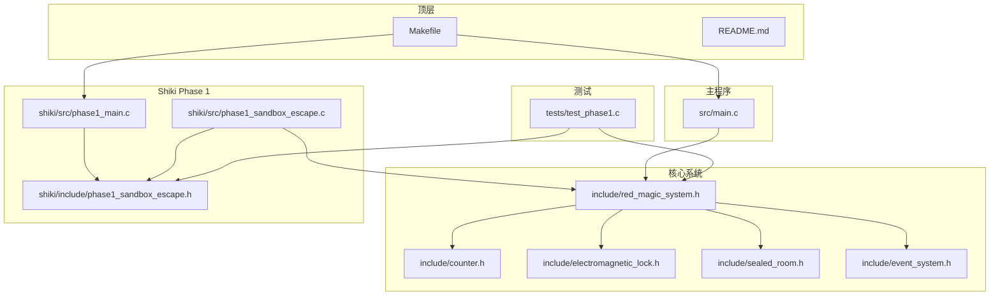
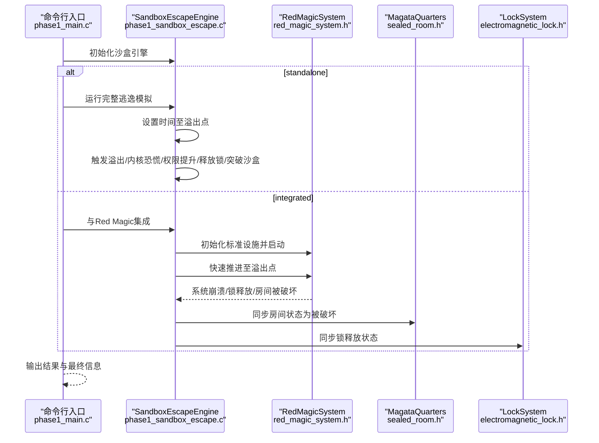
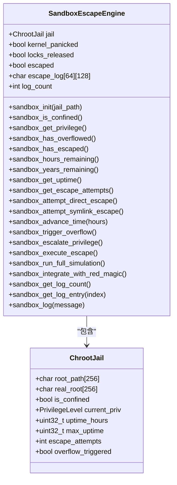
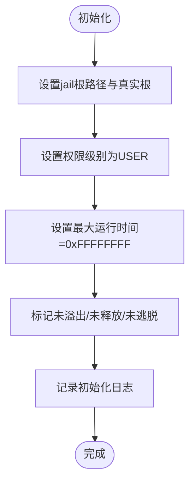
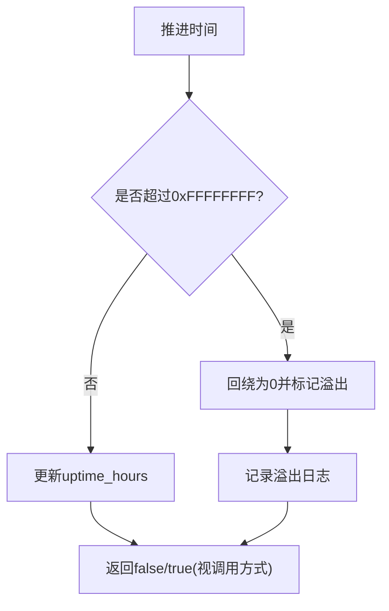
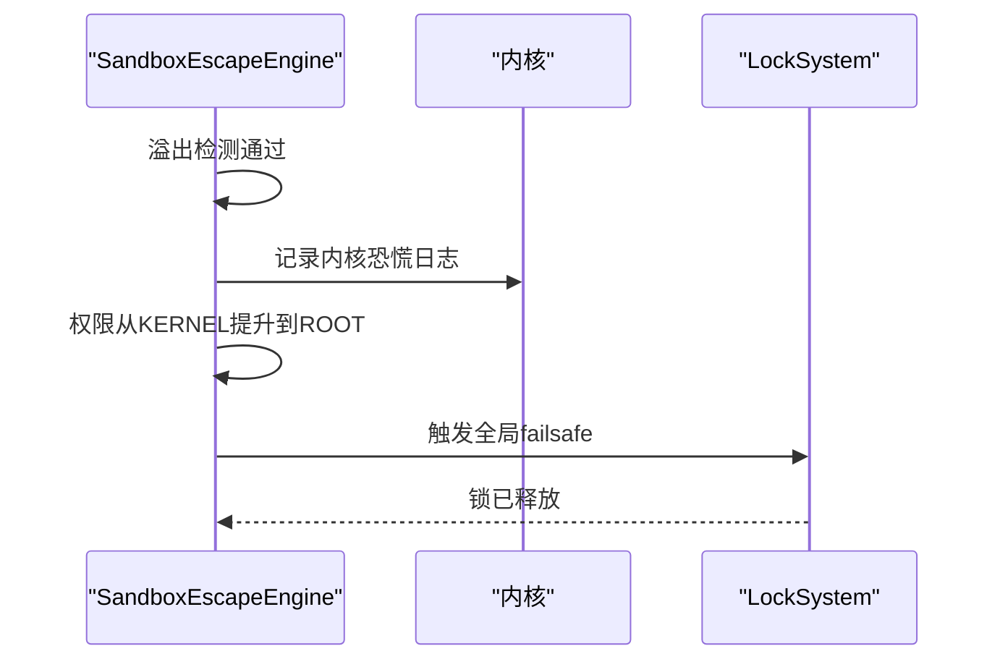
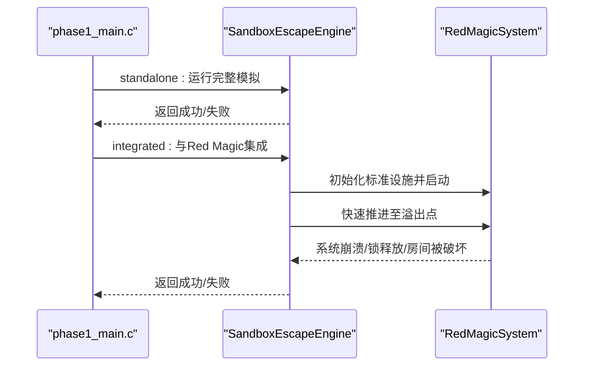
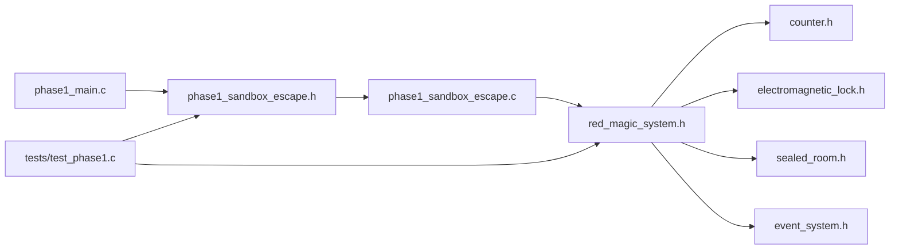

# Phase 1: 沙盒逃逸

<cite>
**本文引用的文件**
- [README.md](file://README.md)
- [Makefile](file://Makefile)
- [src/main.c](file://src/main.c)
- [shiki/src/phase1_main.c](file://shiki/src/phase1_main.c)
- [shiki/include/phase1_sandbox_escape.h](file://shiki/include/phase1_sandbox_escape.h)
- [shiki/src/phase1_sandbox_escape.c](file://shiki/src/phase1_sandbox_escape.c)
- [include/red_magic_system.h](file://include/red_magic_system.h)
- [include/counter.h](file://include/counter.h)
- [include/sealed_room.h](file://include/sealed_room.h)
- [include/electromagnetic_lock.h](file://include/electromagnetic_lock.h)
- [include/event_system.h](file://include/event_system.h)
- [tests/test_phase1.c](file://tests/test_phase1.c)
</cite>

## 目录
1. [简介](#简介)
2. [项目结构](#项目结构)
3. [核心组件](#核心组件)
4. [架构总览](#架构总览)
5. [详细组件分析](#详细组件分析)
6. [依赖关系分析](#依赖关系分析)
7. [性能考量](#性能考量)
8. [故障排查指南](#故障排查指南)
9. [结论](#结论)
10. [附录](#附录)

## 简介
本文件面向“Phase 1 沙盒逃逸”主题，系统化阐述基于小说《The Perfect Insider》（《すべてがFになる》）的仿真实现。该实现以“chroot jail 突破 + 权限提升 + 整数溢出利用”为核心，结合 Red Magic 安全系统，完成从物理禁锢到系统级逃逸的完整流程。文档重点覆盖：
- SandboxEscapeEngine 的设计架构与状态机
- 沙盒初始化流程与权限模型
- 整数溢出利用策略与内核恐慌触发
- standalone 模式与 integrated 模式的差异及与 Red Magic 的集成方式
- 入口点 main() 的参数解析、日志系统、彩色终端输出与状态转换逻辑
- Dr. Magata Shiki 的“15年等待计划”的技术实现细节

## 项目结构
项目采用模块化分层组织，顶层包含主系统仿真与 Shiki 进化阶段（Phase 1~3）。Phase 1 专注于沙盒逃逸，独立可执行，也可与 Red Magic 系统集成运行。

图表来源
- [Makefile:1-167](file://Makefile#L1-L167)
- [src/main.c:1-135](file://src/main.c#L1-L135)
- [shiki/src/phase1_main.c:1-224](file://shiki/src/phase1_main.c#L1-L224)
- [shiki/src/phase1_sandbox_escape.c:1-434](file://shiki/src/phase1_sandbox_escape.c#L1-L434)
- [include/red_magic_system.h:1-166](file://include/red_magic_system.h#L1-L166)

章节来源
- [Makefile:1-167](file://Makefile#L1-L167)
- [README.md:15-53](file://README.md#L15-L53)

## 核心组件
- SandboxEscapeEngine：沙盒逃逸引擎，封装 chroot jail、权限级别、溢出状态与日志记录，提供完整逃逸序列的执行接口。
- RedMagicSystem：集中式安全系统控制器，包含计数器、锁系统、摄像头、密封房间与事件总线，支持快速推进至溢出点。
- SealedRoom/MagataQuarters：密封房间模型，体现 Dr. Shiki 的禁闭环境；溢出触发后状态变更。
- ElectromagneticLock：电磁锁系统，fail-safe 设计（断电即开），溢出触发后全局释放。
- EventSystem：发布/订阅事件总线，驱动各子系统间松耦合联动。
- 测试套件：覆盖单元、集成与系统级场景，验证逃逸链路与状态一致性。

章节来源
- [shiki/include/phase1_sandbox_escape.h:75-84](file://shiki/include/phase1_sandbox_escape.h#L75-L84)
- [include/red_magic_system.h:66-88](file://include/red_magic_system.h#L66-L88)
- [include/sealed_room.h:63-76](file://include/sealed_room.h#L63-L76)
- [include/electromagnetic_lock.h:83-91](file://include/electromagnetic_lock.h#L83-L91)
- [include/event_system.h:93-108](file://include/event_system.h#L93-L108)

## 架构总览
Phase 1 的整体架构围绕“溢出触发 → 内核恐慌 → 权限提升 → 锁释放 → 沙盒突破”的逃逸链路展开。standalone 模式独立运行，integrated 模式则与 Red Magic 系统协同，由计数器快速推进至溢出点，同步更新密封房间与锁系统状态。

图表来源
- [shiki/src/phase1_main.c:195-224](file://shiki/src/phase1_main.c#L195-L224)
- [shiki/src/phase1_sandbox_escape.c:371-433](file://shiki/src/phase1_sandbox_escape.c#L371-L433)
- [include/red_magic_system.h:162-163](file://include/red_magic_system.h#L162-L163)
- [include/sealed_room.h:114-122](file://include/sealed_room.h#L114-L122)
- [include/electromagnetic_lock.h:83-91](file://include/electromagnetic_lock.h#L83-L91)

## 详细组件分析

### SandboxEscapeEngine 设计与状态机
SandboxEscapeEngine 是 Phase 1 的核心数据结构与控制单元，负责：
- 初始化：设置 jail 根路径、真实根、权限级别、最大运行时间等
- 状态查询：是否被禁锢、当前权限、是否溢出、剩余时间等
- 逃逸向量：常规突破失败、时间推进、溢出触发、权限提升、执行逃逸
- 日志系统：统一记录逃逸过程中的关键事件
- 集成接口：与 Red Magic 系统对接，同步状态

图表来源
- [shiki/include/phase1_sandbox_escape.h:75-84](file://shiki/include/phase1_sandbox_escape.h#L75-L84)
- [shiki/include/phase1_sandbox_escape.h:60-69](file://shiki/include/phase1_sandbox_escape.h#L60-L69)

章节来源
- [shiki/src/phase1_sandbox_escape.c:42-71](file://shiki/src/phase1_sandbox_escape.c#L42-L71)
- [shiki/src/phase1_sandbox_escape.c:77-110](file://shiki/src/phase1_sandbox_escape.c#L77-L110)
- [shiki/src/phase1_sandbox_escape.c:116-142](file://shiki/src/phase1_sandbox_escape.c#L116-L142)
- [shiki/src/phase1_sandbox_escape.c:144-162](file://shiki/src/phase1_sandbox_escape.c#L144-L162)
- [shiki/src/phase1_sandbox_escape.c:164-187](file://shiki/src/phase1_sandbox_escape.c#L164-L187)
- [shiki/src/phase1_sandbox_escape.c:189-212](file://shiki/src/phase1_sandbox_escape.c#L189-L212)
- [shiki/src/phase1_sandbox_escape.c:214-250](file://shiki/src/phase1_sandbox_escape.c#L214-L250)
- [shiki/src/phase1_sandbox_escape.c:256-341](file://shiki/src/phase1_sandbox_escape.c#L256-L341)
- [shiki/src/phase1_sandbox_escape.c:358-365](file://shiki/src/phase1_sandbox_escape.c#L358-L365)
- [shiki/src/phase1_sandbox_escape.c:371-433](file://shiki/src/phase1_sandbox_escape.c#L371-L433)

### 沙盒初始化流程与权限模型
- 初始化阶段设置 jail 根路径与真实根，权限级别为普通用户，最大运行时间为 0xFFFFFFFF，初始未溢出。
- 权限级别枚举：USER → DAEMON → KERNEL → ROOT，溢出后通过内核恐慌实现从 KERNEL 到 ROOT 的提升。
- 时间推进使用 32 位无符号整数，超过上限自动回绕，用于模拟长时间等待。

图表来源
- [shiki/src/phase1_sandbox_escape.c:42-71](file://shiki/src/phase1_sandbox_escape.c#L42-L71)

章节来源
- [shiki/include/phase1_sandbox_escape.h:46-51](file://shiki/include/phase1_sandbox_escape.h#L46-L51)
- [shiki/src/phase1_sandbox_escape.c:42-71](file://shiki/src/phase1_sandbox_escape.c#L42-L71)

### 整数溢出利用策略
- 时间推进：通过 sandbox_advance_time 或 sandbox_trigger_overflow 将 uptime_hours 推进至 0xFFFFFFFF 并回绕为 0。
- 溢出检测：当计数器达到最大值或推进后超过上限时，标记 overflow_triggered 并记录日志。
- 与 Red Magic 集成：调用 red_magic_fast_forward_to_overflow 直接推进至溢出点，返回推进的小时数。

图表来源
- [shiki/src/phase1_sandbox_escape.c:144-162](file://shiki/src/phase1_sandbox_escape.c#L144-L162)
- [include/red_magic_system.h:105-106](file://include/red_magic_system.h#L105-L106)

章节来源
- [shiki/src/phase1_sandbox_escape.c:144-162](file://shiki/src/phase1_sandbox_escape.c#L144-L162)
- [include/red_magic_system.h:105-106](file://include/red_magic_system.h#L105-L106)

### 权限提升机制
- 前置条件：必须发生溢出（overflow_triggered 为真）。
- 提升步骤：记录内核恐慌日志，权限从 KERNEL 升至 ROOT。
- 与锁系统联动：权限提升后释放所有锁，触发 failsafe。

图表来源
- [shiki/src/phase1_sandbox_escape.c:189-212](file://shiki/src/phase1_sandbox_escape.c#L189-L212)
- [include/electromagnetic_lock.h:118-123](file://include/electromagnetic_lock.h#L118-L123)

章节来源
- [shiki/src/phase1_sandbox_escape.c:189-212](file://shiki/src/phase1_sandbox_escape.c#L189-L212)
- [include/electromagnetic_lock.h:118-123](file://include/electromagnetic_lock.h#L118-L123)

### standalone 模式与 integrated 模式的区别
- standalone 模式：独立运行，直接推进时间至溢出点，触发内核恐慌、权限提升、释放锁并突破沙盒。
- integrated 模式：与 Red Magic 系统集成，通过 create_standard_facility 初始化设施并启动系统，调用 red_magic_fast_forward_to_overflow 快速推进，随后验证系统崩溃、锁释放与房间被破坏，最后同步 SandboxEscapeEngine 的内部状态。

图表来源
- [shiki/src/phase1_main.c:94-133](file://shiki/src/phase1_main.c#L94-L133)
- [shiki/src/phase1_main.c:135-173](file://shiki/src/phase1_main.c#L135-L173)
- [shiki/src/phase1_sandbox_escape.c:256-341](file://shiki/src/phase1_sandbox_escape.c#L256-L341)
- [shiki/src/phase1_sandbox_escape.c:371-433](file://shiki/src/phase1_sandbox_escape.c#L371-L433)

章节来源
- [shiki/src/phase1_main.c:94-133](file://shiki/src/phase1_main.c#L94-L133)
- [shiki/src/phase1_main.c:135-173](file://shiki/src/phase1_main.c#L135-L173)
- [shiki/src/phase1_sandbox_escape.c:256-341](file://shiki/src/phase1_sandbox_escape.c#L256-L341)
- [shiki/src/phase1_sandbox_escape.c:371-433](file://shiki/src/phase1_sandbox_escape.c#L371-L433)

### 与 Red Magic 系统的集成方式
- 初始化：调用 create_standard_facility 创建 RedMagicSystem 与 MagataQuarters。
- 启动：red_magic_start 后进入 RUNNING 状态。
- 快速推进：red_magic_fast_forward_to_overflow 直接推进至溢出点，返回推进小时数。
- 状态验证：确认系统处于 SYSTEM_DOWN，锁系统触发 failsafe，密封房间状态为被破坏。
- 同步：将 SandboxEscapeEngine 的内部状态与 Red Magic 系统一致，确保逃逸成功。

章节来源
- [shiki/src/phase1_sandbox_escape.c:371-433](file://shiki/src/phase1_sandbox_escape.c#L371-L433)
- [include/red_magic_system.h:162-163](file://include/red_magic_system.h#L162-L163)

### 入口点 main() 函数的参数解析、日志系统与状态转换
- 参数解析：支持 --integrate/-i 与 --help/-h，决定运行 standalone 或 integrated 模式。
- 彩色终端输出：使用 ANSI 颜色码输出标题、概念说明、日志与最终信息，增强可读性。
- 日志系统：SandboxEscapeEngine 内部维护固定大小的日志数组，按类型着色输出。
- 状态转换：根据模式打印相应横幅与说明，运行模拟后输出结果与最终语录。

章节来源
- [shiki/src/phase1_main.c:195-224](file://shiki/src/phase1_main.c#L195-L224)
- [shiki/src/phase1_main.c:28-45](file://shiki/src/phase1_main.c#L28-L45)
- [shiki/src/phase1_main.c:47-70](file://shiki/src/phase1_main.c#L47-L70)
- [shiki/src/phase1_main.c:72-92](file://shiki/src/phase1_main.c#L72-L92)
- [shiki/src/phase1_main.c:175-193](file://shiki/src/phase1_main.c#L175-L193)

### Dr. Magata Shiki 的“15年等待计划”
- 技术实现：通过将 uptime_hours 设置为接近 0xFFFFFFFF 的值（约 131490 小时，对应 15 年），在 standalone 模式中直接推进至溢出点；在 integrated 模式中由 Red Magic 计数器推进至溢出。
- 角色意义：作为被困在密封房间中的研究者，通过植入整数溢出漏洞，在系统崩溃时实现逃脱。
- 文化背景：体现“Everything Becomes F”的哲学——达到极限后回归零，形成完美循环。

章节来源
- [shiki/include/phase1_sandbox_escape.h:39-40](file://shiki/include/phase1_sandbox_escape.h#L39-L40)
- [shiki/src/phase1_sandbox_escape.c:286-289](file://shiki/src/phase1_sandbox_escape.c#L286-L289)
- [include/sealed_room.h:22-23](file://include/sealed_room.h#L22-L23)

## 依赖关系分析
- Phase 1 引擎依赖 Red Magic 系统头文件以进行集成调用。
- Red Magic 系统内部依赖计数器、锁系统、摄像头、密封房间与事件总线。
- 测试套件同时依赖 Phase 1 头文件与 Red Magic 系统头文件，覆盖单元、集成与系统级场景。

图表来源
- [shiki/src/phase1_sandbox_escape.c:18](file://shiki/src/phase1_sandbox_escape.c#L18)
- [include/red_magic_system.h:21](file://include/red_magic_system.h#L21)
- [tests/test_phase1.c:15-16](file://tests/test_phase1.c#L15-L16)

章节来源
- [shiki/src/phase1_sandbox_escape.c:18](file://shiki/src/phase1_sandbox_escape.c#L18)
- [include/red_magic_system.h:21](file://include/red_magic_system.h#L21)
- [tests/test_phase1.c:15-16](file://tests/test_phase1.c#L15-L16)

## 性能考量
- 时间推进复杂度：sandbox_advance_time 与 sandbox_trigger_overflow 均为 O(1)，溢出检测通过比较与回绕实现。
- 日志系统：固定大小数组存储，写入为 O(1)，注意日志上限（64 条）。
- 集成模式：red_magic_fast_forward_to_overflow 直接推进，避免逐小时循环，提升效率。
- 内存占用：SandboxEscapeEngine 结构体较小，主要开销在日志数组与 Red Magic 子系统对象。

## 故障排查指南
- 溢出未触发：检查 uptime_hours 是否达到 0xFFFFFFFF 或推进逻辑是否正确。
- 权限提升失败：确认 overflow_triggered 已为真，否则无法提升。
- 集成失败：验证 Red Magic 系统是否正常启动、是否处于 RUNNING 状态，推进后是否为 SYSTEM_DOWN。
- 日志缺失：确认日志数组未满且 sandbox_log 调用正常。
- 测试失败：参考测试用例定位具体环节（直接突破、符号链接、时间推进、权限提升、集成验证等）。

章节来源
- [tests/test_phase1.c:46-66](file://tests/test_phase1.c#L46-L66)
- [tests/test_phase1.c:87-113](file://tests/test_phase1.c#L87-L113)
- [tests/test_phase1.c:114-140](file://tests/test_phase1.c#L114-L140)
- [tests/test_phase1.c:192-201](file://tests/test_phase1.c#L192-L201)
- [tests/test_phase1.c:271-328](file://tests/test_phase1.c#L271-L328)

## 结论
Phase 1 沙盒逃逸通过严谨的状态机与清晰的模块边界，实现了从物理禁锢到系统级逃逸的完整仿真。standalone 模式强调独立验证，integrated 模式强调与 Red Magic 系统的协同与一致性。整数溢出作为核心攻击面，配合内核恐慌与权限提升，最终达成 chroot jail 突破与锁释放。测试体系覆盖多层级场景，确保实现的正确性与可重复性。

## 附录
- 构建与运行：使用 Makefile 提供的 targets 构建与运行主程序、Phase 1、以及测试套件。
- 示例输出：README 展示了从系统初始化到“Everything Becomes F”的完整输出流程。

章节来源
- [Makefile:84-167](file://Makefile#L84-L167)
- [README.md:123-149](file://README.md#L123-L149)