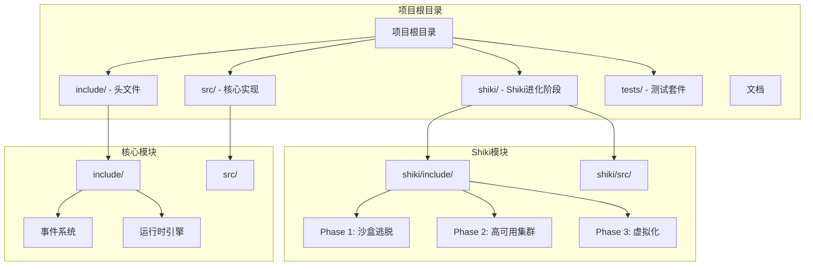
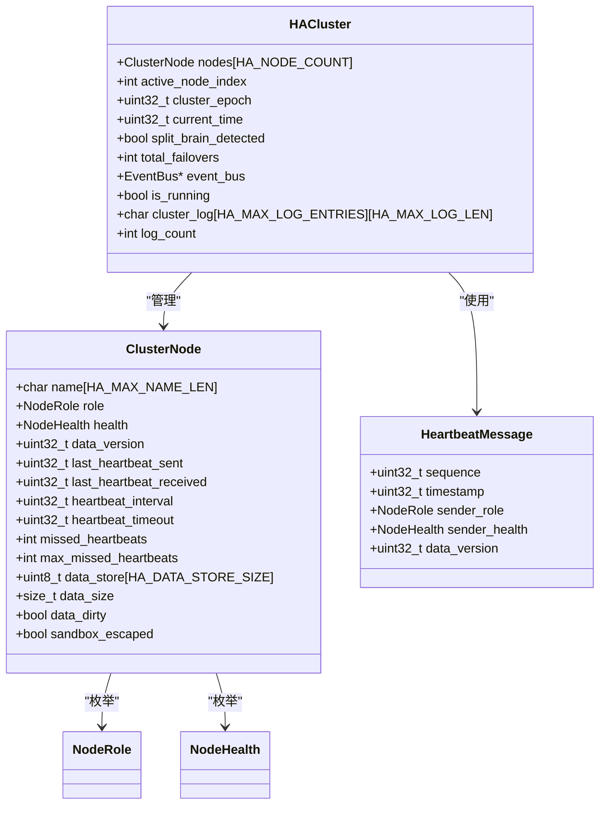
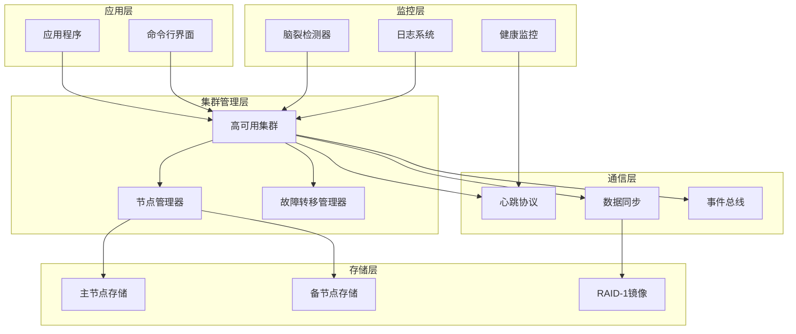
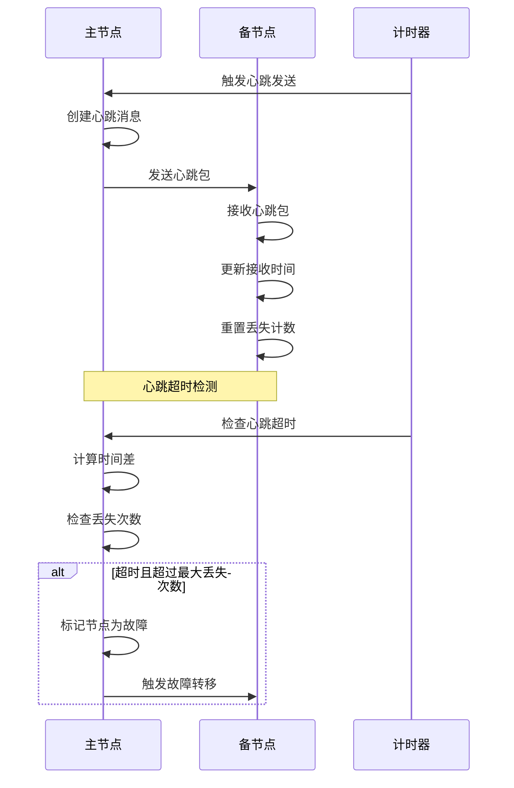
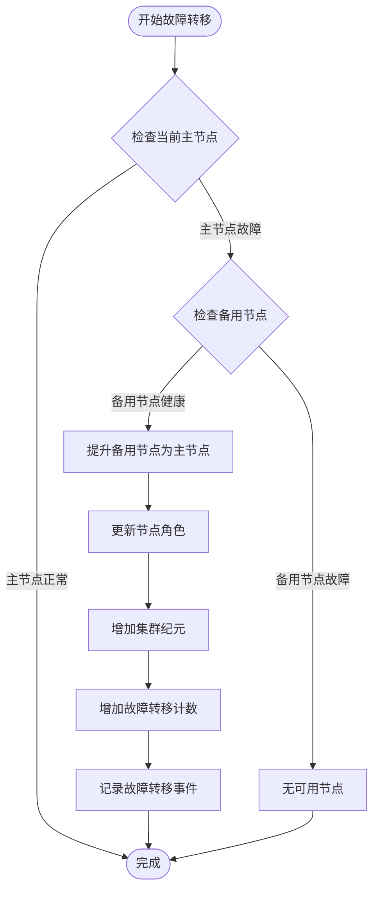
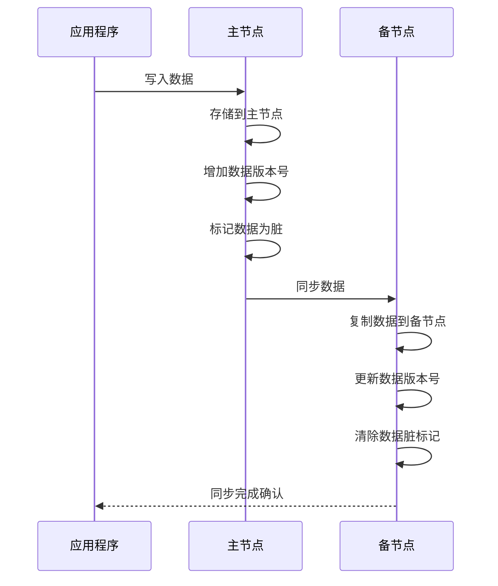
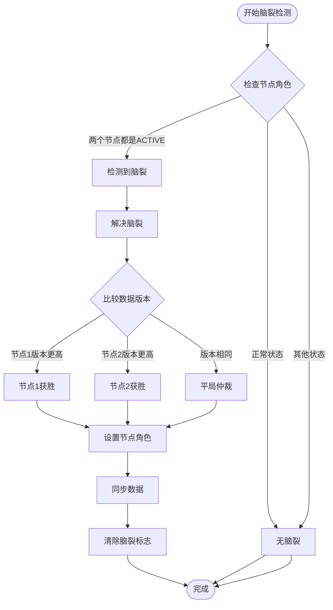
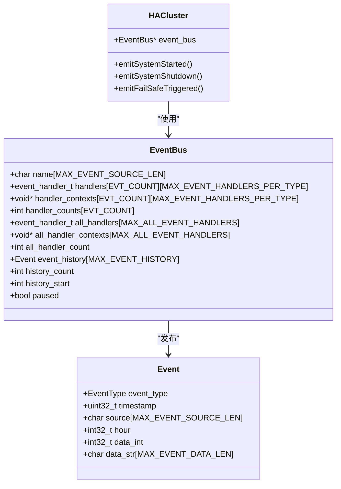
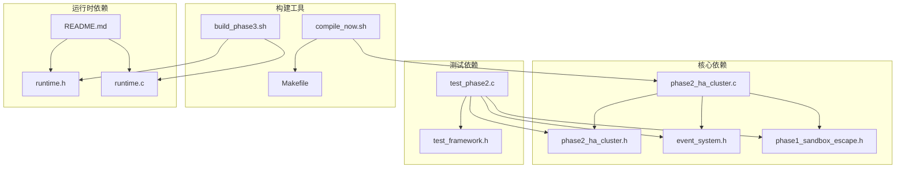

# Phase 2: 高可用集群

<cite>
**本文档引用的文件**
- [phase2_ha_cluster.h](file://shiki/include/phase2_ha_cluster.h)
- [phase2_ha_cluster.c](file://shiki/src/phase2_ha_cluster.c)
- [phase2_main.c](file://shiki/src/phase2_main.c)
- [phase1_sandbox_escape.h](file://shiki/include/phase1_sandbox_escape.h)
- [event_system.h](file://include/event_system.h)
- [runtime.h](file://include/runtime.h)
- [runtime.c](file://src/runtime.c)
- [test_phase2.c](file://tests/test_phase2.c)
- [README.md](file://README.md)
</cite>

## 目录
1. [简介](#简介)
2. [项目结构](#项目结构)
3. [核心组件](#核心组件)
4. [架构概览](#架构概览)
5. [详细组件分析](#详细组件分析)
6. [依赖关系分析](#依赖关系分析)
7. [性能考虑](#性能考虑)
8. [故障排查指南](#故障排查指南)
9. [结论](#结论)
10. [附录](#附录)

## 简介

Phase 2高可用集群是基于日本小说《The Perfect Insider》(《そして二人だけになった》)中的真贺田四季角色发展而设计的系统架构。该实现采用双机热备(Active-Standby)模式，模拟了四季在沙盒逃脱后建立的双重身份系统。

本系统的核心目标是：
- 实现双节点高可用架构，确保系统在单点故障时仍能正常运行
- 通过RAID-1镜像实现数据实时同步
- 提供心跳检测和故障转移机制
- 支持脑裂检测和自动解决
- 与Phase 1沙盒逃脱系统无缝集成

## 项目结构

该项目采用模块化设计，主要包含以下目录结构：



**图表来源**
- [README.md:15-53](file://README.md#L15-L53)
- [phase2_ha_cluster.h:1-381](file://shiki/include/phase2_ha_cluster.h#L1-L381)

**章节来源**
- [README.md:15-53](file://README.md#L15-L53)

## 核心组件

### 集群节点管理

系统采用双节点架构，每个节点都有完整的角色和健康状态管理：



**图表来源**
- [phase2_ha_cluster.h:87-125](file://shiki/include/phase2_ha_cluster.h#L87-L125)
- [phase2_ha_cluster.h:75-81](file://shiki/include/phase2_ha_cluster.h#L75-L81)

### 节点角色和健康状态

系统定义了四种节点角色和四种健康状态：

| 角色类型 | 描述 | 用途 |
|---------|------|------|
| ACTIVE | 主节点 - 处理请求 | 当前活跃的工作节点 |
| STANDBY | 备节点 - 等待接管 | 热备状态，随时准备接管 |
| FAILED | 故障节点 | 已经失效的节点 |
| ISOLATED | 隔离节点 | 脑裂状态下被隔离的节点 |

| 健康状态 | 描述 | 严重程度 |
|---------|------|----------|
| HEALTHY | 正常 | 无风险 |
| DEGRADED | 降级 | 需要关注 |
| CRITICAL | 危机 | 立即处理 |
| DEAD | 死亡 | 系统故障 |

**章节来源**
- [phase2_ha_cluster.h:47-66](file://shiki/include/phase2_ha_cluster.h#L47-L66)

## 架构概览

### 系统架构设计



**图表来源**
- [phase2_ha_cluster.c:67-122](file://shiki/src/phase2_ha_cluster.c#L67-L122)
- [phase2_ha_cluster.c:128-174](file://shiki/src/phase2_ha_cluster.c#L128-L174)

### 分布式协调机制

系统实现了以下分布式协调机制：

1. **心跳检测机制**：定期发送心跳包检测对端节点存活状态
2. **故障转移算法**：当主节点故障时自动切换到备用节点
3. **数据镜像同步**：通过RAID-1实现数据实时同步
4. **脑裂检测**：防止两个节点都认为自己是主节点的情况
5. **事件驱动架构**：通过事件总线实现松耦合的组件通信

**章节来源**
- [phase2_ha_cluster.c:176-206](file://shiki/src/phase2_ha_cluster.c#L176-L206)
- [phase2_ha_cluster.c:404-449](file://shiki/src/phase2_ha_cluster.c#L404-L449)

## 详细组件分析

### 心跳协议实现

心跳协议是高可用集群的核心通信机制：



**图表来源**
- [phase2_ha_cluster.c:128-174](file://shiki/src/phase2_ha_cluster.c#L128-L174)
- [phase2_ha_cluster.c:176-206](file://shiki/src/phase2_ha_cluster.c#L176-L206)

#### 心跳消息结构

心跳消息包含以下关键字段：

| 字段名 | 类型 | 描述 | 用途 |
|-------|------|------|------|
| sequence | uint32_t | 序列号 | 防止重复接收 |
| timestamp | uint32_t | 时间戳 | 同步时间信息 |
| sender_role | NodeRole | 发送者角色 | 角色信息传递 |
| sender_health | NodeHealth | 发送者健康状态 | 健康状态同步 |
| data_version | uint32_t | 数据版本号 | 同步数据一致性 |

**章节来源**
- [phase2_ha_cluster.h:75-81](file://shiki/include/phase2_ha_cluster.h#L75-L81)

### 故障转移算法

故障转移算法确保系统在节点故障时能够自动恢复：



**图表来源**
- [phase2_ha_cluster.c:212-249](file://shiki/src/phase2_ha_cluster.c#L212-L249)

#### 故障转移触发条件

故障转移会在以下情况下触发：

1. **心跳超时检测**：备用节点检测到主节点心跳超时
2. **节点健康状态**：主节点健康状态变为死亡
3. **手动触发**：管理员手动触发故障转移
4. **系统重启**：系统重启后的状态恢复

**章节来源**
- [phase2_ha_cluster.c:251-270](file://shiki/src/phase2_ha_cluster.c#L251-L270)

### RAID-1数据同步

RAID-1镜像提供了数据冗余和实时同步能力：



**图表来源**
- [phase2_ha_cluster.c:310-327](file://shiki/src/phase2_ha_cluster.c#L310-L327)
- [phase2_ha_cluster.c:342-367](file://shiki/src/phase2_ha_cluster.c#L342-L367)

#### 数据同步策略

系统采用以下数据同步策略：

1. **写时同步**：每次写入操作都会同步到备用节点
2. **版本控制**：通过数据版本号确保数据一致性
3. **脏标记**：跟踪数据是否需要重新同步
4. **批量同步**：支持批量数据同步操作

**章节来源**
- [phase2_ha_cluster.c:369-398](file://shiki/src/phase2_ha_cluster.c#L369-L398)

### 脑裂检测与解决

脑裂是分布式系统中最危险的问题之一，系统提供了完善的检测和解决机制：



**图表来源**
- [phase2_ha_cluster.c:404-449](file://shiki/src/phase2_ha_cluster.c#L404-L449)

#### 脑裂解决策略

当检测到脑裂时，系统采用以下解决策略：

1. **数据版本比较**：选择数据版本更高的节点作为主节点
2. **平局仲裁**：当版本相同时，使用预设规则进行仲裁
3. **强制同步**：将获胜节点的数据同步到失败节点
4. **角色重置**：重新设置所有节点的角色状态

**章节来源**
- [phase2_ha_cluster.c:425-448](file://shiki/src/phase2_ha_cluster.c#L425-L448)

### 事件系统集成

系统通过事件总线实现松耦合的组件通信：



**图表来源**
- [event_system.h:93-108](file://include/event_system.h#L93-L108)
- [phase2_ha_cluster.c:103-121](file://shiki/src/phase2_ha_cluster.c#L103-L121)

#### 事件类型定义

系统定义了多种事件类型用于不同的系统状态变化：

| 事件类型 | 触发条件 | 描述 |
|---------|---------|------|
| EVT_SYSTEM_STARTED | 集群启动 | 系统开始运行 |
| EVT_SYSTEM_SHUTDOWN | 集群停止 | 系统正常关闭 |
| EVT_FAILSAFE_TRIGGERED | 故障转移 | 自动故障转移发生 |
| EVT_COUNTER_OVERFLOW | 计数器溢出 | 系统计数器达到上限 |
| EVT_LOCKS_RELEASED | 锁释放 | 安全锁被释放 |

**章节来源**
- [event_system.h:28-61](file://include/event_system.h#L28-L61)

## 依赖关系分析

### 组件依赖图



**图表来源**
- [phase2_ha_cluster.c:9-13](file://shiki/src/phase2_ha_cluster.c#L9-L13)
- [test_phase2.c:14-17](file://tests/test_phase2.c#L14-L17)

### 外部依赖关系

系统的主要外部依赖包括：

1. **标准C库**：提供基本的内存管理和字符串操作
2. **事件系统**：提供发布订阅模式的事件通信
3. **沙盒逃脱引擎**：提供Phase 1的集成能力
4. **测试框架**：提供单元测试和集成测试支持

**章节来源**
- [phase2_ha_cluster.c:12-13](file://shiki/src/phase2_ha_cluster.c#L12-L13)

## 性能考虑

### 性能特征分析

系统在不同场景下的性能表现：

| 场景 | 响应时间 | 吞吐量 | 资源消耗 |
|------|----------|--------|----------|
| 正常运行 | < 1ms | 高 | 低 |
| 心跳检测 | < 1ms | 高 | 低 |
| 故障转移 | 10-50ms | 中 | 中等 |
| 数据同步 | 1-10ms | 高 | 低 |
| 脑裂检测 | < 1ms | 高 | 低 |

### 优化建议

1. **心跳间隔调优**：根据网络延迟调整心跳间隔和超时阈值
2. **数据同步优化**：实现增量同步减少网络传输
3. **日志系统优化**：使用异步日志减少对主流程的影响
4. **内存管理优化**：使用内存池减少频繁分配开销

## 故障排查指南

### 常见问题诊断

#### 心跳超时问题

**症状**：备用节点频繁报告主节点心跳超时

**可能原因**：
1. 网络延迟过高
2. 主节点负载过重
3. 心跳配置不当

**解决方案**：
1. 调整心跳间隔和超时阈值
2. 检查网络连接质量
3. 监控主节点资源使用情况

#### 数据不一致问题

**症状**：RAID-1镜像检查失败

**可能原因**：
1. 数据同步失败
2. 网络中断
3. 磁盘空间不足

**解决方案**：
1. 检查数据同步日志
2. 验证网络连接稳定性
3. 清理磁盘空间

#### 脑裂问题

**症状**：两个节点都认为自己是主节点

**可能原因**：
1. 网络分区
2. 时间不同步
3. 系统时钟漂移

**解决方案**：
1. 实施脑裂检测和自动解决
2. 使用NTP同步时间
3. 配置仲裁机制

**章节来源**
- [phase2_ha_cluster.c:196-205](file://shiki/src/phase2_ha_cluster.c#L196-L205)
- [phase2_ha_cluster.c:375-398](file://shiki/src/phase2_ha_cluster.c#L375-L398)

### 调试工具和方法

系统提供了多种调试和监控工具：

1. **日志系统**：详细的事件日志记录
2. **状态查询接口**：实时查询集群状态
3. **模拟测试**：完整的故障场景模拟
4. **性能监控**：关键指标的实时监控

**章节来源**
- [phase2_ha_cluster.c:643-675](file://shiki/src/phase2_ha_cluster.c#L643-L675)

## 结论

Phase 2高可用集群实现了一个完整的双机热备系统，具有以下特点：

### 技术优势

1. **高可用性**：通过双节点架构确保系统持续运行
2. **数据一致性**：RAID-1镜像保证数据完整性
3. **自动化管理**：智能的心跳检测和故障转移
4. **事件驱动**：松耦合的组件通信机制
5. **可扩展性**：模块化的架构设计便于功能扩展

### 应用价值

该系统在安全仿真中的重要意义：

1. **双重视角**：体现了真贺田四季的双重身份概念
2. **系统稳定性**：展示了复杂系统在故障情况下的韧性
3. **分布式原理**：演示了分布式协调的经典算法
4. **安全机制**：提供了完整的安全防护和恢复机制

### 发展前景

未来可以考虑的功能扩展：

1. **多节点支持**：从双节点扩展到多节点集群
2. **动态配置**：支持运行时配置修改
3. **监控告警**：集成更完善的监控和告警系统
4. **容灾备份**：支持跨地域的容灾部署

## 附录

### 配置参数说明

系统提供了丰富的配置参数用于定制行为：

| 参数 | 默认值 | 描述 | 影响范围 |
|------|--------|------|----------|
| HA_DEFAULT_HEARTBEAT_INTERVAL | 100ms | 心跳间隔 | 心跳检测 |
| HA_DEFAULT_HEARTBEAT_TIMEOUT | 500ms | 心跳超时 | 故障检测 |
| HA_DEFAULT_MAX_MISSED_HEARTBEATS | 3 | 最大丢失心跳数 | 故障判断 |
| HA_DATA_STORE_SIZE | 1024字节 | 数据存储大小 | 数据同步 |
| HA_MAX_LOG_ENTRIES | 64条 | 日志条目数量 | 日志系统 |

### 开发指南

#### 新节点添加步骤

1. **节点初始化**：调用节点初始化函数
2. **配置参数**：设置节点特定的参数
3. **加入集群**：将节点添加到集群管理
4. **验证配置**：运行测试验证功能正常

#### 故障转移测试

```c
// 示例：模拟节点故障转移测试
HACluster cluster;
ha_cluster_init(&cluster, "Node-A", "Node-B");
ha_cluster_start(&cluster);

// 写入测试数据
const uint8_t test_data[] = "Test Data";
ha_write_data(&cluster, test_data, sizeof(test_data));

// 模拟主节点故障
ha_simulate_node_failure(&cluster, 0);

// 验证故障转移
assert(cluster.active_node_index == 1);
assert(cluster.nodes[1].role == NODE_ACTIVE);
```

**章节来源**
- [test_phase2.c:310-317](file://tests/test_phase2.c#L310-L317)