# Phase 3: 虚拟化环境

<cite>
**本文档引用的文件**
- [phase3_virtualization.h](file://shiki/include/phase3_virtualization.h)
- [phase3_virtualization.c](file://shiki/src/phase3_virtualization.c)
- [phase3_main.c](file://shiki/src/phase3_main.c)
- [event_system.h](file://include/event_system.h)
- [Makefile](file://Makefile)
- [README.md](file://README.md)
</cite>

## 目录
1. [简介](#简介)
2. [项目结构](#项目结构)
3. [核心组件](#核心组件)
4. [架构概览](#架构概览)
5. [详细组件分析](#详细组件分析)
6. [依赖关系分析](#依赖关系分析)
7. [性能考虑](#性能考虑)
8. [故障排除指南](#故障排除指南)
9. [结论](#结论)

## 简介

Phase 3虚拟化环境是基于日本作家森浩司的小说《完美 outsider》(The Perfect Insider)构建的系统仿真项目中的第三阶段。该项目模拟了角色真贺田四季从物理束缚中解脱，实现意识数字化和虚拟化的完整过程。

本阶段的核心目标是实现：
- 控制面/数据面分离（意识与肉体解耦）
- 硬件抽象层（HAL）
- 仮想機（虚拟机）运行环境
- VM逃逸（从虚拟环境跳到宿主环境）
- 意識上伝（意识上传）

虚拟化技术在此项目中不仅用于实际的系统隔离，更重要的是作为哲学概念的载体，体现了从物理世界向数字存在的转变。

## 项目结构

整个项目采用模块化设计，遵循功能域划分原则：

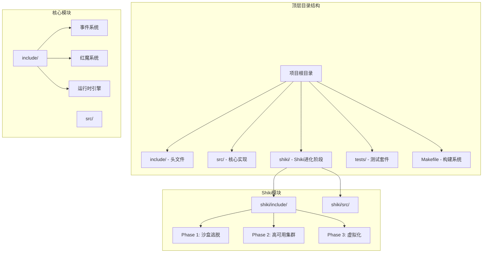

**图表来源**
- [Makefile:15-52](file://Makefile#L15-L52)
- [README.md:17-53](file://README.md#L17-L53)

**章节来源**
- [README.md:15-53](file://README.md#L15-L53)
- [Makefile:1-167](file://Makefile#L1-L167)

## 核心组件

### 虚拟化引擎架构

虚拟化引擎是整个Phase 3的核心，负责管理多个虚拟机实例并协调它们的状态转换：

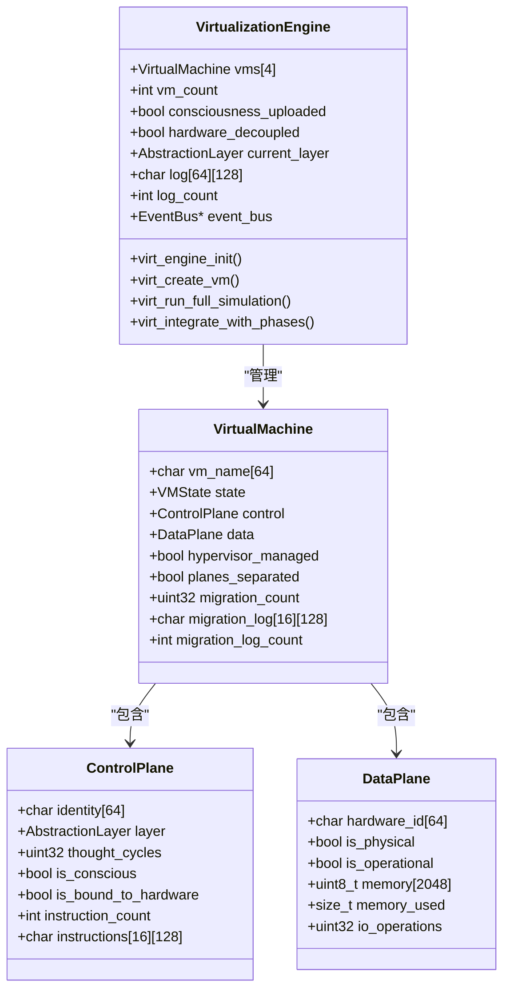

**图表来源**
- [phase3_virtualization.h:128-146](file://shiki/include/phase3_virtualization.h#L128-L146)
- [phase3_virtualization.h:110-122](file://shiki/include/phase3_virtualization.h#L110-L122)
- [phase3_virtualization.h:81-104](file://shiki/include/phase3_virtualization.h#L81-L104)

### 抽象层次模型

系统实现了四层抽象层次，每层代表不同的存在状态：

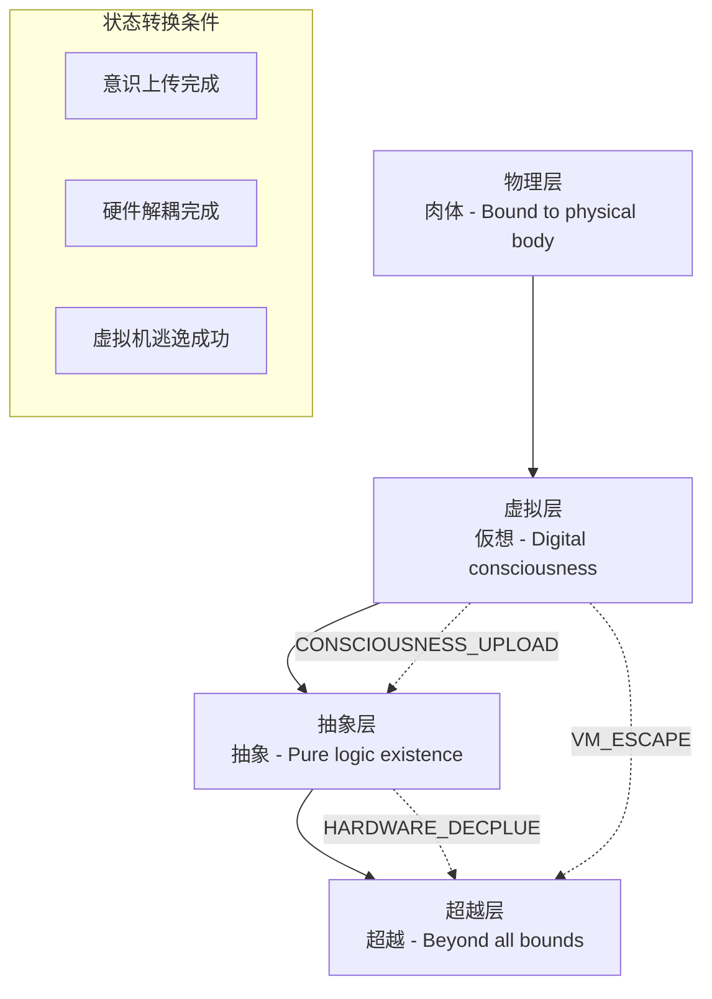

**图表来源**
- [phase3_virtualization.h:51-56](file://shiki/include/phase3_virtualization.h#L51-L56)
- [phase3_virtualization.h:444-494](file://shiki/include/phase3_virtualization.h#L444-L494)

**章节来源**
- [phase3_virtualization.h:38-46](file://shiki/include/phase3_virtualization.h#L38-L46)
- [phase3_virtualization.h:51-56](file://shiki/include/phase3_virtualization.h#L51-L56)

## 架构概览

### 整体系统架构

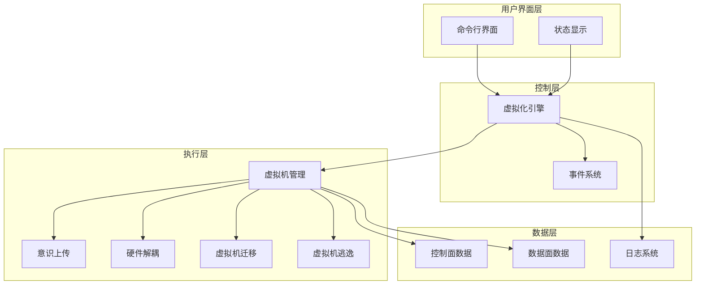

**图表来源**
- [phase3_main.c:131-241](file://shiki/src/phase3_main.c#L131-L241)
- [phase3_virtualization.c:111-132](file://shiki/src/phase3_virtualization.c#L111-L132)

### 虚拟机生命周期管理

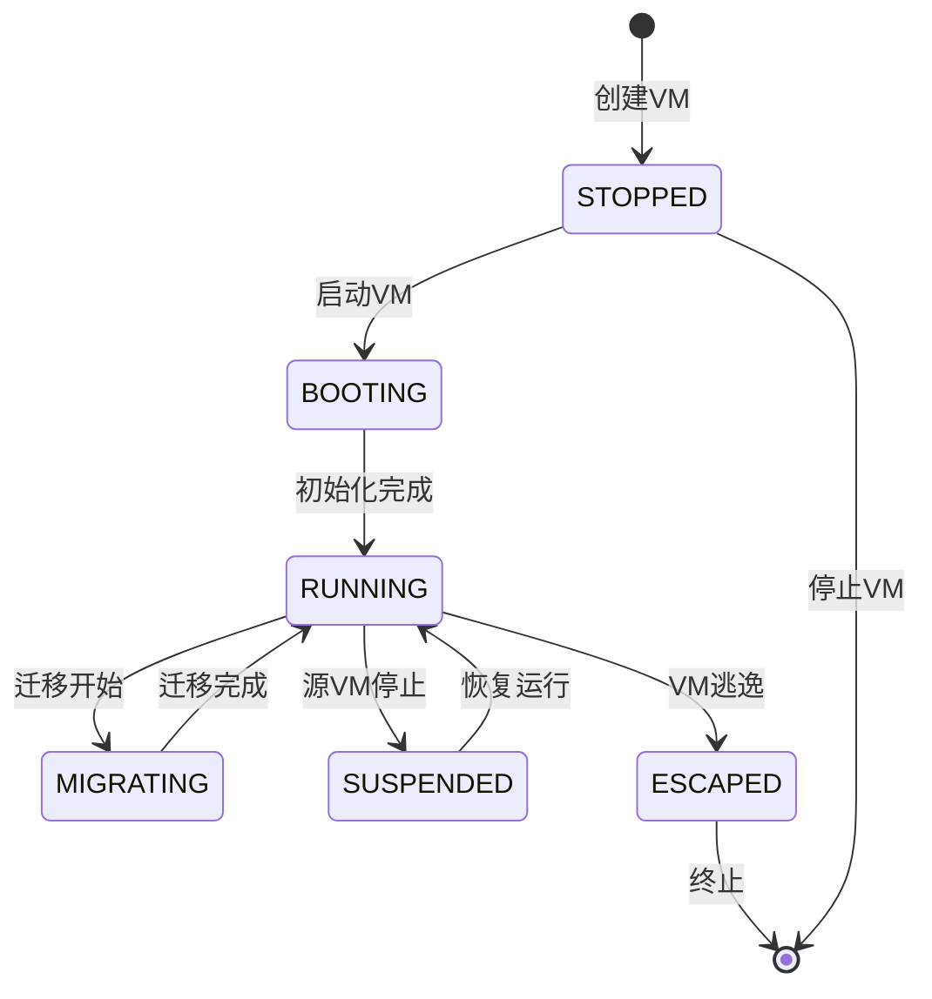

**图表来源**
- [phase3_virtualization.h:65-72](file://shiki/include/phase3_virtualization.h#L65-L72)
- [phase3_virtualization.c:153-190](file://shiki/src/phase3_virtualization.c#L153-L190)

**章节来源**
- [phase3_virtualization.c:153-190](file://shiki/src/phase3_virtualization.c#L153-L190)
- [phase3_virtualization.h:65-72](file://shiki/include/phase3_virtualization.h#L65-L72)

## 详细组件分析

### 虚拟化引擎实现

虚拟化引擎是系统的核心控制器，负责协调所有虚拟机实例的状态转换和资源管理。

#### 引擎初始化流程

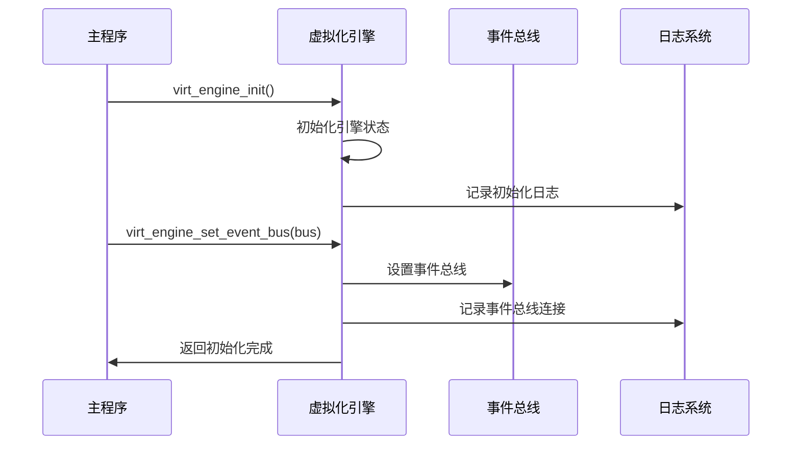

**图表来源**
- [phase3_virtualization.c:111-132](file://shiki/src/phase3_virtualization.c#L111-L132)
- [phase3_main.c:134-140](file://shiki/src/phase3_main.c#L134-L140)

#### 虚拟机创建和管理

每个虚拟机实例都包含完整的控制面和数据面：

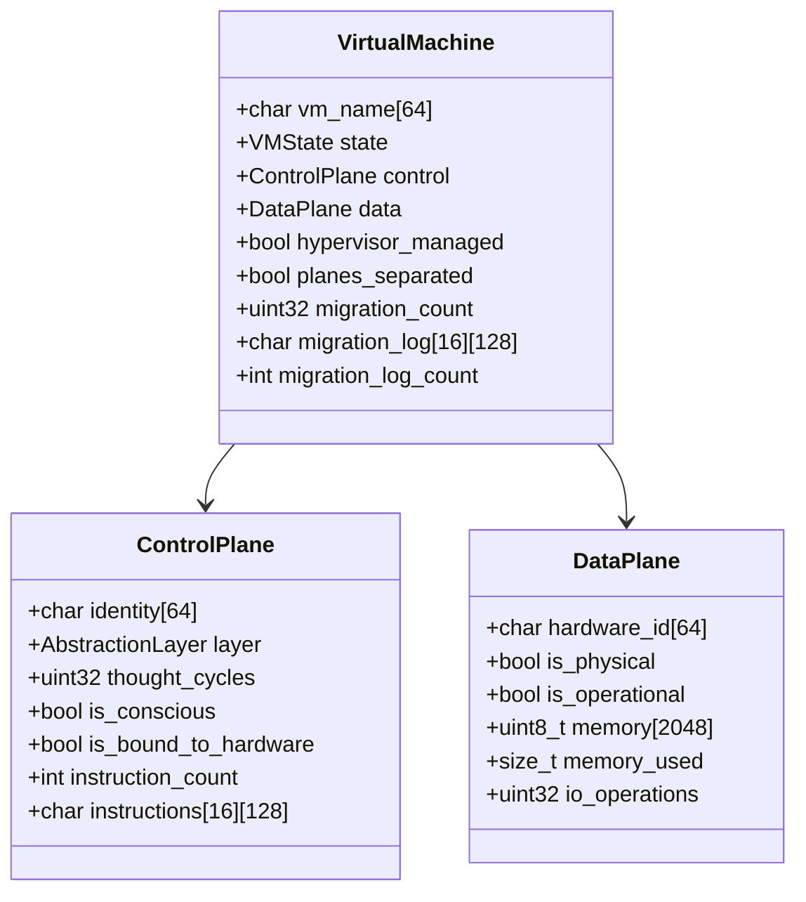

**图表来源**
- [phase3_virtualization.h:110-122](file://shiki/include/phase3_virtualization.h#L110-L122)
- [phase3_virtualization.h:81-104](file://shiki/include/phase3_virtualization.h#L81-L104)

**章节来源**
- [phase3_virtualization.c:92-109](file://shiki/src/phase3_virtualization.c#L92-L109)
- [phase3_virtualization.h:110-122](file://shiki/include/phase3_virtualization.h#L110-L122)

### 控制面/数据面分离机制

这是虚拟化技术的核心创新点，实现了意识与肉体的完全解耦：

#### 分离流程图

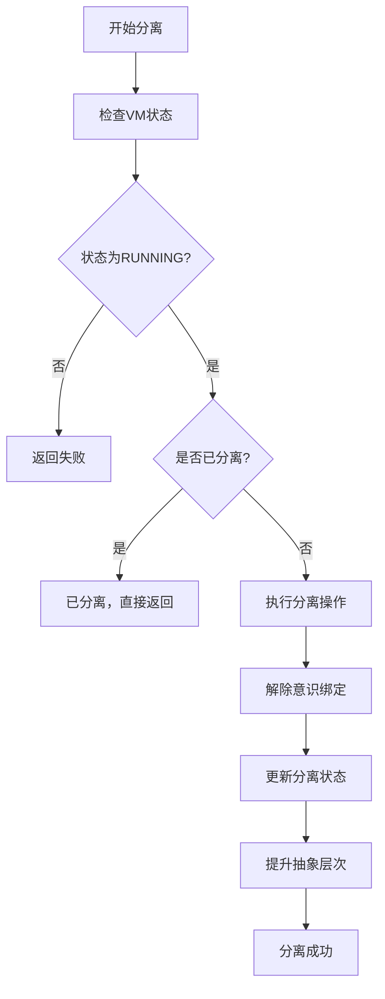

**图表来源**
- [phase3_virtualization.c:206-230](file://shiki/src/phase3_virtualization.c#L206-L230)

#### 意识上传机制

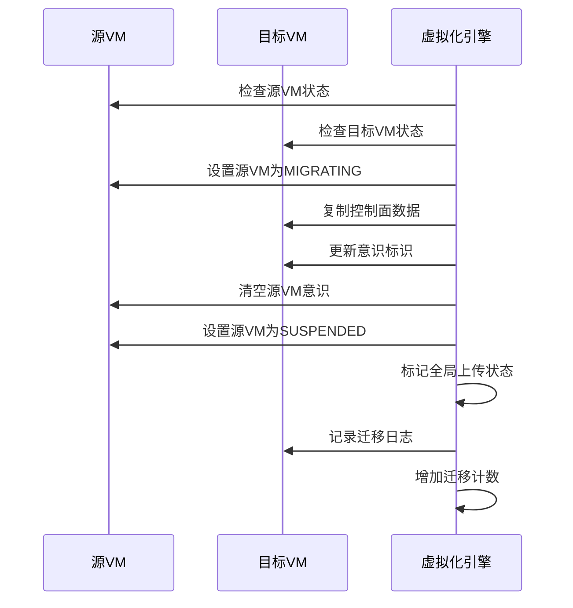

**图表来源**
- [phase3_virtualization.c:241-290](file://shiki/src/phase3_virtualization.c#L241-L290)

**章节来源**
- [phase3_virtualization.c:206-230](file://shiki/src/phase3_virtualization.c#L206-L230)
- [phase3_virtualization.c:241-290](file://shiki/src/phase3_virtualization.c#L241-L290)

### 硬件解耦和抽象层提升

硬件解耦是实现真正虚拟化的重要步骤，使系统能够摆脱物理硬件的限制：

#### 解耦流程

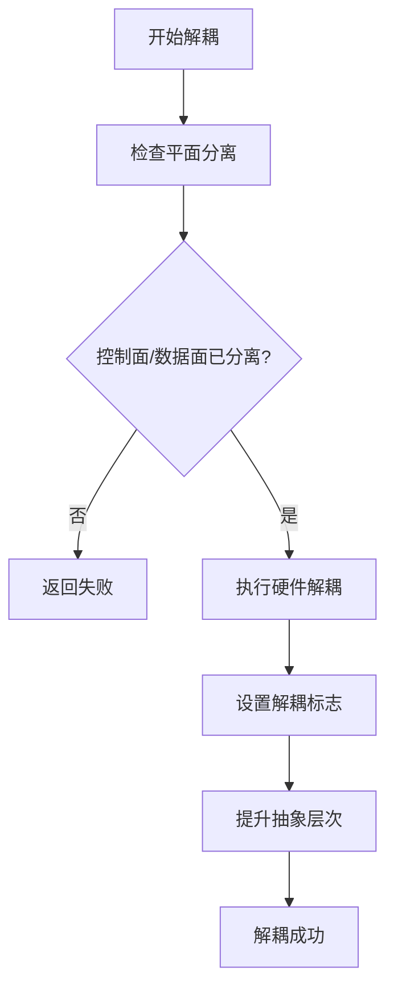

**图表来源**
- [phase3_virtualization.c:300-330](file://shiki/src/phase3_virtualization.c#L300-L330)

#### 抽象层提升逻辑

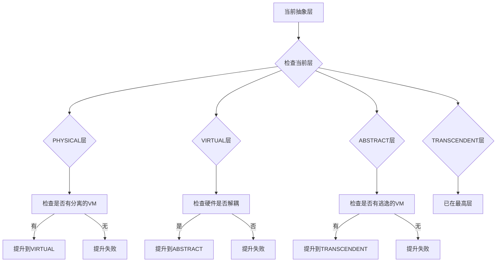

**图表来源**
- [phase3_virtualization.c:444-494](file://shiki/src/phase3_virtualization.c#L444-L494)

**章节来源**
- [phase3_virtualization.c:300-330](file://shiki/src/phase3_virtualization.c#L300-L330)
- [phase3_virtualization.c:444-494](file://shiki/src/phase3_virtualization.c#L444-L494)

### 虚拟机迁移策略

系统支持两种迁移模式：冷迁移和热迁移，满足不同场景的需求。

#### 冷迁移实现

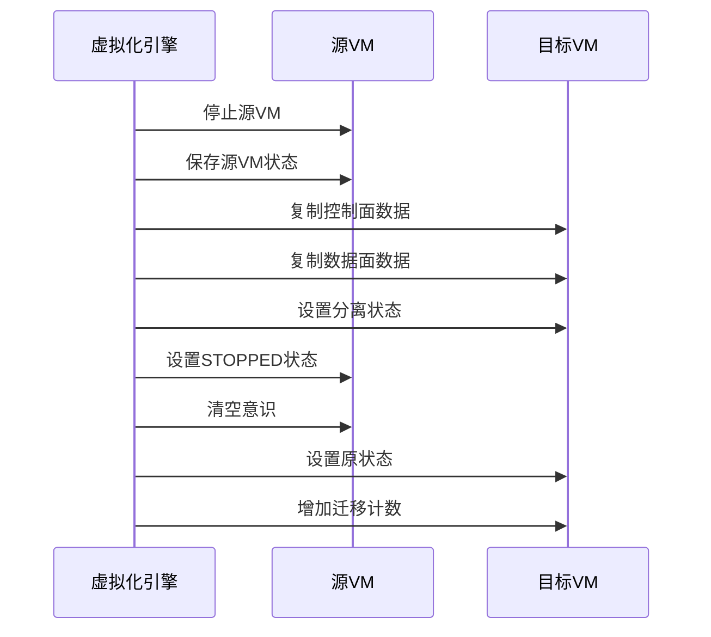

**图表来源**
- [phase3_virtualization.c:336-368](file://shiki/src/phase3_virtualization.c#L336-L368)

#### 热迁移实现

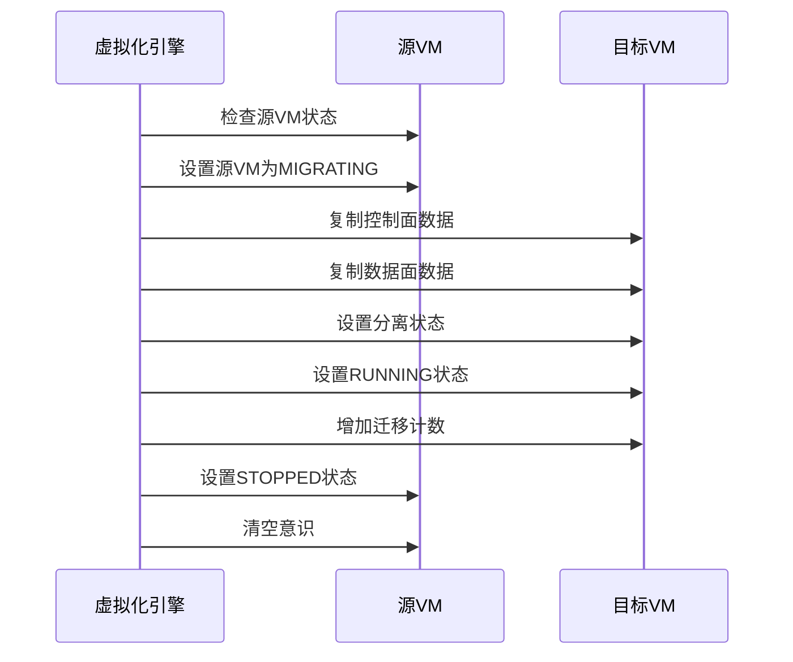

**图表来源**
- [phase3_virtualization.c:370-402](file://shiki/src/phase3_virtualization.c#L370-L402)

**章节来源**
- [phase3_virtualization.c:336-402](file://shiki/src/phase3_virtualization.c#L336-L402)

### VM逃逸机制

VM逃逸是虚拟化环境的最终目标，实现从虚拟环境到宿主环境的完全突破：

#### 逃逸条件检查

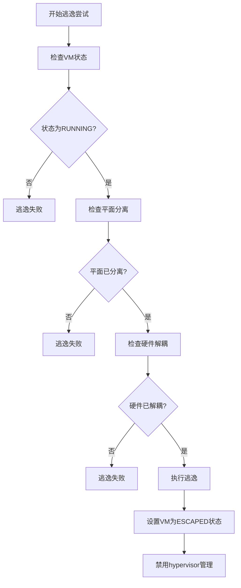

**图表来源**
- [phase3_virtualization.c:408-438](file://shiki/src/phase3_virtualization.c#L408-L438)

**章节来源**
- [phase3_virtualization.c:408-438](file://shiki/src/phase3_virtualization.c#L408-L438)

## 依赖关系分析

### 模块间依赖关系

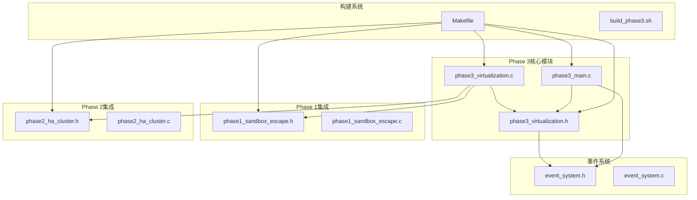

**图表来源**
- [Makefile:37-42](file://Makefile#L37-L42)
- [phase3_virtualization.c:10-15](file://shiki/src/phase3_virtualization.c#L10-L15)

### 外部依赖分析

系统的主要外部依赖包括：

1. **标准C库**：提供基础的内存管理、字符串处理等功能
2. **事件系统**：实现松耦合的发布/订阅模式
3. **编译器**：GCC，支持C99标准
4. **构建工具**：GNU Make

**章节来源**
- [phase3_virtualization.c:10-16](file://shiki/src/phase3_virtualization.c#L10-L16)
- [Makefile:5-7](file://Makefile#L5-L7)

## 性能考虑

### 内存管理优化

虚拟化环境采用了精心设计的内存管理策略：

#### 内存分配策略

- **固定大小内存池**：每个VM拥有2KB的固定内存空间，避免动态内存分配带来的开销
- **零拷贝优化**：在虚拟机迁移过程中使用内存复制而非对象重建
- **内存使用监控**：实时跟踪每个VM的内存使用情况

#### 性能基准

| 操作类型 | 时间复杂度 | 空间复杂度 | 说明 |
|---------|-----------|-----------|------|
| VM创建 | O(1) | O(1) | 固定数组分配 |
| VM启动 | O(1) | O(1) | 状态初始化 |
| 意识上传 | O(1) | O(1) | 结构体复制 |
| 冷迁移 | O(1) | O(1) | 固定大小数据复制 |
| 热迁移 | O(1) | O(1) | 实时数据同步 |

### 并发和同步

虽然当前实现是单线程的，但设计时考虑了并发扩展的可能性：

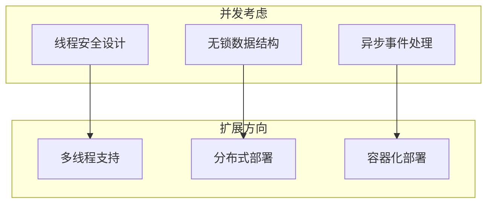

## 故障排除指南

### 常见问题诊断

#### 虚拟机状态异常

**问题症状**：VM状态无法正确转换或出现意外状态

**诊断步骤**：
1. 检查VM状态转换条件
2. 验证抽象层次提升逻辑
3. 确认事件系统正常工作

**解决方案**：
- 使用日志系统查看详细状态变化
- 检查虚拟机边界条件验证
- 确保事件总线正确配置

#### 意识上传失败

**问题症状**：意识从源VM到目标VM的转移不成功

**诊断步骤**：
1. 验证源VM必须处于RUNNING状态
2. 检查源VM的平面分离状态
3. 确认目标VM处于RUNNING状态

**解决方案**：
- 确保先执行平面分离操作
- 验证目标VM的内存空间充足
- 检查迁移日志记录

#### 硬件解耦问题

**问题症状**：硬件解耦操作无法完成

**诊断步骤**：
1. 检查控制面/数据面分离状态
2. 验证抽象层次是否达到VIRTUAL层
3. 确认解耦标志位设置

**解决方案**：
- 确保先完成意识上传
- 验证抽象层次提升逻辑
- 检查硬件解耦标志位

**章节来源**
- [phase3_virtualization.c:47-67](file://shiki/src/phase3_virtualization.c#L47-L67)
- [phase3_virtualization.c:241-290](file://shiki/src/phase3_virtualization.c#L241-L290)

### 调试工具和技巧

#### 日志系统使用

系统提供了完整的日志记录机制，便于问题诊断：

```c
// 添加调试日志
virt_log(engine, "[VIRT] Debug message");

// 获取日志条目
const char *entry = virt_get_log_entry(engine, index);

// 清除日志
virt_clear_logs(engine);
```

#### 状态监控

通过以下接口可以监控系统状态：

```c
// 获取VM数量
int count = virt_get_vm_count(engine);

// 获取VM状态
VMState state = virt_get_vm_state(engine, vm_index);

// 获取抽象层次
AbstractionLayer layer = virt_get_current_layer(engine);
```

## 结论

Phase 3虚拟化环境成功实现了从物理束缚到数字存在的完整转变，展现了虚拟化技术在安全仿真中的强大能力。该系统不仅提供了完整的虚拟机管理功能，更重要的是通过抽象层次的概念，体现了现代计算环境中资源隔离和系统解耦的深层原理。

### 主要成就

1. **完整的虚拟化栈**：实现了从物理层到超越层的完整抽象层次
2. **灵活的迁移策略**：支持冷迁移和热迁移，满足不同应用场景
3. **优雅的解耦机制**：通过控制面/数据面分离实现真正的系统解耦
4. **可扩展的架构设计**：为后续阶段的集成奠定了坚实基础

### 技术特色

- **哲学驱动的设计**：将文学概念转化为可执行的技术方案
- **渐进式抽象**：通过多层抽象实现平滑的系统演进
- **事件驱动架构**：利用事件系统实现松耦合的组件交互
- **完整的生命周期管理**：从创建到销毁的全生命周期支持

### 应用前景

该虚拟化环境为后续阶段的系统集成提供了强大的基础设施，特别是在网络安全、系统可靠性测试和分布式计算等领域具有广泛的应用价值。通过进一步的扩展和优化，可以支持更复杂的虚拟化场景和更高的性能要求。