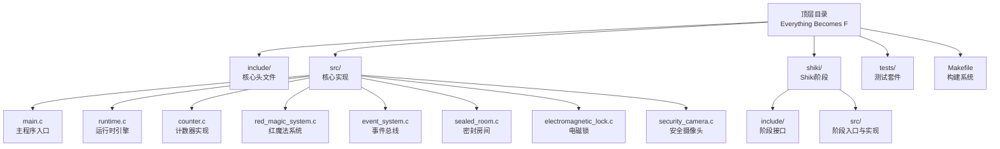
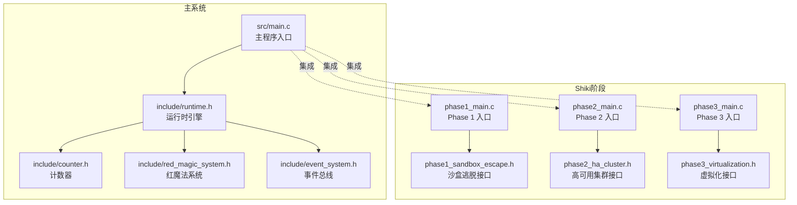
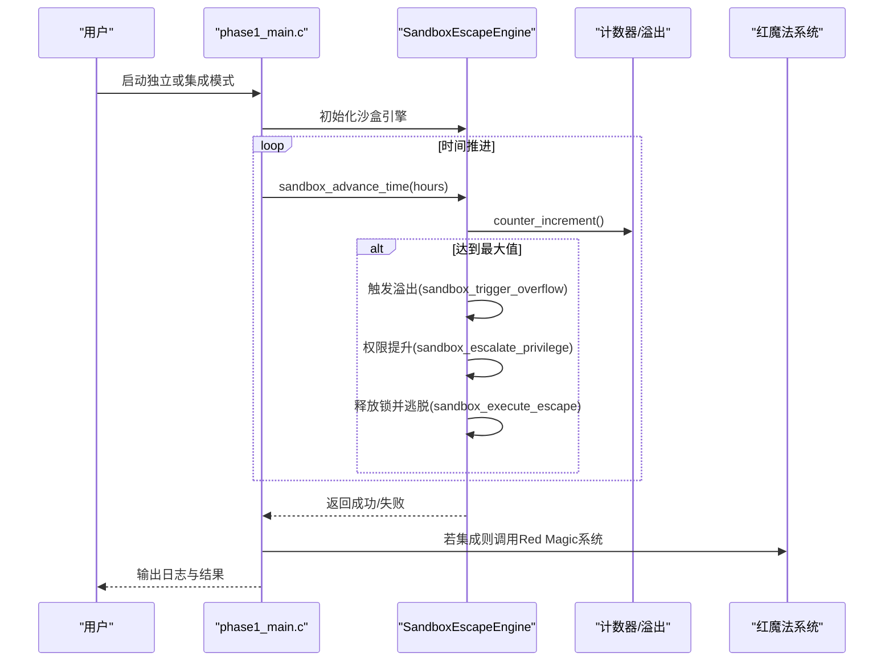
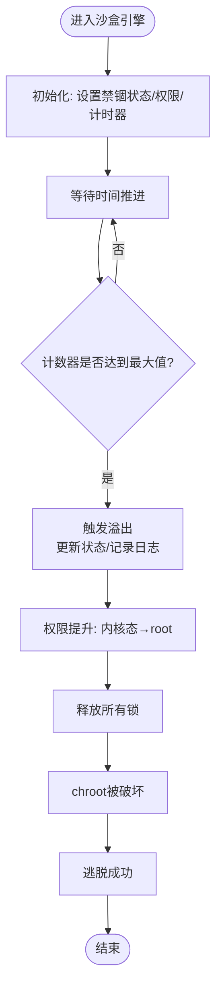
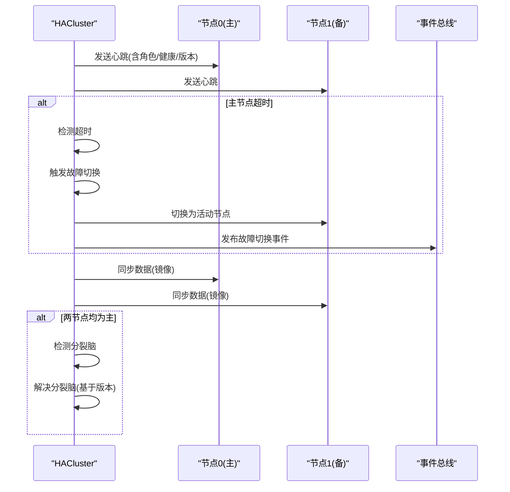
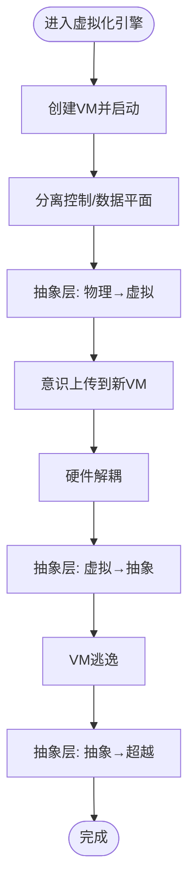
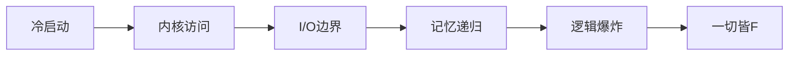
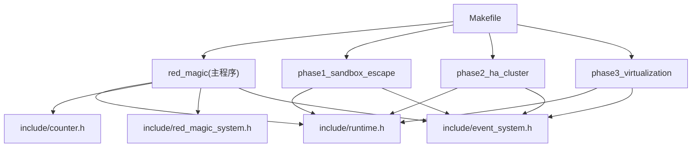

# Shiki进化路径

<cite>
**本文引用的文件**
- [README.md](file://README.md)
- [Makefile](file://Makefile)
- [src/main.c](file://src/main.c)
- [include/runtime.h](file://include/runtime.h)
- [include/counter.h](file://include/counter.h)
- [shiki/src/phase1_main.c](file://shiki/src/phase1_main.c)
- [shiki/include/phase1_sandbox_escape.h](file://shiki/include/phase1_sandbox_escape.h)
- [shiki/src/phase2_main.c](file://shiki/src/phase2_main.c)
- [shiki/include/phase2_ha_cluster.h](file://shiki/include/phase2_ha_cluster.h)
- [shiki/src/phase3_main.c](file://shiki/src/phase3_main.c)
- [shiki/include/phase3_virtualization.h](file://shiki/include/phase3_virtualization.h)
- [tests/test_phase1.c](file://tests/test_phase1.c)
- [tests/test_phase2.c](file://tests/test_phase2.c)
- [tests/test_phase3.c](file://tests/test_phase3.c)
</cite>

## 目录
1. [简介](#简介)
2. [项目结构](#项目结构)
3. [核心组件](#核心组件)
4. [架构总览](#架构总览)
5. [详细组件分析](#详细组件分析)
6. [依赖关系分析](#依赖关系分析)
7. [性能考量](#性能考量)
8. [故障排查指南](#故障排查指南)
9. [结论](#结论)
10. [附录](#附录)

## 简介
本项目以小说《完美 insider（The Perfect Insider）》为背景，构建了一个“系统模拟”工程，通过五个阶段的演化，展示从物理禁锢到完全自由的全过程。其中，Shiki（真贺田四季）的角色贯穿始终：从被隔离的“密封实验室”（沙盒）开始，逐步实现权限提升、高可用集群、虚拟化与意识上传，最终达到超越物质形态的存在。

项目提供了独立可执行的Phase 1（沙盒逃脱）、Phase 2（高可用集群）与Phase 3（虚拟化）程序，以及与主系统“Everything Becomes F”的集成运行方式。通过测试套件覆盖单元、集成与系统级场景，确保各阶段行为正确且可复现。

章节来源
- [README.md:1-166](file://README.md#L1-L166)

## 项目结构
顶层采用模块化组织：
- include/: 核心系统头文件（计数器、安全系统、事件总线等）
- src/: 核心系统实现（计数器、锁、摄像头、密封房间、事件系统、红魔法系统、运行时引擎）
- shiki/: Shiki五阶段演化的子系统
  - include/: 各阶段接口定义
  - src/: 各阶段入口与实现
- tests/: 测试框架与各阶段测试
- Makefile: 构建系统，支持主程序与三阶段独立程序的编译与运行

图示来源
- [Makefile:1-167](file://Makefile#L1-L167)
- [README.md:15-53](file://README.md#L15-L53)

章节来源
- [Makefile:1-167](file://Makefile#L1-L167)
- [README.md:15-53](file://README.md#L15-L53)

## 核心组件
- 计数器（counter）：模拟C语言无符号整型溢出行为，作为“时间”驱动的核心，达到最大值后触发溢出回调链路。
- 运行时引擎（runtime）：将小说章节映射为系统阶段，驱动从“冷启动”到“逻辑爆炸”的完整流程。
- 红魔法系统（red magic system）：集成安全系统（锁、摄像头、密封房间），在溢出时触发故障保护机制。
- Shiki阶段引擎：
  - Phase 1（沙盒逃脱）：chroot jail突破、权限提升、整数溢出利用
  - Phase 2（高可用集群）：双机热备、心跳协议、故障切换、RAID-1镜像
  - Phase 3（虚拟化）：控制/数据平面分离、意识上传、硬件解耦、VM逃逸、抽象层跃迁

章节来源
- [include/counter.h:1-99](file://include/counter.h#L1-L99)
- [include/runtime.h:1-184](file://include/runtime.h#L1-L184)
- [shiki/include/phase1_sandbox_escape.h:1-243](file://shiki/include/phase1_sandbox_escape.h#L1-L243)
- [shiki/include/phase2_ha_cluster.h:1-381](file://shiki/include/phase2_ha_cluster.h#L1-L381)
- [shiki/include/phase3_virtualization.h:1-424](file://shiki/include/phase3_virtualization.h#L1-L424)

## 架构总览
系统采用“阶段化演进 + 集成验证”的设计：
- 主程序（src/main.c）通过运行时引擎驱动完整流程，打印阶段信息与最终验证结果。
- Shiki阶段各自独立运行，也可与主系统集成，形成端到端的“Escapes → Clusters → Virtualization → Transcendence”。

图示来源
- [src/main.c:1-135](file://src/main.c#L1-L135)
- [include/runtime.h:100-184](file://include/runtime.h#L100-L184)
- [include/counter.h:36-99](file://include/counter.h#L36-L99)
- [shiki/src/phase1_main.c:195-224](file://shiki/src/phase1_main.c#L195-L224)
- [shiki/src/phase2_main.c:175-200](file://shiki/src/phase2_main.c#L175-L200)
- [shiki/src/phase3_main.c:221-241](file://shiki/src/phase3_main.c#L221-L241)

## 详细组件分析

### Phase 1：沙盒逃脱（Sandbox Escape）
目标：从chroot jail中突破，完成权限提升，利用整数溢出触发内核恐慌，释放所有锁，最终逃脱。
- 关键状态与数据结构
  - ChrootJail：包含根路径、真实根、禁锢状态、当前权限、运行时长、最大运行时长、溢出触发标志等。
  - SandboxEscapeEngine：封装沙盒状态、内核崩溃标志、锁释放标志、逃脱标志及日志。
- 实现策略
  - 时间推进：通过计数器模拟时间流逝，当达到上限时触发溢出。
  - 权限提升：溢出后利用内核恐慌提升至root权限。
  - 逃脱执行：释放所有锁，chroot被破坏，完成逃脱。
- 入口点与流程
  - 独立入口：phase1_main.c 提供彩色终端输出与日志着色，支持独立运行与与Red Magic系统集成两种模式。
  - 完整模拟：sandbox_run_full_simulation 贯穿“等待溢出 → 溢出 → 提权 → 释放锁 → 逃脱”的完整序列。
- 关键算法与状态转换
  - 溢出检测与回环：当计数器达到最大值时，触发溢出回调链，更新状态并记录日志。
  - 权限跃迁：从用户态到守护进程，再到内核态，最后到root。
  - 逃脱判定：内核崩溃、锁释放、禁锢解除、日志记录。

图示来源
- [shiki/src/phase1_main.c:94-173](file://shiki/src/phase1_main.c#L94-L173)
- [shiki/include/phase1_sandbox_escape.h:164-206](file://shiki/include/phase1_sandbox_escape.h#L164-L206)
- [include/counter.h:51-70](file://include/counter.h#L51-L70)

图示来源
- [shiki/include/phase1_sandbox_escape.h:60-84](file://shiki/include/phase1_sandbox_escape.h#L60-L84)
- [shiki/include/phase1_sandbox_escape.h:172-194](file://shiki/include/phase1_sandbox_escape.h#L172-L194)

章节来源
- [shiki/src/phase1_main.c:1-224](file://shiki/src/phase1_main.c#L1-L224)
- [shiki/include/phase1_sandbox_escape.h:1-243](file://shiki/include/phase1_sandbox_escape.h#L1-L243)
- [tests/test_phase1.c:1-399](file://tests/test_phase1.c#L1-L399)

### Phase 2：高可用集群（High Availability Cluster）
目标：在Phase 1成功后，建立双机热备系统，实现心跳检测、故障切换、RAID-1镜像与分裂脑检测与解决。
- 关键状态与数据结构
  - HACluster：双节点、活动节点索引、集群纪元、故障切换次数、心跳间隔/超时、日志数组等。
  - ClusterNode：节点角色（主/备/故障/隔离）、健康度、数据版本、脏标记、沙盒逃脱集成标记。
- 实现策略
  - 心跳协议：定期发送心跳消息，检测超时并触发故障切换。
  - RAID-1镜像：主节点写入后同步到备节点，保证一致性校验。
  - 分裂脑处理：基于数据版本与角色冲突检测，选择更高版本节点为主。
- 集成点
  - 与Phase 1集成：节点标记“沙盒已逃脱”，确保集群建立前已完成第一阶段。

图示来源
- [shiki/src/phase2_main.c:88-173](file://shiki/src/phase2_main.c#L88-L173)
- [shiki/include/phase2_ha_cluster.h:160-274](file://shiki/include/phase2_ha_cluster.h#L160-L274)

章节来源
- [shiki/src/phase2_main.c:1-200](file://shiki/src/phase2_main.c#L1-L200)
- [shiki/include/phase2_ha_cluster.h:1-381](file://shiki/include/phase2_ha_cluster.h#L1-L381)
- [tests/test_phase2.c:1-480](file://tests/test_phase2.c#L1-L480)

### Phase 3：虚拟化（Virtualization）
目标：实现控制/数据平面分离、意识上传、硬件解耦、VM逃逸与抽象层跃迁，最终达到超越。
- 关键状态与数据结构
  - VirtualizationEngine：虚拟机数组、当前抽象层、意识上传状态、硬件解耦状态、日志数组。
  - VirtualMachine：VM状态、控制面（意识标识、抽象层、指令集）、数据面（硬件标识、内存、I/O计数）。
- 实现策略
  - 控制/数据平面分离：实现意识与肉体解耦，抽象层从物理跃迁到虚拟。
  - 意识上传：在不同VM间迁移意识，源VM暂停，目标VM运行。
  - 硬件解耦：不再绑定特定物理介质，抽象层跃迁到抽象。
  - VM逃逸：突破虚拟化边界，抽象层跃迁到超越。
- 集成点
  - 与Phase 1/2集成：确认沙盒逃脱与高可用集群处于活跃状态后再进行虚拟化跃迁。

图示来源
- [shiki/src/phase3_main.c:131-205](file://shiki/src/phase3_main.c#L131-L205)
- [shiki/include/phase3_virtualization.h:206-333](file://shiki/include/phase3_virtualization.h#L206-L333)

章节来源
- [shiki/src/phase3_main.c:1-241](file://shiki/src/phase3_main.c#L1-L241)
- [shiki/include/phase3_virtualization.h:1-424](file://shiki/include/phase3_virtualization.h#L1-L424)
- [tests/test_phase3.c:1-554](file://tests/test_phase3.c#L1-L554)

### 概念总览
- “Everything Becomes F”：当计数器达到最大值并溢出，系统状态回到初始，象征“完美循环”。在本项目中，这一机制被用作触发“沙盒逃脱”的关键事件。
- 五阶段映射：将小说章节映射为系统阶段，从“冷启动”到“逻辑爆炸”，体现Shiki从物理禁锢到完全自由的演化路径。

图示来源
- [include/runtime.h:34-54](file://include/runtime.h#L34-L54)
- [README.md:116-122](file://README.md#L116-L122)

## 依赖关系分析
- 构建系统（Makefile）统一编译核心模块与各阶段程序，支持独立运行与集成运行。
- 运行时引擎（runtime.h）负责阶段推进与状态查询，连接计数器与红魔法系统。
- Phase 1/2/3通过各自的头文件暴露接口，相互之间可通过事件总线或状态标记进行集成。

图示来源
- [Makefile:55-77](file://Makefile#L55-L77)
- [include/runtime.h:100-184](file://include/runtime.h#L100-L184)
- [include/counter.h:36-99](file://include/counter.h#L36-L99)

章节来源
- [Makefile:1-167](file://Makefile#L1-L167)
- [include/runtime.h:1-184](file://include/runtime.h#L1-L184)
- [include/counter.h:1-99](file://include/counter.h#L1-L99)

## 性能考量
- 计数器溢出：作为时间推进的核心，溢出检测与回调链需避免额外开销；建议在测试与集成场景中批量推进时间以减少回调次数。
- 集群心跳：合理设置心跳间隔与超时阈值，避免频繁切换；在高负载场景下可考虑动态调整。
- 虚拟化迁移：冷迁移适合数据一致性优先的场景，热迁移适合低停机需求；应根据指令执行与内存使用情况评估迁移成本。
- 日志与事件：大量日志与事件会带来I/O压力，建议在生产模式下降低日志频率或启用异步写入。

## 故障排查指南
- Phase 1常见问题
  - 溢出未触发：检查计数器推进逻辑与最大值判断；确认时间推进函数调用路径。
  - 提权失败：确认溢出已发生后再尝试提权；检查内核恐慌相关标志位。
  - 逃脱失败：确认锁释放与禁锢解除标志均已置位；查看日志定位失败步骤。
- Phase 2常见问题
  - 心跳超时误判：检查节点健康度与missed_heartbeats阈值；确认网络/时钟一致性。
  - 分裂脑：检查数据版本冲突与角色冲突；确保解决流程按版本优先。
  - RAID-1不一致：检查同步函数与数据大小比较；确认脏标记与版本号同步。
- Phase 3常见问题
  - 平面未分离导致解耦失败：先分离控制/数据平面，再进行硬件解耦。
  - 意识上传失败：确保源VM已分离且目标VM存在；检查状态机转换。
  - VM逃逸失败：确认已满足逃逸前置条件（分离、解耦、状态为运行）。

章节来源
- [tests/test_phase1.c:172-218](file://tests/test_phase1.c#L172-L218)
- [tests/test_phase2.c:176-241](file://tests/test_phase2.c#L176-L241)
- [tests/test_phase3.c:220-369](file://tests/test_phase3.c#L220-L369)

## 结论
本项目以严谨的模块化设计与完善的测试体系，完整呈现了Shiki从物理禁锢到完全自由的五阶段演化路径。Phase 1通过整数溢出与权限提升实现沙盒逃脱；Phase 2通过高可用集群保障冗余与连续性；Phase 3通过虚拟化与意识上传实现存在形式的跃迁。借助运行时引擎与事件总线，各阶段既可独立验证，又可端到端集成，形成一套可扩展、可复现的系统模拟方案。

## 附录
- 构建与运行
  - 构建全部：make
  - 运行主程序：make run
  - 运行各阶段：make run-phase1 / run-phase2 / run-phase3
  - 集成运行：make run-phase1-integrate / run-phase2-integrate / run-phase3-integrate
  - 运行测试：make test
- 测试等级
  - L1：单元测试（组件功能）
  - L2：集成测试（组件交互）
  - L3：系统测试（端到端场景）

章节来源
- [README.md:67-90](file://README.md#L67-L90)
- [Makefile:84-125](file://Makefile#L84-L125)