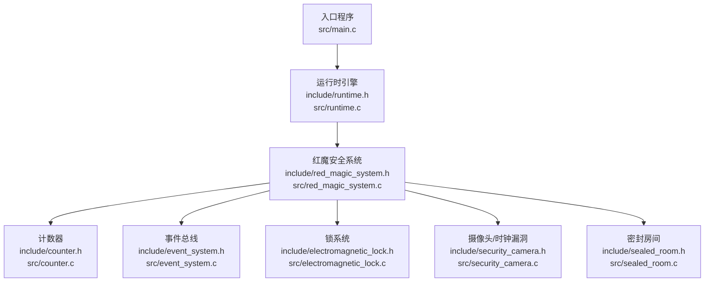
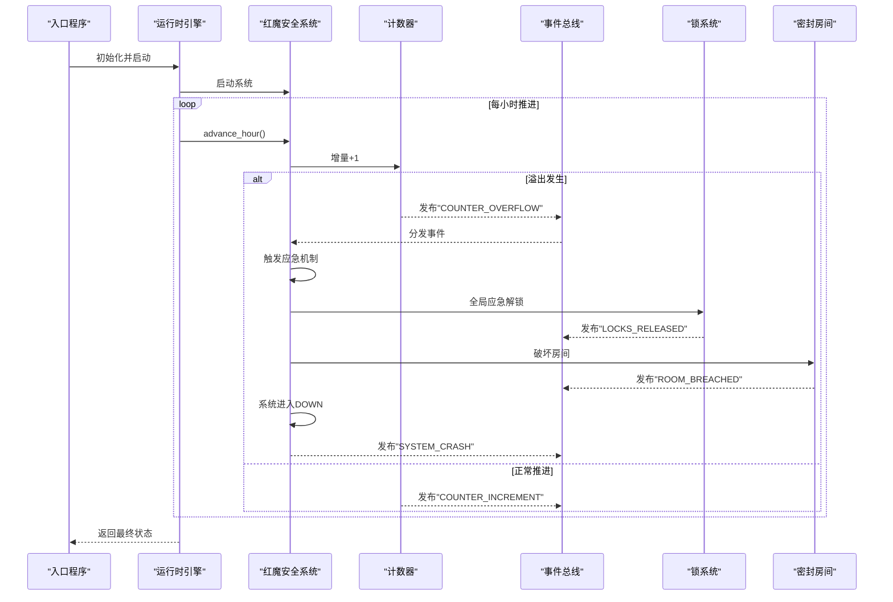
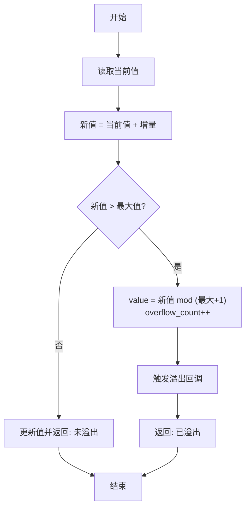
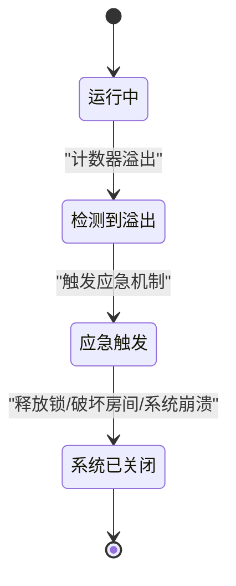
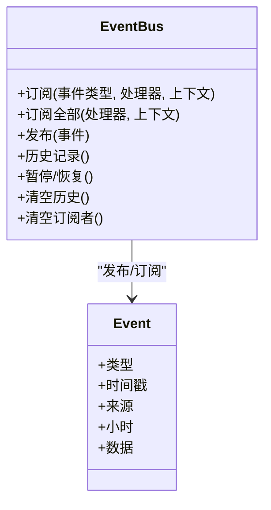
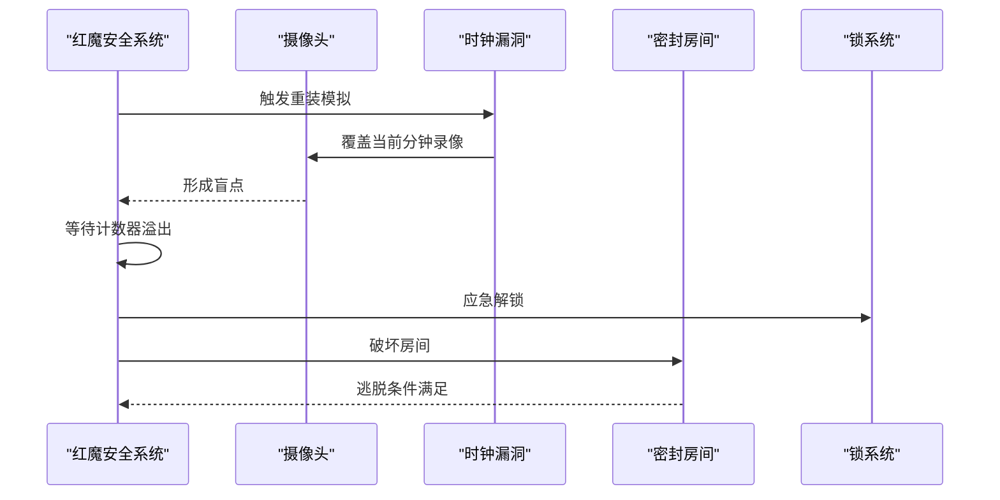
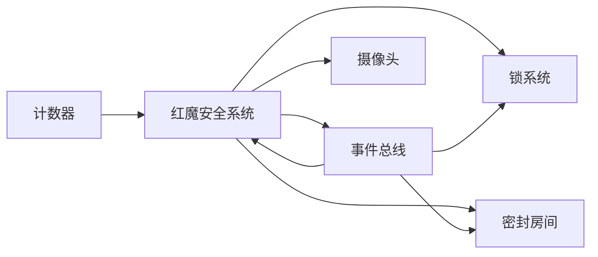

# 安全教育内容

<cite>
**本文引用的文件**
- [README.md](file://README.md)
- [main.c](file://src/main.c)
- [runtime.h](file://include/runtime.h)
- [runtime.c](file://src/runtime.c)
- [counter.h](file://include/counter.h)
- [counter.c](file://src/counter.c)
- [red_magic_system.h](file://include/red_magic_system.h)
- [red_magic_system.c](file://src/red_magic_system.c)
- [event_system.h](file://include/event_system.h)
- [event_system.c](file://src/event_system.c)
- [electromagnetic_lock.h](file://include/electromagnetic_lock.h)
- [electromagnetic_lock.c](file://src/electromagnetic_lock.c)
- [sealed_room.h](file://include/sealed_room.h)
- [sealed_room.c](file://src/sealed_room.c)
- [security_camera.h](file://include/security_camera.h)
- [security_camera.c](file://src/security_camera.c)
- [test_framework.h](file://tests/test_framework.h)
- [test_l1_unit.c](file://tests/test_l1_unit.c)
</cite>

## 目录
1. [引言](#引言)
2. [项目结构](#项目结构)
3. [核心组件](#核心组件)
4. [架构总览](#架构总览)
5. [详细组件分析](#详细组件分析)
6. [依赖关系分析](#依赖关系分析)
7. [性能与复杂度考量](#性能与复杂度考量)
8. [故障排查指南](#故障排查指南)
9. [结论](#结论)
10. [附录](#附录)

## 引言
本项目以小说《完美内鬼》为背景，通过一个“计时器溢出触发应急机制”的故事线，演示整数溢出漏洞的原理、危害与防护。读者将学习到：
- C99 标准下 32 位无符号整数的溢出行为（模运算）与系统级影响；
- fail-safe 安全设计的动机与实现方式；
- 基于事件驱动的解耦架构如何在安全系统中协同工作；
- 实际安全案例（时钟同步盲点 + 计数器溢出）与防护策略；
- 安全编程最佳实践与防御策略。

## 项目结构
项目采用模块化分层组织：核心计数器、安全系统控制器、锁系统、摄像头监控、密封房间模型、事件总线与运行时引擎。入口程序负责初始化系统、注册阶段回调、推进仿真并验证结果。

图示来源
- [main.c:76-135](file://src/main.c#L76-L135)
- [runtime.c:158-205](file://src/runtime.c#L158-L205)
- [red_magic_system.c:48-72](file://src/red_magic_system.c#L48-L72)
- [counter.c:9-21](file://src/counter.c#L9-L21)
- [event_system.c:79-96](file://src/event_system.c#L79-L96)
- [electromagnetic_lock.c:126-138](file://src/electromagnetic_lock.c#L126-L138)
- [security_camera.c:21-37](file://src/security_camera.c#L21-L37)
- [sealed_room.c:69-88](file://src/sealed_room.c#L69-L88)

章节来源
- [README.md:15-53](file://README.md#L15-L53)
- [main.c:76-135](file://src/main.c#L76-L135)

## 核心组件
- 计数器（32 位无符号整数）
  - 提供增量、快速前进、溢出检测与回调注册等能力；溢出后值回绕至 0，并统计溢出次数。
- 红魔安全系统
  - 负责状态机推进、溢出事件处理、应急机制触发（释放所有锁、破坏密封房间）、日志记录与事件发布。
- 事件总线
  - 发布/订阅模式，支持按类型订阅、全局订阅、历史记录、暂停/恢复与清空等。
- 锁系统
  - fail-safe 设计：正常供电时锁定，断电或触发应急时解锁；支持全局应急解锁。
- 摄像头与时钟漏洞
  - 模拟系统重装时的时钟同步盲点，覆盖当前分钟录像形成监控盲区。
- 密封房间
  - 封闭状态 → 被破坏 → 逃脱；与锁系统联动，受溢出事件影响。
- 运行时引擎
  - 将小说情节映射为系统阶段，推进仿真并最终验证“一切终将归零”的结局。

章节来源
- [counter.h:29-43](file://include/counter.h#L29-L43)
- [counter.c:40-60](file://src/counter.c#L40-L60)
- [red_magic_system.h:65-88](file://include/red_magic_system.h#L65-L88)
- [red_magic_system.c:74-90](file://src/red_magic_system.c#L74-L90)
- [event_system.h:69-108](file://include/event_system.h#L69-L108)
- [event_system.c:171-204](file://src/event_system.c#L171-L204)
- [electromagnetic_lock.h:40-91](file://include/electromagnetic_lock.h#L40-L91)
- [electromagnetic_lock.c:223-238](file://src/electromagnetic_lock.c#L223-L238)
- [security_camera.h:48-115](file://include/security_camera.h#L48-L115)
- [security_camera.c:176-192](file://src/security_camera.c#L176-L192)
- [sealed_room.h:63-76](file://include/sealed_room.h#L63-L76)
- [sealed_room.c:144-168](file://src/sealed_room.c#L144-L168)
- [runtime.h:100-117](file://include/runtime.h#L100-L117)
- [runtime.c:80-101](file://src/runtime.c#L80-L101)

## 架构总览
系统采用事件驱动的松耦合架构：计数器溢出作为根因事件，通过事件总线传播到安全系统，进而触发应急机制、释放锁、破坏房间并最终导致系统崩溃。运行时引擎负责阶段推进与状态迁移。

图示来源
- [runtime.c:158-205](file://src/runtime.c#L158-L205)
- [red_magic_system.c:115-125](file://src/red_magic_system.c#L115-L125)
- [counter.c:40-60](file://src/counter.c#L40-L60)
- [red_magic_system.c:74-90](file://src/red_magic_system.c#L74-L90)
- [red_magic_system.c:146-183](file://src/red_magic_system.c#L146-L183)
- [event_system.c:171-204](file://src/event_system.c#L171-L204)

## 详细组件分析

### 整数溢出与计数器（C99 32 位无符号）
- 数值范围与溢出机制
  - 32 位无符号整数取值范围为 0 到 4294967295（即 0xFFFFFFFF）。当值达到最大后继续递增，将回绕到 0，形成模运算环。
  - 快速前进算法使用除法与取余一次性计算溢出次数与最终值，避免逐次递增带来的性能问题。
- 关键接口与行为
  - 增量与批量增量：返回是否发生溢出。
  - 快速前进：O(1) 计算溢出次数并更新计数器。
  - 回调：每次溢出触发注册的回调，用于通知上层系统。
- 系统级影响
  - 在本项目中，溢出触发“应急机制”，导致系统状态从“运行”转为“系统已关闭”，并释放所有锁、破坏密封房间。

图示来源
- [counter.c:44-60](file://src/counter.c#L44-L60)
- [counter.c:81-104](file://src/counter.c#L81-L104)
- [counter.h:45-84](file://include/counter.h#L45-L84)

章节来源
- [README.md:100-104](file://README.md#L100-L104)
- [counter.c:40-60](file://src/counter.c#L40-L60)
- [counter.c:81-104](file://src/counter.c#L81-L104)
- [counter.h:19-21](file://include/counter.h#L19-L21)

### fail-safe 安全设计
- 设计理念
  - fail-safe（故障安全）原则：在异常或紧急情况下，系统自动进入最安全的状态（例如断电时门锁应解锁）。
- 在本项目中的体现
  - 应急机制被计数器溢出事件触发，系统进入“FAILSAFE_TRIGGERED”，随后释放所有锁、破坏密封房间、最终系统崩溃。
  - 锁系统提供全局应急解锁接口，确保在紧急时刻能快速解除物理约束。
- 重要性
  - 防止系统在异常状态下维持危险状态；在本例中，溢出意味着“系统寿命终结”，fail-safe 是唯一合理的收尾。

图示来源
- [red_magic_system.c:74-90](file://src/red_magic_system.c#L74-L90)
- [red_magic_system.c:146-183](file://src/red_magic_system.c#L146-L183)
- [electromagnetic_lock.c:223-238](file://src/electromagnetic_lock.c#L223-L238)
- [sealed_room.c:144-168](file://src/sealed_room.c#L144-L168)

章节来源
- [README.md:59-60](file://README.md#L59-L60)
- [red_magic_system.c:146-183](file://src/red_magic_system.c#L146-L183)
- [electromagnetic_lock.h:40-46](file://include/electromagnetic_lock.h#L40-L46)

### 事件驱动架构在安全系统中的应用
- 松耦合与可扩展性
  - 事件总线支持按类型订阅与全局订阅，便于新增处理器而不修改既有逻辑。
  - 历史记录与暂停/恢复功能有助于调试与审计。
- 在本项目中的应用
  - 计数器溢出 → 安全系统 → 应急机制 → 锁释放 → 房间破坏 → 系统崩溃，事件链路清晰且可追踪。
- 可靠性
  - 事件总线提供订阅者数量统计、清空历史与清空订阅者等功能，便于在极端情况下进行系统清理与恢复。

图示来源
- [event_system.h:93-108](file://include/event_system.h#L93-L108)
- [event_system.c:171-204](file://src/event_system.c#L171-L204)

章节来源
- [event_system.h:25-61](file://include/event_system.h#L25-L61)
- [event_system.c:79-96](file://src/event_system.c#L79-L96)
- [event_system.c:235-247](file://src/event_system.c#L235-L247)

### 安全案例：时钟同步盲点 + 计数器溢出
- 时钟同步盲点
  - 系统重装时，时钟存在 1 分钟漂移，当前分钟的录像会被覆盖，形成监控盲点。
  - 该漏洞与计数器溢出共同构成“越狱路径”：利用盲点完成内部操作，等待计数器溢出触发应急机制。
- 密封房间与锁系统
  - 密封房间在被破坏后才允许逃脱；锁系统在应急机制触发时全局解锁。
- 运行时推进
  - 运行时引擎将小说情节映射为阶段，直接推进到“逻辑爆炸”阶段，模拟计数器溢出与后续事件链。

图示来源
- [security_camera.c:176-192](file://src/security_camera.c#L176-L192)
- [red_magic_system.c:146-183](file://src/red_magic_system.c#L146-L183)
- [sealed_room.c:144-168](file://src/sealed_room.c#L144-L168)
- [electromagnetic_lock.c:223-238](file://src/electromagnetic_lock.c#L223-L238)

章节来源
- [security_camera.h:102-115](file://include/security_camera.h#L102-L115)
- [security_camera.c:176-192](file://src/security_camera.c#L176-L192)
- [sealed_room.c:144-168](file://src/sealed_room.c#L144-L168)
- [red_magic_system.c:146-183](file://src/red_magic_system.c#L146-L183)

### 防护措施与安全编程最佳实践
- 预防溢出
  - 使用更大位宽的计数器或在增量前检查边界；对可能溢出的算式进行显式边界判断。
- fail-safe 设计
  - 明确异常路径下的安全状态；在关键系统中默认启用 fail-safe 行为，并提供可控的降级策略。
- 事件驱动与可观测性
  - 通过事件总线记录关键事件与状态变更，便于审计与回溯；在调试阶段可暂停事件流以隔离问题。
- 输入校验与边界测试
  - 单元测试覆盖边界值（如最大值、最小值、接近溢出的值），确保行为符合预期。
- 日志与告警
  - 对关键事件（如溢出检测、应急触发）进行日志记录，并设置告警阈值。

章节来源
- [counter.c:44-60](file://src/counter.c#L44-L60)
- [counter.c:81-104](file://src/counter.c#L81-L104)
- [red_magic_system.c:74-90](file://src/red_magic_system.c#L74-L90)
- [event_system.c:171-204](file://src/event_system.c#L171-L204)
- [test_l1_unit.c:58-75](file://tests/test_l1_unit.c#L58-L75)
- [test_l1_unit.c:115-129](file://tests/test_l1_unit.c#L115-L129)

## 依赖关系分析
- 组件耦合与职责
  - 计数器仅负责数值管理与溢出检测，不直接操作锁或房间，保持高内聚低耦合。
  - 红魔安全系统聚合子系统并通过事件总线协调各模块。
  - 事件总线为跨模块通信提供基础设施，避免直接依赖。
- 关键依赖链
  - 计数器 → 红魔安全系统 → 锁系统/密封房间 → 事件总线。
- 循环依赖规避
  - 通过事件总线与回调机制实现单向传播，避免循环引用。

图示来源
- [red_magic_system.c:48-72](file://src/red_magic_system.c#L48-L72)
- [event_system.c:171-204](file://src/event_system.c#L171-L204)
- [electromagnetic_lock.c:223-238](file://src/electromagnetic_lock.c#L223-L238)
- [sealed_room.c:144-168](file://src/sealed_room.c#L144-L168)

章节来源
- [red_magic_system.h:66-88](file://include/red_magic_system.h#L66-L88)
- [event_system.h:93-108](file://include/event_system.h#L93-L108)

## 性能与复杂度考量
- 计数器快速前进
  - 时间复杂度：O(1)，空间复杂度：O(1)。通过除法与取余一次性计算溢出次数与最终值，避免逐次递增。
- 事件总线
  - 订阅/取消订阅：O(n)（需查找现有订阅者）；发布：O(k)（k 为订阅该类型的处理器数量 + 全局处理器数量）。
  - 历史记录采用环形缓冲，插入为 O(1)，查询最近事件为 O(m)（m 为返回条数）。
- 锁系统与密封房间
  - 全局应急解锁遍历所有锁，时间复杂度 O(n)；状态查询与计数为 O(n)。

章节来源
- [counter.c:81-104](file://src/counter.c#L81-L104)
- [event_system.c:109-117](file://src/event_system.c#L109-L117)
- [event_system.c:171-204](file://src/event_system.c#L171-L204)
- [electromagnetic_lock.c:223-238](file://src/electromagnetic_lock.c#L223-L238)
- [sealed_room.c:178-187](file://src/sealed_room.c#L178-L187)

## 故障排查指南
- 溢出未触发
  - 检查计数器是否正确注册溢出回调；确认运行时推进流程是否到达溢出阶段。
- 应急机制未生效
  - 检查安全系统状态转换逻辑与事件发布；确认锁系统是否收到全局应急解锁指令。
- 事件丢失
  - 使用事件总线的历史记录功能回溯事件；检查是否误用暂停功能。
- 测试验证
  - 使用单元测试框架验证边界条件（如最大值、接近溢出、快速前进多次溢出）。

章节来源
- [test_framework.h:22-46](file://tests/test_framework.h#L22-L46)
- [test_l1_unit.c:58-75](file://tests/test_l1_unit.c#L58-L75)
- [test_l1_unit.c:115-129](file://tests/test_l1_unit.c#L115-L129)
- [event_system.c:235-247](file://src/event_system.c#L235-L247)

## 结论
本项目以“计数器溢出”为核心线索，串联起 fail-safe 设计、事件驱动架构与多子系统的协同工作，生动演示了整数溢出在真实系统中的潜在危害与应对策略。通过模块化设计与事件总线，系统实现了高内聚、低耦合与强可观测性，为构建健壮的安全系统提供了范式参考。

## 附录
- 名词解释
  - 模运算：在固定位宽整数中，超过最大值后回绕到最小值的行为。
  - fail-safe：在异常或紧急情况下自动进入安全状态的设计原则。
  - 事件驱动：通过发布/订阅模式实现组件间的异步解耦通信。
- 参考输出节选
  - “计数器从 0xFFFFFFFF 增加到 0x00000000，触发应急机制，所有电磁锁释放，密封房间被破坏，系统崩溃。”

章节来源
- [README.md:123-149](file://README.md#L123-L149)