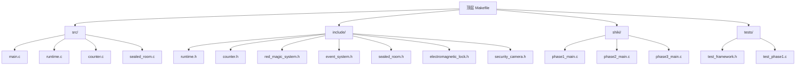
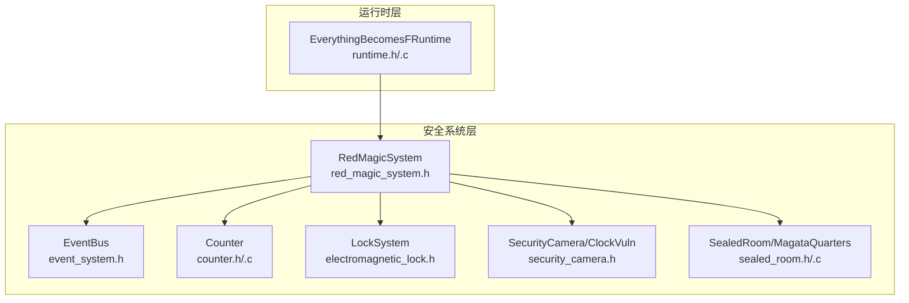
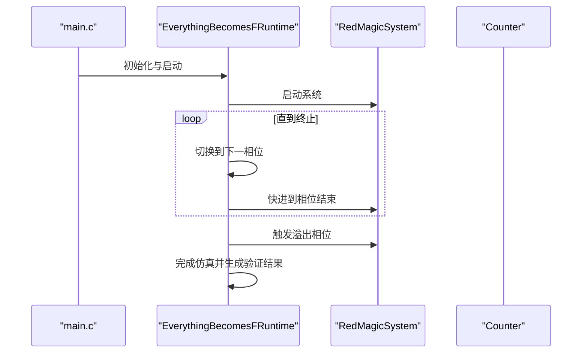
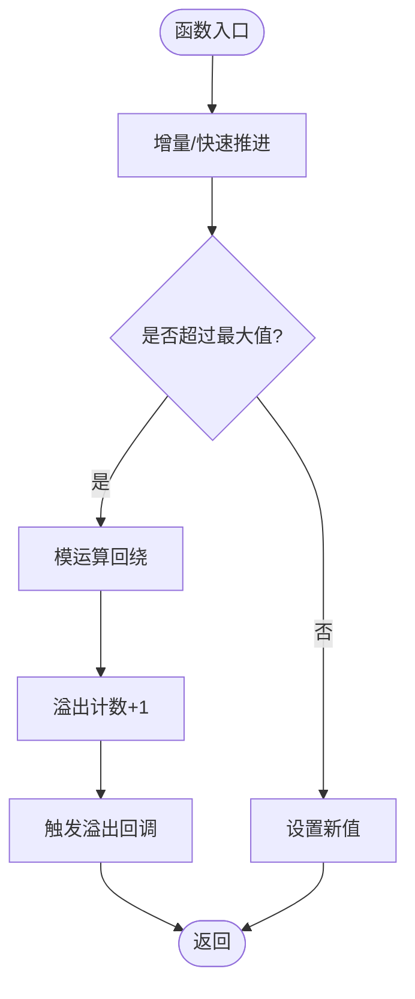
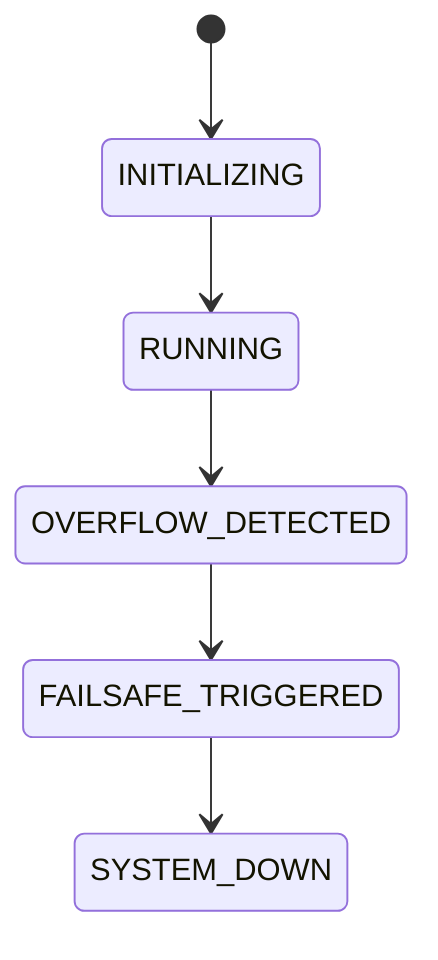
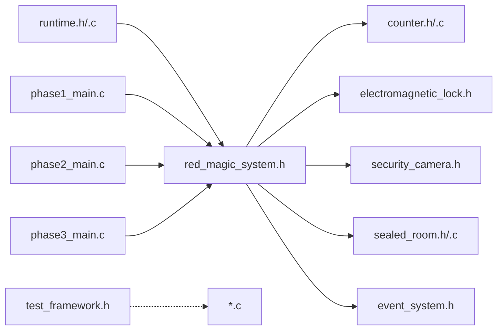

# 开发指南

<cite>
**本文引用的文件**
- [README.md](file://README.md)
- [Makefile](file://Makefile)
- [src/main.c](file://src/main.c)
- [include/runtime.h](file://include/runtime.h)
- [src/runtime.c](file://src/runtime.c)
- [include/counter.h](file://include/counter.h)
- [src/counter.c](file://src/counter.c)
- [include/red_magic_system.h](file://include/red_magic_system.h)
- [include/event_system.h](file://include/event_system.h)
- [include/sealed_room.h](file://include/sealed_room.h)
- [src/sealed_room.c](file://src/sealed_room.c)
- [include/electromagnetic_lock.h](file://include/electromagnetic_lock.h)
- [include/security_camera.h](file://include/security_camera.h)
- [shiki/src/phase1_main.c](file://shiki/src/phase1_main.c)
- [shiki/src/phase2_main.c](file://shiki/src/phase2_main.c)
- [shiki/src/phase3_main.c](file://shiki/src/phase3_main.c)
- [tests/test_framework.h](file://tests/test_framework.h)
- [tests/test_phase1.c](file://tests/test_phase1.c)
</cite>

## 目录
1. [简介](#简介)
2. [项目结构](#项目结构)
3. [核心组件](#核心组件)
4. [架构总览](#架构总览)
5. [详细组件分析](#详细组件分析)
6. [依赖关系分析](#依赖关系分析)
7. [性能考虑](#性能考虑)
8. [故障排查指南](#故障排查指南)
9. [结论](#结论)
10. [附录](#附录)

## 简介
本指南面向贡献者，帮助理解 Everything Becomes F 项目的代码结构与运行机制，并提供扩展开发、测试与发布的实践建议。项目以小说《The Perfect Insider》为背景，通过“计数器溢出”这一核心漏洞，模拟 Dr. Magata Shiki 的越狱过程，涵盖从系统初始化到“一切归于 F”的完整叙事弧。

## 项目结构
项目采用按功能域划分的目录组织方式：
- include/: 头文件集中管理，定义各子系统接口与数据结构
- src/: 各模块实现文件
- shiki/: 分阶段（Phase）独立可执行程序，逐步引入高可用集群与虚拟化等概念
- tests/: 测试框架与多层级测试用例
- 根目录构建脚本与说明文档

图表来源
- [Makefile](file://Makefile)
- [src/main.c](file://src/main.c)
- [src/runtime.c](file://src/runtime.c)
- [src/counter.c](file://src/counter.c)
- [src/sealed_room.c](file://src/sealed_room.c)
- [include/runtime.h](file://include/runtime.h)
- [include/counter.h](file://include/counter.h)
- [include/red_magic_system.h](file://include/red_magic_system.h)
- [include/event_system.h](file://include/event_system.h)
- [include/sealed_room.h](file://include/sealed_room.h)
- [include/electromagnetic_lock.h](file://include/electromagnetic_lock.h)
- [include/security_camera.h](file://include/security_camera.h)
- [shiki/src/phase1_main.c](file://shiki/src/phase1_main.c)
- [shiki/src/phase2_main.c](file://shiki/src/phase2_main.c)
- [shiki/src/phase3_main.c](file://shiki/src/phase3_main.c)
- [tests/test_framework.h](file://tests/test_framework.h)
- [tests/test_phase1.c](file://tests/test_phase1.c)

章节来源
- [README.md](file://README.md)
- [Makefile](file://Makefile)

## 核心组件
- 计数器模块（counter）：模拟 C 语言无符号整型计数器，支持溢出回调与快速推进时间
- 安全系统（red_magic_system）：整合计数器、锁、摄像头、密室等子系统，维护系统状态机
- 运行时引擎（runtime）：将小说情节映射为系统相位，驱动状态迁移与验证
- 事件总线（event_system）：发布/订阅模式，解耦组件间通信
- 密室与电磁锁（sealed_room、electromagnetic_lock）：密室状态机与锁的控制逻辑
- 摄像头与时间漏洞（security_camera）：记录与盲点模拟，体现时钟同步漏洞
- Shiki 阶段程序（shiki/）：独立可执行程序，演示不同阶段的越狱路径与集成效果

章节来源
- [include/counter.h](file://include/counter.h)
- [src/counter.c](file://src/counter.c)
- [include/red_magic_system.h](file://include/red_magic_system.h)
- [include/runtime.h](file://include/runtime.h)
- [src/runtime.c](file://src/runtime.c)
- [include/event_system.h](file://include/event_system.h)
- [include/sealed_room.h](file://include/sealed_room.h)
- [src/sealed_room.c](file://src/sealed_room.c)
- [include/electromagnetic_lock.h](file://include/electromagnetic_lock.h)
- [include/security_camera.h](file://include/security_camera.h)

## 架构总览
系统采用“运行时引擎 + 子系统”的分层架构：
- 运行时引擎负责相位推进与状态验证
- 安全系统作为容器聚合子系统并暴露统一接口
- 事件总线贯穿各模块，实现松耦合
- Shiki 阶段程序以独立可执行形式复用核心能力，支持单机与跨阶段集成

图表来源
- [include/runtime.h](file://include/runtime.h)
- [src/runtime.c](file://src/runtime.c)
- [include/red_magic_system.h](file://include/red_magic_system.h)
- [include/counter.h](file://include/counter.h)
- [src/counter.c](file://src/counter.c)
- [include/electromagnetic_lock.h](file://include/electromagnetic_lock.h)
- [include/security_camera.h](file://include/security_camera.h)
- [include/sealed_room.h](file://include/sealed_room.h)
- [src/sealed_room.c](file://src/sealed_room.c)
- [include/event_system.h](file://include/event_system.h)

## 详细组件分析

### 运行时引擎（runtime）
- 职责：将小说情节映射为系统相位，推进状态机，提供验证结果
- 关键点：
  - 相位信息表：定义每个相位的起止小时与描述
  - 相位切换：触发事件与回调
  - 快进至溢出：直接推进到逻辑爆炸相位并完成仿真
  - 验证“一切归于 F”：基于溢出次数、系统状态与是否越狱

图表来源
- [src/main.c](file://src/main.c)
- [include/runtime.h](file://include/runtime.h)
- [src/runtime.c](file://src/runtime.c)
- [include/red_magic_system.h](file://include/red_magic_system.h)
- [include/counter.h](file://include/counter.h)

章节来源
- [include/runtime.h](file://include/runtime.h)
- [src/runtime.c](file://src/runtime.c)
- [src/main.c](file://src/main.c)

### 计数器（counter）
- 职责：模拟无符号整型计数器，支持增量、快速推进与溢出回调
- 关键点：
  - 溢出计算使用模运算，保证 O(1) 快速推进
  - 提供溢出回调链，便于触发后续事件
  - 支持查询剩余小时与年数

图表来源
- [include/counter.h](file://include/counter.h)
- [src/counter.c](file://src/counter.c)

章节来源
- [include/counter.h](file://include/counter.h)
- [src/counter.c](file://src/counter.c)

### 安全系统（red_magic_system）
- 职责：封装计数器、锁、摄像头、密室与事件总线，提供统一接口
- 关键点：
  - 系统状态机：初始化 → 运行 → 检测溢出 → 失效保护触发 → 系统停机
  - 快进接口：支持直接推进到溢出时刻
  - 相机时钟漏洞：在系统重装时产生一分钟盲点

图表来源
- [include/red_magic_system.h](file://include/red_magic_system.h)

章节来源
- [include/red_magic_system.h](file://include/red_magic_system.h)

### 事件总线（event_system）
- 职责：发布/订阅事件，支持全局与特定类型订阅、历史记录与暂停/恢复
- 关键点：
  - 事件类型覆盖系统、计数器、锁、相机、房间与相位
  - 支持通配订阅与历史回放

章节来源
- [include/event_system.h](file://include/event_system.h)

### 密室与电磁锁（sealed_room、electromagnetic_lock）
- 职责：密室状态机与锁控制，Fail-safe 设计（断电即开）
- 关键点：
  - 密室状态：密封 → 被突破 → 已越狱
  - 主锁失效即门可开启，进而触发密室被突破与越狱

章节来源
- [include/sealed_room.h](file://include/sealed_room.h)
- [src/sealed_room.c](file://src/sealed_room.c)
- [include/electromagnetic_lock.h](file://include/electromagnetic_lock.h)

### 摄像头与时间漏洞（security_camera）
- 职责：视频录制与盲点模拟，体现时钟同步漏洞
- 关键点：
  - 盲点由重装时钟同步导致的分钟级覆盖形成
  - 可注册盲点回调用于追踪

章节来源
- [include/security_camera.h](file://include/security_camera.h)

### Shiki 阶段程序（shiki/）
- Phase 1：沙盒越狱（1996），通过计数器溢出触发内核恐慌与锁释放
- Phase 2：高可用集群（1999），双节点主备与故障转移
- Phase 3：虚拟化（1998），意识上传与抽象层跃迁
- 各阶段均提供独立可执行与集成模式，支持与 Red Magic 系统联动

章节来源
- [shiki/src/phase1_main.c](file://shiki/src/phase1_main.c)
- [shiki/src/phase2_main.c](file://shiki/src/phase2_main.c)
- [shiki/src/phase3_main.c](file://shiki/src/phase3_main.c)

## 依赖关系分析
- 运行时引擎依赖安全系统；安全系统聚合计数器、锁、摄像头、密室与事件总线
- Shiki 阶段程序通过公共头文件与独立实现复用核心能力
- 测试框架为最小化头文件实现，不依赖外部库

图表来源
- [include/runtime.h](file://include/runtime.h)
- [src/runtime.c](file://src/runtime.c)
- [include/red_magic_system.h](file://include/red_magic_system.h)
- [include/counter.h](file://include/counter.h)
- [src/counter.c](file://src/counter.c)
- [include/electromagnetic_lock.h](file://include/electromagnetic_lock.h)
- [include/security_camera.h](file://include/security_camera.h)
- [include/sealed_room.h](file://include/sealed_room.h)
- [src/sealed_room.c](file://src/sealed_room.c)
- [include/event_system.h](file://include/event_system.h)
- [shiki/src/phase1_main.c](file://shiki/src/phase1_main.c)
- [shiki/src/phase2_main.c](file://shiki/src/phase2_main.c)
- [shiki/src/phase3_main.c](file://shiki/src/phase3_main.c)
- [tests/test_framework.h](file://tests/test_framework.h)

章节来源
- [Makefile](file://Makefile)
- [include/runtime.h](file://include/runtime.h)
- [src/runtime.c](file://src/runtime.c)
- [include/red_magic_system.h](file://include/red_magic_system.h)
- [include/counter.h](file://include/counter.h)
- [src/counter.c](file://src/counter.c)
- [include/electromagnetic_lock.h](file://include/electromagnetic_lock.h)
- [include/security_camera.h](file://include/security_camera.h)
- [include/sealed_room.h](file://include/sealed_room.h)
- [src/sealed_room.c](file://src/sealed_room.c)
- [include/event_system.h](file://include/event_system.h)
- [shiki/src/phase1_main.c](file://shiki/src/phase1_main.c)
- [shiki/src/phase2_main.c](file://shiki/src/phase2_main.c)
- [shiki/src/phase3_main.c](file://shiki/src/phase3_main.c)
- [tests/test_framework.h](file://tests/test_framework.h)

## 性能考虑
- 计数器快速推进：使用除法与取模一次性计算溢出次数，避免逐次递增，复杂度 O(1)
- 回调链触发：溢出发生时批量触发回调，注意回调内部避免阻塞
- 事件总线：历史缓冲区为环形队列，注意在高频事件场景下清理历史或限制容量
- 构建优化：Makefile 使用编译器警告与 C99 标准，建议在本地开发中启用更严格选项以发现潜在问题

## 故障排查指南
- 构建失败
  - 检查编译器与 C 标准：确保使用支持 C99 的编译器
  - 清理并重新构建：使用 clean/distclean 清理后重新 make
- 运行异常
  - 核对系统状态机转换顺序：确认从初始化到运行再到溢出的正确时序
  - 检查溢出回调是否注册：若未触发，检查回调注册与计数器推进逻辑
- 测试失败
  - 使用测试框架提供的断言宏定位失败点
  - 逐级验证：先单元测试，再集成测试，最后端到端测试
- 集成问题（Phase 1/2/3）
  - 确认独立可执行程序可正常运行后再进行跨阶段集成
  - 检查事件总线与回调链是否正确传递

章节来源
- [Makefile](file://Makefile)
- [tests/test_framework.h](file://tests/test_framework.h)
- [tests/test_phase1.c](file://tests/test_phase1.c)

## 结论
本指南提供了从架构、组件到测试与扩展的全景式开发指引。遵循模块化设计与事件驱动的解耦思想，贡献者可以安全地添加新的 Shiki 阶段、扩展安全系统功能并提升测试覆盖率。建议在每次变更后运行测试套件与示例输出比对，确保行为一致性。

## 附录

### 代码规范与编程风格
- 命名约定
  - 类型与结构体：大驼峰（如 SealedRoom、ElectromagneticLock）
  - 函数与方法：小驼峰（如 sealed_room_init、lock_power_off）
  - 宏与常量：全大写（如 MAX_LOCKS_IN_SYSTEM）
  - 文件与目录：小写加下划线（如 security_camera.h）
- 注释标准
  - 头文件提供模块级注释与接口说明
  - 实现文件补充算法细节与边界条件处理
  - 关键流程使用简要注释标注
- 模块化设计原则
  - 单一职责：每个模块聚焦一个子系统
  - 明确接口：通过头文件暴露稳定 API
  - 松耦合：通过事件总线与回调链交互
- 错误处理
  - 对空指针与非法输入进行显式检查
  - 在关键路径返回布尔值指示成功与否
  - 使用断言辅助测试与调试

### 如何添加新的 Shiki 进化阶段
- 新增阶段程序
  - 在 shiki/src/ 下新增阶段主程序与实现文件
  - 定义阶段名称、描述与相位映射
  - 提供独立运行与集成模式
- 扩展安全系统
  - 在 red_magic_system.h 中扩展相关接口
  - 在 src/ 相应实现文件中增加状态与行为
  - 注册事件类型并在事件总线中传播
- 更新运行时
  - 在 runtime.h/.c 中新增相位枚举与相位信息
  - 在 runtime.c 中实现相位推进与验证逻辑
- 测试覆盖
  - 补充 L1/L2/L3 测试用例，覆盖新阶段的关键路径
  - 验证与现有阶段的集成行为

章节来源
- [shiki/src/phase1_main.c](file://shiki/src/phase1_main.c)
- [shiki/src/phase2_main.c](file://shiki/src/phase2_main.c)
- [shiki/src/phase3_main.c](file://shiki/src/phase3_main.c)
- [include/runtime.h](file://include/runtime.h)
- [src/runtime.c](file://src/runtime.c)
- [include/red_magic_system.h](file://include/red_magic_system.h)

### 如何扩展安全系统功能
- 新增子系统
  - 在 include/ 添加头文件，在 src/ 添加实现
  - 在 red_magic_system.h 中声明并集成到 RedMagicSystem
- 引入事件
  - 在 event_system.h 中定义新的 EventType
  - 在相关模块中发布事件并订阅处理
- 增强计数器
  - 在 counter.h/.c 中扩展回调与查询接口
  - 在安全系统中注册回调以响应溢出

章节来源
- [include/event_system.h](file://include/event_system.h)
- [include/red_magic_system.h](file://include/red_magic_system.h)
- [include/counter.h](file://include/counter.h)
- [src/counter.c](file://src/counter.c)

### 如何改进测试覆盖
- 使用测试框架
  - 借助 test_framework.h 的断言宏编写清晰的测试用例
  - 将测试拆分为 L1（单元）、L2（集成）、L3（系统）
- 验证关键路径
  - 溢出触发与系统状态变化
  - 事件传播与回调链完整性
  - 阶段间集成的正确性
- 自动化执行
  - 使用 make test 运行测试套件
  - 在 CI 中加入测试步骤

章节来源
- [tests/test_framework.h](file://tests/test_framework.h)
- [tests/test_phase1.c](file://tests/test_phase1.c)
- [Makefile](file://Makefile)

### 调试技巧与性能分析
- 调试技巧
  - 使用事件总线历史记录回溯事件序列
  - 在关键回调中打印状态快照
  - 分阶段运行（独立与集成）定位问题范围
- 性能分析
  - 关注计数器快速推进的调用频率
  - 评估事件总线订阅数量与处理开销
  - 在高频场景下考虑历史缓冲区大小与清理策略

章节来源
- [include/event_system.h](file://include/event_system.h)
- [src/counter.c](file://src/counter.c)
- [include/red_magic_system.h](file://include/red_magic_system.h)

### 代码审查标准
- 接口稳定性：对外 API 是否保持向后兼容
- 边界条件：溢出、空指针、数组越界、状态机边界
- 回调与事件：回调注册/注销是否成对出现，事件是否可预期传播
- 测试覆盖：新增功能是否具备相应测试用例
- 文档与注释：接口与关键算法是否有清晰说明

### 扩展点与插件机制
- 插件化思路
  - 通过回调与事件总线实现模块间动态组合
  - 将阶段程序视为“插件”，按需加载与集成
- 可扩展点
  - 新增 EventType 与处理器
  - 新增计数器回调与系统状态回调
  - 新增密室/锁/摄像头的扩展行为

章节来源
- [include/event_system.h](file://include/event_system.h)
- [include/red_magic_system.h](file://include/red_magic_system.h)
- [include/runtime.h](file://include/runtime.h)

### 贡献流程、版本管理与发布策略
- 贡献流程
  - Fork 仓库并创建特性分支
  - 编写测试用例与实现，确保通过所有测试
  - 提交 PR 并等待代码审查
- 版本管理
  - 使用语义化版本号，遵循变更类型（主/次/补丁）
  - 在 README 中记录重大变更与破坏性更新
- 发布策略
  - 发布前运行完整测试套件
  - 生成可执行文件并提供运行说明
  - 维护示例输出与行为一致性

章节来源
- [README.md](file://README.md)
- [Makefile](file://Makefile)