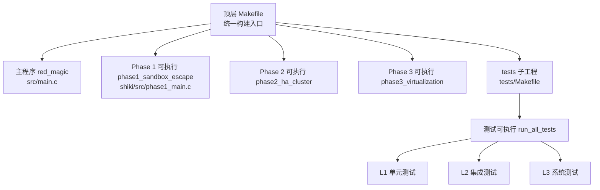
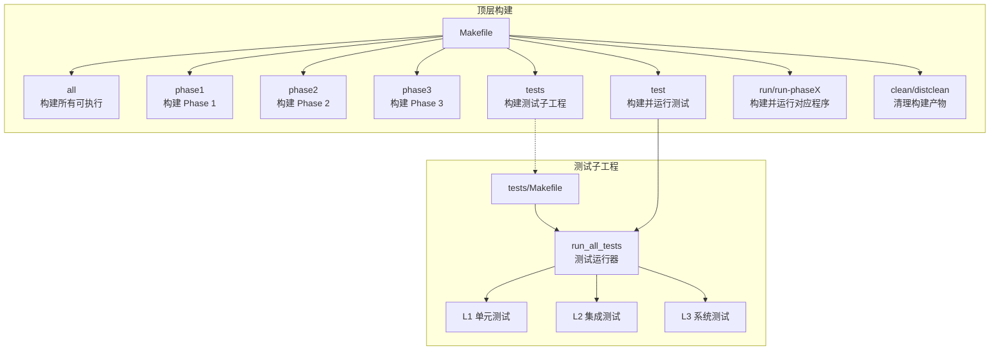
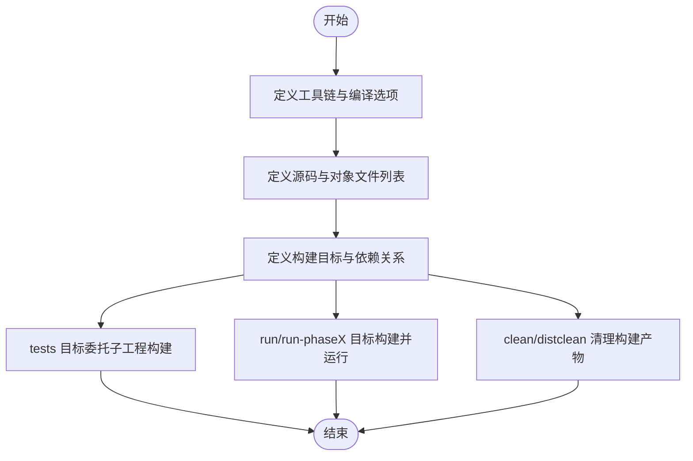
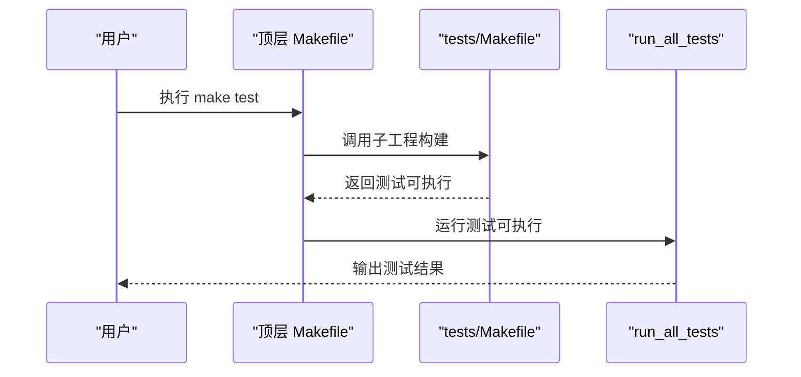
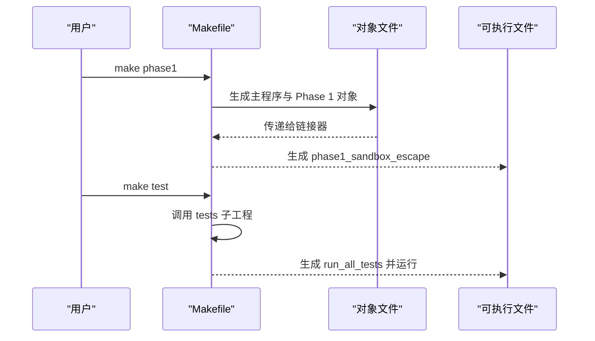
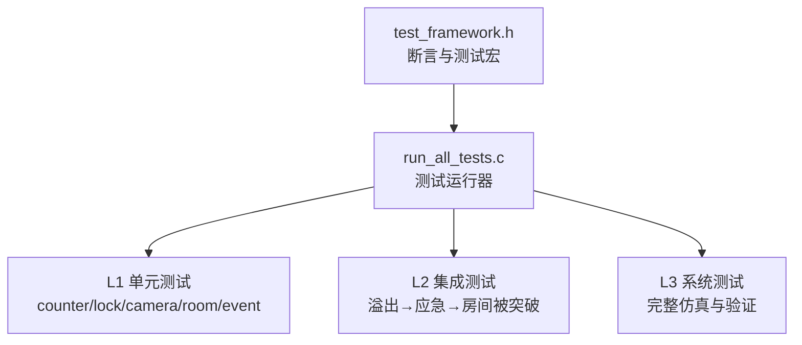
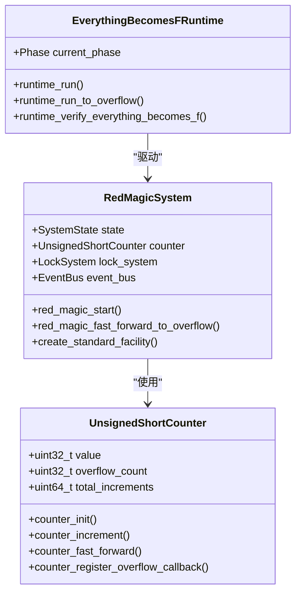
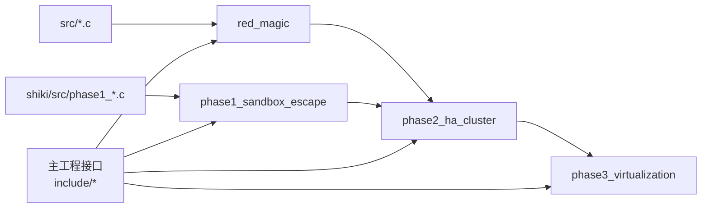

# 构建系统

<cite>
**本文引用的文件**
- [Makefile](file://Makefile)
- [tests/Makefile](file://tests/Makefile)
- [README.md](file://README.md)
- [src/main.c](file://src/main.c)
- [shiki/src/phase1_main.c](file://shiki/src/phase1_main.c)
- [tests/test_framework.h](file://tests/test_framework.h)
- [tests/run_all_tests.c](file://tests/run_all_tests.c)
- [tests/test_l1_unit.c](file://tests/test_l1_unit.c)
- [tests/test_l2_integration.c](file://tests/test_l2_integration.c)
- [tests/test_l3_system.c](file://tests/test_l3_system.c)
- [include/counter.h](file://include/counter.h)
- [include/red_magic_system.h](file://include/red_magic_system.h)
- [include/runtime.h](file://include/runtime.h)
</cite>

## 目录
1. [简介](#简介)
2. [项目结构](#项目结构)
3. [核心组件](#核心组件)
4. [架构总览](#架构总览)
5. [详细组件分析](#详细组件分析)
6. [依赖分析](#依赖分析)
7. [性能考虑](#性能考虑)
8. [故障排查指南](#故障排查指南)
9. [结论](#结论)
10. [附录](#附录)

## 简介
本项目是一个基于小说《Perfect Insider（すべてがFになる）》的系统仿真项目，围绕“计数器溢出”这一核心机制展开，通过多阶段（Phase）运行时引擎驱动系统状态变迁，最终验证“一切终将归于F”的主题。构建系统采用顶层 Makefile 统一管理主程序与 Shiki 多阶段构建，同时在 tests 子目录中提供独立的测试构建与执行流程。

## 项目结构
项目采用按功能域分层的组织方式：
- include：公共头文件，定义计数器、红魔系统、运行时等核心接口
- src：主程序实现，入口为 main.c
- shiki：Shiki 进化阶段的实现，当前提供 Phase 1 的独立可执行
- tests：测试套件，包含单元、集成、系统级测试以及测试框架
- 根目录 Makefile：顶层构建脚本
- tests/Makefile：测试子工程构建脚本
- README.md：使用说明与示例

图表来源
- [Makefile:50-167](file://Makefile#L50-L167)
- [tests/Makefile:1-48](file://tests/Makefile#L1-L48)

章节来源
- [Makefile:1-167](file://Makefile#L1-L167)
- [tests/Makefile:1-48](file://tests/Makefile#L1-L48)
- [README.md:15-90](file://README.md#L15-L90)

## 核心组件
- 顶层构建系统（顶层 Makefile）
  - 定义编译器、通用编译/链接标志、源码目录与对象文件列表
  - 提供 all、phase1、phase2、phase3、tests、test、run、run-phaseX、clean、distclean、help 等目标
  - 使用模式规则 %.o: %.c 实现通用编译
- 测试构建系统（tests/Makefile）
  - 独立于主工程，复用主工程源码进行测试打包
  - 目标 run 支持直接运行测试可执行文件
- 主程序与 Phase 1
  - 主程序入口位于 src/main.c，负责完整五阶段仿真
  - Phase 1 独立可执行位于 shiki/src/phase1_main.c，支持 --integrate 参数与 Red Magic 系统集成

章节来源
- [Makefile:5-167](file://Makefile#L5-L167)
- [tests/Makefile:4-48](file://tests/Makefile#L4-L48)
- [src/main.c:76-135](file://src/main.c#L76-L135)
- [shiki/src/phase1_main.c:195-224](file://shiki/src/phase1_main.c#L195-L224)

## 架构总览
顶层 Makefile 将主程序与 Shiki 各阶段构建解耦，同时通过 tests 子工程提供独立的测试构建与执行。下图展示了构建目标之间的依赖关系与控制流：

图表来源
- [Makefile:50-167](file://Makefile#L50-L167)
- [tests/Makefile:31-48](file://tests/Makefile#L31-L48)

## 详细组件分析

### 顶层 Makefile 分析
- 工具链与编译选项
  - 编译器与标准 C99 设置，包含 include 与 shiki/include 头文件路径
  - 通用编译标志与链接标志变量，便于扩展
- 源码与对象文件管理
  - 主程序源码列表与对象文件列表
  - Shiki 各阶段源码与对象文件分别定义，便于独立构建
- 目标与依赖
  - all 默认目标构建主程序与三个 Phase 可执行
  - 各 Phase 目标仅链接主程序对象与对应 Phase 的对象
  - tests 目标委托到 tests 子目录构建；test 目标在构建后直接运行测试可执行
- 运行与清理
  - run/run-phaseX 目标在构建后执行对应可执行
  - clean 清理主工程与各 Phase 的对象与可执行；distclean 还清理根目录临时对象
- 帮助信息
  - help 目标打印可用目标清单，便于用户快速查阅

图表来源
- [Makefile:5-167](file://Makefile#L5-L167)

章节来源
- [Makefile:5-167](file://Makefile#L5-L167)

### 测试 Makefile 分析
- 独立构建策略
  - 复用主工程 src 与 shiki/src 源码，组合为测试库对象
  - 测试源码与测试运行器 run_all_tests 独立编译
- 目标与执行
  - all 目标构建测试运行器
  - run 目标在构建后直接运行测试
  - clean 清理测试对象与可执行文件
- 与主工程的耦合
  - 通过相对路径包含 ../include 与 ../shiki/include，确保测试能访问主工程接口

图表来源
- [Makefile:83-89](file://Makefile#L83-L89)
- [tests/Makefile:31-48](file://tests/Makefile#L31-L48)

章节来源
- [tests/Makefile:1-48](file://tests/Makefile#L1-L48)

### 多目标构建流程详解
- 主程序构建（red_magic）
  - 依赖 src 下所有对象文件与主程序入口对象
  - 使用顶层编译标志链接生成可执行
- Shiki Phase 1 构建（phase1_sandbox_escape）
  - 依赖主程序对象与 Phase 1 源码对象
  - 支持独立运行与与 Red Magic 集成运行两种模式
- Shiki Phase 2/3 构建
  - 依赖主程序对象与前序阶段对象，体现阶段间的依赖关系
- 测试套件构建与执行
  - tests 目标构建测试运行器
  - test 目标在构建后直接运行 run_all_tests，汇总 L1/L2/L3 与各 Phase 测试结果

图表来源
- [Makefile:58-77](file://Makefile#L58-L77)
- [Makefile:83-89](file://Makefile#L83-L89)

章节来源
- [Makefile:58-77](file://Makefile#L58-L77)
- [Makefile:83-89](file://Makefile#L83-L89)

### 测试框架与测试层次
- 测试框架（test_framework.h）
  - 提供最小化测试宏：TEST、RUN_TEST、ASSERT_* 系列断言
  - 内置测试计数器与失败统计，支持 TEST_SUMMARY
- 测试运行器（run_all_tests.c）
  - 聚合 L1/L2/L3 与各 Phase 测试套件，输出最终汇总
- 测试层次
  - L1 单元测试：针对计数器、锁、摄像头、密封室、事件总线等单个模块
  - L2 集成测试：关注模块间交互（如溢出触发应急、事件传播链）
  - L3 系统测试：端到端仿真（从冷启动到“一切终将归于F”）

图表来源
- [tests/test_framework.h:1-149](file://tests/test_framework.h#L1-L149)
- [tests/run_all_tests.c:18-61](file://tests/run_all_tests.c#L18-L61)
- [tests/test_l1_unit.c:22-498](file://tests/test_l1_unit.c#L22-L498)
- [tests/test_l2_integration.c:33-365](file://tests/test_l2_integration.c#L33-L365)
- [tests/test_l3_system.c:24-389](file://tests/test_l3_system.c#L24-L389)

章节来源
- [tests/test_framework.h:1-149](file://tests/test_framework.h#L1-L149)
- [tests/run_all_tests.c:18-61](file://tests/run_all_tests.c#L18-L61)
- [tests/test_l1_unit.c:22-498](file://tests/test_l1_unit.c#L22-L498)
- [tests/test_l2_integration.c:33-365](file://tests/test_l2_integration.c#L33-L365)
- [tests/test_l3_system.c:24-389](file://tests/test_l3_system.c#L24-L389)

### 关键数据模型与接口（用于理解构建依赖）
- 计数器（counter.h）
  - 32 位无符号整型计数器，支持增量、快进、溢出回调
- 红魔系统（red_magic_system.h）
  - 集成计数器、锁系统、摄像头、密封室与事件总线
  - 系统状态机：INITIALIZING → RUNNING → OVERFLOW_DETECTED → FAILSAFE_TRIGGERED → SYSTEM_DOWN
- 运行时引擎（runtime.h）
  - 将小说章节映射为五阶段仿真：冷启动、内核访问、I/O 边界、内存递归、逻辑爆炸
  - 提供完整运行、直达溢出、阶段切换与完成回调

图表来源
- [include/counter.h:36-98](file://include/counter.h#L36-L98)
- [include/red_magic_system.h:66-88](file://include/red_magic_system.h#L66-L88)
- [include/runtime.h:100-117](file://include/runtime.h#L100-L117)

章节来源
- [include/counter.h:19-98](file://include/counter.h#L19-L98)
- [include/red_magic_system.h:33-88](file://include/red_magic_system.h#L33-L88)
- [include/runtime.h:34-117](file://include/runtime.h#L34-L117)

## 依赖分析
- 构建时依赖
  - 主程序 red_magic 依赖 src 下所有对象文件
  - Phase 1 依赖主程序对象与 shiki/src 下 Phase 1 源码对象
  - Phase 2 依赖主程序对象与 Phase 1 对象
  - Phase 3 依赖主程序对象与 Phase 1、Phase 2 对象
- 运行时依赖
  - 主程序入口调用运行时引擎以驱动五阶段仿真
  - Phase 1 独立可执行根据参数选择独立或与 Red Magic 集成模式
- 测试依赖
  - 测试运行器聚合 L1/L2/L3 与各 Phase 测试，依赖主工程接口

图表来源
- [Makefile:10-42](file://Makefile#L10-L42)
- [Makefile:55-77](file://Makefile#L55-L77)

章节来源
- [Makefile:10-42](file://Makefile#L10-L42)
- [Makefile:55-77](file://Makefile#L55-L77)

## 性能考虑
- 构建性能
  - 使用模式规则 %.o: %.c 实现增量编译，避免全量重编
  - tests 子工程独立构建，减少主工程变更对测试的影响
- 运行性能
  - 计数器提供 fast_forward 接口，可在测试与仿真中高效推进时间
  - 运行时引擎支持直达溢出的快速路径，缩短端到端验证时间
- 可维护性
  - 明确的阶段依赖关系，便于逐步扩展 Phase 2/3
  - 测试分层清晰，有助于定位问题与回归验证

## 故障排查指南
- 构建失败（找不到头文件）
  - 确认顶层 Makefile 与 tests/Makefile 中的包含路径正确
  - 检查 include 与 shiki/include 是否存在
- 构建缓慢
  - 确认未手动删除中间对象文件导致全量重建
  - 使用 make -jN 并行构建（若环境允许）
- 测试失败
  - 使用 make tests 重新构建测试子工程
  - 查看 run_all_tests 的汇总输出，定位失败的测试套件
- 运行期异常
  - 检查计数器溢出回调是否正确注册
  - 确认 Phase 1 集成模式参数传递正确

章节来源
- [Makefile:5-7](file://Makefile#L5-L7)
- [tests/Makefile:4-6](file://tests/Makefile#L4-L6)
- [tests/run_all_tests.c:18-61](file://tests/run_all_tests.c#L18-L61)

## 结论
该构建系统以顶层 Makefile 为核心，清晰地分离了主程序、Shiki 各阶段与测试子工程，既保证了多目标并行构建的灵活性，又提供了简洁的运行与清理流程。配合测试分层与运行时引擎，能够高效验证“计数器溢出→应急触发→系统崩溃→逃逸”的完整叙事与机制闭环。

## 附录
- 快速上手
  - 构建主程序：make
  - 运行主程序：make run
  - 构建并运行 Phase 1：make phase1 && make run-phase1 或 make run-phase1-integrate
  - 构建并运行测试：make test
  - 清理：make clean 或 make distclean
- 目标帮助：make help

章节来源
- [README.md:67-90](file://README.md#L67-L90)
- [Makefile:144-167](file://Makefile#L144-L167)