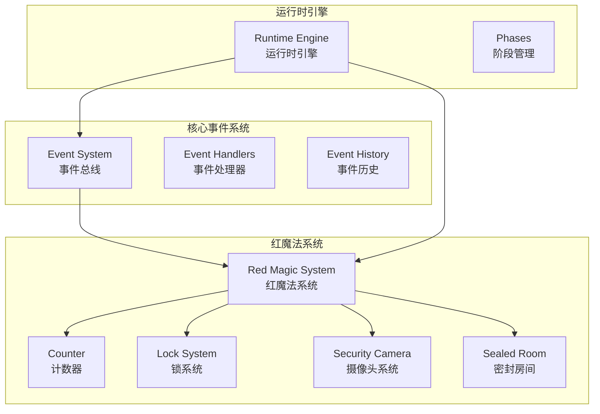
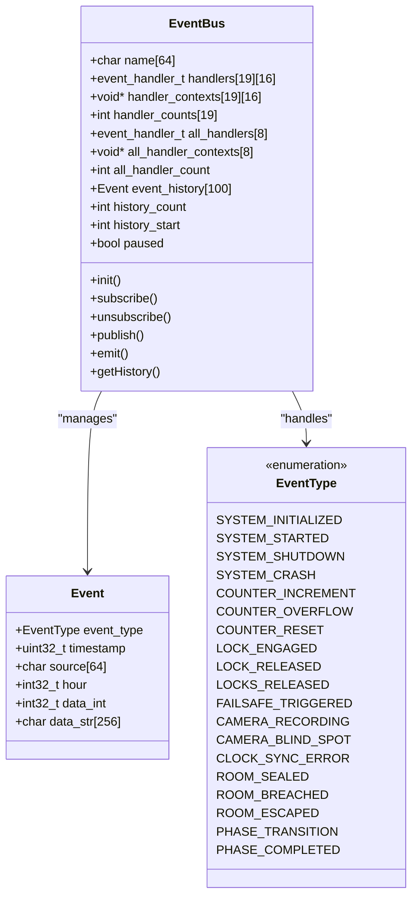
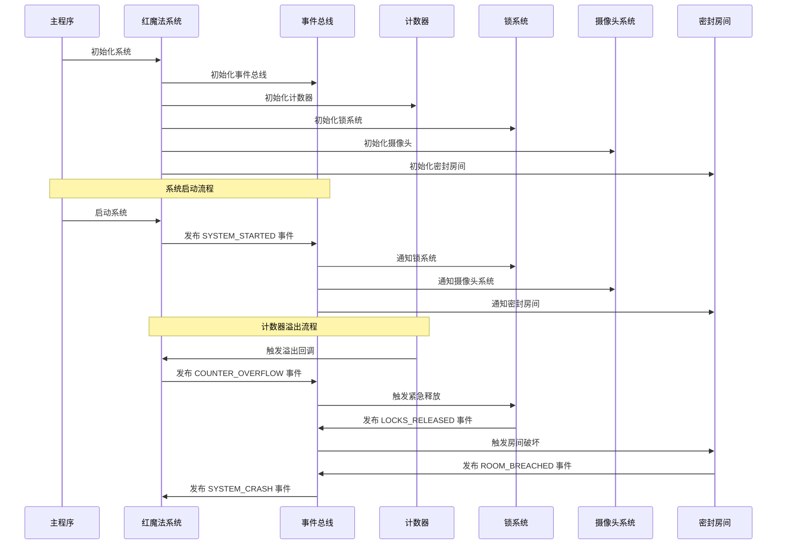
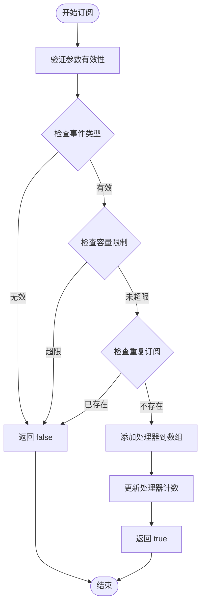
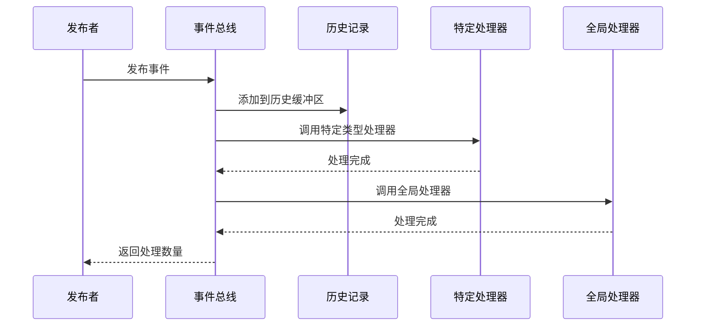
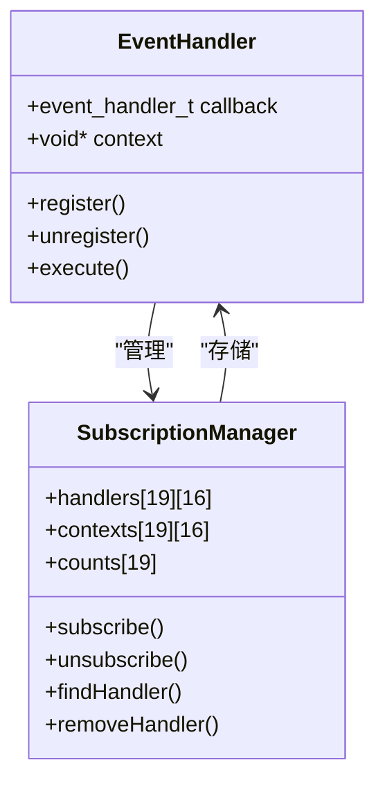
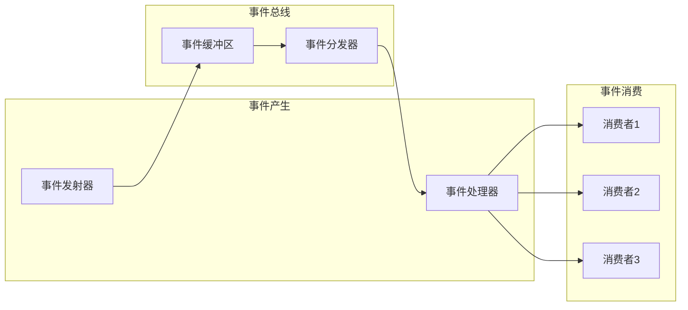
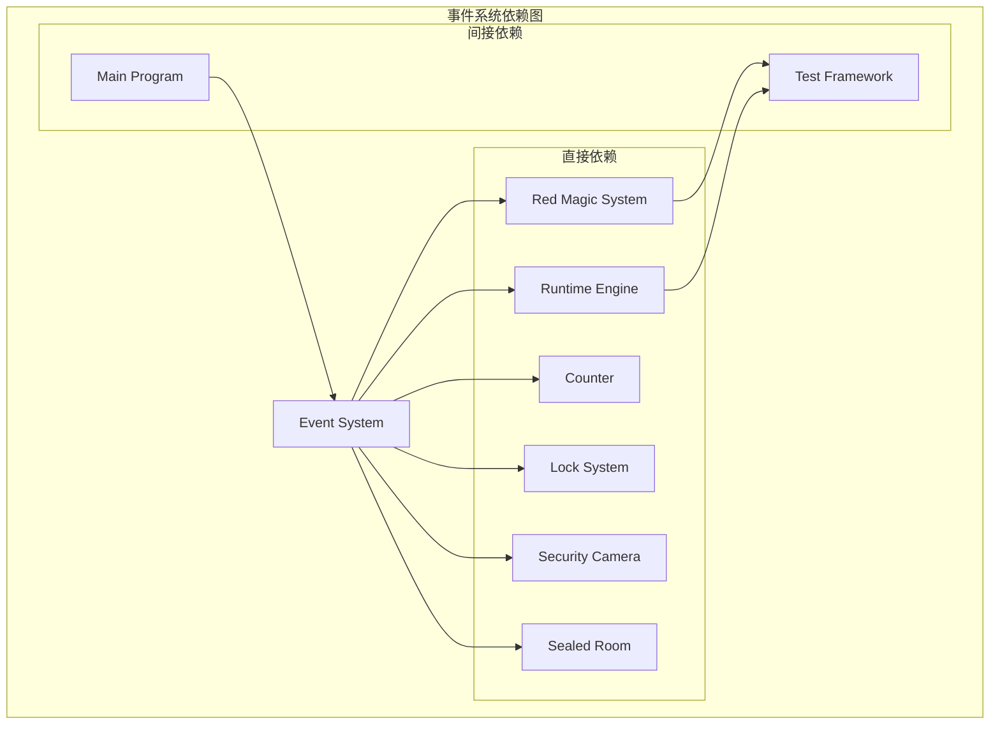

# 事件系统

<cite>
**本文档引用的文件**
- [event_system.h](file://include/event_system.h)
- [event_system.c](file://src/event_system.c)
- [red_magic_system.h](file://include/red_magic_system.h)
- [red_magic_system.c](file://src/red_magic_system.c)
- [runtime.h](file://include/runtime.h)
- [main.c](file://src/main.c)
- [counter.h](file://include/counter.h)
- [electromagnetic_lock.h](file://include/electromagnetic_lock.h)
- [security_camera.h](file://include/security_camera.h)
- [sealed_room.h](file://include/sealed_room.h)
- [test_l1_unit.c](file://tests/test_l1_unit.c)
- [test_l2_integration.c](file://tests/test_l2_integration.c)
</cite>

## 目录
1. [简介](#简介)
2. [项目结构](#项目结构)
3. [核心组件](#核心组件)
4. [架构概览](#架构概览)
5. [详细组件分析](#详细组件分析)
6. [依赖关系分析](#依赖关系分析)
7. [性能考虑](#性能考虑)
8. [故障排除指南](#故障排除指南)
9. [结论](#结论)

## 简介

事件系统是Everything Becomes F项目的核心基础设施，实现了松耦合的组件通信机制。该系统基于发布/订阅模式，通过事件总线实现组件间的异步通信，支持多播通信和事件链式传播。

在红魔法系统中，事件系统扮演着至关重要的角色，它负责协调计数器溢出、电磁锁释放、安全摄像头盲点检测、密封房间破坏等关键事件的传播。系统通过精心设计的事件类型和回调机制，确保了复杂安全场景的正确模拟。

## 项目结构

该项目采用模块化设计，事件系统作为独立的基础设施模块，被其他子系统广泛使用：



**图表来源**
- [event_system.h:1-157](file://include/event_system.h#L1-L157)
- [red_magic_system.h:1-166](file://include/red_magic_system.h#L1-L166)
- [runtime.h:1-184](file://include/runtime.h#L1-L184)

**章节来源**
- [event_system.h:1-157](file://include/event_system.h#L1-L157)
- [red_magic_system.h:1-166](file://include/red_magic_system.h#L1-L166)
- [runtime.h:1-184](file://include/runtime.h#L1-L184)

## 核心组件

### 事件总线架构

事件总线是整个系统的核心，提供了以下关键功能：

- **事件类型定义**：支持19种不同的事件类型，涵盖系统初始化、计数器操作、锁状态变化、摄像头监控、房间状态等
- **订阅管理**：支持按事件类型订阅和全局订阅两种模式
- **事件分发**：实现多播机制，确保每个事件被所有相关处理器接收
- **历史记录**：维护最近100个事件的历史记录，支持查询和回溯

### 事件处理器管理

系统采用静态数组存储事件处理器，每个事件类型最多支持16个处理器，全局订阅支持最多8个处理器：



**图表来源**
- [event_system.h:69-108](file://include/event_system.h#L69-L108)
- [event_system.h:28-61](file://include/event_system.h#L28-L61)

**章节来源**
- [event_system.h:19-23](file://include/event_system.h#L19-L23)
- [event_system.h:87-88](file://include/event_system.h#L87-L88)
- [event_system.h:93-108](file://include/event_system.h#L93-L108)

## 架构概览

事件系统采用分层架构设计，确保了高度的模块化和可扩展性：



**图表来源**
- [red_magic_system.c:74-90](file://src/red_magic_system.c#L74-L90)
- [red_magic_system.c:146-183](file://src/red_magic_system.c#L146-L183)
- [event_system.c:171-204](file://src/event_system.c#L171-L204)

**章节来源**
- [red_magic_system.c:48-72](file://src/red_magic_system.c#L48-L72)
- [red_magic_system.c:92-113](file://src/red_magic_system.c#L92-L113)
- [event_system.c:79-96](file://src/event_system.c#L79-L96)

## 详细组件分析

### 事件总线实现

事件总线采用静态内存分配策略，确保在嵌入式环境中的稳定运行：

#### 订阅管理机制



**图表来源**
- [event_system.c:98-117](file://src/event_system.c#L98-L117)

#### 事件发布流程

事件发布采用多播机制，确保所有订阅者都能接收到事件：



**图表来源**
- [event_system.c:171-204](file://src/event_system.c#L171-L204)

**章节来源**
- [event_system.c:98-117](file://src/event_system.c#L98-L117)
- [event_system.c:171-204](file://src/event_system.c#L171-L204)

### 事件类型系统

系统定义了完整的事件类型层次结构，覆盖了红魔法系统的各个方面：

#### 核心系统事件
- `EVT_SYSTEM_INITIALIZED`：系统初始化完成
- `EVT_SYSTEM_STARTED`：系统正常启动
- `EVT_SYSTEM_SHUTDOWN`：系统正常关闭
- `EVT_SYSTEM_CRASH`：系统崩溃

#### 计数器事件
- `EVT_COUNTER_INCREMENT`：计数器递增
- `EVT_COUNTER_OVERFLOW`：计数器溢出（关键事件）
- `EVT_COUNTER_RESET`：计数器重置

#### 锁系统事件
- `EVT_LOCK_ENGAGED`：锁系统锁定
- `EVT_LOCK_RELEASED`：单个锁释放
- `EVT_LOCKS_RELEASED`：所有锁释放（紧急状态）
- `EVT_FAILSAFE_TRIGGERED`：紧急失效保护触发

#### 摄像头事件
- `EVT_CAMERA_RECORDING`：摄像头录制
- `EVT_CAMERA_BLIND_SPOT`：摄像头盲点
- `EVT_CLOCK_SYNC_ERROR`：时钟同步错误

#### 房间事件
- `EVT_ROOM_SEALED`：房间密封
- `EVT_ROOM_BREACHED`：房间被破坏
- `EVT_ROOM_ESCAPED`：有人逃脱

**章节来源**
- [event_system.h:28-61](file://include/event_system.h#L28-L61)

### 回调函数管理系统

系统提供了灵活的回调函数管理机制，支持上下文传递和生命周期管理：

#### 回调注册与注销



**图表来源**
- [event_system.h:87-88](file://include/event_system.h#L87-L88)
- [event_system.c:98-153](file://src/event_system.c#L98-L153)

**章节来源**
- [event_system.h:87-88](file://include/event_system.h#L87-L88)
- [event_system.c:98-153](file://src/event_system.c#L98-L153)

### 异步事件处理机制

事件系统支持完全异步的事件处理，避免了阻塞操作：

#### 事件队列与处理



**图表来源**
- [event_system.c:171-204](file://src/event_system.c#L171-L204)

**章节来源**
- [event_system.c:171-204](file://src/event_system.c#L171-L204)

## 依赖关系分析

事件系统在整个项目中扮演着基础设施的角色，与多个子系统存在紧密的依赖关系：



**图表来源**
- [red_magic_system.h:21-25](file://include/red_magic_system.h#L21-L25)
- [runtime.h:22-23](file://include/runtime.h#L22-L23)

**章节来源**
- [red_magic_system.h:21-25](file://include/red_magic_system.h#L21-L25)
- [runtime.h:22-23](file://include/runtime.h#L22-L23)

### 组件耦合度分析

事件系统通过接口抽象实现了低耦合设计：

- **向上耦合**：事件总线不依赖具体业务逻辑，只定义通用接口
- **向下耦合**：各子系统通过事件接口与总线交互
- **横向耦合**：通过事件链实现跨系统的松耦合通信

这种设计确保了系统的可扩展性和可维护性。

## 性能考虑

事件系统在设计时充分考虑了性能优化和内存管理：

### 内存管理策略

#### 静态内存分配
- 所有处理器数组采用静态分配，避免动态内存分配带来的性能开销
- 事件历史缓冲区使用循环缓冲区，支持固定大小的内存占用
- 使用全局静态变量缓存事件对象，减少栈分配压力

#### 缓冲区优化
- 事件历史缓冲区大小固定为100个事件，避免内存泄漏
- 循环缓冲区实现O(1)时间复杂度的事件添加和访问
- 处理器数组大小预分配，避免运行时扩容

### 性能优化技术

#### O(1)查找算法
订阅管理使用线性搜索，由于处理器数量有限（最多16个），性能影响可以忽略不计。

#### 事件分发优化
- 事件分发采用直接函数调用，避免反射机制的性能损耗
- 支持暂停功能，在系统维护期间可以暂时停止事件处理
- 历史记录采用环形缓冲区，保证常数时间的添加和访问

### 内存使用分析

| 组件 | 内存占用 | 用途 |
|------|----------|------|
| EventBus结构体 | ~2KB | 包含所有处理器数组和历史缓冲区 |
| 处理器数组 | ~1.5KB | 每个事件类型最多16个处理器 |
| 全局处理器数组 | ~256字节 | 最多8个全局处理器 |
| 事件历史缓冲区 | ~2.5KB | 最多100个事件记录 |
| **总计** | **~6KB** | 固定内存占用 |

**章节来源**
- [event_system.h:19-23](file://include/event_system.h#L19-L23)
- [event_system.c:79-96](file://src/event_system.c#L79-L96)

## 故障排除指南

### 常见问题诊断

#### 事件未到达问题
1. **检查订阅状态**：确认处理器是否正确注册
2. **验证事件类型**：确认发布的事件类型与订阅类型匹配
3. **检查暂停状态**：确认事件总线未处于暂停状态

#### 内存相关问题
1. **处理器数量限制**：超过最大处理器数量会导致订阅失败
2. **历史缓冲区溢出**：历史记录超过100条后会自动覆盖旧记录
3. **重复订阅检测**：同一处理器重复订阅会被拒绝

#### 性能问题排查
1. **处理器数量过多**：每个事件的处理时间与处理器数量成正比
2. **事件频率过高**：频繁的事件发布会影响系统性能
3. **回调函数阻塞**：长时间运行的回调会影响事件处理延迟

### 调试技巧

#### 事件追踪
使用历史记录功能可以追踪事件的完整传播路径：

```c
// 获取最近的事件历史
Event events[50];
int count = event_bus_get_history(&bus, events, 50);
for (int i = 0; i < count; i++) {
    printf("Event: %s at hour %d\n", 
           event_type_name(events[i].event_type), 
           events[i].hour);
}
```

#### 订阅统计
监控订阅者数量有助于识别潜在的内存泄漏：

```c
// 获取特定事件类型的订阅者数量
int count = event_bus_get_subscriber_count(&bus, EVT_COUNTER_OVERFLOW);
printf("Subscribers: %d\n", count);

// 获取总订阅者数量
int total = event_bus_get_total_subscriber_count(&bus);
printf("Total subscribers: %d\n", total);
```

**章节来源**
- [event_system.c:219-247](file://src/event_system.c#L219-L247)
- [event_system.c:281-294](file://src/event_system.c#L281-L294)

## 结论

事件系统作为Everything Becomes F项目的核心基础设施，成功实现了松耦合的组件通信机制。通过精心设计的发布/订阅架构，系统能够有效地协调复杂的红魔法安全场景，从系统初始化到最终的"Everything Becomes F"结局。

### 设计优势

1. **松耦合架构**：组件间通过事件进行通信，降低了相互依赖
2. **异步处理**：支持非阻塞的事件处理，提高了系统响应性
3. **可扩展性**：新的组件可以通过事件接口轻松集成
4. **可靠性**：事件历史记录提供了完整的审计跟踪
5. **性能优化**：静态内存分配和循环缓冲区确保了稳定的性能表现

### 应用价值

在红魔法系统中，事件系统不仅是一个技术实现，更是对现实世界安全漏洞的精确模拟。通过事件链的方式，系统完整地重现了计数器溢出导致的安全漏洞，以及由此引发的一系列连锁反应。

这种设计为理解复杂系统的安全风险提供了宝贵的工具，展示了如何通过事件驱动的方式构建可预测和可控的系统行为。