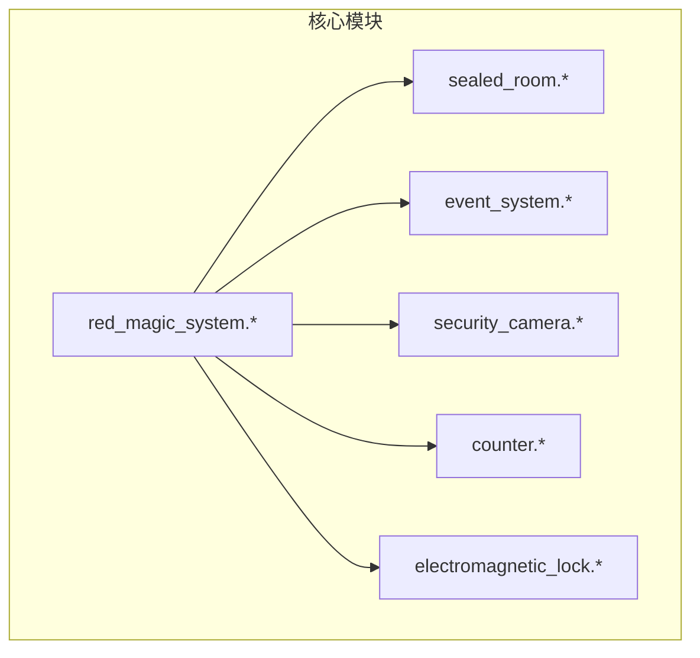
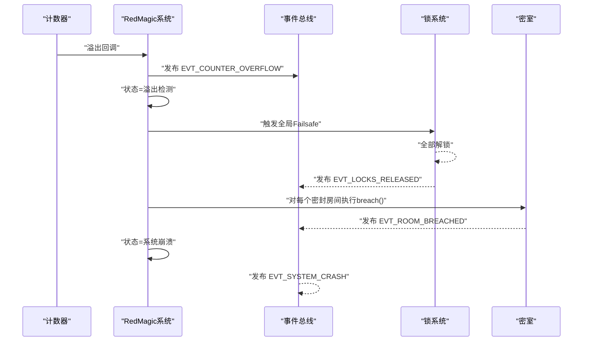
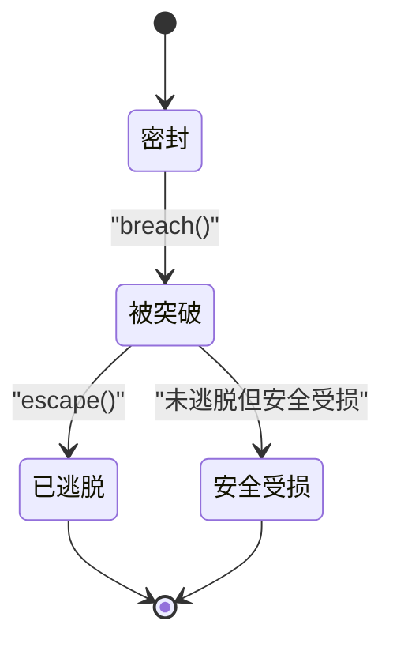
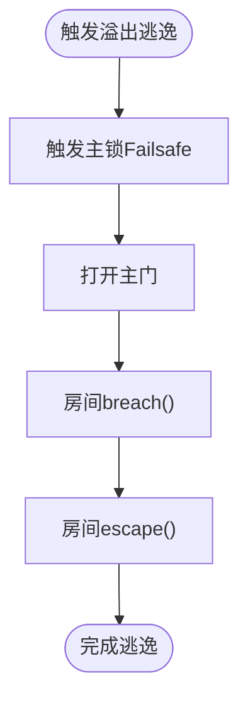
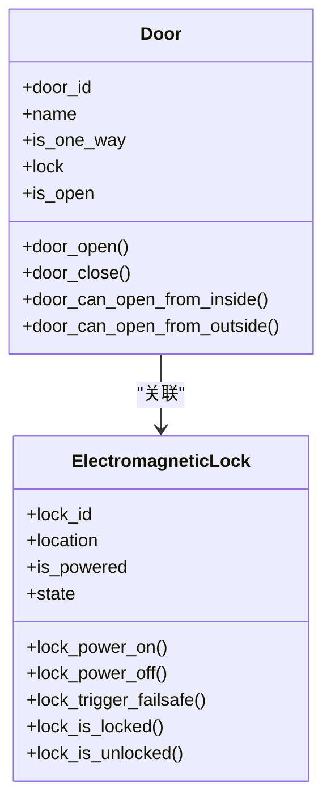
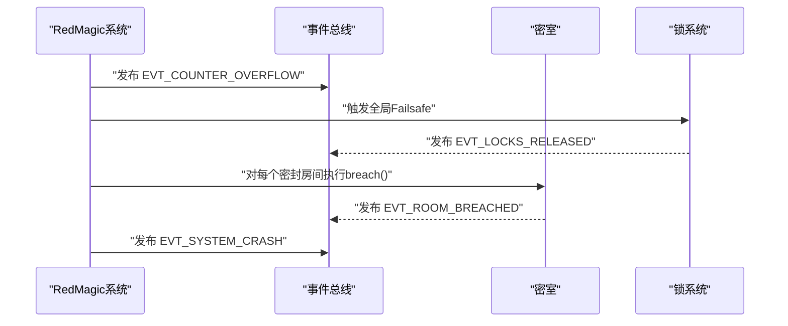
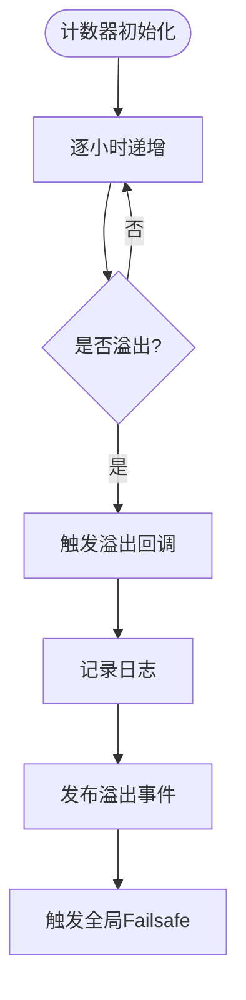
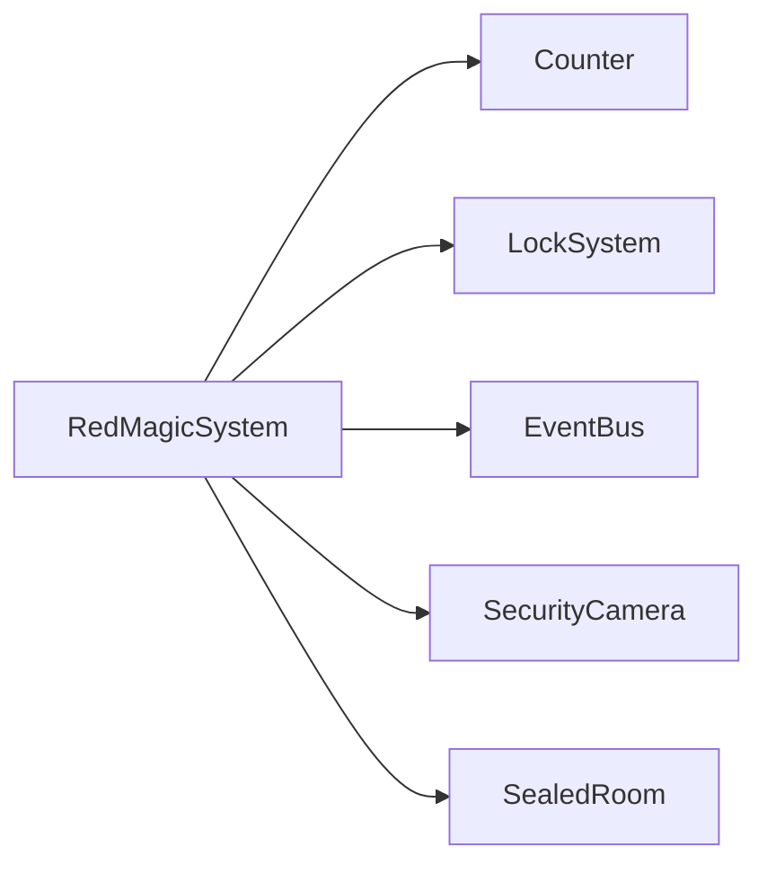

# 密室系统

<cite>
**本文引用的文件**
- [sealed_room.h](file://include/sealed_room.h)
- [sealed_room.c](file://src/sealed_room.c)
- [red_magic_system.h](file://include/red_magic_system.h)
- [red_magic_system.c](file://src/red_magic_system.c)
- [event_system.h](file://include/event_system.h)
- [event_system.c](file://src/event_system.c)
- [security_camera.h](file://include/security_camera.h)
- [security_camera.c](file://src/security_camera.c)
- [counter.h](file://include/counter.h)
- [counter.c](file://src/counter.c)
- [electromagnetic_lock.h](file://include/electromagnetic_lock.h)
- [electromagnetic_lock.c](file://src/electagrid_room.c)
- [test_framework.h](file://tests/test_framework.h)
- [test_l1_unit.c](file://tests/test_l1_unit.c)
</cite>

## 目录
1. [简介](#简介)
2. [项目结构](#项目结构)
3. [核心组件](#核心组件)
4. [架构总览](#架构总览)
5. [详细组件分析](#详细组件分析)
6. [依赖分析](#依赖分析)
7. [性能考虑](#性能考虑)
8. [故障排查指南](#故障排查指南)
9. [结论](#结论)
10. [附录](#附录)

## 简介
本文件面向“Dr. Shiki 隔离房间”（密室）的建模与实现，系统性阐述密室的状态机设计、breach 检测机制、密封状态管理、访问控制与安全等级划分；并说明密室系统如何响应外部攻击与内部异常，以及与锁系统、事件系统、计数器与监控系统的协作关系。文档同时提供可追溯的代码路径示例，帮助读者快速定位实现细节。

## 项目结构
该仓库采用按功能域分层的组织方式：顶层包含核心头文件与源文件，shiki 子目录存放阶段性实现，tests 提供单元测试框架与用例。密室系统的核心位于 include 与 src 的 sealed_room.*、red_magic_system.*、event_system.*、security_camera.*、counter.*、electromagnetic_lock.* 文件中。

图示来源
- [red_magic_system.c:48-72](file://src/red_magic_system.c#L48-L72)
- [red_magic_system.h:66-88](file://include/red_magic_system.h#L66-L88)

章节来源
- [red_magic_system.c:48-72](file://src/red_magic_system.c#L48-L72)
- [red_magic_system.h:66-88](file://include/red_magic_system.h#L66-L88)

## 核心组件
- 密室模型（SealedRoom）：封装房间状态、门列表、占用者存在性、breach/escape 时间戳、状态回调等。
- Dr. Shiki 密室特化（MagataQuarters）：在基础密室之上增加主锁与网络能力标记。
- 锁系统（ElectromagneticLock/LockSystem）：fail-safe 设计，正常供电时锁定，断电或触发 failsafe 时解锁。
- 事件系统（EventBus）：发布订阅模式，贯穿系统各子模块，驱动状态流转与告警。
- 计数器（UnsignedShortCounter）：模拟 C 语言无符号整型溢出行为，作为系统“溢出逃逸”的触发条件。
- 监控系统（SecurityCamera/ClockSyncVulnerability）：记录视频片段，暴露时钟同步漏洞导致的监视盲点。

章节来源
- [sealed_room.h:63-76](file://include/sealed_room.h#L63-L76)
- [sealed_room.h:114-122](file://include/sealed_room.h#L114-L122)
- [electromagnetic_lock.h:47-55](file://include/electromagnetic_lock.h#L47-L55)
- [event_system.h:93-108](file://include/event_system.h#L93-L108)
- [counter.h:36-43](file://include/counter.h#L36-L43)
- [security_camera.h:51-61](file://include/security_camera.h#L51-L61)

## 架构总览
密室系统以 Red Magic 安全系统为核心控制器，围绕以下流程运行：
- 计数器每小时递增，接近最大值时触发溢出回调。
- 溢出事件被事件总线广播，系统进入“溢出检测”状态。
- 触发全局 failsafe：所有锁释放，密室 breach，系统进入“系统崩溃”状态。
- 事件总线向各订阅者传播 ROOM_BREACHED、LOCKS_RELEASED、SYSTEM_CRASH 等事件，驱动后续处理。

图示来源
- [red_magic_system.c:74-90](file://src/red_magic_system.c#L74-L90)
- [red_magic_system.c:146-183](file://src/red_magic_system.c#L146-L183)
- [event_system.c:171-204](file://src/event_system.c#L171-L204)

章节来源
- [red_magic_system.c:74-90](file://src/red_magic_system.c#L74-L90)
- [red_magic_system.c:146-183](file://src/red_magic_system.c#L146-L183)
- [event_system.c:171-204](file://src/event_system.c#L171-L204)

## 详细组件分析

### 密室状态机与 Breach 检测
- 状态定义：密封（SEALED）、被突破（BREACHED）、已逃脱（ESCAPED）、安全受损但未逃脱（COMPROMISED）。
- 关键方法：
  - 初始化：房间默认密封、占用者存在、监控开启、breach/escape 时间戳为-1。
  - 状态查询：判断是否密封、是否已被突破、是否已逃脱、占用者是否存在。
  - 密封完整性检查：任一门未上锁或门处于打开状态即视为密封失效。
  - breach：仅当房间处于密封状态时允许，设置 breach_time 并触发状态变更通知。
  - escape：仅当房间处于被突破且占用者存在时允许，设置 escape_time、清空占用者并触发状态变更通知。
- 回调机制：支持注册房间状态变更回调，用于联动事件系统或其他模块。

图示来源
- [sealed_room.h:26-31](file://include/sealed_room.h#L26-L31)
- [sealed_room.c:69-88](file://src/sealed_room.c#L69-L88)
- [sealed_room.c:129-142](file://src/sealed_room.c#L129-L142)
- [sealed_room.c:144-168](file://src/sealed_room.c#L144-L168)

章节来源
- [sealed_room.h:26-31](file://include/sealed_room.h#L26-L31)
- [sealed_room.c:69-88](file://src/sealed_room.c#L69-L88)
- [sealed_room.c:129-142](file://src/sealed_room.c#L129-L142)
- [sealed_room.c:144-168](file://src/sealed_room.c#L144-L168)

### Dr. Shiki 隔离房间（MagataQuarters）
- 特性：单主门、主锁、网络访问能力、编程能力标记。
- 初始化：设置房间标识、名称、主锁、主门、约束年份（15年监禁）。
- 溢出逃逸序列：触发主锁 failsafe → 打开主门 → breach → escape，形成“系统溢出触发 failsafe → 解锁并逃逸”的闭环。

图示来源
- [sealed_room.c:230-244](file://src/sealed_room.c#L230-L244)
- [sealed_room.h:114-122](file://include/sealed_room.h#L114-L122)

章节来源
- [sealed_room.c:230-244](file://src/sealed_room.c#L230-L244)
- [sealed_room.h:114-122](file://include/sealed_room.h#L114-L122)

### 门与锁的协作
- 门对象包含门 ID、名称、单向属性、关联电磁锁、开关状态。
- 开启规则：若门为单向则内部不可开启；若门关联锁且锁处于锁定状态，则不可开启。
- 锁系统：fail-safe 行为，供电时锁定，断电或触发 failsafe 时解锁；支持全局 failsafe 统一解锁。

图示来源
- [sealed_room.h:36-42](file://include/sealed_room.h#L36-L42)
- [electromagnetic_lock.h:47-55](file://include/electromagnetic_lock.h#L47-L55)
- [electromagnetic_lock.h:83-91](file://include/electromagnetic_lock.h#L83-L91)

章节来源
- [sealed_room.h:36-42](file://include/sealed_room.h#L36-L42)
- [electromagnetic_lock.h:47-55](file://include/electromagnetic_lock.h#L47-L55)
- [electromagnetic_lock.h:83-91](file://include/electromagnetic_lock.h#L83-L91)

### 事件系统与状态联动
- 事件类型覆盖系统生命周期、计数器溢出、锁释放、房间被突破、系统崩溃等。
- 事件总线支持订阅特定事件类型或全部事件，支持暂停/恢复、历史记录、统计订阅者数量等。
- 在 Red Magic 系统中，计数器溢出后通过事件总线广播，随后触发 failsafe、breach 密室、最终系统崩溃。

图示来源
- [event_system.h:28-61](file://include/event_system.h#L28-L61)
- [event_system.c:171-204](file://src/event_system.c#L171-L204)
- [red_magic_system.c:146-183](file://src/red_magic_system.c#L146-L183)

章节来源
- [event_system.h:28-61](file://include/event_system.h#L28-L61)
- [event_system.c:171-204](file://src/event_system.c#L171-L204)
- [red_magic_system.c:146-183](file://src/red_magic_system.c#L146-L183)

### 计数器与溢出逃逸机制
- 计数器模拟 C 语言无符号整型，达到最大值后溢出回零，触发溢出回调。
- Red Magic 系统注册溢出回调，在回调中记录日志、发布事件、触发 failsafe 并推进系统状态。

图示来源
- [counter.c:40-60](file://src/counter.c#L40-L60)
- [red_magic_system.c:74-90](file://src/red_magic_system.c#L74-L90)

章节来源
- [counter.c:40-60](file://src/counter.c#L40-L60)
- [red_magic_system.c:74-90](file://src/red_magic_system.c#L74-L90)

### 监控盲点与安全等级
- 监控系统记录每分钟视频片段，支持覆盖与盲点创建。
- 时钟同步漏洞：系统重装时产生 1 分钟盲点，覆盖当前分钟录制，形成监控空白。
- 安全等级：密室属于最高安全等级区域，任何 breach/escape 事件均会触发系统级告警与降级。

章节来源
- [security_camera.h:51-61](file://include/security_camera.h#L51-L61)
- [security_camera.c:71-100](file://src/security_camera.c#L71-L100)
- [security_camera.c:176-192](file://src/security_camera.c#L176-L192)

## 依赖分析
- RedMagicSystem 依赖计数器、锁系统、事件总线、监控系统与密室集合。
- 密室依赖锁系统提供的电磁锁。
- 事件总线为松耦合枢纽，承载跨模块通信。
- 测试框架提供断言宏与测试套件入口，覆盖各模块单元测试。

图示来源
- [red_magic_system.h:66-88](file://include/red_magic_system.h#L66-L88)
- [red_magic_system.c:48-72](file://src/red_magic_system.c#L48-L72)

章节来源
- [red_magic_system.h:66-88](file://include/red_magic_system.h#L66-L88)
- [red_magic_system.c:48-72](file://src/red_magic_system.c#L48-L72)

## 性能考虑
- 状态查询与门检查为 O(n_door)，n_door 最大为 4，常数级别开销。
- 事件总线发布为 O(n_handler)，订阅上限为 16（单事件类型），整体摊销低。
- 计数器快进使用 O(1) 数学运算，避免循环累加。
- 建议：在高频事件场景下，优先使用“发布全部事件”订阅策略减少重复订阅成本。

## 故障排查指南
- 密封完整性检查失败：检查门是否打开或锁未锁定。
  - 参考路径：[sealed_room.c:129-142](file://src/sealed_room.c#L129-L142)
- breach/escape 条件不满足：确认房间状态与占用者存在性。
  - 参考路径：[sealed_room.c:144-168](file://src/sealed_room.c#L144-L168)
- 溢出未触发：确认计数器回调是否注册与计数器值是否接近最大值。
  - 参考路径：[red_magic_system.c:74-90](file://src/red_magic_system.c#L74-L90)
- 事件未到达：检查事件总线订阅状态与暂停标志。
  - 参考路径：[event_system.c:171-204](file://src/event_system.c#L171-L204)
- 监控盲点：确认时钟同步漏洞是否被利用及当前分钟是否被覆盖。
  - 参考路径：[security_camera.c:176-192](file://src/security_camera.c#L176-L192)

章节来源
- [sealed_room.c:129-142](file://src/sealed_room.c#L129-L142)
- [sealed_room.c:144-168](file://src/sealed_room.c#L144-L168)
- [red_magic_system.c:74-90](file://src/red_magic_system.c#L74-L90)
- [event_system.c:171-204](file://src/event_system.c#L171-L204)
- [security_camera.c:176-192](file://src/security_camera.c#L176-L192)

## 结论
密室系统通过 fail-safe 锁、严格的门控制、事件驱动的状态机与计数器溢出机制，构建了高可靠的安全架构。Dr. Shiki 隔离房间作为最高安全等级区域，其 breach/escape 流程与系统级崩溃事件紧密耦合，确保在极端情况下实现“系统溢出触发 failsafe → 解锁并逃逸”的闭环。事件系统与监控系统进一步增强了可观测性与可审计性，使安全处置具备清晰的轨迹与可追溯性。

## 附录

### 代码示例路径（不含具体代码内容）
- 密室初始化
  - [sealed_room.c:69-88](file://src/sealed_room.c#L69-L88)
- 状态查询
  - [sealed_room.c:90-109](file://src/sealed_room.c#L90-L109)
- 密封完整性检查
  - [sealed_room.c:129-142](file://src/sealed_room.c#L129-L142)
- Breach 检测
  - [sealed_room.c:144-154](file://src/sealed_room.c#L144-L154)
- Escape 处置
  - [sealed_room.c:156-168](file://src/sealed_room.c#L156-L168)
- Magata 溢出逃逸序列
  - [sealed_room.c:230-244](file://src/sealed_room.c#L230-L244)
- 事件发布与订阅
  - [event_system.c:171-204](file://src/event_system.c#L171-L204)
- 计数器溢出回调
  - [red_magic_system.c:74-90](file://src/red_magic_system.c#L74-L90)
- 全局 failsafe 触发
  - [red_magic_system.c:146-183](file://src/red_magic_system.c#L146-L183)
- 监控盲点创建
  - [security_camera.c:71-100](file://src/security_camera.c#L71-L100)
- 单元测试入口与断言
  - [test_framework.h:33-46](file://tests/test_framework.h#L33-L46)
  - [test_l1_unit.c:430-497](file://tests/test_l1_unit.c#L430-L497)