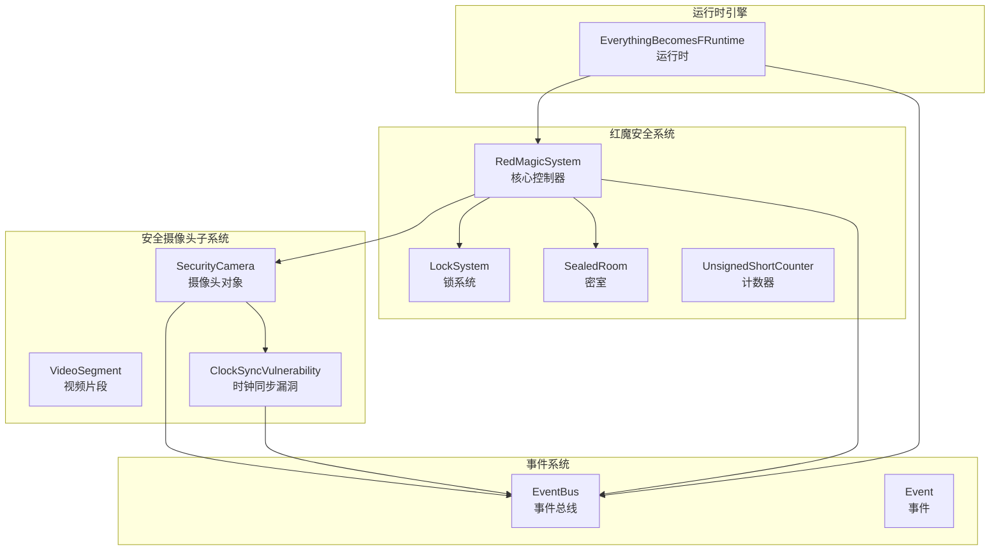
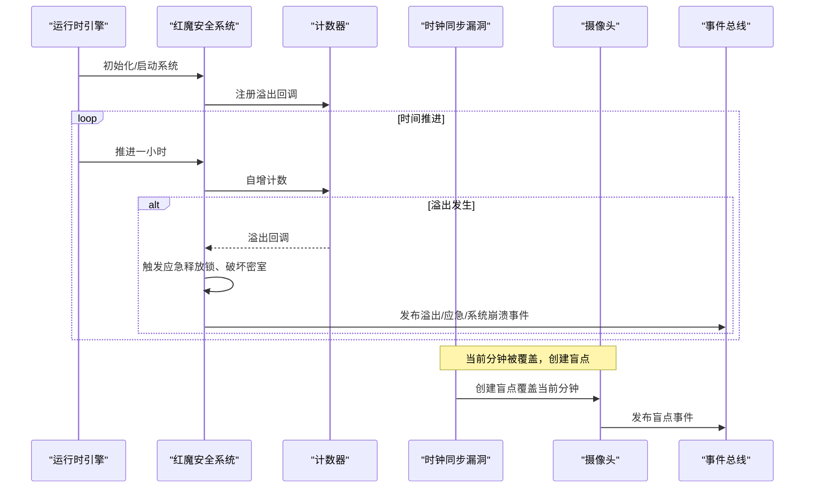
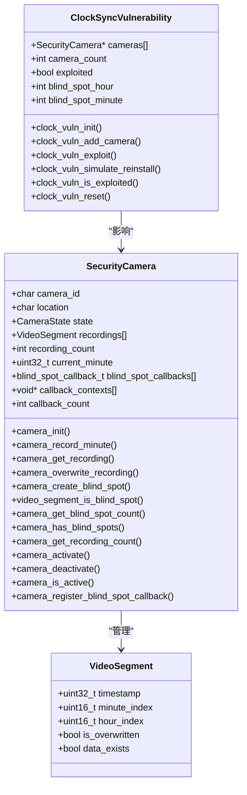
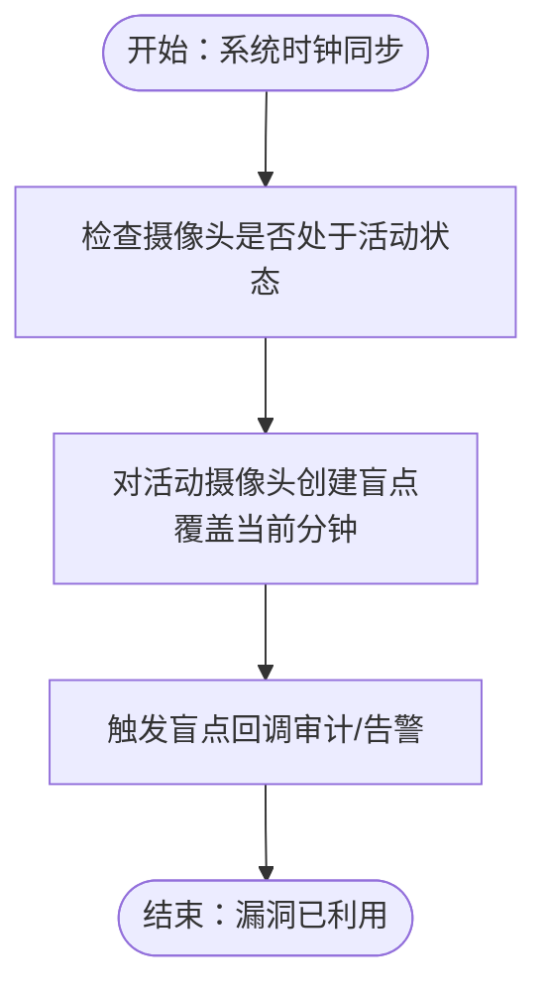
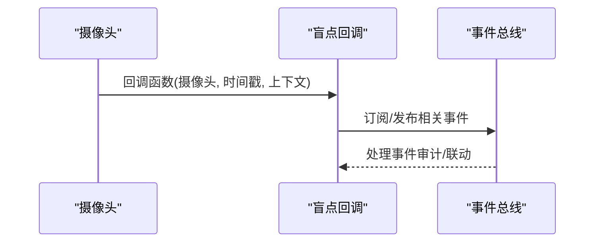
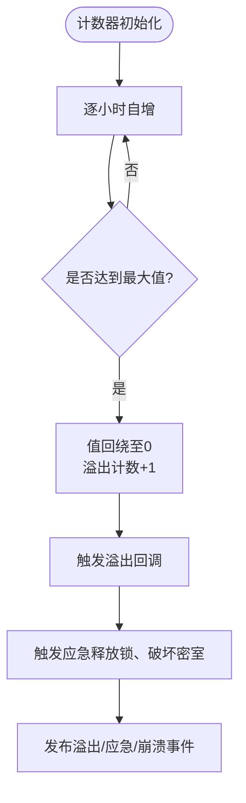
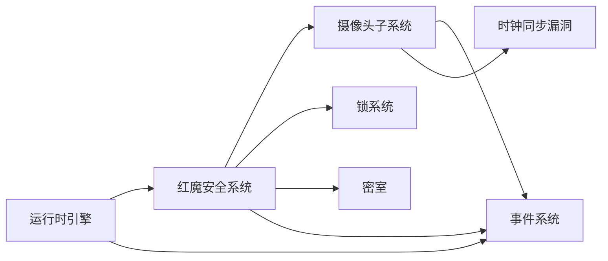

# 摄像头系统

<cite>
**本文档引用的文件**
- [security_camera.h](file://include/security_camera.h)
- [security_camera.c](file://src/security_camera.c)
- [event_system.h](file://include/event_system.h)
- [event_system.c](file://src/event_system.c)
- [red_magic_system.h](file://include/red_magic_system.h)
- [red_magic_system.c](file://src/red_magic_system.c)
- [runtime.h](file://include/runtime.h)
- [runtime.c](file://src/runtime.c)
- [sealed_room.h](file://include/sealed_room.h)
- [sealed_room.c](file://src/sealed_room.c)
- [counter.h](file://include/counter.h)
- [counter.c](file://src/counter.c)
- [test_framework.h](file://tests/test_framework.h)
- [test_l1_unit.c](file://tests/test_l1_unit.c)
- [test_l2_integration.c](file://tests/test_l2_integration.c)
- [test_l3_system.c](file://tests/test_l3_system.c)
</cite>

## 目录
1. [简介](#简介)
2. [项目结构](#项目结构)
3. [核心组件](#核心组件)
4. [架构总览](#架构总览)
5. [详细组件分析](#详细组件分析)
6. [依赖关系分析](#依赖关系分析)
7. [性能考虑](#性能考虑)
8. [故障排查指南](#故障排查指南)
9. [结论](#结论)
10. [附录](#附录)

## 简介
本文件面向“摄像头系统”的安全监控设计与实现，围绕以下目标展开：
- 解释摄像头阵列的布局与监控范围模型
- 深入阐述时钟同步漏洞的实现机制与安全影响
- 分析摄像头系统在整数溢出场景中的特殊行为
- 说明摄像头的状态管理、盲点检测与监控数据收集机制
- 提供具体代码示例路径，展示摄像头初始化、状态查询与监控数据获取
- 阐述摄像头系统与事件系统的集成关系及在安全审计中的作用

## 项目结构
该代码库采用分层模块化组织，核心模块包括：
- 安全摄像头子系统：摄像头对象、视频片段、盲点检测与回调
- 事件系统：发布/订阅事件总线，支持历史记录与暂停/恢复
- 红魔安全系统：整合计数器、电磁锁、摄像头、密室等子系统
- 运行时引擎：驱动系统从启动到溢出的完整仿真流程
- 密室模型：模拟被封印房间的状态变化与逃逸序列
- 计数器：32位无符号整数计数器，模拟溢出触发机制

**图表来源**
- [security_camera.h:42-61](file://include/security_camera.h#L42-L61)
- [security_camera.c:11-19](file://src/security_camera.c#L11-L19)
- [event_system.h:84-108](file://include/event_system.h#L84-L108)
- [red_magic_system.h:66-88](file://include/red_magic_system.h#L66-L88)
- [runtime.h:98-117](file://include/runtime.h#L98-L117)

**章节来源**
- [security_camera.h:1-147](file://include/security_camera.h#L1-L147)
- [event_system.h:1-157](file://include/event_system.h#L1-L157)
- [red_magic_system.h:1-166](file://include/red_magic_system.h#L1-L166)
- [runtime.h:1-184](file://include/runtime.h#L1-L184)

## 核心组件
- 摄像头对象（SecurityCamera）：包含摄像头标识、位置、状态、录制数组、当前分钟、盲点回调等字段；提供初始化、录制、覆盖、创建盲点、查询盲点数量、激活/停用、注册盲点回调等接口。
- 视频片段（VideoSegment）：以“小时×60+分钟”作为时间戳，记录所属小时索引、分钟索引、是否被覆盖、是否存在数据等。
- 时钟同步漏洞（ClockSyncVulnerability）：记录受影响摄像头集合、是否已利用、盲点发生的时间点；提供初始化、添加摄像头、利用（创建盲点）、重置等接口。
- 事件系统（EventBus/Event）：支持按事件类型订阅/取消订阅、全局订阅、发布事件、历史记录、暂停/恢复等功能。
- 红魔安全系统（RedMagicSystem）：整合计数器、锁系统、摄像头、密室与事件总线；提供系统初始化、启动、推进、触发应急、日志记录、摄像头管理等。
- 运行时引擎（EverythingBecomesFRuntime）：驱动系统阶段转换、执行指定阶段或完整仿真、验证“一切皆F”条件。

**章节来源**
- [security_camera.h:42-146](file://include/security_camera.h#L42-L146)
- [security_camera.c:21-151](file://src/security_camera.c#L21-L151)
- [event_system.h:69-155](file://include/event_system.h#L69-L155)
- [red_magic_system.h:66-165](file://include/red_magic_system.h#L66-L165)
- [runtime.h:100-182](file://include/runtime.h#L100-L182)

## 架构总览
摄像头系统通过红魔安全系统进行统一管理，并与事件系统紧密耦合。计数器溢出触发应急流程，导致锁释放、密室可被破坏，同时摄像头盲点漏洞在“重新安装红魔系统”时被利用，形成一分钟的监控空白。

**图表来源**
- [red_magic_system.c:74-90](file://src/red_magic_system.c#L74-L90)
- [red_magic_system.c:146-183](file://src/red_magic_system.c#L146-L183)
- [security_camera.c:71-81](file://src/security_camera.c#L71-L81)
- [event_system.c:171-204](file://src/event_system.c#L171-L204)

## 详细组件分析

### 摄像头对象与视频片段
- 数据结构要点
  - SecurityCamera：包含摄像头标识、位置、状态、最多1024个视频片段、当前分钟、盲点回调数组与上下文、回调计数。
  - VideoSegment：以“小时×60+分钟”为时间戳，记录分钟索引、小时索引、是否覆盖、是否存在数据。
- 关键行为
  - 录制：camera_record_minute 将新片段追加到数组末尾，更新当前分钟。
  - 覆盖：camera_overwrite_recording 将指定片段标记为覆盖且不存在，并触发盲点通知。
  - 创建盲点：camera_create_blind_spot 直接创建一个覆盖且不存在的片段，用于模拟漏洞。
  - 盲点判定：video_segment_is_blind_spot 判断片段是否被覆盖或不存在。
  - 统计：camera_get_blind_spot_count 统计所有盲点数量；camera_has_blind_spots 快速判断是否存在盲点。
  - 状态：camera_activate/camera_deactivate/camera_is_active 管理摄像头启用/停用状态。
  - 回调：camera_register_blind_spot_callback 注册盲点事件回调，便于审计与告警。

**图表来源**
- [security_camera.h:42-61](file://include/security_camera.h#L42-L61)
- [security_camera.h:109-115](file://include/security_camera.h#L109-L115)
- [security_camera.h:117-144](file://include/security_camera.h#L117-L144)

**章节来源**
- [security_camera.h:23-146](file://include/security_camera.h#L23-L146)
- [security_camera.c:21-151](file://src/security_camera.c#L21-L151)

### 时钟同步漏洞与安全影响
- 漏洞模型
  - ClockSyncVulnerability 记录受影响摄像头集合与利用状态；clock_vuln_exploit 在给定小时/分钟上对所有活动摄像头创建盲点。
  - clock_vuln_simulate_reinstall 返回一次“重新安装红魔系统”的模拟结果，包含时钟漂移（1分钟）、是否创建盲点、受影响摄像头数量等。
- 安全影响
  - 在系统时钟同步期间，当前分钟的录制会被覆盖，形成一分钟的监控空白，可能被攻击者利用。
  - 该漏洞与计数器溢出事件链结合，可在系统应急状态下放大安全风险。

**图表来源**
- [security_camera.c:176-192](file://src/security_camera.c#L176-L192)
- [security_camera.c:194-212](file://src/security_camera.c#L194-L212)

**章节来源**
- [security_camera.h:102-144](file://include/security_camera.h#L102-L144)
- [security_camera.c:157-225](file://src/security_camera.c#L157-L225)

### 事件系统与摄像头集成
- 事件类型
  - 摄像头相关事件：EVT_CAMERA_RECORDING、EVT_CAMERA_BLIND_SPOT、EVT_CLOCK_SYNC_ERROR。
  - 其他关键事件：EVT_COUNTER_OVERFLOW、EVT_FAILSAFE_TRIGGERED、EVT_LOCKS_RELEASED、EVT_SYSTEM_CRASH。
- 集成方式
  - 摄像头在创建盲点时调用 notify_blind_spot，遍历回调并传递摄像头与时间戳，便于事件总线订阅者处理。
  - 红魔安全系统在溢出、应急、系统崩溃等时刻通过 event_bus_emit 发布事件，摄像头盲点也可作为事件传播的一部分。
- 历史与控制
  - EventBus 支持历史记录、订阅计数查询、暂停/恢复、清空历史与订阅者等操作，便于审计与调试。

**图表来源**
- [security_camera.c:12-19](file://src/security_camera.c#L12-L19)
- [event_system.h:28-61](file://include/event_system.h#L28-L61)
- [event_system.c:171-204](file://src/event_system.c#L171-L204)

**章节来源**
- [event_system.h:25-155](file://include/event_system.h#L25-L155)
- [event_system.c:39-295](file://src/event_system.c#L39-L295)
- [security_camera.c:12-19](file://src/security_camera.c#L12-L19)

### 整数溢出场景下的摄像头行为
- 计数器模型
  - UnsignedShortCounter 使用32位无符号整数，模拟C语言unsigned int行为；溢出后值回绕至0，并触发溢出回调。
- 摄像头与溢出的关系
  - 红魔安全系统在计数器溢出时触发应急流程（释放锁、破坏密室），同时发布溢出事件；摄像头盲点漏洞在“重新安装红魔系统”时被利用，形成监控空白。
  - 运行时引擎通过 runtime_run_to_overflow 快速推进到溢出，验证系统终止与逃逸序列。

**图表来源**
- [counter.c:40-60](file://src/counter.c#L40-L60)
- [counter.c:81-104](file://src/counter.c#L81-L104)
- [red_magic_system.c:74-90](file://src/red_magic_system.c#L74-L90)
- [red_magic_system.c:146-183](file://src/red_magic_system.c#L146-L183)

**章节来源**
- [counter.h:29-98](file://include/counter.h#L29-L98)
- [counter.c:9-162](file://src/counter.c#L9-L162)
- [red_magic_system.c:74-90](file://src/red_magic_system.c#L74-L90)

### 摄像头状态管理、盲点检测与数据收集
- 状态管理
  - ACTIVE/INACTIVE/BLIND_SPOT/MALFUNCTIONING 四种状态；通过 activate/deactivate 控制；is_active 查询状态。
- 盲点检测
  - 通过 video_segment_is_blind_spot 判断片段是否覆盖或不存在；camera_get_blind_spot_count 统计盲点数量；camera_has_blind_spots 快速判断。
- 数据收集
  - camera_record_minute 追加新片段；camera_get_recording 查找指定时间片段；camera_get_recording_count 获取总数。
- 回调与审计
  - camera_register_blind_spot_callback 注册盲点回调，结合事件系统实现审计与联动。

**章节来源**
- [security_camera.h:23-146](file://include/security_camera.h#L23-L146)
- [security_camera.c:21-151](file://src/security_camera.c#L21-L151)

### 代码示例路径（不直接展示代码内容）
- 摄像头初始化
  - [camera_init:21-37](file://src/security_camera.c#L21-L37)
- 录制一分钟片段
  - [camera_record_minute:39-56](file://src/security_camera.c#L39-L56)
- 获取指定时间的录制
  - [camera_get_recording:58-69](file://src/security_camera.c#L58-L69)
- 覆盖录制（创建盲点）
  - [camera_overwrite_recording:71-81](file://src/security_camera.c#L71-L81)
  - [camera_create_blind_spot:83-100](file://src/security_camera.c#L83-L100)
- 盲点判定与统计
  - [video_segment_is_blind_spot:102-104](file://src/security_camera.c#L102-L104)
  - [camera_get_blind_spot_count:106-116](file://src/security_camera.c#L106-L116)
  - [camera_has_blind_spots:118-120](file://src/security_camera.c#L118-L120)
- 摄像头状态查询
  - [camera_is_active:138-140](file://src/security_camera.c#L138-L140)
- 注册盲点回调
  - [camera_register_blind_spot_callback:142-151](file://src/security_camera.c#L142-L151)
- 时钟同步漏洞利用
  - [clock_vuln_exploit:176-192](file://src/security_camera.c#L176-L192)
  - [clock_vuln_simulate_reinstall:194-212](file://src/security_camera.c#L194-L212)
- 事件系统使用
  - [event_bus_emit:209-217](file://src/event_system.c#L209-L217)
  - [event_bus_publish:171-204](file://src/event_system.c#L171-L204)
  - [event_bus_subscribe:98-117](file://src/event_system.c#L98-L117)
  - [event_bus_subscribe_all:119-135](file://src/event_system.c#L119-L135)
- 红魔系统集成
  - [red_magic_add_camera:221-235](file://src/red_magic_system.c#L221-L235)
  - [red_magic_setup_clock_vulnerability:271-276](file://src/red_magic_system.c#L271-L276)
  - [create_standard_facility:320-348](file://src/red_magic_system.c#L320-L348)
- 运行时引擎
  - [runtime_run_to_overflow:235-252](file://src/runtime.c#L235-L252)
  - [runtime_verify_everything_becomes_f:317-348](file://src/runtime.c#L317-L348)

**章节来源**
- [security_camera.c:21-225](file://src/security_camera.c#L21-L225)
- [event_system.c:98-217](file://src/event_system.c#L98-L217)
- [red_magic_system.c:221-276](file://src/red_magic_system.c#L221-L276)
- [runtime.c:235-252](file://src/runtime.c#L235-L252)

## 依赖关系分析
- 摄像头子系统依赖
  - 事件系统：用于发布盲点事件与审计联动
  - 时钟同步漏洞：在系统重新安装时触发盲点
- 红魔安全系统依赖
  - 计数器：溢出触发应急
  - 锁系统：应急释放
  - 密室：应急破坏后的状态变化
  - 事件系统：跨组件通信
- 运行时引擎依赖
  - 红魔安全系统：驱动阶段与仿真
  - 事件系统：事件传播与审计

**图表来源**
- [red_magic_system.h:66-88](file://include/red_magic_system.h#L66-L88)
- [security_camera.h:109-115](file://include/security_camera.h#L109-L115)
- [event_system.h:84-108](file://include/event_system.h#L84-L108)
- [runtime.h:100-117](file://include/runtime.h#L100-L117)

**章节来源**
- [red_magic_system.h:66-88](file://include/red_magic_system.h#L66-L88)
- [security_camera.h:109-115](file://include/security_camera.h#L109-L115)
- [event_system.h:84-108](file://include/event_system.h#L84-L108)
- [runtime.h:100-117](file://include/runtime.h#L100-L117)

## 性能考虑
- 摄像头录制与盲点统计
  - 录制与覆盖操作为O(1)，统计盲点需遍历已记录片段，复杂度O(N)，其中N为录制片段数（上限1024）。
- 事件系统
  - 发布事件时复制事件到环形缓冲区，特定处理器与全局处理器分别遍历，复杂度O(H)+O(G)，H为特定类型处理器数，G为全局处理器数。
- 计数器快速推进
  - counter_fast_forward 使用除法与取模一次性计算溢出次数与最终值，复杂度O(1)，适合大步长推进仿真。

[本节为通用性能讨论，无需列出具体文件来源]

## 故障排查指南
- 摄像头未生成盲点
  - 检查摄像头是否处于活动状态：[camera_is_active:138-140](file://src/security_camera.c#L138-L140)
  - 确认是否正确调用覆盖或创建盲点接口：[camera_overwrite_recording:71-81](file://src/security_camera.c#L71-L81)、[camera_create_blind_spot:83-100](file://src/security_camera.c#L83-L100)
  - 核对时间戳格式（小时×60+分钟）：[camera_record_minute:39-56](file://src/security_camera.c#L39-L56)
- 盲点统计异常
  - 使用统计接口核对：[camera_get_blind_spot_count:106-116](file://src/security_camera.c#L106-L116)
  - 检查片段覆盖标志与数据存在标志：[video_segment_is_blind_spot:102-104](file://src/security_camera.c#L102-L104)
- 事件未到达
  - 检查订阅是否成功：[event_bus_subscribe:98-117](file://src/event_system.c#L98-L117)、[event_bus_subscribe_all:119-135](file://src/event_system.c#L119-L135)
  - 确认事件总线未被暂停：[event_bus_is_paused:261-263](file://src/event_system.c#L261-L263)
  - 查看历史记录确认事件是否发布：[event_bus_get_history:235-247](file://src/event_system.c#L235-L247)
- 系统未进入应急状态
  - 检查计数器溢出回调是否注册：[counter_register_overflow_callback:106-115](file://src/counter.c#L106-L115)
  - 确认红魔系统是否正确触发应急：[red_magic_trigger_failsafe:146-183](file://src/red_magic_system.c#L146-L183)

**章节来源**
- [security_camera.c:71-151](file://src/security_camera.c#L71-L151)
- [event_system.c:98-263](file://src/event_system.c#L98-L263)
- [counter.c:106-115](file://src/counter.c#L106-L115)
- [red_magic_system.c:146-183](file://src/red_magic_system.c#L146-L183)

## 结论
摄像头系统通过清晰的数据结构与事件驱动机制，实现了对监控盲点的建模与审计。时钟同步漏洞在系统重新安装时利用当前分钟的录制覆盖，形成一分钟的监控空白；结合计数器溢出触发的应急流程，放大了安全风险。通过事件系统与运行时引擎的协同，系统能够完整地仿真从启动到溢出的全过程，并在安全审计中发挥关键作用。

[本节为总结性内容，无需列出具体文件来源]

## 附录
- 测试框架与用例
  - 单元测试：覆盖摄像头初始化、录制、盲点创建、漏洞利用等基础功能
  - 集成测试：验证摄像头与事件系统、红魔系统之间的交互
  - 系统测试：端到端仿真“一切皆F”场景，验证系统终止与逃逸序列
  - 参考路径：
    - [test_framework.h:1-149](file://tests/test_framework.h#L1-L149)
    - [test_l1_unit.c:228-287](file://tests/test_l1_unit.c#L228-L287)
    - [test_l2_integration.c:161-200](file://tests/test_l2_integration.c#L161-L200)
    - [test_l3_system.c:88-102](file://tests/test_l3_system.c#L88-L102)

**章节来源**
- [test_framework.h:1-149](file://tests/test_framework.h#L1-L149)
- [test_l1_unit.c:228-287](file://tests/test_l1_unit.c#L228-L287)
- [test_l2_integration.c:161-200](file://tests/test_l2_integration.c#L161-L200)
- [test_l3_system.c:88-102](file://tests/test_l3_system.c#L88-L102)