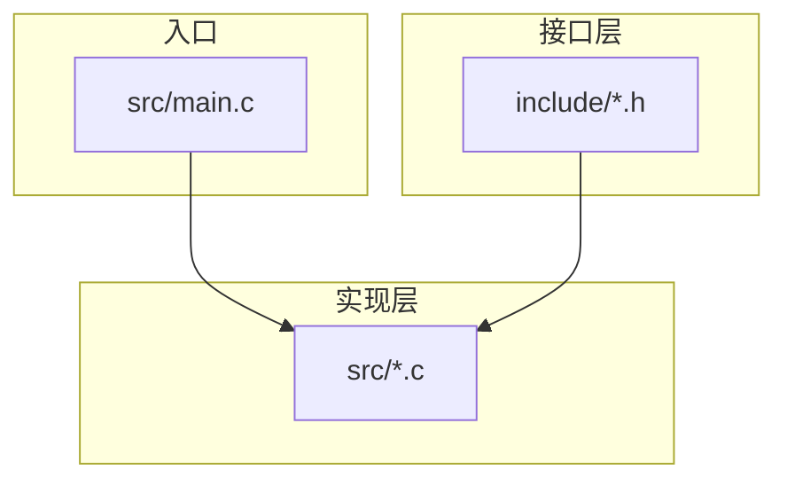
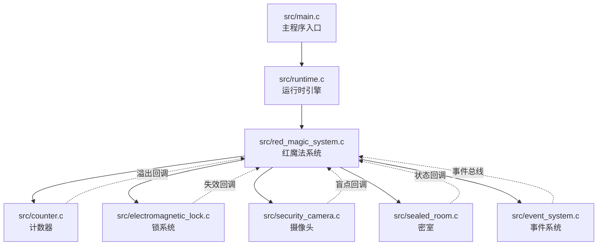
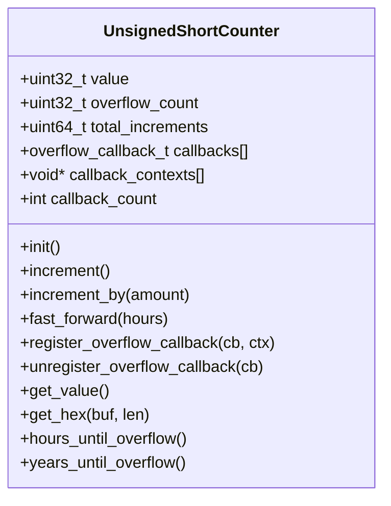
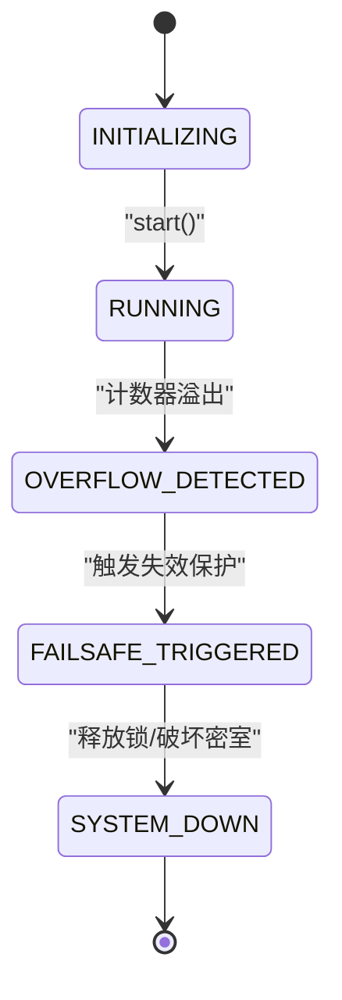
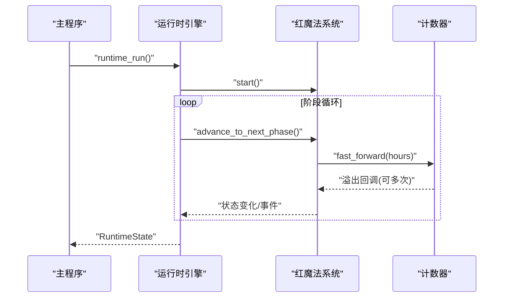
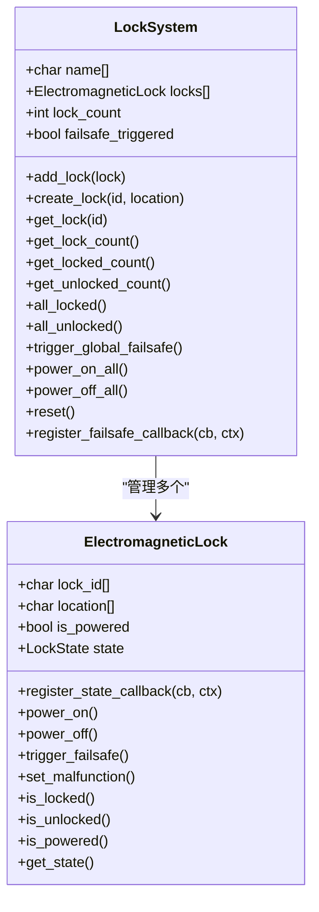
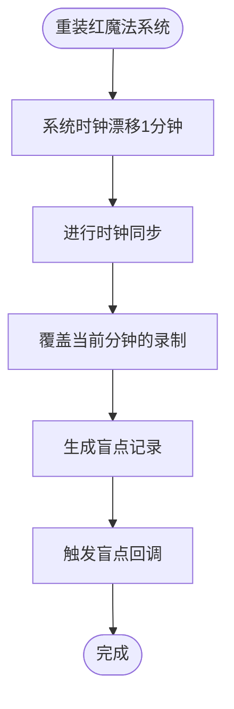
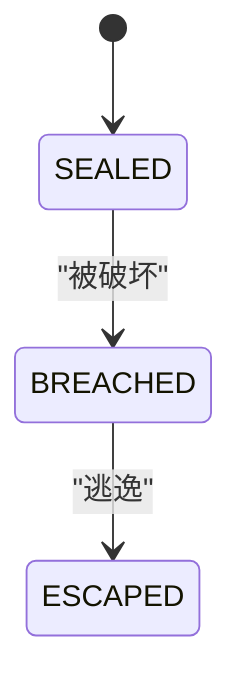
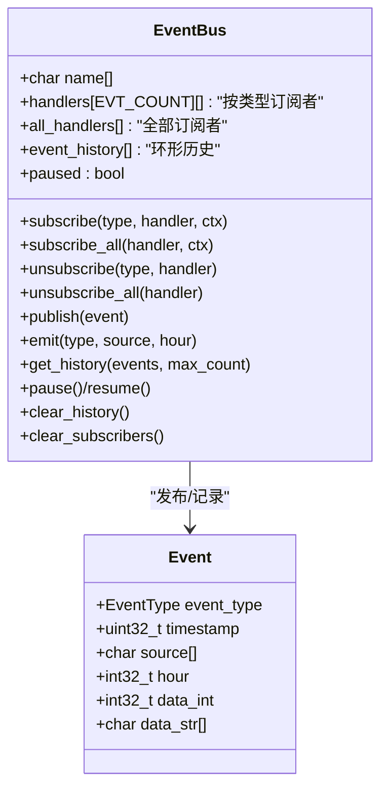
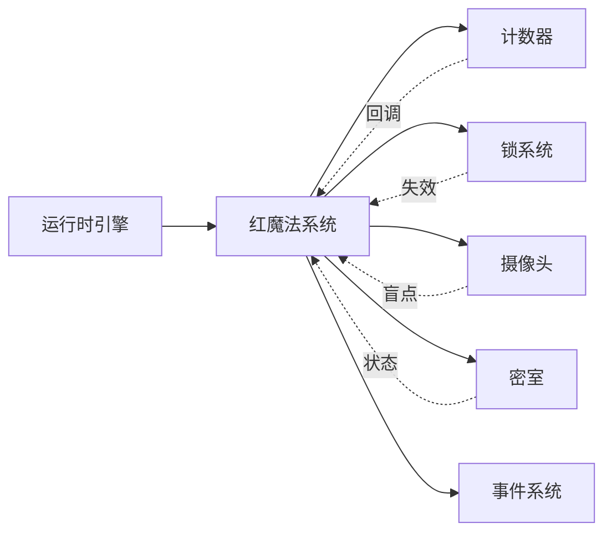

# 核心模块详解

<cite>
**本文档引用的文件**
- [include/counter.h](file://include/counter.h)
- [src/counter.c](file://src/counter.c)
- [include/red_magic_system.h](file://include/red_magic_system.h)
- [src/red_magic_system.c](file://src/red_magic_system.c)
- [include/runtime.h](file://include/runtime.h)
- [src/runtime.c](file://src/runtime.c)
- [include/electromagnetic_lock.h](file://include/electromagnetic_lock.h)
- [src/electromagnetic_lock.c](file://src/electromagnetic_lock.c)
- [include/security_camera.h](file://include/security_camera.h)
- [src/security_camera.c](file://src/security_camera.c)
- [include/sealed_room.h](file://include/sealed_room.h)
- [src/sealed_room.c](file://src/sealed_room.c)
- [include/event_system.h](file://include/event_system.h)
- [src/event_system.c](file://src/event_system.c)
- [src/main.c](file://src/main.c)
</cite>

## 目录
1. [简介](#简介)
2. [项目结构](#项目结构)
3. [核心组件](#核心组件)
4. [架构总览](#架构总览)
5. [详细组件分析](#详细组件分析)
6. [依赖关系分析](#依赖关系分析)
7. [性能考量](#性能考量)
8. [故障排查指南](#故障排查指南)
9. [结论](#结论)
10. [附录](#附录)

## 简介
本项目以小说《一切皆F》为背景，通过一个5阶段仿真运行时引擎，完整模拟从系统启动到“一切皆F”的故事结局。核心模块包括：
- 计数器模块：基于32位无符号整数的溢出机制，驱动整个逃逸流程
- 红魔法系统：安全系统中枢，整合计数器、门锁、摄像头与密室
- 运行时引擎：将小说章节映射为系统状态迁移
- 锁系统：fail-safe设计（断电即开），在溢出时释放
- 摄像头系统：时钟同步漏洞导致的一分钟监控盲点
- 密室系统：状态机驱动的逃生路径
- 事件系统：发布/订阅机制，贯穿各子系统

## 项目结构
项目采用按功能域分层的组织方式，头文件集中定义接口与数据结构，源文件实现具体逻辑，并在顶层提供主程序入口。

**图表来源**
- [src/main.c:1-135](file://src/main.c#L1-L135)
- [include/counter.h:1-99](file://include/counter.h#L1-L99)
- [include/red_magic_system.h:1-166](file://include/red_magic_system.h#L1-L166)
- [include/runtime.h:1-184](file://include/runtime.h#L1-L184)
- [include/electromagnetic_lock.h:1-137](file://include/electromagnetic_lock.h#L1-L137)
- [include/security_camera.h:1-147](file://include/security_camera.h#L1-L147)
- [include/sealed_room.h:1-141](file://include/sealed_room.h#L1-L141)
- [include/event_system.h:1-157](file://include/event_system.h#L1-L157)

**章节来源**
- [src/main.c:1-135](file://src/main.c#L1-L135)
- [include/counter.h:1-99](file://include/counter.h#L1-L99)
- [include/red_magic_system.h:1-166](file://include/red_magic_system.h#L1-L166)
- [include/runtime.h:1-184](file://include/runtime.h#L1-L184)
- [include/electromagnetic_lock.h:1-137](file://include/electromagnetic_lock.h#L1-L137)
- [include/security_camera.h:1-147](file://include/security_camera.h#L1-L147)
- [include/sealed_room.h:1-141](file://include/sealed_room.h#L1-L141)
- [include/event_system.h:1-157](file://include/event_system.h#L1-L157)

## 核心组件
本节概述各核心模块的职责、关键接口与行为特征，便于快速理解模块边界与交互方式。

- 计数器模块
  - 负责以小时为单位递增，达到最大值后触发溢出回调
  - 提供注册/注销溢出回调、快进、查询剩余时间等能力
- 红魔法系统
  - 安全系统中枢，管理计数器、锁系统、摄像头、密室与事件总线
  - 维护系统状态机：初始化→运行→溢出检测→紧急失效→系统停机
- 运行时引擎
  - 将小说章节映射为系统阶段：冷启动→内核访问→I/O边界→内存递归→逻辑爆炸→终止
  - 支持顺序执行与直接快进至溢出
- 锁系统
  - fail-safe设计：上电锁定，断电或触发紧急失效则解锁
  - 支持全局失效、状态统计与回调通知
- 摄像头系统
  - 基于分钟级视频片段记录，支持覆盖与盲点标记
  - 时钟同步漏洞：重装红魔法系统时产生一分钟盲点
- 密室系统
  - 驱动密室状态：密封→被突破→已逃生
  - 与锁系统联动，触发逃逸序列
- 事件系统
  - 发布/订阅总线，支持按类型与全部事件订阅
  - 历史记录、暂停/恢复、统计订阅者数量

**章节来源**
- [include/counter.h:29-98](file://include/counter.h#L29-L98)
- [include/red_magic_system.h:33-88](file://include/red_magic_system.h#L33-L88)
- [include/runtime.h:32-117](file://include/runtime.h#L32-L117)
- [include/electromagnetic_lock.h:22-91](file://include/electromagnetic_lock.h#L22-L91)
- [include/security_camera.h:23-61](file://include/security_camera.h#L23-L61)
- [include/sealed_room.h:25-76](file://include/sealed_room.h#L25-L76)
- [include/event_system.h:25-108](file://include/event_system.h#L25-L108)

## 架构总览
下图展示核心模块之间的依赖关系与控制流：

**图表来源**
- [src/main.c:76-135](file://src/main.c#L76-L135)
- [src/runtime.c:131-205](file://src/runtime.c#L131-L205)
- [src/red_magic_system.c:48-90](file://src/red_magic_system.c#L48-L90)
- [src/counter.c:9-21](file://src/counter.c#L9-L21)
- [src/electromagnetic_lock.c:126-138](file://src/electromagnetic_lock.c#L126-L138)
- [src/security_camera.c:21-37](file://src/security_camera.c#L21-L37)
- [src/sealed_room.c:69-88](file://src/sealed_room.c#L69-L88)
- [src/event_system.c:79-96](file://src/event_system.c#L79-L96)

## 详细组件分析

### 计数器模块（32位无符号整数溢出机制）
- 设计要点
  - 使用32位无符号整数模拟C语言unsigned int范围，最大值为0xFFFFFFFF
  - 溢出采用模运算，每次超过上限即回绕至0，并增加溢出计数
  - 提供注册/注销溢出回调，用于驱动后续系统动作
- 关键接口
  - 初始化与设置：counter_init、counter_init_with_value、counter_set_value、counter_reset
  - 递增与快进：counter_increment、counter_increment_by、counter_fast_forward
  - 查询：counter_get_value、counter_get_hex、counter_hours_until_overflow、counter_years_until_overflow
  - 回调：counter_register_overflow_callback、counter_unregister_overflow_callback
- 复杂度与优化
  - 单次递增/快进为O(1)，快进内部使用除法计算溢出次数，避免逐次递增
- 数据结构复杂度
  - 结构体包含当前值、溢出次数、总增量与回调数组，空间复杂度O(N)用于回调存储

**图表来源**
- [include/counter.h:29-43](file://include/counter.h#L29-L43)

**章节来源**
- [include/counter.h:29-98](file://include/counter.h#L29-L98)
- [src/counter.c:9-21](file://src/counter.c#L9-L21)
- [src/counter.c:40-60](file://src/counter.c#L40-L60)
- [src/counter.c:81-104](file://src/counter.c#L81-L104)
- [src/counter.c:106-133](file://src/counter.c#L106-L133)

### 红魔法系统（安全系统集成架构）
- 系统状态机
  - INITIALIZING → RUNNING → OVERFLOW_DETECTED → FAILSAFE_TRIGGERED → SYSTEM_DOWN
  - 通过状态转换回调对外通知状态变更
- 子系统集成
  - 计数器：溢出触发失败保护
  - 锁系统：全局失效释放所有锁
  - 摄像头：盲点记录与事件上报
  - 密室：被突破后进入逃生阶段
  - 事件总线：统一事件发布与历史记录
- 关键流程
  - 初始化：创建标准设施（含密室、锁、摄像头）
  - 启动：进入运行态并发出启动事件
  - 推进：按小时推进计数器，发布计数事件
  - 快进：支持按小时快进，直接触发溢出
  - 触发失效：释放锁、破坏密室、系统停机并发出崩溃事件

**图表来源**
- [include/red_magic_system.h:33-40](file://include/red_magic_system.h#L33-L40)
- [src/red_magic_system.c:32-42](file://src/red_magic_system.c#L32-L42)
- [src/red_magic_system.c:146-183](file://src/red_magic_system.c#L146-L183)

**章节来源**
- [include/red_magic_system.h:33-88](file://include/red_magic_system.h#L33-L88)
- [src/red_magic_system.c:48-72](file://src/red_magic_system.c#L48-L72)
- [src/red_magic_system.c:92-113](file://src/red_magic_system.c#L92-L113)
- [src/red_magic_system.c:115-125](file://src/red_magic_system.c#L115-L125)
- [src/red_magic_system.c:127-144](file://src/red_magic_system.c#L127-L144)
- [src/red_magic_system.c:146-183](file://src/red_magic_system.c#L146-L183)
- [src/red_magic_system.c:320-348](file://src/red_magic_system.c#L320-L348)

### 运行时引擎（5阶段仿真映射）
- 阶段映射
  - 冷启动：系统初始化，开始被监禁
  - 内核访问：核心系统运行，bug植入红魔法
  - I/O边界：时间流逝，计数器接近半点
  - 内存递归：接近溢出，记忆与时间呈现递归模式
  - 逻辑爆炸：计数器到达0xFFFF，溢出，逃逸，系统崩溃
  - 终止：系统崩溃，一切皆F
- 执行策略
  - 顺序执行：依次推进到下一阶段
  - 直达溢出：快进到溢出点，直接进入逻辑爆炸与终止
  - 阶段切换：记录历史，发布阶段转换事件
- 验证结果
  - everything_becomes_f：是否满足“一切皆F”条件（发生溢出且系统停机）
  - 可选：是否已逃逸

**图表来源**
- [src/main.c:76-135](file://src/main.c#L76-L135)
- [src/runtime.c:219-233](file://src/runtime.c#L219-L233)
- [src/runtime.c:166-205](file://src/runtime.c#L166-L205)
- [src/red_magic_system.c:127-144](file://src/red_magic_system.c#L127-L144)

**章节来源**
- [include/runtime.h:32-86](file://include/runtime.h#L32-L86)
- [src/runtime.c:10-53](file://src/runtime.c#L10-L53)
- [src/runtime.c:80-101](file://src/runtime.c#L80-L101)
- [src/runtime.c:166-205](file://src/runtime.c#L166-L205)
- [src/runtime.c:219-252](file://src/runtime.c#L219-L252)
- [src/runtime.c:317-348](file://src/runtime.c#L317-L348)

### 锁系统（fail-safe设计）
- 设计原则
  - 上电锁定（门关闭），断电或触发失效保护则解锁（门打开）
  - 全局失效：对所有锁执行失效操作，返回解锁数量
- 接口要点
  - 单锁：初始化、上电/断电、触发失效、故障、状态查询、注册状态回调
  - 系统：添加锁、创建锁、按ID检索、统计锁定/解锁数量、判断全锁状态、全局失效、电源控制、复位、注册失效回调
- 复杂度
  - 全局失效遍历所有锁，时间复杂度O(N)

**图表来源**
- [include/electromagnetic_lock.h:40-91](file://include/electromagnetic_lock.h#L40-L91)
- [src/electromagnetic_lock.c:22-37](file://src/electromagnetic_lock.c#L22-L37)
- [src/electromagnetic_lock.c:126-138](file://src/electromagnetic_lock.c#L126-L138)
- [src/electromagnetic_lock.c:223-238](file://src/electromagnetic_lock.c#L223-L238)

**章节来源**
- [include/electromagnetic_lock.h:22-91](file://include/electromagnetic_lock.h#L22-L91)
- [src/electromagnetic_lock.c:22-37](file://src/electromagnetic_lock.c#L22-L37)
- [src/electromagnetic_lock.c:126-138](file://src/electromagnetic_lock.c#L126-L138)
- [src/electromagnetic_lock.c:223-238](file://src/electromagnetic_lock.c#L223-L238)

### 摄像头系统（时钟同步漏洞）
- 功能特性
  - 分钟级视频片段记录，支持覆盖与盲点标记
  - 盲点回调：当某分钟记录被覆盖时触发
- 时钟同步漏洞
  - 重装红魔法系统时，系统时钟存在1分钟漂移
  - 同步过程中当前分钟的录制会被覆盖，形成监控盲点
- 接口要点
  - 摄像头：初始化、记录/获取/覆盖/创建盲点、激活/停用、注册盲点回调
  - 漏洞：初始化、添加摄像头、利用漏洞（覆盖指定分钟）、模拟重装、检查是否被利用、复位

**图表来源**
- [include/security_camera.h:102-144](file://include/security_camera.h#L102-L144)
- [src/security_camera.c:176-192](file://src/security_camera.c#L176-L192)
- [src/security_camera.c:194-212](file://src/security_camera.c#L194-L212)

**章节来源**
- [include/security_camera.h:23-61](file://include/security_camera.h#L23-L61)
- [include/security_camera.h:102-144](file://include/security_camera.h#L102-L144)
- [src/security_camera.c:21-37](file://src/security_camera.c#L21-L37)
- [src/security_camera.c:176-192](file://src/security_camera.c#L176-L192)
- [src/security_camera.c:194-212](file://src/security_camera.c#L194-L212)

### 密室系统（状态机设计）
- 状态机
  - SEALED → BREACHED → ESCAPED
  - 支持占用者存在性与被破坏时间/逃逸时间记录
- 门与锁
  - 门可单向或双向，绑定电磁锁
  - 仅当锁处于锁定且门未开启时才可打开
- 逃逸序列
  - 触发失效保护→解锁主锁→破坏密室→逃逸

**图表来源**
- [include/sealed_room.h:25-31](file://include/sealed_room.h#L25-L31)
- [src/sealed_room.c:144-168](file://src/sealed_room.c#L144-L168)

**章节来源**
- [include/sealed_room.h:25-76](file://include/sealed_room.h#L25-L76)
- [src/sealed_room.c:69-88](file://src/sealed_room.c#L69-L88)
- [src/sealed_room.c:144-168](file://src/sealed_room.c#L144-L168)
- [src/sealed_room.c:230-244](file://src/sealed_room.c#L230-L244)

### 事件系统（发布订阅机制）
- 事件类型
  - 系统：初始化、启动、停机、崩溃
  - 计数器：递增、溢出、重置
  - 锁：锁定、解锁、全部解锁、失效触发
  - 摄像头：录制、盲点、时钟同步错误
  - 密室：密封、被破坏、已逃逸
  - 阶段：阶段转换、阶段完成
- 总线特性
  - 按事件类型订阅/取消订阅
  - 订阅全部事件处理器
  - 发布事件，写入环形历史缓冲区
  - 支持暂停/恢复、清空历史与订阅者
- 复杂度
  - 发布时遍历该类型的订阅者与全部订阅者，时间复杂度O(M+N)

**图表来源**
- [include/event_system.h:66-108](file://include/event_system.h#L66-L108)
- [src/event_system.c:79-96](file://src/event_system.c#L79-L96)
- [src/event_system.c:171-204](file://src/event_system.c#L171-L204)

**章节来源**
- [include/event_system.h:25-108](file://include/event_system.h#L25-L108)
- [src/event_system.c:79-96](file://src/event_system.c#L79-L96)
- [src/event_system.c:171-204](file://src/event_system.c#L171-L204)
- [src/event_system.c:235-247](file://src/event_system.c#L235-L247)

## 依赖关系分析
- 模块耦合
  - 红魔法系统是中枢，向上依赖计数器、锁系统、摄像头、密室与事件总线
  - 运行时引擎依赖红魔法系统与密室信息
  - 计数器通过回调驱动红魔法系统状态转换
  - 锁系统与密室通过事件与状态回调与红魔法系统交互
- 外部依赖
  - 标准库：字符串与时间相关函数
- 循环依赖
  - 未发现直接循环依赖；回调链路为单向（计数器→红魔法系统→锁/密室/摄像头）

**图表来源**
- [src/runtime.c:131-156](file://src/runtime.c#L131-L156)
- [src/red_magic_system.c:48-72](file://src/red_magic_system.c#L48-L72)
- [src/counter.c:31-38](file://src/counter.c#L31-L38)
- [src/electromagnetic_lock.c:117-124](file://src/electromagnetic_lock.c#L117-L124)
- [src/security_camera.c:12-19](file://src/security_camera.c#L12-L19)
- [src/sealed_room.c:59-67](file://src/sealed_room.c#L59-L67)

**章节来源**
- [src/runtime.c:131-156](file://src/runtime.c#L131-L156)
- [src/red_magic_system.c:48-72](file://src/red_magic_system.c#L48-L72)
- [src/counter.c:31-38](file://src/counter.c#L31-L38)
- [src/electromagnetic_lock.c:117-124](file://src/electromagnetic_lock.c#L117-L124)
- [src/security_camera.c:12-19](file://src/security_camera.c#L12-L19)
- [src/sealed_room.c:59-67](file://src/sealed_room.c#L59-L67)

## 性能考量
- 计数器快进
  - 使用整除与取模一次性计算溢出次数，避免逐次递增，时间复杂度O(1)
- 锁系统全局失效
  - 遍历所有锁执行失效，时间复杂度O(N)，N为锁数量
- 事件总线发布
  - 对特定类型与全部订阅者分别遍历，时间复杂度O(M+N)
- 历史缓冲区
  - 环形缓冲区，插入为O(1)，查询最近事件为O(K)，K为返回数量
- 内存占用
  - 各模块结构体紧凑，回调数组上限可控，适合嵌入式场景

## 故障排查指南
- 计数器未溢出
  - 检查计数器是否在运行态推进（红魔法系统状态需为RUNNING）
  - 使用快进接口确认是否到达溢出点
- 锁未释放
  - 确认是否触发了失效保护（溢出或手动触发）
  - 检查全局失效回调是否被正确注册
- 摄像头盲点缺失
  - 确认漏洞是否被利用（重装红魔法系统）
  - 检查当前分钟是否被覆盖
- 密室未被破坏/逃逸
  - 确认密室状态是否为SEALED
  - 检查锁状态与门状态
- 事件未到达
  - 检查事件总线是否被暂停
  - 确认订阅者是否正确注册

**章节来源**
- [src/red_magic_system.c:146-183](file://src/red_magic_system.c#L146-L183)
- [src/electromagnetic_lock.c:223-238](file://src/electromagnetic_lock.c#L223-L238)
- [src/security_camera.c:176-192](file://src/security_camera.c#L176-L192)
- [src/sealed_room.c:144-168](file://src/sealed_room.c#L144-L168)
- [src/event_system.c:249-263](file://src/event_system.c#L249-L263)

## 结论
本项目通过严谨的模块化设计与清晰的状态机映射，完整还原了“一切皆F”的逃逸路径。计数器的溢出机制是核心驱动力，配合fail-safe锁系统、时钟同步漏洞与密室状态机，最终在运行时引擎的5阶段仿真中达成目标。事件系统提供了松耦合的通信机制，确保各模块间的行为可追踪与可观测。

## 附录
- 使用模式建议
  - 初始化：通过运行时引擎创建标准设施并启动
  - 推进：按阶段顺序执行或直接快进至溢出
  - 监控：订阅事件总线观察关键节点
  - 验证：使用验证接口确认“一切皆F”条件