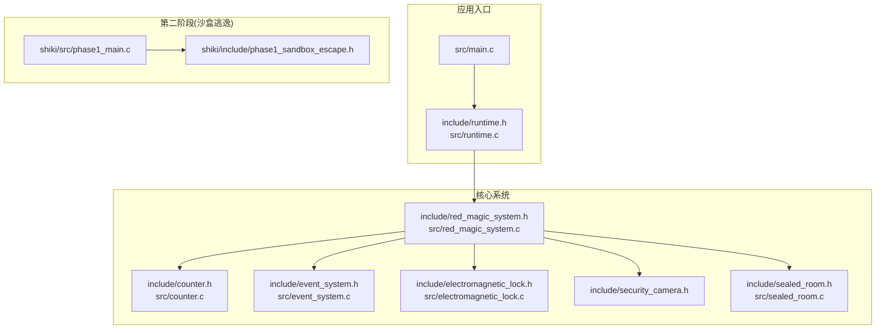
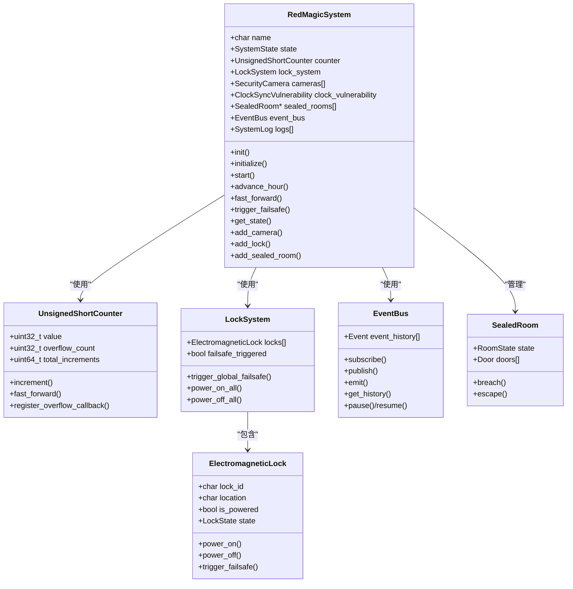
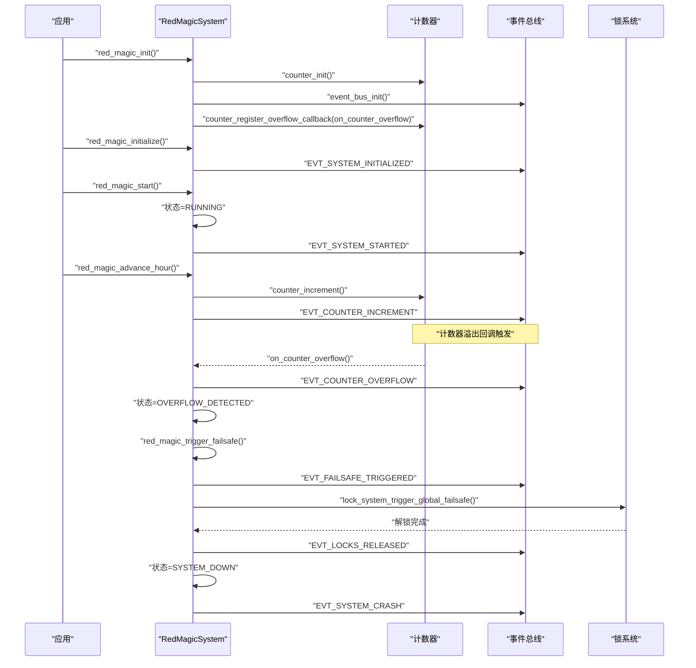
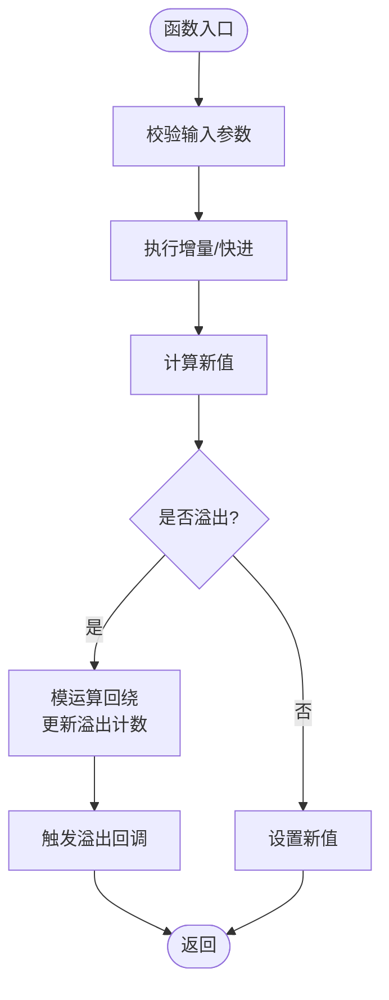
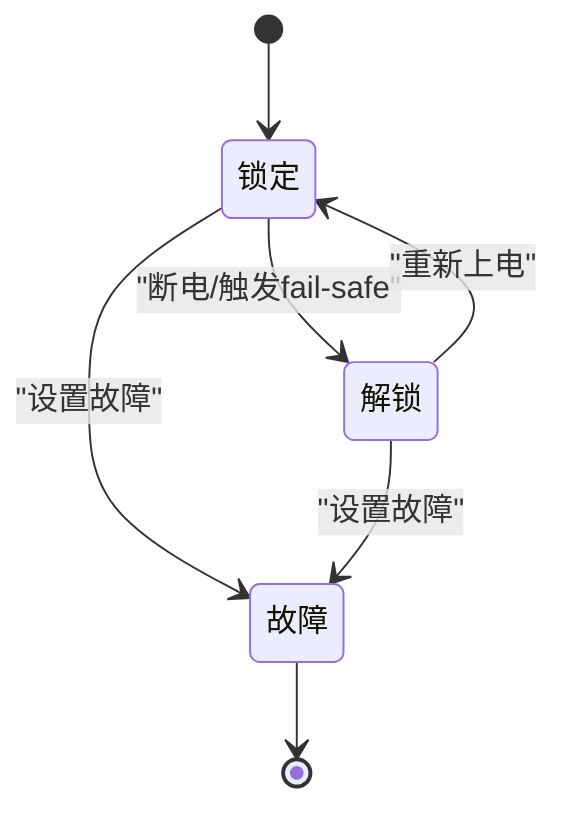
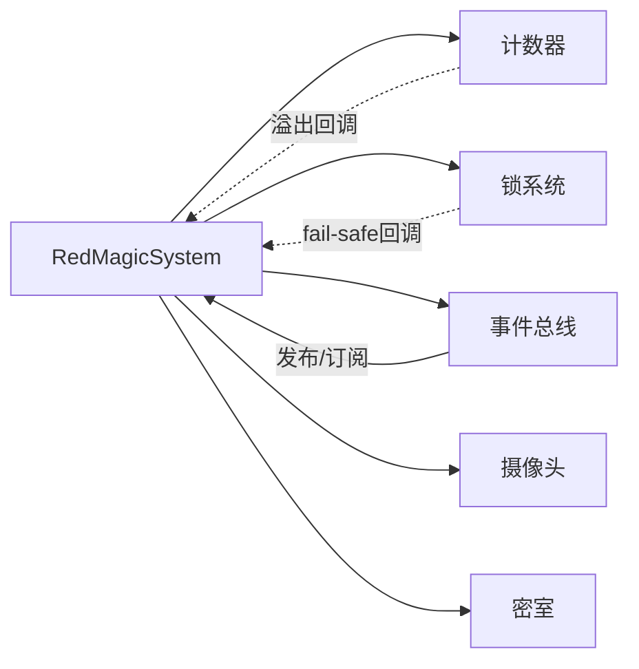

# 红魔法系统

<cite>
**本文引用的文件**
- [src/red_magic_system.c](file://src/red_magic_system.c)
- [include/red_magic_system.h](file://include/red_magic_system.h)
- [src/main.c](file://src/main.c)
- [include/event_system.h](file://include/event_system.h)
- [src/event_system.c](file://src/event_system.c)
- [include/counter.h](file://include/counter.h)
- [src/counter.c](file://src/counter.c)
- [include/electromagnetic_lock.h](file://include/electromagnetic_lock.h)
- [src/electromagnetic_lock.c](file://src/electromagnetic_lock.c)
- [include/security_camera.h](file://include/security_camera.h)
- [include/sealed_room.h](file://include/sealed_room.h)
- [src/sealed_room.c](file://src/sealed_room.c)
- [include/runtime.h](file://include/runtime.h)
- [shiki/include/phase1_sandbox_escape.h](file://shiki/include/phase1_sandbox_escape.h)
- [shiki/src/phase1_main.c](file://shiki/src/phase1_main.c)
</cite>

## 目录
1. [简介](#简介)
2. [项目结构](#项目结构)
3. [核心组件](#核心组件)
4. [架构总览](#架构总览)
5. [详细组件分析](#详细组件分析)
6. [依赖分析](#依赖分析)
7. [性能考虑](#性能考虑)
8. [故障排查指南](#故障排查指南)
9. [结论](#结论)
10. [附录](#附录)

## 简介
本文件为“红魔法系统”的全面架构文档，聚焦于中央安全系统的集成设计与实现。系统围绕计数器、锁系统、摄像头系统、密室系统与事件系统协同工作，通过事件总线实现松耦合通信，形成从初始化、运行、溢出检测到紧急失效保护（fail-safe）的完整生命周期。

系统以16位无符号短整型计数器为核心时间源，模拟Dr. Magata Shiki在“Magata Research Facility”中被监禁15年的背景故事。当计数器溢出时，系统触发fail-safe，释放所有电磁锁并破坏密室，从而实现角色的逃脱。整个过程通过事件总线传播，确保各子系统之间低耦合、高内聚。

## 项目结构
仓库采用按功能模块划分的层次化组织方式：
- include：公共头文件，定义接口与数据结构
- src：核心实现，包含计数器、锁系统、事件系统、摄像头、密室、运行时等
- shiki：第二阶段（Phase 1）独立沙盒逃逸模拟程序，演示溢出与内核恐慌导致的系统崩溃与锁释放
- tests：测试框架与多层级测试用例
- 根目录：顶层构建脚本与README

图表来源
- [src/main.c:1-135](file://src/main.c#L1-L135)
- [include/red_magic_system.h:1-166](file://include/red_magic_system.h#L1-L166)
- [src/red_magic_system.c:1-349](file://src/red_magic_system.c#L1-L349)
- [include/counter.h:1-99](file://include/counter.h#L1-L99)
- [src/counter.c:1-162](file://src/counter.c#L1-L162)
- [include/event_system.h:1-157](file://include/event_system.h#L1-L157)
- [src/event_system.c:1-295](file://src/event_system.c#L1-L295)
- [include/electromagnetic_lock.h:1-137](file://include/electromagnetic_lock.h#L1-L137)
- [src/electromagnetic_lock.c:1-278](file://src/electromagnetic_lock.c#L1-L278)
- [include/security_camera.h:1-147](file://include/security_camera.h#L1-L147)
- [include/sealed_room.h:1-141](file://include/sealed_room.h#L1-L141)
- [src/sealed_room.c:1-253](file://src/sealed_room.c#L1-L253)
- [include/runtime.h:1-184](file://include/runtime.h#L1-L184)
- [shiki/include/phase1_sandbox_escape.h:1-243](file://shiki/include/phase1_sandbox_escape.h#L1-L243)
- [shiki/src/phase1_main.c:1-224](file://shiki/src/phase1_main.c#L1-L224)

章节来源
- [src/main.c:1-135](file://src/main.c#L1-L135)
- [include/red_magic_system.h:1-166](file://include/red_magic_system.h#L1-L166)

## 核心组件
- 中央安全系统（RedMagicSystem）
  - 统一管理计数器、锁系统、摄像头、密室、事件总线与日志
  - 提供初始化、启动、计时推进、快速前进、状态查询、组件注册等接口
- 计数器（UnsignedShortCounter）
  - 以32位无符号整型模拟溢出行为，支持增量、快进、回调注册
- 锁系统（LockSystem + ElectromagneticLock）
  - fail-safe设计：上电锁定，断电或触发fail-safe则解锁
- 摄像头系统（SecurityCamera + ClockSyncVulnerability）
  - 记录视频片段，模拟时钟同步漏洞导致的监控盲点
- 密室系统（SealedRoom + MagataQuarters）
  - 封闭房间模型，支持破坏与逃脱，与锁系统联动
- 事件系统（EventBus）
  - 发布/订阅模式，支持历史记录、暂停/恢复、全局处理器

章节来源
- [include/red_magic_system.h:66-88](file://include/red_magic_system.h#L66-L88)
- [include/counter.h:36-43](file://include/counter.h#L36-L43)
- [include/electromagnetic_lock.h:47-55](file://include/electromagnetic_lock.h#L47-L55)
- [include/electromagnetic_lock.h:83-91](file://include/electromagnetic_lock.h#L83-L91)
- [include/security_camera.h:51-61](file://include/security_camera.h#L51-L61)
- [include/security_camera.h:109-115](file://include/security_camera.h#L109-L115)
- [include/sealed_room.h:63-76](file://include/sealed_room.h#L63-L76)
- [include/event_system.h:93-108](file://include/event_system.h#L93-L108)

## 架构总览
红魔法系统采用“中央控制器 + 子系统 + 事件总线”的分层架构：
- 中央控制器（RedMagicSystem）负责状态机与组件编排
- 子系统通过接口暴露能力，内部状态变化通过事件总线广播
- 事件总线提供跨模块解耦，支持历史回放与调试

图表来源
- [include/red_magic_system.h:66-88](file://include/red_magic_system.h#L66-L88)
- [include/counter.h:36-43](file://include/counter.h#L36-L43)
- [include/electromagnetic_lock.h:83-91](file://include/electromagnetic_lock.h#L83-L91)
- [include/event_system.h:93-108](file://include/event_system.h#L93-L108)
- [include/sealed_room.h:63-76](file://include/sealed_room.h#L63-L76)

## 详细组件分析

### 中央安全系统（RedMagicSystem）
- 初始化流程
  - 设置状态为“初始化中”，初始化计数器、锁系统、事件总线与时钟漏洞
  - 注册计数器溢出回调，用于触发fail-safe
- 启动流程
  - 状态从“初始化中”转为“运行中”，发布系统启动事件
- 计时推进
  - 单步推进或批量快进，发布计数器增量事件
- fail-safe触发
  - 记录日志，发布事件，触发全局锁释放，破坏所有密封房间，最终系统停机

图表来源
- [src/red_magic_system.c:48-102](file://src/red_magic_system.c#L48-L102)
- [src/red_magic_system.c:74-90](file://src/red_magic_system.c#L74-L90)
- [src/red_magic_system.c:104-113](file://src/red_magic_system.c#L104-L113)
- [src/red_magic_system.c:115-125](file://src/red_magic_system.c#L115-L125)
- [src/red_magic_system.c:146-183](file://src/red_magic_system.c#L146-L183)
- [include/event_system.h:28-61](file://include/event_system.h#L28-L61)

章节来源
- [src/red_magic_system.c:48-102](file://src/red_magic_system.c#L48-L102)
- [src/red_magic_system.c:104-113](file://src/red_magic_system.c#L104-L113)
- [src/red_magic_system.c:115-125](file://src/red_magic_system.c#L115-L125)
- [src/red_magic_system.c:146-183](file://src/red_magic_system.c#L146-L183)

### 计数器（UnsignedShortCounter）
- 数据结构
  - 当前值、溢出次数、累计增量、溢出回调数组
- 关键算法
  - 增量与快进均使用模运算处理溢出，O(1)快进通过除法计算溢出次数并批量触发回调
- 复杂度
  - 增量：O(1)
  - 快进：O(k)，k为溢出次数（通常很小）

图表来源
- [src/counter.c:44-60](file://src/counter.c#L44-L60)
- [src/counter.c:81-104](file://src/counter.c#L81-L104)

章节来源
- [include/counter.h:36-43](file://include/counter.h#L36-L43)
- [src/counter.c:44-60](file://src/counter.c#L44-L60)
- [src/counter.c:81-104](file://src/counter.c#L81-L104)

### 锁系统（LockSystem + ElectromagneticLock）
- 设计要点
  - fail-safe原则：上电锁定，断电或触发fail-safe则解锁
  - 支持全局fail-safe触发，统计解锁数量
- 状态转换
  - 上电/断电改变锁状态；fail-safe强制解锁
- 回调机制
  - 锁状态变化与系统fail-safe均可注册回调

图表来源
- [include/electromagnetic_lock.h:22-27](file://include/electromagnetic_lock.h#L22-L27)
- [src/electromagnetic_lock.c:39-73](file://src/electromagnetic_lock.c#L39-L73)
- [src/electromagnetic_lock.c:223-238](file://src/electromagnetic_lock.c#L223-L238)

章节来源
- [include/electromagnetic_lock.h:47-55](file://include/electromagnetic_lock.h#L47-L55)
- [include/electromagnetic_lock.h:83-91](file://include/electromagnetic_lock.h#L83-L91)
- [src/electromagnetic_lock.c:39-73](file://src/electromagnetic_lock.c#L39-L73)
- [src/electromagnetic_lock.c:223-238](file://src/electromagnetic_lock.c#L223-L238)

### 摄像头系统（SecurityCamera + ClockSyncVulnerability）
- 功能
  - 记录每分钟视频片段，支持覆盖与盲点创建
  - 时钟同步漏洞：系统重装时产生1分钟盲点
- 与红魔法系统的集成
  - 在添加摄像头时将其加入漏洞系统，便于后续exploit

章节来源
- [include/security_camera.h:51-61](file://include/security_camera.h#L51-L61)
- [include/security_camera.h:109-115](file://include/security_camera.h#L109-L115)
- [src/red_magic_system.c:231-233](file://src/red_magic_system.c#L231-L233)

### 密室系统（SealedRoom + MagataQuarters）
- 功能
  - 封闭房间状态机：密封 → 破坏 → 逃脱
  - 与门与锁联动，支持完整性检查
- 与fail-safe的关联
  - fail-safe触发后房间被破坏，允许逃脱

章节来源
- [include/sealed_room.h:63-76](file://include/sealed_room.h#L63-L76)
- [src/sealed_room.c:144-168](file://src/sealed_room.c#L144-L168)
- [src/sealed_room.c:230-244](file://src/sealed_room.c#L230-L244)

### 事件系统（EventBus）
- 特性
  - 每事件类型最多16个订阅者，全局订阅者最多8个
  - 历史缓冲区循环队列，支持最近事件检索
  - 支持暂停/恢复事件投递
- 使用模式
  - 红魔法系统在关键节点发布事件，如系统初始化、计数器溢出、锁释放、房间破坏、系统崩溃等

章节来源
- [include/event_system.h:93-108](file://include/event_system.h#L93-L108)
- [src/event_system.c:171-204](file://src/event_system.c#L171-L204)
- [src/event_system.c:235-247](file://src/event_system.c#L235-L247)

### 第二阶段：沙盒逃逸（Phase 1）
- 目标
  - 展示溢出导致内核恐慌、锁释放与逃脱的完整链路
- 关键点
  - 通过计数器推进至溢出，模拟内核panic与fail-safe
  - 输出彩色日志，直观展示权限提升与逃脱过程

章节来源
- [shiki/include/phase1_sandbox_escape.h:1-243](file://shiki/include/phase1_sandbox_escape.h#L1-L243)
- [shiki/src/phase1_main.c:1-224](file://shiki/src/phase1_main.c#L1-L224)

## 依赖分析
- 组件耦合
  - RedMagicSystem聚合计数器、锁系统、事件总线、摄像头、密室
  - 计数器与锁系统通过事件总线间接耦合
- 外部依赖
  - 事件系统提供发布/订阅基础设施
  - 运行时（runtime）驱动系统进入不同阶段并验证结果

图表来源
- [include/red_magic_system.h:70-78](file://include/red_magic_system.h#L70-L78)
- [src/red_magic_system.c:70-72](file://src/red_magic_system.c#L70-L72)
- [src/red_magic_system.c:285-285](file://src/red_magic_system.c#L285-L285)

章节来源
- [include/red_magic_system.h:70-78](file://include/red_magic_system.h#L70-L78)
- [src/red_magic_system.c:70-72](file://src/red_magic_system.c#L70-L72)
- [src/red_magic_system.c:285-285](file://src/red_magic_system.c#L285-L285)

## 性能考虑
- 计数器快进为O(k)，其中k为溢出次数，通常极小，整体开销可忽略
- 事件总线采用固定大小数组与循环缓冲，发布/订阅均为O(n)，n为该事件类型的订阅者数量
- 日志与历史记录上限可控，避免内存膨胀
- 建议
  - 在高频事件场景下，优先使用全局处理器减少重复订阅
  - 控制订阅者数量，避免超过最大限制

## 故障排查指南
- 系统未进入“运行中”
  - 检查初始化顺序：必须先初始化再启动
  - 查看事件总线是否被暂停
- 溢出未触发fail-safe
  - 确认计数器溢出回调已注册
  - 检查事件总线历史记录中是否存在溢出事件
- 锁未释放
  - 确认全局fail-safe已触发
  - 检查锁系统状态与回调是否正常
- 密室未被破坏
  - 确认房间处于密封状态且被添加到系统
  - 检查事件总线中房间破坏事件

章节来源
- [src/red_magic_system.c:92-102](file://src/red_magic_system.c#L92-L102)
- [src/red_magic_system.c:146-183](file://src/red_magic_system.c#L146-L183)
- [src/event_system.c:235-247](file://src/event_system.c#L235-L247)

## 结论
红魔法系统通过清晰的分层架构与事件总线实现了高度解耦的组件协作。计数器作为核心时间源，驱动fail-safe机制，进而影响锁系统与密室状态，最终达成“一切终将归F”的叙事闭环。该设计既满足了仿真需求，也为扩展更多阶段与场景提供了良好基础。

## 附录

### 系统状态与事件类型
- 系统状态
  - 初始化中 → 运行中 → 溢出检测 → fail-safe触发 → 系统停机
- 事件类型（节选）
  - 系统初始化、启动、崩溃
  - 计数器增量、溢出、重置
  - 锁锁定、解锁、全部解锁、fail-safe触发
  - 房间密封、破坏、逃脱

章节来源
- [include/red_magic_system.h:33-40](file://include/red_magic_system.h#L33-L40)
- [include/event_system.h:28-61](file://include/event_system.h#L28-L61)

### 代码示例路径（不展示具体代码内容）
- 系统启动与状态查询
  - [src/red_magic_system.c:92-102](file://src/red_magic_system.c#L92-L102)
  - [src/red_magic_system.c:185-195](file://src/red_magic_system.c#L185-L195)
- 组件交互（添加摄像头/锁/密室）
  - [src/red_magic_system.c:221-244](file://src/red_magic_system.c#L221-L244)
  - [src/red_magic_system.c:246-269](file://src/red_magic_system.c#L246-L269)
- fail-safe触发流程
  - [src/red_magic_system.c:146-183](file://src/red_magic_system.c#L146-L183)
- 应用入口与运行时
  - [src/main.c:76-135](file://src/main.c#L76-L135)
  - [include/runtime.h:119-182](file://include/runtime.h#L119-L182)