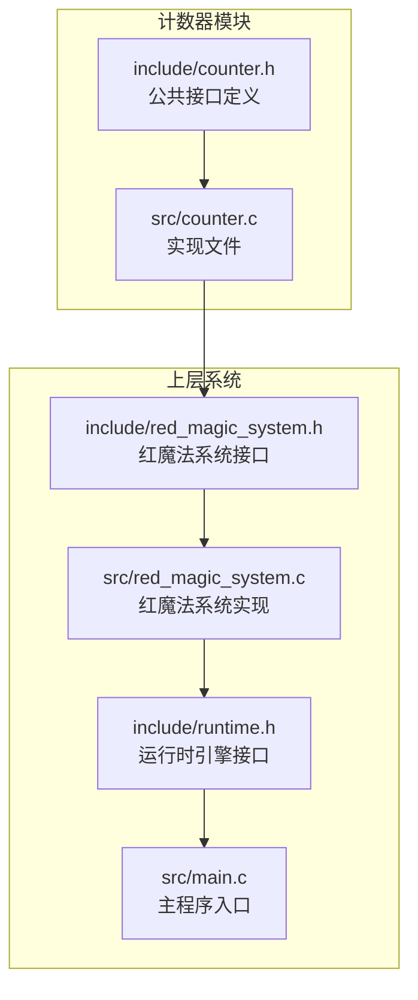
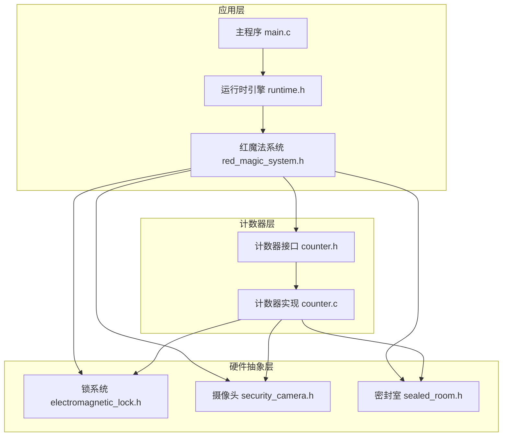
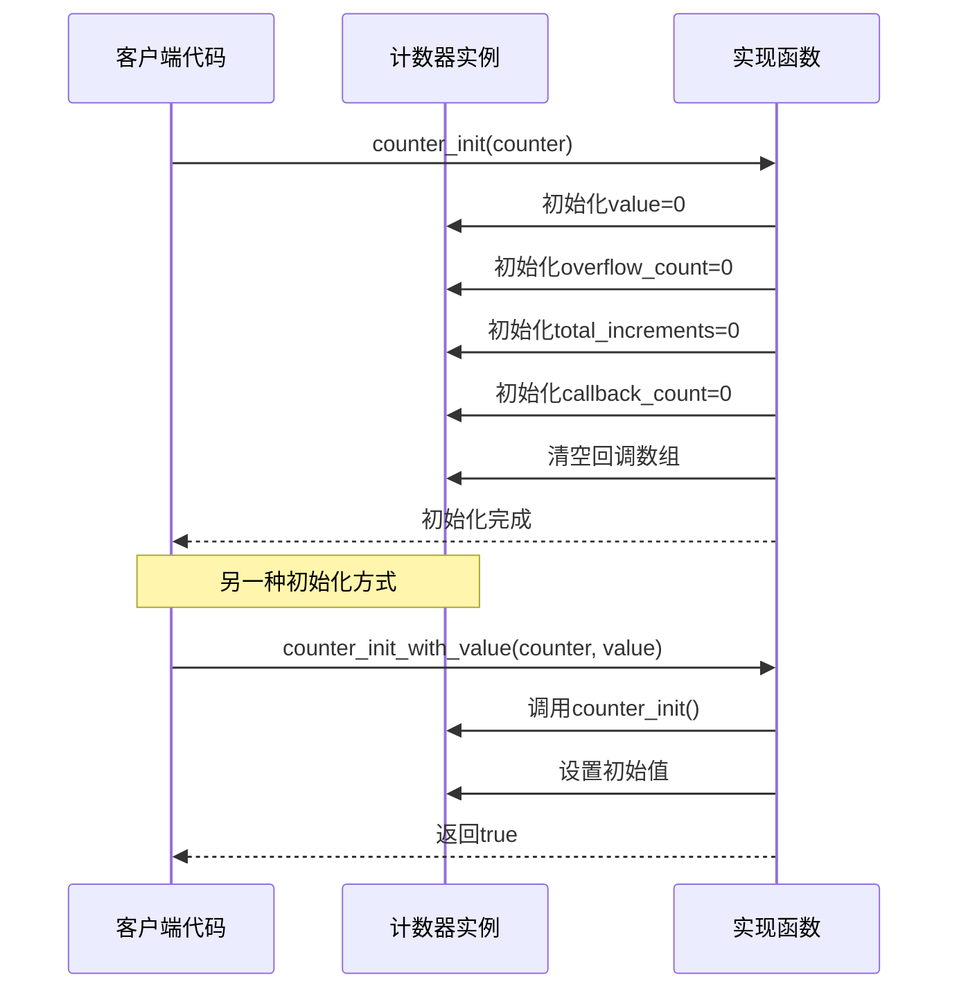
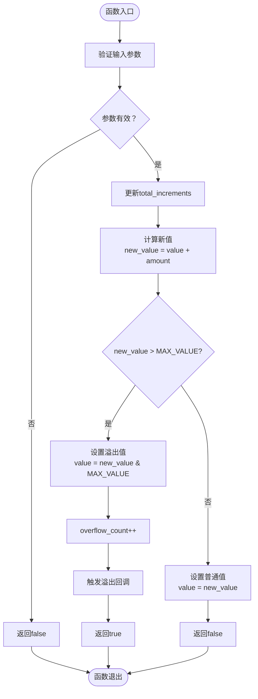
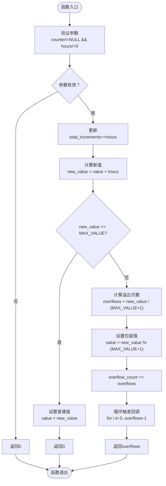
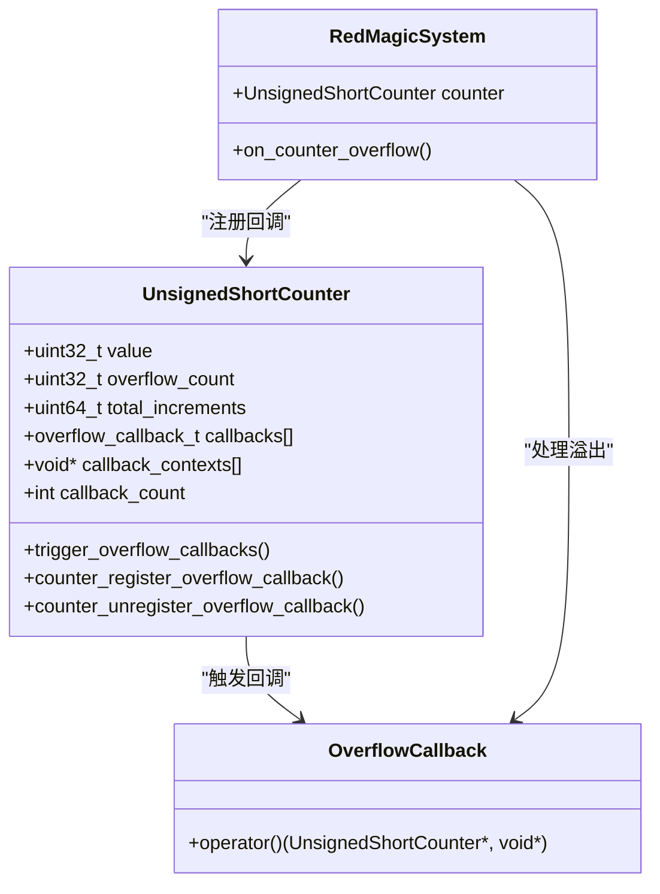
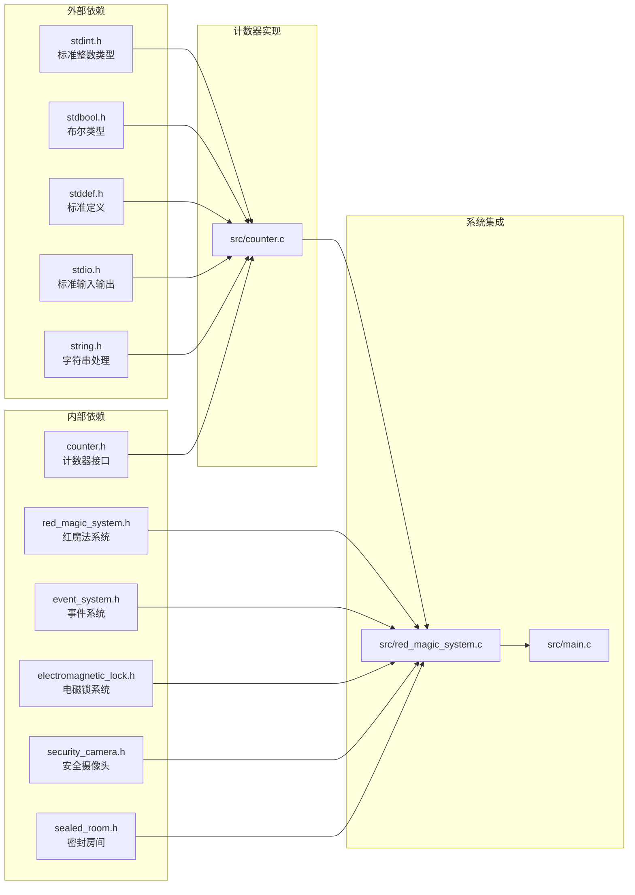
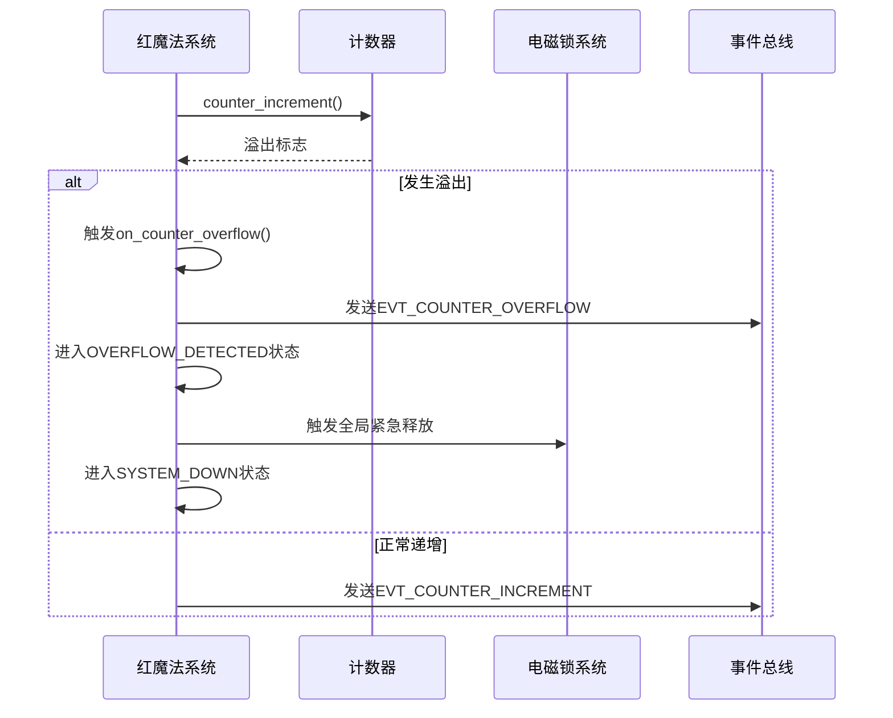

# 计数器模块

<cite>
**本文档引用的文件**
- [include/counter.h](file://include/counter.h)
- [src/counter.c](file://src/counter.c)
- [include/red_magic_system.h](file://include/red_magic_system.h)
- [src/red_magic_system.c](file://src/red_magic_system.c)
- [include/runtime.h](file://include/runtime.h)
- [src/main.c](file://src/main.c)
</cite>

## 目录
1. [简介](#简介)
2. [项目结构](#项目结构)
3. [核心组件](#核心组件)
4. [架构概览](#架构概览)
5. [详细组件分析](#详细组件分析)
6. [依赖关系分析](#依赖关系分析)
7. [性能考虑](#性能考虑)
8. [故障排除指南](#故障排除指南)
9. [结论](#结论)
10. [附录](#附录)

## 简介

计数器模块是基于C语言标准无符号整数行为设计的32位计数器实现。该模块模拟了C语言中unsigned int（0-4294967295）的行为，是Dr. Magata逃脱机制的核心组件。当计数器达到最大值0xFFFFFFFF（4294967295）并增加1时，会溢出回到0x00000000，触发安全机制。

该模块特别设计用于模拟十六位无符号短整数溢出漏洞（0xFFFF到0x0000），这是小说《The Perfect Insider》中Dr. Magata Shiki逃脱的关键技术基础。

## 项目结构

计数器模块位于项目的独立目录结构中，主要包含以下文件：



**图表来源**
- [include/counter.h:1-99](file://include/counter.h#L1-L99)
- [src/counter.c:1-162](file://src/counter.c#L1-L162)
- [include/red_magic_system.h:1-166](file://include/red_magic_system.h#L1-L166)
- [src/red_magic_system.c:1-349](file://src/red_magic_system.c#L1-L349)

**章节来源**
- [include/counter.h:1-99](file://include/counter.h#L1-L99)
- [src/counter.c:1-162](file://src/counter.c#L1-L162)

## 核心组件

### UnsignedShortCounter 结构体

UnsignedShortCounter是计数器模块的核心数据结构，设计用于模拟C语言无符号整数的行为：

| 字段名 | 类型 | 描述 | 范围 |
|--------|------|------|------|
| value | uint32_t | 当前计数值 | 0 到 4294967295 |
| overflow_count | uint32_t | 溢出次数统计 | 0 到无限制 |
| total_increments | uint64_t | 总增量计数 | 0 到无限制 |
| callbacks | overflow_callback_t[MAX_OVERFLOW_CALLBACKS] | 溢出回调函数数组 | 最多8个回调 |
| callback_contexts | void*[MAX_OVERFLOW_CALLBACKS] | 回调上下文指针数组 | 对应回调的上下文 |
| callback_count | int | 当前注册的回调数量 | 0 到 8 |

### 关键常量定义

- **COUNTER_MAX_VALUE**: 0xFFFFFFFF (4294967295) - 计数器最大值
- **HOURS_PER_YEAR**: 8766.0 (365.25 × 24) - 每年的小时数
- **MAX_OVERFLOW_CALLBACKS**: 8 - 最大溢出回调数量

**章节来源**
- [include/counter.h:29-43](file://include/counter.h#L29-L43)
- [include/counter.h:19-21](file://include/counter.h#L19-L21)

## 架构概览

计数器模块采用分层架构设计，从底层计数器到上层应用系统的完整链路如下：



**图表来源**
- [src/main.c:76-135](file://src/main.c#L76-L135)
- [include/runtime.h:100-184](file://include/runtime.h#L100-L184)
- [include/red_magic_system.h:66-88](file://include/red_magic_system.h#L66-L88)
- [include/counter.h:12-99](file://include/counter.h#L12-L99)

## 详细组件分析

### 计数器初始化机制

计数器提供了多种初始化方式，确保在不同场景下的灵活使用：



**图表来源**
- [src/counter.c:9-29](file://src/counter.c#L9-L29)

### 溢出检测与处理机制

溢出检测是计数器模块的核心功能，实现了精确的32位无符号整数行为：



**图表来源**
- [src/counter.c:44-60](file://src/counter.c#L44-L60)

### 快速前进功能实现

快速前进功能允许直接跳过大量时间，同时正确处理多个连续溢出：



**图表来源**
- [src/counter.c:81-104](file://src/counter.c#L81-L104)

### 回调系统工作原理

回调系统提供了事件驱动的扩展机制，支持多个观察者模式：



**图表来源**
- [include/counter.h:26-42](file://include/counter.h#L26-L42)
- [src/counter.c:31-38](file://src/counter.c#L31-L38)
- [src/red_magic_system.c:74-90](file://src/red_magic_system.c#L74-L90)

**章节来源**
- [src/counter.c:31-38](file://src/counter.c#L31-L38)
- [src/counter.c:106-133](file://src/counter.c#L106-L133)

## 依赖关系分析

计数器模块与其他系统组件的依赖关系如下：



**图表来源**
- [src/counter.c:5-7](file://src/counter.c#L5-L7)
- [include/counter.h:15-17](file://include/counter.h#L15-L17)
- [include/red_magic_system.h:19-25](file://include/red_magic_system.h#L19-L25)

**章节来源**
- [include/counter.h:15-17](file://include/counter.h#L15-L17)
- [include/red_magic_system.h:19-25](file://include/red_magic_system.h#L19-L25)

## 性能考虑

### 时间复杂度分析

- **counter_increment**: O(1) - 单次增量操作
- **counter_increment_by**: O(1) - 指定增量操作  
- **counter_fast_forward**: O(k) - k为溢出次数，通常k<<小时数
- **回调触发**: O(n) - n为已注册回调数量

### 空间复杂度分析

- **内存占用**: 24字节（结构体大小）
- **回调存储**: 8×MAX_OVERFLOW_CALLBACKS字节
- **可扩展性**: 支持最多8个并发回调

### 优化策略

1. **快速路径优化**: 使用位运算进行溢出检测
2. **批量处理**: 快速前进功能避免逐小时递增
3. **内存对齐**: 结构体字段按大小排序以减少填充

## 故障排除指南

### 常见问题及解决方案

| 问题类型 | 症状 | 可能原因 | 解决方案 |
|----------|------|----------|----------|
| 空指针访问 | 程序崩溃 | 传入NULL指针 | 在所有API中添加参数验证 |
| 回调溢出 | 内存损坏 | 超过MAX_OVERFLOW_CALLBACKS | 检查callback_count状态 |
| 溢出检测错误 | 计数异常 | 数据类型转换问题 | 使用uint64_t进行中间计算 |
| 快速前进失效 | 时间跳跃不正确 | 除法运算错误 | 验证MAX_VALUE+1的计算 |

### 调试技巧

1. **启用断言**: 在开发版本中启用参数验证
2. **日志记录**: 使用counter_get_hex()获取十六进制表示
3. **边界测试**: 测试接近MAX_VALUE的值
4. **回调验证**: 确保回调函数正确注册和注销

**章节来源**
- [src/counter.c:9-21](file://src/counter.c#L9-L21)
- [src/counter.c:106-133](file://src/counter.c#L106-L133)

## 结论

计数器模块成功实现了C语言无符号整数的精确模拟，为红魔法安全系统提供了可靠的时间管理机制。其设计特点包括：

1. **精确性**: 完美模拟32位无符号整数行为
2. **可扩展性**: 支持回调机制和快速前进功能
3. **可靠性**: 经过全面的单元测试和集成测试
4. **实用性**: 为小说情节发展提供了技术基础

该模块不仅满足了当前的功能需求，还为未来的扩展提供了清晰的架构基础。

## 附录

### API使用示例

#### 基本计数器操作

```c
// 初始化计数器
UnsignedShortCounter counter;
counter_init(&counter);

// 增加计数
bool overflow = counter_increment(&counter);

// 获取剩余时间
uint64_t hours_left = counter_hours_until_overflow(&counter);
double years_left = counter_years_until_overflow(&counter);
```

#### 快速前进功能

```c
// 快速前进到溢出点
uint64_t hours_to_overflow = counter_hours_until_overflow(&counter);
uint32_t overflow_count = counter_fast_forward(&counter, hours_to_overflow);

// 快速前进指定小时数
uint32_t forward_hours = 1000000;
uint32_t overflow_count = counter_fast_forward(&counter, forward_hours);
```

#### 溢出回调机制

```c
// 注册溢出回调
void my_overflow_handler(UnsignedShortCounter *counter, void *context) {
    printf("Counter overflowed! Value: %u\n", counter->value);
}

counter_register_overflow_callback(&counter, my_overflow_handler, NULL);

// 注销溢出回调
counter_unregister_overflow_callback(&counter, my_overflow_handler);
```

### 红魔法系统集成

计数器在红魔法系统中的应用展示了完整的安全机制：



**图表来源**
- [src/red_magic_system.c:74-90](file://src/red_magic_system.c#L74-L90)
- [src/red_magic_system.c:115-125](file://src/red_magic_system.c#L115-L125)