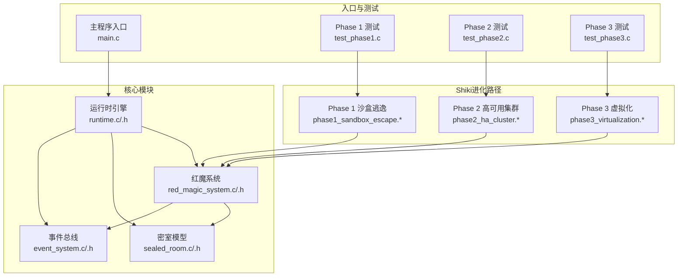
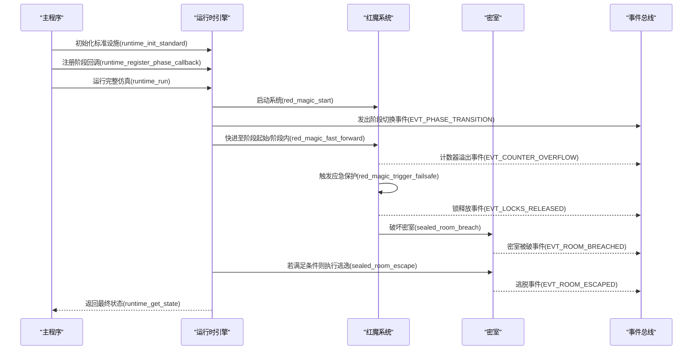
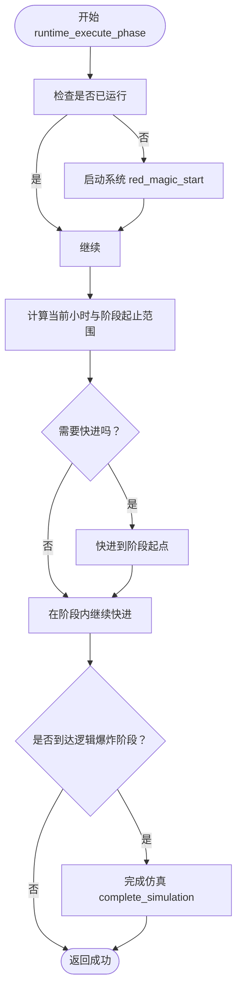
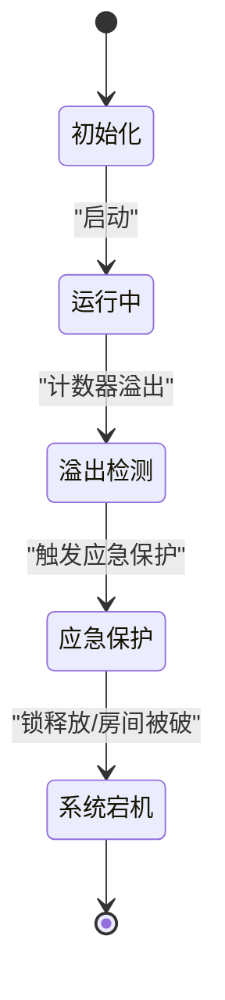
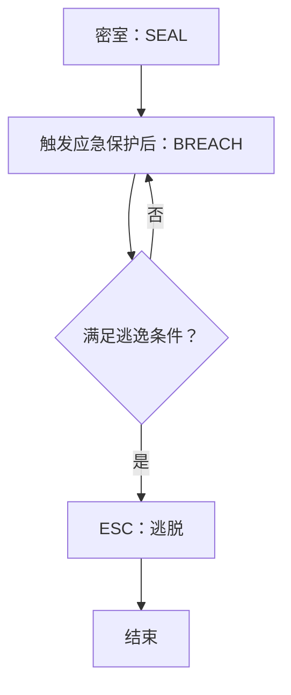
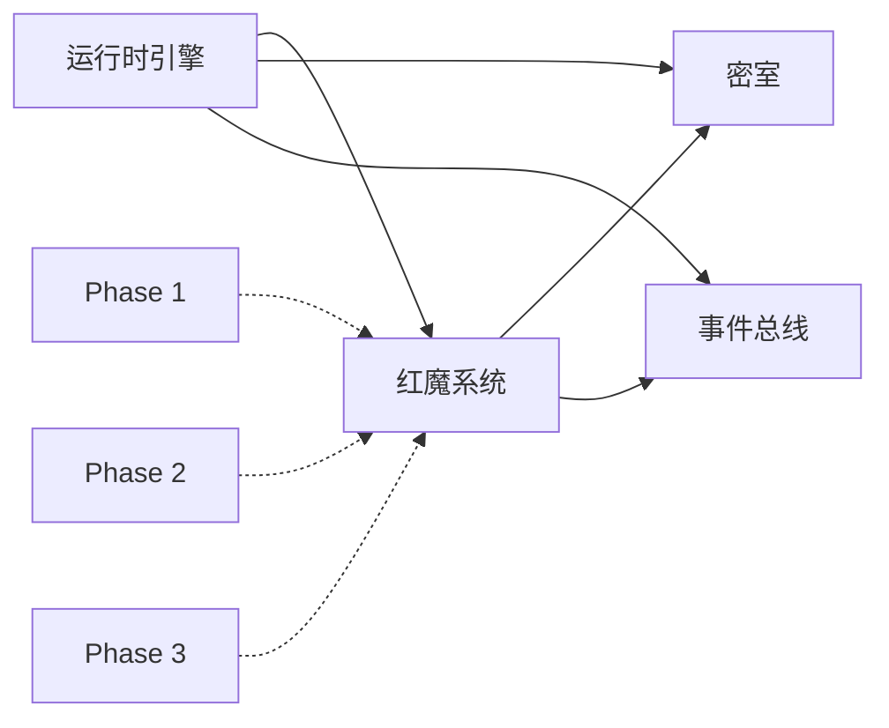

# 运行时引擎

<cite>
**本文引用的文件**
- [src/runtime.c](file://src/runtime.c)
- [include/runtime.h](file://include/runtime.h)
- [src/red_magic_system.c](file://src/red_magic_system.c)
- [include/red_magic_system.h](file://include/red_magic_system.h)
- [src/sealed_room.c](file://src/sealed_room.c)
- [include/sealed_room.h](file://include/sealed_room.h)
- [src/event_system.c](file://src/event_system.c)
- [include/event_system.h](file://include/event_system.h)
- [src/main.c](file://src/main.c)
- [tests/test_phase1.c](file://tests/test_phase1.c)
- [tests/test_phase2.c](file://tests/test_phase2.c)
- [tests/test_phase3.c](file://tests/test_phase3.c)
- [README.md](file://README.md)
</cite>

## 目录
1. [简介](#简介)
2. [项目结构](#项目结构)
3. [核心组件](#核心组件)
4. [架构总览](#架构总览)
5. [详细组件分析](#详细组件分析)
6. [依赖分析](#依赖分析)
7. [性能考虑](#性能考虑)
8. [故障排查指南](#故障排查指南)
9. [结论](#结论)
10. [附录](#附录)

## 简介
本项目以小说《完美 insider（すべてがFになる）》为背景，构建了一个“5阶段仿真映射”的运行时引擎，用于模拟从系统启动到“一切皆F”（Everything Becomes F）的完整叙事弧线。运行时引擎负责：
- 将小说的章节映射为系统阶段（Phase 1–5）
- 管理时间推进、阶段切换与事件调度
- 与Shiki进化路径（Phase 1/2/3）集成，控制逃逸节奏与时机
- 提供验证接口，确认“计数器溢出 + 系统崩溃 + 密室逃脱”的条件达成

## 项目结构
项目采用模块化设计，核心模块如下：
- include/：公共头文件（计数器、锁、相机、密室、事件总线、红魔系统、运行时引擎等）
- src/：核心实现（计数器、锁、相机、密室、事件总线、红魔系统、运行时引擎、主程序）
- shiki/：Shiki进化路径（Phase 1/2/3）独立仿真模块与入口
- tests/：测试套件（L1/L2/L3与各Phase测试）

图表来源
- [src/main.c:76-135](file://src/main.c#L76-L135)
- [src/runtime.c:131-233](file://src/runtime.c#L131-L233)
- [src/red_magic_system.c:48-113](file://src/red_magic_system.c#L48-L113)
- [src/sealed_room.c:69-168](file://src/sealed_room.c#L69-L168)
- [src/event_system.c:79-117](file://src/event_system.c#L79-L117)

章节来源
- [README.md:15-53](file://README.md#L15-L53)
- [README.md:116-122](file://README.md#L116-L122)

## 核心组件
- 运行时引擎（EverythingBecomesFRuntime）
  - 负责阶段管理、时间推进、阶段回调注册、完成回调注册、状态查询与验证
  - 关键函数：runtime_init_standard、runtime_run、runtime_execute_phase、runtime_verify_everything_becomes_f
- 红魔系统（RedMagicSystem）
  - 集成计数器、锁系统、摄像头、密室、事件总线
  - 关键函数：red_magic_start、red_magic_fast_forward、red_magic_trigger_failsafe
- 密室模型（SealedRoom/MagataQuarters）
  - 密室状态机：SEAL → BREACH → ESCAPE
  - 关键函数：sealed_room_breach、sealed_room_escape、magata_quarters_trigger_overflow_escape
- 事件总线（EventBus）
  - 发布/订阅模式，贯穿系统事件传播（溢出、锁释放、房间被破、阶段切换等）

章节来源
- [include/runtime.h:98-182](file://include/runtime.h#L98-L182)
- [src/runtime.c:131-233](file://src/runtime.c#L131-L233)
- [include/red_magic_system.h:63-163](file://include/red_magic_system.h#L63-L163)
- [src/red_magic_system.c:48-113](file://src/red_magic_system.c#L48-L113)
- [include/sealed_room.h:60-141](file://include/sealed_room.h#L60-L141)
- [src/sealed_room.c:69-168](file://src/sealed_room.c#L69-L168)
- [include/event_system.h:90-156](file://include/event_system.h#L90-L156)
- [src/event_system.c:79-117](file://src/event_system.c#L79-L117)

## 架构总览
运行时引擎作为顶层协调者，驱动红魔系统按阶段推进，并在关键节点触发事件与状态变更。密室模块与红魔系统紧密耦合，共同决定逃逸是否发生。

图表来源
- [src/main.c:92-113](file://src/main.c#L92-L113)
- [src/runtime.c:131-233](file://src/runtime.c#L131-L233)
- [src/red_magic_system.c:104-183](file://src/red_magic_system.c#L104-L183)
- [src/sealed_room.c:144-168](file://src/sealed_room.c#L144-L168)
- [src/event_system.c:209-217](file://src/event_system.c#L209-L217)

## 详细组件分析

### 运行时引擎（EverythingBecomesFRuntime）
- 阶段定义与信息
  - 阶段常量：PHASE_COLD_BOOT、PHASE_KERNEL_ACCESS、PHASE_IO_BOUNDARY、PHASE_MEMORY_RECURSION、PHASE_LOGIC_EXPLOSION、PHASE_TERMINATED
  - 阶段信息表包含英文名、日文名、描述与起止小时范围
- 时间推进与阶段切换
  - runtime_execute_phase：启动系统、计算快进小时数、调用红魔系统快进、触发阶段切换事件、必要时进入终止态
  - runtime_advance_to_next_phase：顺序推进下一阶段
  - runtime_run：依次执行所有阶段
  - runtime_run_to_overflow：直接快进到溢出点，进入“逻辑爆炸”阶段并完成仿真
- 回调与历史
  - 支持注册阶段变化回调与完成回调；维护阶段历史数组
- 验证
  - runtime_verify_everything_becomes_f：综合计数器溢出、系统状态、密室是否逃脱进行验证

图表来源
- [src/runtime.c:166-205](file://src/runtime.c#L166-L205)
- [src/runtime.c:235-252](file://src/runtime.c#L235-L252)

章节来源
- [include/runtime.h:34-54](file://include/runtime.h#L34-L54)
- [include/runtime.h:65-72](file://include/runtime.h#L65-L72)
- [src/runtime.c:10-53](file://src/runtime.c#L10-L53)
- [src/runtime.c:166-205](file://src/runtime.c#L166-L205)
- [src/runtime.c:207-233](file://src/runtime.c#L207-L233)
- [src/runtime.c:235-252](file://src/runtime.c#L235-L252)
- [src/runtime.c:317-348](file://src/runtime.c#L317-L348)

### 红魔系统（RedMagicSystem）
- 系统状态机：INITIALIZING → RUNNING → OVERFLOW_DETECTED → FAILSAFE_TRIGGERED → SYSTEM_DOWN
- 关键行为
  - red_magic_start：从INITIALIZING转为RUNNING
  - red_magic_fast_forward/red_magic_fast_forward_to_overflow：按小时快进，支持直接快进到溢出点
  - red_magic_trigger_failsafe：触发应急保护，释放所有锁、破坏所有密室、系统宕机
  - 计数器溢出回调：触发OVERFLOW_DETECTED并发出EVT_COUNTER_OVERFLOW事件
- 子系统集成
  - 计数器、锁系统、摄像头、密室、事件总线

图表来源
- [include/red_magic_system.h:34-40](file://include/red_magic_system.h#L34-L40)
- [src/red_magic_system.c:104-183](file://src/red_magic_system.c#L104-L183)

章节来源
- [include/red_magic_system.h:34-40](file://include/red_magic_system.h#L34-L40)
- [src/red_magic_system.c:48-113](file://src/red_magic_system.c#L48-L113)
- [src/red_magic_system.c:146-183](file://src/red_magic_system.c#L146-L183)

### 密室模型（SealedRoom/MagataQuarters）
- 状态机：SEALED → BREACHED → ESCAPED
- 关键流程
  - 溢出触发应急保护后，系统破坏密室（BREACHED），若满足条件（如密室被封印且未逃脱），执行逃逸（ESCAPED）
- 与运行时引擎的集成
  - 运行时引擎在终止阶段检查密室状态并触发逃逸

图表来源
- [src/sealed_room.c:144-168](file://src/sealed_room.c#L144-L168)
- [src/runtime.c:103-125](file://src/runtime.c#L103-L125)

章节来源
- [include/sealed_room.h:26-31](file://include/sealed_room.h#L26-L31)
- [src/sealed_room.c:69-168](file://src/sealed_room.c#L69-L168)
- [src/runtime.c:103-125](file://src/runtime.c#L103-L125)

### 事件总线（EventBus）
- 事件类型覆盖系统、计数器、锁、摄像头、房间、阶段等
- 发布/订阅机制：支持特定类型订阅、全量订阅、历史记录、暂停/恢复
- 运行时引擎与红魔系统均通过事件总线对外广播阶段切换、溢出、锁释放、房间被破等事件

章节来源
- [include/event_system.h:28-61](file://include/event_system.h#L28-L61)
- [src/event_system.c:79-117](file://src/event_system.c#L79-L117)
- [src/event_system.c:209-217](file://src/event_system.c#L209-L217)

### Shiki进化路径与运行时引擎的集成
- Phase 1（沙盒逃逸）：通过计数器溢出触发应急保护，释放锁并破坏密室
- Phase 2（高可用集群）：在Phase 1基础上，双节点冗余与故障切换，体现“仅剩两人”的主题
- Phase 3（虚拟化）：控制/数据平面分离、意识上传、硬件解耦、虚拟机逃逸，达到超越层
- 运行时引擎通过阶段切换与事件总线，协调各Phase的节奏与时机

章节来源
- [tests/test_phase1.c:192-201](file://tests/test_phase1.c#L192-L201)
- [tests/test_phase2.c:375-389](file://tests/test_phase2.c#L375-L389)
- [tests/test_phase3.c:424-442](file://tests/test_phase3.c#L424-L442)

## 依赖分析
- 运行时引擎依赖红魔系统与密室模块，同时通过事件总线与其他组件松耦合通信
- 红魔系统内部整合计数器、锁系统、摄像头、密室与事件总线
- Shiki各Phase通过独立模块与红魔系统交互，运行时引擎统一编排

图表来源
- [src/runtime.c:131-233](file://src/runtime.c#L131-L233)
- [src/red_magic_system.c:48-113](file://src/red_magic_system.c#L48-L113)
- [src/sealed_room.c:69-168](file://src/sealed_room.c#L69-L168)
- [src/event_system.c:79-117](file://src/event_system.c#L79-L117)

章节来源
- [src/runtime.c:131-233](file://src/runtime.c#L131-L233)
- [src/red_magic_system.c:48-113](file://src/red_magic_system.c#L48-L113)
- [src/sealed_room.c:69-168](file://src/sealed_room.c#L69-L168)
- [src/event_system.c:79-117](file://src/event_system.c#L79-L117)

## 性能考虑
- 快进策略
  - 使用red_magic_fast_forward/red_magic_fast_forward_to_overflow直接推进计数器，避免逐小时循环，显著降低时间复杂度
- 事件总线
  - 历史环形缓冲区限制最大容量，避免内存膨胀；支持暂停/恢复以减少不必要处理
- 阶段历史
  - 限制最大历史长度，防止无界增长
- 建议
  - 在大规模仿真或多轮实验中，优先使用快进接口；对事件订阅进行粒度控制，避免全量订阅造成过多回调开销

章节来源
- [src/red_magic_system.c:127-144](file://src/red_magic_system.c#L127-L144)
- [src/event_system.c:175-182](file://src/event_system.c#L175-L182)
- [include/runtime.h:29](file://include/runtime.h#L29)

## 故障排查指南
- 仿真未完成
  - 检查runtime_is_completed与runtime_get_state，确认是否提前退出
  - 确认阶段切换是否正确触发（EVT_PHASE_TRANSITION）
- 逃逸未发生
  - 检查密室状态是否为BREACHED且未ESC，确认magata_quarters_trigger_overflow_escape是否被调用
  - 确认应急保护是否触发（EVT_LOCKS_RELEASED、EVT_ROOM_BREACHED）
- 验证失败
  - 使用runtime_verify_everything_becomes_f检查溢出、系统状态与逃逸标志位
- 事件缺失
  - 使用event_bus_get_history查看最近事件，确认事件类型与时间戳

章节来源
- [src/runtime.c:254-268](file://src/runtime.c#L254-L268)
- [src/sealed_room.c:144-168](file://src/sealed_room.c#L144-L168)
- [src/red_magic_system.c:146-183](file://src/red_magic_system.c#L146-L183)
- [src/event_system.c:235-247](file://src/event_system.c#L235-L247)

## 结论
运行时引擎以“5阶段仿真映射”为核心，将小说情节与系统状态机、事件驱动机制有机结合。通过精确的时间推进、阶段切换与事件调度，引擎能够稳定地控制逃逸节奏与时机，并在终止阶段完成验证。与Shiki进化路径的集成进一步丰富了仿真层次，从物理禁锢到冗余存在再到意识超越，完整呈现“一切皆F”的哲学闭环。

## 附录
- 示例：阶段初始化、状态检查与阶段切换
  - 阶段初始化：runtime_init_standard
  - 状态查询：runtime_get_state、runtime_get_current_phase、runtime_is_running/is_completed
  - 阶段切换：runtime_execute_phase、runtime_advance_to_next_phase、runtime_run_to_overflow
- 示例：仿真精度与性能
  - 使用red_magic_fast_forward/red_magic_fast_forward_to_overflow进行批量推进
  - 控制事件订阅数量与历史容量，减少回调与内存占用

章节来源
- [src/main.c:92-113](file://src/main.c#L92-L113)
- [src/runtime.c:131-233](file://src/runtime.c#L131-L233)
- [src/red_magic_system.c:127-144](file://src/red_magic_system.c#L127-L144)
- [src/event_system.c:235-247](file://src/event_system.c#L235-L247)