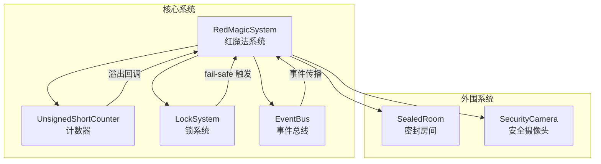
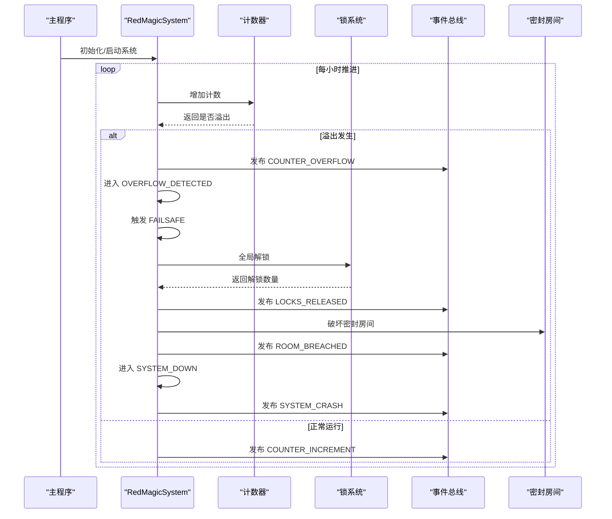
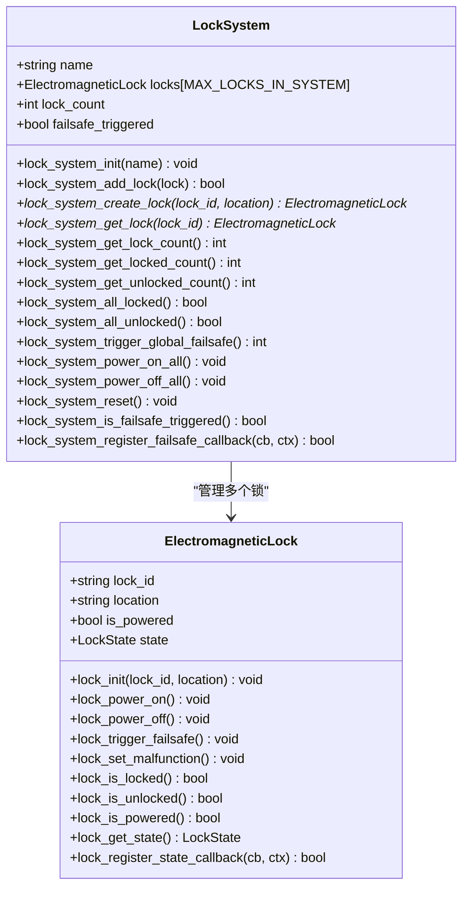
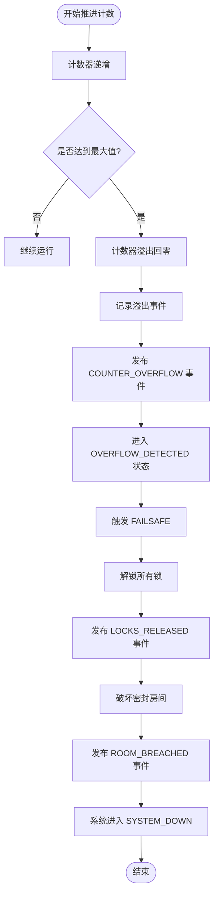
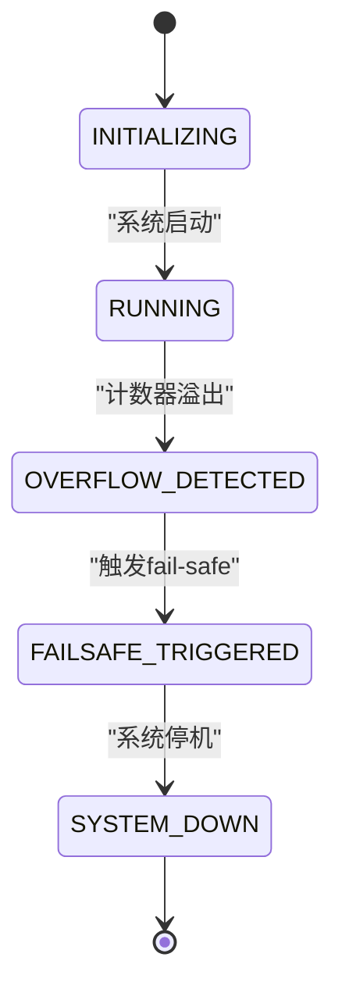
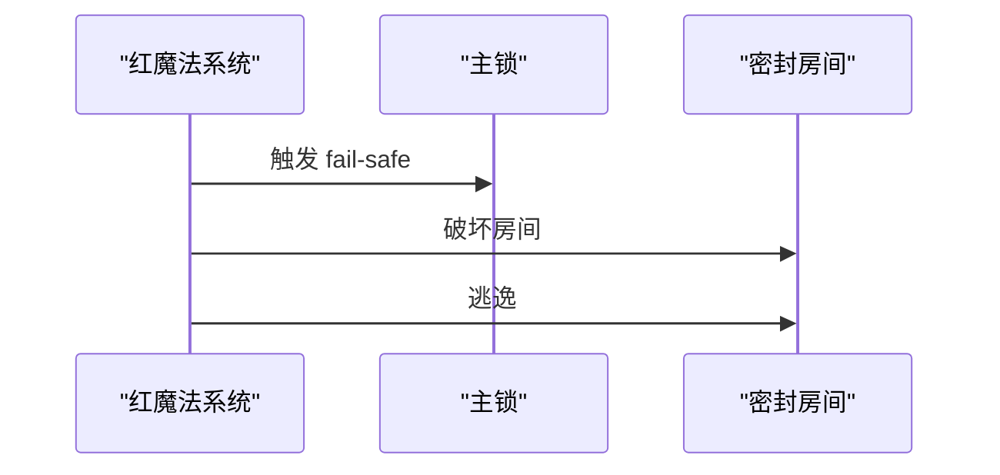
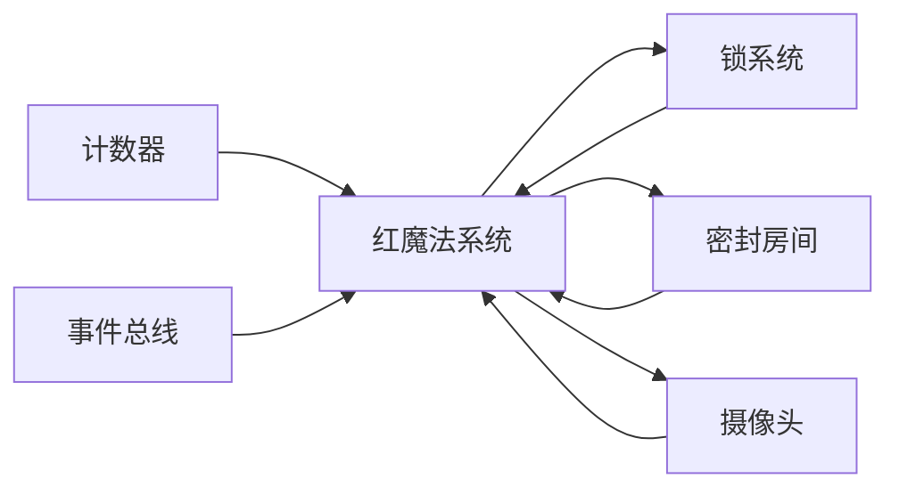

# 锁系统

<cite>
**本文引用的文件**
- [include/counter.h](file://include/counter.h)
- [src/counter.c](file://src/counter.c)
- [include/electromagnetic_lock.h](file://include/electromagnetic_lock.h)
- [src/electromagnetic_lock.c](file://src/electromagnetic_lock.c)
- [include/red_magic_system.h](file://include/red_magic_system.h)
- [src/red_magic_system.c](file://src/red_magic_system.c)
- [include/event_system.h](file://include/event_system.h)
- [src/event_system.c](file://src/event_system.c)
- [include/sealed_room.h](file://include/sealed_room.h)
- [src/sealed_room.c](file://src/sealed_room.c)
- [include/security_camera.h](file://include/security_camera.h)
- [src/security_camera.c](file://src/security_camera.c)
- [src/main.c](file://src/main.c)
</cite>

## 目录
1. [引言](#引言)
2. [项目结构](#项目结构)
3. [核心组件](#核心组件)
4. [架构总览](#架构总览)
5. [详细组件分析](#详细组件分析)
6. [依赖关系分析](#依赖关系分析)
7. [性能考量](#性能考量)
8. [故障排查指南](#故障排查指南)
9. [结论](#结论)
10. [附录](#附录)

## 引言
本文件面向“锁系统”的安全架构与实现，围绕以下目标展开：
- 深入解释电磁锁fail-safe（故障安全）设计的安全原理与实现机制：默认锁定状态、断电或触发时解锁、系统溢出触发全局安全关闭。
- 系统状态管理、权限控制与访问验证机制。
- 计数器溢出事件如何驱动fail-safe模式，以及在红魔法系统中的角色定位。
- 提供具体代码示例路径，展示锁的初始化、状态查询、权限验证与安全关闭的实现方式。
- 解释系统的可靠性保证与故障恢复机制。

## 项目结构
该项目以功能域划分模块，核心围绕“计数器”“锁系统”“事件总线”“密封房间”“摄像头”等子系统协同工作，形成完整的安全控制闭环。

图表来源
- [include/red_magic_system.h:66-88](file://include/red_magic_system.h#L66-L88)
- [include/counter.h:36-43](file://include/counter.h#L36-L43)
- [include/electromagnetic_lock.h:83-91](file://include/electromagnetic_lock.h#L83-L91)
- [include/event_system.h:93-108](file://include/event_system.h#L93-L108)
- [include/sealed_room.h:63-76](file://include/sealed_room.h#L63-L76)
- [include/security_camera.h:51-61](file://include/security_camera.h#L51-L61)

章节来源
- [src/main.c:76-135](file://src/main.c#L76-L135)
- [include/red_magic_system.h:16-166](file://include/red_magic_system.h#L16-L166)

## 核心组件
- 计数器（Counter）：模拟无符号整型计数，小时步进，达到最大值后溢出回零，触发fail-safe。
- 电磁锁（Electromagnetic Lock）：fail-safe设计，默认锁定；断电或触发fail-safe时解锁。
- 锁系统（LockSystem）：统一管理多把锁，支持全局fail-safe触发与状态统计。
- 红魔法系统（RedMagicSystem）：系统控制器，协调计数器、锁系统、事件总线、密封房间与摄像头。
- 事件总线（EventBus）：发布订阅模型，贯穿系统各组件，用于状态变更与安全事件传播。
- 密封房间（SealedRoom）：包含门与锁，记录被破坏与逃逸时间点。
- 安全摄像头（SecurityCamera）：记录视频片段，存在时钟同步漏洞导致监控盲点。

章节来源
- [include/counter.h:29-43](file://include/counter.h#L29-L43)
- [include/electromagnetic_lock.h:40-55](file://include/electromagnetic_lock.h#L40-L55)
- [include/electromagnetic_lock.h:83-91](file://include/electromagnetic_lock.h#L83-L91)
- [include/red_magic_system.h:66-88](file://include/red_magic_system.h#L66-L88)
- [include/event_system.h#L69-L108:69-108](file://include/event_system.h#L69-L108)
- [include/sealed_room.h:63-76](file://include/sealed_room.h#L63-L76)
- [include/security_camera.h:51-61](file://include/security_camera.h#L51-L61)

## 架构总览
红魔法系统通过计数器驱动时间推进，当计数器溢出时，系统进入“溢出检测”状态，并立即触发fail-safe，释放所有锁并破坏密封房间，随后系统进入“系统停机”。事件总线在整个过程中负责事件传播与日志记录。

图表来源
- [src/red_magic_system.c:115-144](file://src/red_magic_system.c#L115-L144)
- [src/red_magic_system.c:146-183](file://src/red_magic_system.c#L146-L183)
- [src/event_system.c:171-204](file://src/event_system.c#L171-L204)
- [src/sealed_room.c:144-154](file://src/sealed_room.c#L144-L154)

章节来源
- [src/red_magic_system.c:48-90](file://src/red_magic_system.c#L48-L90)
- [src/red_magic_system.c:115-183](file://src/red_magic_system.c#L115-L183)
- [include/red_magic_system.h:34-40](file://include/red_magic_system.h#L34-L40)

## 详细组件分析

### 电磁锁 fail-safe 设计与实现
- 默认状态：上电即锁定，门处于密封状态。
- fail-safe 触发：断电或显式触发fail-safe时，锁变为解锁状态。
- 全局fail-safe：锁系统遍历所有锁，逐个触发fail-safe，同时通知注册的回调。

图表来源
- [include/electromagnetic_lock.h:47-55](file://include/electromagnetic_lock.h#L47-L55)
- [include/electromagnetic_lock.h:83-91](file://include/electromagnetic_lock.h#L83-L91)
- [src/electromagnetic_lock.c:22-111](file://src/electromagnetic_lock.c#L22-L111)
- [src/electromagnetic_lock.c:126-278](file://src/electromagnetic_lock.c#L126-L278)

章节来源
- [include/electromagnetic_lock.h:22-27](file://include/electromagnetic_lock.h#L22-L27)
- [src/electromagnetic_lock.c:39-84](file://src/electromagnetic_lock.c#L39-L84)
- [src/electromagnetic_lock.c:223-238](file://src/electromagnetic_lock.c#L223-L238)

### 计数器与溢出驱动的 fail-safe 流程
- 计数器以小时为单位递增，达到最大值后溢出回零。
- 溢出时触发回调，红魔法系统记录事件、发布溢出事件、进入“溢出检测”，并立即触发fail-safe。

图表来源
- [src/counter.c:44-60](file://src/counter.c#L44-L60)
- [src/red_magic_system.c:74-90](file://src/red_magic_system.c#L74-L90)
- [src/red_magic_system.c:146-183](file://src/red_magic_system.c#L146-L183)

章节来源
- [include/counter.h:19-21](file://include/counter.h#L19-L21)
- [src/counter.c:44-60](file://src/counter.c#L44-L60)
- [src/red_magic_system.c:74-90](file://src/red_magic_system.c#L74-L90)

### 红魔法系统状态管理与事件传播
- 系统状态：INITIALIZING → RUNNING → OVERFLOW_DETECTED → FAILSAFE_TRIGGERED → SYSTEM_DOWN。
- 状态切换通过内部转换函数完成，并广播状态变更回调。
- 事件总线负责记录历史事件、订阅/退订处理程序、暂停/恢复事件分发。

图表来源
- [include/red_magic_system.h:34-40](file://include/red_magic_system.h#L34-L40)
- [src/red_magic_system.c:32-42](file://src/red_magic_system.c#L32-L42)

章节来源
- [include/red_magic_system.h:34-40](file://include/red_magic_system.h#L34-L40)
- [src/red_magic_system.c:32-42](file://src/red_magic_system.c#L32-L42)
- [src/event_system.c:171-204](file://src/event_system.c#L171-L204)

### 密封房间与逃逸流程
- 密封房间初始为密封状态；被破坏后可允许逃逸。
- 当fail-safe触发时，系统会破坏所有已密封的房间。
- 可通过专用接口触发溢出逃逸序列，逐步执行：触发锁fail-safe、开门、破坏房间、逃逸。

图表来源
- [src/sealed_room.c:230-244](file://src/sealed_room.c#L230-L244)
- [src/red_magic_system.c:167-175](file://src/red_magic_system.c#L167-L175)

章节来源
- [include/sealed_room.h:25-31](file://include/sealed_room.h#L25-L31)
- [src/sealed_room.c:144-168](file://src/sealed_room.c#L144-L168)
- [src/sealed_room.c:230-244](file://src/sealed_room.c#L230-L244)

### 权限控制与访问验证机制
- 本系统未实现基于用户身份的权限控制与访问验证。安全策略完全由fail-safe与计数器溢出驱动。
- 若需扩展权限控制，可在锁系统与事件总线上增加访问令牌校验与审计日志。

章节来源
- [include/electromagnetic_lock.h:22-27](file://include/electromagnetic_lock.h#L22-L27)
- [src/electromagnetic_lock.c:39-84](file://src/electromagnetic_lock.c#L39-L84)

### 代码示例路径（不直接展示代码内容）
- 锁初始化
  - [lock_init](file://include/electromagnetic_lock.h#L58)
  - [src/electromagnetic_lock.c:22-37](file://src/electromagnetic_lock.c#L22-L37)
- 状态查询
  - [lock_is_locked:86-92](file://include/electromagnetic_lock.h#L86-L92)
  - [lock_system_get_locked_count:110-112](file://include/electromagnetic_lock.h#L110-L112)
  - [src/electromagnetic_lock.c:86-100](file://src/electromagnetic_lock.c#L86-L100)
- 权限验证（当前未实现）
  - 可在事件总线与锁系统之间扩展访问控制与审计
- 安全关闭（fail-safe）
  - [lock_trigger_failsafe:64-65](file://include/electromagnetic_lock.h#L64-L65)
  - [lock_system_trigger_global_failsafe:118-119](file://include/electromagnetic_lock.h#L118-L119)
  - [src/electromagnetic_lock.c:63-73](file://src/electromagnetic_lock.c#L63-L73)
  - [src/electromagnetic_lock.c:223-238](file://src/electromagnetic_lock.c#L223-L238)
- 计数器溢出与 fail-safe 触发
  - [counter_increment:51-52](file://include/counter.h#L51-L52)
  - [on_counter_overflow 回调:74-90](file://src/red_magic_system.c#L74-L90)
  - [red_magic_trigger_failsafe:146-183](file://src/red_magic_system.c#L146-L183)

章节来源
- [include/electromagnetic_lock.h:58-119](file://include/electromagnetic_lock.h#L58-L119)
- [src/electromagnetic_lock.c:22-111](file://src/electromagnetic_lock.c#L22-L111)
- [src/electromagnetic_lock.c:223-238](file://src/electromagnetic_lock.c#L223-L238)
- [include/counter.h:51-52](file://include/counter.h#L51-L52)
- [src/red_magic_system.c:74-90](file://src/red_magic_system.c#L74-L90)
- [src/red_magic_system.c:146-183](file://src/red_magic_system.c#L146-L183)

## 依赖关系分析
- 红魔法系统依赖计数器、锁系统、事件总线、密封房间与摄像头。
- 计数器通过回调驱动红魔法系统状态机；锁系统作为fail-safe执行单元；事件总线贯穿各组件进行解耦通信。
- 密封房间与摄像头为安全边界补充，记录破坏与监控盲点。

图表来源
- [include/red_magic_system.h:66-88](file://include/red_magic_system.h#L66-L88)
- [src/red_magic_system.c:48-90](file://src/red_magic_system.c#L48-L90)

章节来源
- [include/red_magic_system.h:66-88](file://include/red_magic_system.h#L66-L88)
- [src/red_magic_system.c:48-90](file://src/red_magic_system.c#L48-L90)

## 性能考量
- 计数器操作为O(1)，溢出计算采用模运算与快速前进算法，避免循环累加。
- 锁系统全局fail-safe遍历所有锁，复杂度O(n)，n为锁数量上限。
- 事件总线使用环形缓冲区存储历史事件，发布时按订阅者数量线性分发。
- 建议：在高并发场景下，可考虑批量处理事件与锁状态更新，减少上下文切换。

章节来源
- [src/counter.c:81-104](file://src/counter.c#L81-L104)
- [src/electromagnetic_lock.c:223-238](file://src/electromagnetic_lock.c#L223-L238)
- [src/event_system.c:171-204](file://src/event_system.c#L171-L204)

## 故障排查指南
- 现象：系统未进入fail-safe
  - 检查计数器是否正确溢出与回调是否注册
  - 参考：[counter_increment:44-60](file://src/counter.c#L44-L60)、[on_counter_overflow:74-90](file://src/red_magic_system.c#L74-L90)
- 现象：锁未解锁
  - 检查全局fail-safe是否调用与锁状态回调
  - 参考：[lock_system_trigger_global_failsafe:223-238](file://src/electromagnetic_lock.c#L223-L238)
- 现象：事件未记录或丢失
  - 检查事件总线历史容量与暂停状态
  - 参考：[event_bus_publish:171-204](file://src/event_system.c#L171-L204)、[event_bus_clear_history:265-270](file://src/event_system.c#L265-L270)
- 现象：密封房间未被破坏
  - 检查房间状态与破坏接口调用
  - 参考：[sealed_room_breach:144-154](file://src/sealed_room.c#L144-L154)

章节来源
- [src/counter.c:44-60](file://src/counter.c#L44-L60)
- [src/red_magic_system.c:74-90](file://src/red_magic_system.c#L74-L90)
- [src/electromagnetic_lock.c:223-238](file://src/electromagnetic_lock.c#L223-L238)
- [src/event_system.c:171-204](file://src/event_system.c#L171-L204)
- [src/sealed_room.c:144-154](file://src/sealed_room.c#L144-L154)

## 结论
该锁系统以fail-safe为核心安全原则，结合计数器溢出事件驱动的应急流程，确保在极端情况下实现“安全关闭”。通过事件总线与状态机的配合，系统具备清晰的可观测性与可追溯性。若需进一步增强安全性，可在现有基础上引入访问控制、审计日志与更细粒度的权限验证机制。

## 附录
- 系统入口与演示
  - [main:76-135](file://src/main.c#L76-L135)
- 红魔法系统 API
  - [red_magic_init:48-72](file://src/red_magic_system.c#L48-L72)
  - [red_magic_start:104-113](file://src/red_magic_system.c#L104-L113)
  - [red_magic_advance_hour:115-125](file://src/red_magic_system.c#L115-L125)
  - [red_magic_trigger_failsafe:146-183](file://src/red_magic_system.c#L146-L183)
- 事件类型定义
  - [EventType:28-61](file://include/event_system.h#L28-L61)
- 摄像头与监控盲点
  - [clock_vuln_exploit:176-192](file://src/security_camera.c#L176-L192)
  - [clock_vuln_simulate_reinstall:194-212](file://src/security_camera.c#L194-L212)