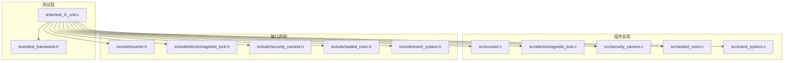
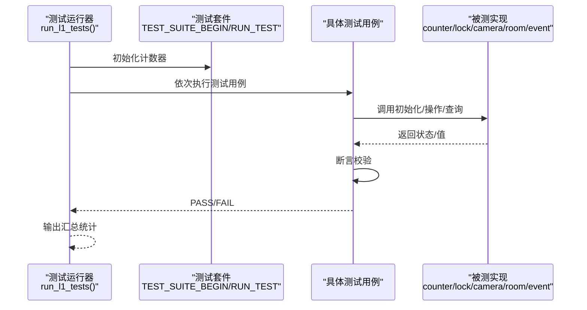
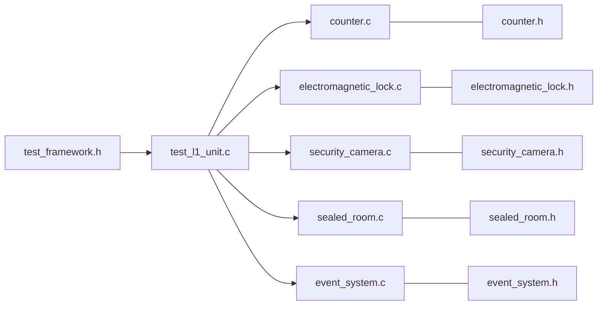

# L1单元测试

<cite>
**本文引用的文件**
- [tests/test_l1_unit.c](file://tests/test_l1_unit.c)
- [tests/test_framework.h](file://tests/test_framework.h)
- [src/counter.c](file://src/counter.c)
- [include/counter.h](file://include/counter.h)
- [src/electromagnetic_lock.c](file://src/electromagnetic_lock.c)
- [include/electromagnetic_lock.h](file://include/electromagnetic_lock.h)
- [src/security_camera.c](file://src/security_camera.c)
- [include/security_camera.h](file://include/security_camera.h)
- [src/sealed_room.c](file://src/sealed_room.c)
- [include/sealed_room.h](file://include/sealed_room.h)
- [src/event_system.c](file://src/event_system.c)
- [include/event_system.h](file://include/event_system.h)
</cite>

## 目录
1. [引言](#引言)
2. [项目结构](#项目结构)
3. [核心组件](#核心组件)
4. [架构总览](#架构总览)
5. [详细组件分析](#详细组件分析)
6. [依赖关系分析](#依赖关系分析)
7. [性能考量](#性能考量)
8. [故障排查指南](#故障排查指南)
9. [结论](#结论)
10. [附录](#附录)

## 引言
本文件面向L1单元测试，聚焦于组件级功能测试与验证策略。通过对计数器、锁系统、摄像头系统、密封房间以及事件系统五个核心模块的测试用例进行逐项解析，阐述每个测试的设计思路、预期行为、断言方法与执行流程，并给出常见失败场景与调试技巧，帮助开发者快速定位问题并提升测试效率。

## 项目结构
仓库采用“头文件在include目录、实现文件在src目录、测试在tests目录”的分层组织方式。L1单元测试集中于tests/test_l1_unit.c，通过轻量级测试框架tests/test_framework.h驱动各组件的独立验证。

图表来源
- [tests/test_l1_unit.c:1-498](file://tests/test_l1_unit.c#L1-L498)
- [tests/test_framework.h:1-149](file://tests/test_framework.h#L1-L149)
- [src/counter.c:1-162](file://src/counter.c#L1-L162)
- [src/electromagnetic_lock.c:1-278](file://src/electromagnetic_lock.c#L1-L278)
- [src/security_camera.c:1-225](file://src/security_camera.c#L1-L225)
- [src/sealed_room.c](file://src/sealed_room.c)
- [src/event_system.c](file://src/event_system.c)
- [include/counter.h:1-99](file://include/counter.h#L1-L99)
- [include/electromagnetic_lock.h:1-137](file://include/electromagnetic_lock.h#L1-L137)
- [include/security_camera.h:1-147](file://include/security_camera.h#L1-L147)
- [include/sealed_room.h:1-141](file://include/sealed_room.h#L1-L141)
- [include/event_system.h:1-157](file://include/event_system.h#L1-L157)

章节来源
- [tests/test_l1_unit.c:1-498](file://tests/test_l1_unit.c#L1-L498)
- [tests/test_framework.h:1-149](file://tests/test_framework.h#L1-L149)

## 核心组件
- 计数器：模拟无符号32位整数计数，支持增量、快进、溢出检测与回调注册；用于触发系统级失效机制。
- 锁系统：fail-safe电磁锁模型，支持上电锁定、断电解锁、全局失效触发与状态回调。
- 摄像头系统：监控录像与盲点管理，支持记录、覆盖（形成盲点）、盲点统计与时钟漂移漏洞模拟。
- 密封房间：Dr. Magata的密室模型，包含门、状态机与逃逸逻辑，受计数器溢出影响。
- 事件系统：发布/订阅事件总线，支持历史记录、暂停/恢复与事件类型名称映射。

章节来源
- [include/counter.h:1-99](file://include/counter.h#L1-L99)
- [include/electromagnetic_lock.h:1-137](file://include/electromagnetic_lock.h#L1-L137)
- [include/security_camera.h:1-147](file://include/security_camera.h#L1-L147)
- [include/sealed_room.h:1-141](file://include/sealed_room.h#L1-L141)
- [include/event_system.h:1-157](file://include/event_system.h#L1-L157)

## 架构总览
L1测试以“测试用例 -> 组件接口 -> 实现函数”为主线，断言覆盖状态查询、边界条件、序列行为与副作用。测试框架提供统一的断言宏与运行统计，确保测试可重复、可诊断。

图表来源
- [tests/test_l1_unit.c:430-497](file://tests/test_l1_unit.c#L430-L497)
- [tests/test_framework.h:22-46](file://tests/test_framework.h#L22-L46)

## 详细组件分析

### 计数器功能测试
设计目标：验证32位计数器的初始化、增量、溢出、快进、状态查询与回调触发等行为。

- 测试要点
  - 默认初始化与指定初始值：断言初始值与溢出计数为零。
  - 十六进制格式输出：断言格式化字符串符合预期。
  - 基础递增与按量递增：断言返回值与计数值。
  - 溢出检测与环绕：断言溢出标志、归零行为与溢出次数。
  - 最大值常量与剩余寿命估算：断言最大值常量与小时/年剩余时间范围。
  - 快进与多溢出：断言O(1)快进算法与溢出次数。
  - 边界判定：断言是否处于零或最大值。

- 预期行为与断言
  - 使用 ASSERT_EQ、ASSERT_TRUE、ASSERT_FALSE、ASSERT_STR_EQ 等断言宏。
  - 对溢出场景，断言溢出计数与最终值；对快进场景，断言溢出次数与最终值。
  - 对寿命估算，断言范围而非精确值，避免平台差异。

- 执行流程
  - 初始化计数器对象。
  - 调用 counter_init 或 counter_init_with_value。
  - 执行增量/快进/溢出操作。
  - 查询状态（如 hours_until_overflow、is_at_max、is_at_zero）。
  - 断言结果。

- 常见失败场景
  - 指针为空：实现中对空指针有保护，但测试需确保传入有效对象。
  - 溢出边界：当从最大值+1开始，应触发一次溢出；从接近最大值开始，需两次增量才溢出。
  - 快进溢出：快进步数为N*(MAX+1)，应产生N次溢出且最终值为0。

- 调试技巧
  - 在溢出前后打印当前值与溢出计数，核对循环节拍。
  - 使用 counter_get_hex 辅助观察十六进制值变化。
  - 对快进场景，先断言溢出次数再断言最终值，避免顺序错误。

章节来源
- [tests/test_l1_unit.c:22-145](file://tests/test_l1_unit.c#L22-L145)
- [src/counter.c:9-162](file://src/counter.c#L9-L162)
- [include/counter.h:19-99](file://include/counter.h#L19-L99)

### 锁系统测试
设计目标：验证单锁与锁系统的初始化、电源控制、失效触发、状态查询与全局失效行为。

- 测试要点
  - 单锁初始化：断言默认上电锁定、状态正确。
  - 断电解锁与上电锁定：断言状态切换与供电状态。
  - 失效触发：断言断电与解锁状态。
  - 锁系统初始化与创建：断言锁数量与默认锁定状态。
  - 全局失效：断言解锁计数、全部解锁与失效标记。

- 预期行为与断言
  - 使用 ASSERT_TRUE/ASSERT_FALSE 验证布尔状态。
  - 使用 ASSERT_EQ 验证锁数量与解锁计数。
  - 使用 lock_system_all_locked/all_unlocked 进行一致性检查。

- 执行流程
  - 初始化锁或锁系统。
  - 执行 power_on/power_off/failsafe。
  - 查询状态与计数。
  - 断言结果。

- 常见失败场景
  - 创建锁超限：超过最大锁数量时应返回失败。
  - 状态回调未触发：确认状态变更时回调通知路径正常。
  - 全局失效未影响所有锁：检查遍历与触发逻辑。

- 调试技巧
  - 在状态变更处添加日志，核对 old_state/new_state。
  - 对全局失效，先断言解锁计数，再断言全部解锁。

章节来源
- [tests/test_l1_unit.c:151-222](file://tests/test_l1_unit.c#L151-L222)
- [src/electromagnetic_lock.c:22-278](file://src/electromagnetic_lock.c#L22-L278)
- [include/electromagnetic_lock.h:22-137](file://include/electromagnetic_lock.h#L22-L137)

### 摄像头系统测试
设计目标：验证摄像头初始化、录像记录、盲点创建、统计与时钟漂移漏洞模拟。

- 测试要点
  - 初始化与激活：断言状态与状态枚举。
  - 录像与盲点：断言分钟索引、小时索引与盲点判定。
  - 盲点统计：断言盲点计数与存在性。
  - 漏洞初始化与利用：断言受影响摄像头数量与漏洞标记。
  - 时钟漂移常量：断言漂移分钟数。

- 预期行为与断言
  - 使用 ASSERT_NOT_NULL/ASSERT_NULL 验证返回指针有效性。
  - 使用 video_segment_is_blind_spot 判定盲点。
  - clock_vuln_exploit 返回受影响摄像头数量，断言该数量与漏洞标记。

- 执行流程
  - 初始化摄像头。
  - 录制分钟与创建盲点。
  - 统计盲点数量。
  - 初始化漏洞并利用，断言结果。

- 常见失败场景
  - 录像数组越界：超过最大段数时应返回空指针。
  - 盲点未触发回调：确认覆盖与通知路径。
  - 漏洞未影响所有活动摄像头：检查激活状态过滤。

- 调试技巧
  - 在 create_blind_spot 后立即断言盲点计数。
  - 对 clock_vuln_exploit，先断言返回值，再断言每个受影响摄像头的状态。

章节来源
- [tests/test_l1_unit.c:228-287](file://tests/test_l1_unit.c#L228-L287)
- [src/security_camera.c:21-225](file://src/security_camera.c#L21-L225)
- [include/security_camera.h:23-147](file://include/security_camera.h#L23-L147)

### 密封房间测试
设计目标：验证密室初始化、门管理、破坏与逃逸逻辑，以及Magata房间的特殊属性与溢出逃逸。

- 测试要点
  - 密室初始化：断言密封状态、默认占用者存在。
  - 添加门：断言门数量与主锁关联。
  - 破坏与逃逸：断言破坏时间、状态转换与占用者离开。
  - Magata房间：断言网络访问、编程能力与主锁状态。
  - 溢出逃逸：断言触发成功、房间状态变为已逃逸、主锁解锁。

- 预期行为与断言
  - sealed_room_escape 返回布尔值，先破坏再逃逸。
  - 溢出逃逸调用后，断言房间状态与锁状态。

- 执行流程
  - 初始化密室与主锁。
  - 添加门并关联主锁。
  - 触发破坏与逃逸。
  - 对Magata房间进行属性断言与溢出逃逸断言。

- 常见失败场景
  - 逃逸前置条件：必须先破坏，否则应返回失败。
  - 主锁状态：逃逸后应解锁，断言锁状态与房间状态一致。

- 调试技巧
  - 分步断言：破坏前断言未破坏，破坏后断言破坏时间与状态。
  - 溢出逃逸：先断言触发返回值，再断言房间与锁状态。

章节来源
- [tests/test_l1_unit.c:293-352](file://tests/test_l1_unit.c#L293-L352)
- [src/sealed_room.c](file://src/sealed_room.c)
- [include/sealed_room.h:25-141](file://include/sealed_room.h#L25-L141)

### 事件系统测试
设计目标：验证事件总线初始化、订阅/取消订阅、事件发射、历史记录、暂停/恢复与事件类型名称映射。

- 测试要点
  - 总线初始化：断言事件计数为零。
  - 订阅与发射：断言处理器被调用一次。
  - 全部订阅：断言多个事件均被处理。
  - 历史记录：断言事件计数与存在性查询。
  - 暂停/恢复：断言暂停期间不触发，恢复后触发。
  - 事件类型名称：断言名称映射正确。

- 预期行为与断言
  - 使用静态计数器验证回调次数。
  - 使用 event_bus_has_event 检查事件存在性。
  - 使用 event_bus_pause/resume 控制事件投递。

- 执行流程
  - 初始化事件总线。
  - 订阅特定事件或全部事件。
  - 发射事件并断言回调次数。
  - 操作暂停/恢复并再次发射事件。
  - 查询历史与事件类型名称。

- 常见失败场景
  - 订阅上限：超过最大处理器数时应拒绝新订阅。
  - 暂停状态：暂停期间不应调用处理器。
  - 历史容量：超过最大历史长度时应循环覆盖。

- 调试技巧
  - 在处理器中增加日志，核对事件类型与计数。
  - 对暂停/恢复，分别断言暂停期间与恢复后的回调次数。

章节来源
- [tests/test_l1_unit.c:358-424](file://tests/test_l1_unit.c#L358-L424)
- [src/event_system.c](file://src/event_system.c)
- [include/event_system.h:25-157](file://include/event_system.h#L25-L157)

## 依赖关系分析
- 测试到实现的依赖：每个测试用例直接依赖对应组件的头文件与实现文件。
- 组件间耦合：计数器溢出可能通过事件系统影响锁系统与摄像头系统；密封房间受计数器与锁系统影响。
- 外部依赖：测试框架为纯头文件实现，无外部依赖。

图表来源
- [tests/test_framework.h:1-149](file://tests/test_framework.h#L1-L149)
- [tests/test_l1_unit.c:12-16](file://tests/test_l1_unit.c#L12-L16)
- [src/counter.c:5-8](file://src/counter.c#L5-L8)
- [src/electromagnetic_lock.c:5-7](file://src/electromagnetic_lock.c#L5-L7)
- [src/security_camera.c:5-7](file://src/security_camera.c#L5-L7)
- [src/sealed_room.c](file://src/sealed_room.c)
- [src/event_system.c](file://src/event_system.c)
- [include/counter.h:15-18](file://include/counter.h#L15-L18)
- [include/electromagnetic_lock.h:13-14](file://include/electromagnetic_lock.h#L13-L14)
- [include/security_camera.h:13-14](file://include/security_camera.h#L13-L14)
- [include/sealed_room.h:14-16](file://include/sealed_room.h#L14-L16)
- [include/event_system.h:15-17](file://include/event_system.h#L15-L17)

## 性能考量
- 计数器快进：使用除法与取模计算溢出次数，时间复杂度O(1)，避免循环累加。
- 摄像头盲点统计：遍历录制数组，时间复杂度O(N)，注意N上限与缓存局部性。
- 锁系统全局失效：遍历所有锁，时间复杂度O(K)，K为锁数量上限。
- 事件系统历史：环形缓冲区，插入与查询均为O(1)。

## 故障排查指南
- 断言失败定位
  - ASSERT_TRUE/FALSE：检查布尔表达式与边界条件。
  - ASSERT_EQ/ASSERT_STR_EQ：核对类型与格式，注意字符串比较与缓冲大小。
  - ASSERT_NULL/ASSERT_NOT_NULL：确认返回指针合法性与数组越界。
- 常见失败场景
  - 指针为空：确保传入有效对象与非空指针。
  - 溢出边界：从最大值+1开始应触发一次溢出；从接近最大值开始需两次增量。
  - 快进溢出：快进步数为N*(MAX+1)，应产生N次溢出且最终值为0。
  - 锁系统超限：超过最大锁数量时应返回失败。
  - 摄像头越界：超过最大段数时返回空指针。
  - 事件订阅上限：超过最大处理器数时拒绝订阅。
- 调试建议
  - 使用最小复现用例，逐步缩小范围。
  - 在关键路径添加日志，核对状态与计数。
  - 对边界条件单独编写用例，覆盖零值、最大值、越界等。

章节来源
- [tests/test_framework.h:48-136](file://tests/test_framework.h#L48-L136)
- [tests/test_l1_unit.c:22-145](file://tests/test_l1_unit.c#L22-L145)
- [tests/test_l1_unit.c:151-222](file://tests/test_l1_unit.c#L151-L222)
- [tests/test_l1_unit.c:228-287](file://tests/test_l1_unit.c#L228-L287)
- [tests/test_l1_unit.c:293-352](file://tests/test_l1_unit.c#L293-L352)
- [tests/test_l1_unit.c:358-424](file://tests/test_l1_unit.c#L358-L424)

## 结论
L1单元测试通过细粒度的组件验证，确保计数器、锁系统、摄像头系统、密封房间与事件系统在边界条件、序列行为与副作用方面的正确性。测试框架简洁可靠，断言覆盖全面，配合清晰的执行流程与调试技巧，能够高效发现并定位问题，为后续集成测试与系统测试奠定坚实基础。

## 附录
- 测试执行流程
  - 初始化测试套件计数器。
  - 依次运行各模块测试用例，输出每条用例的PASS/FAIL。
  - 输出总运行数、通过数与失败数。
- 断言使用示例
  - 数值断言：使用 ASSERT_EQ/ASSERT_NEQ/ASSERT_GT/ASSERT_LT 等。
  - 布尔断言：使用 ASSERT_TRUE/ASSERT_FALSE。
  - 字符串断言：使用 ASSERT_STR_EQ。
  - 指针断言：使用 ASSERT_NULL/ASSERT_NOT_NULL。
- 测试结果解读
  - 若某用例FAIL，根据断言失败位置与行号定位问题；结合日志与最小复现用例进一步分析。
  - 对边界与溢出场景，优先检查实现中的算术与掩码逻辑。