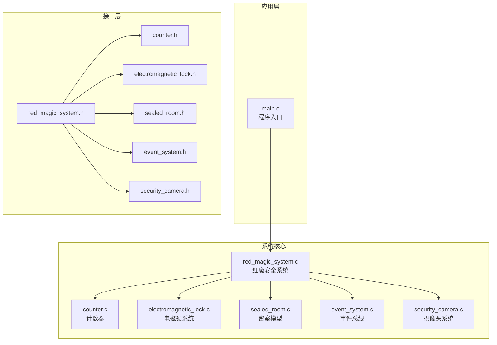
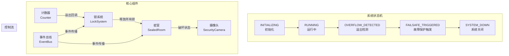
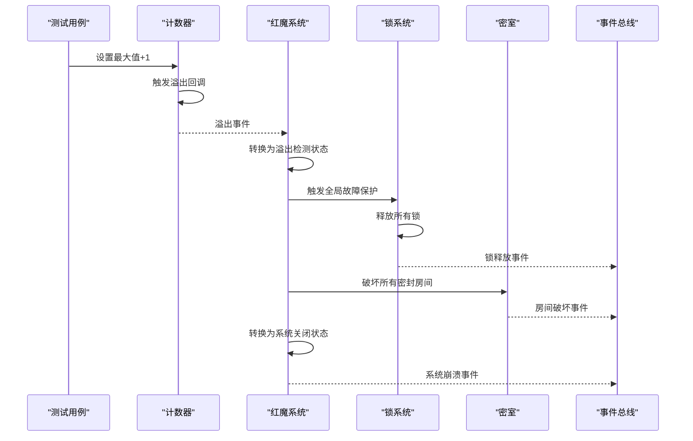
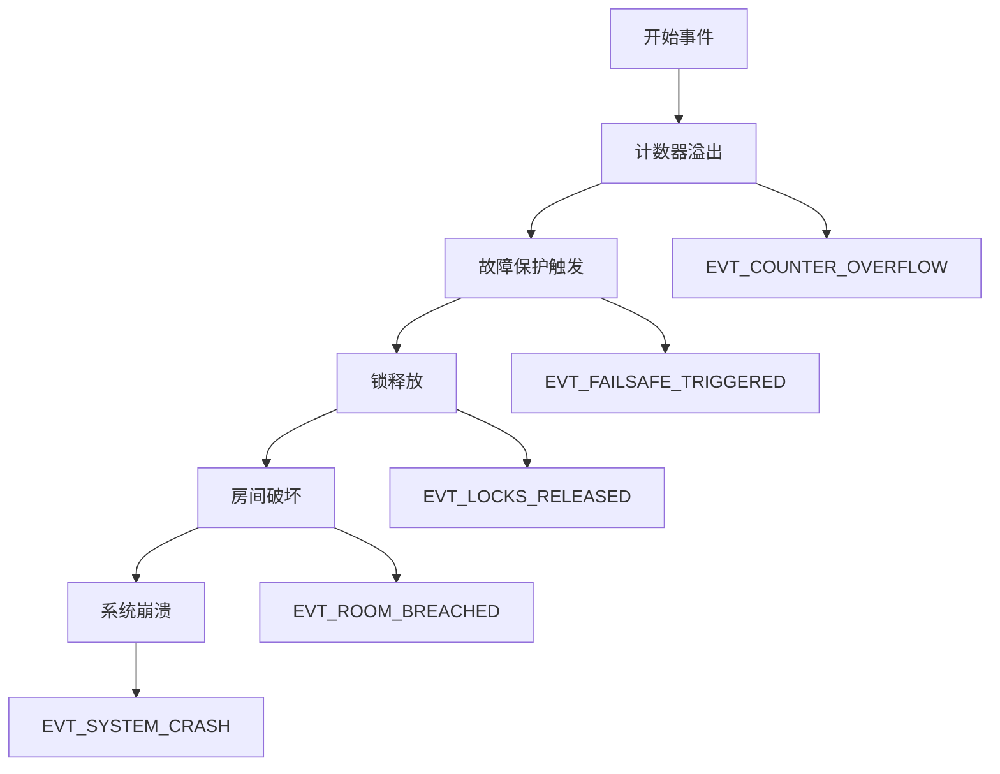
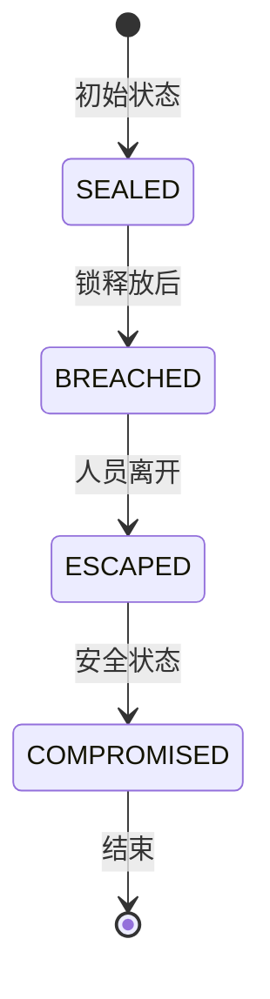
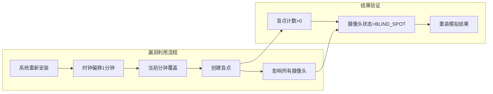
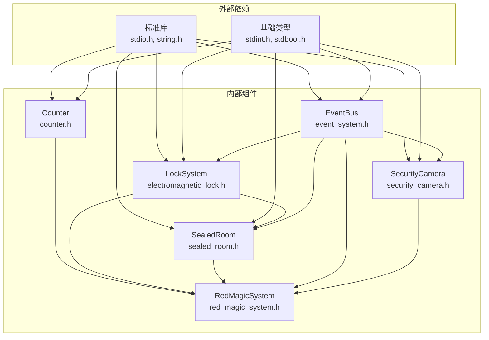
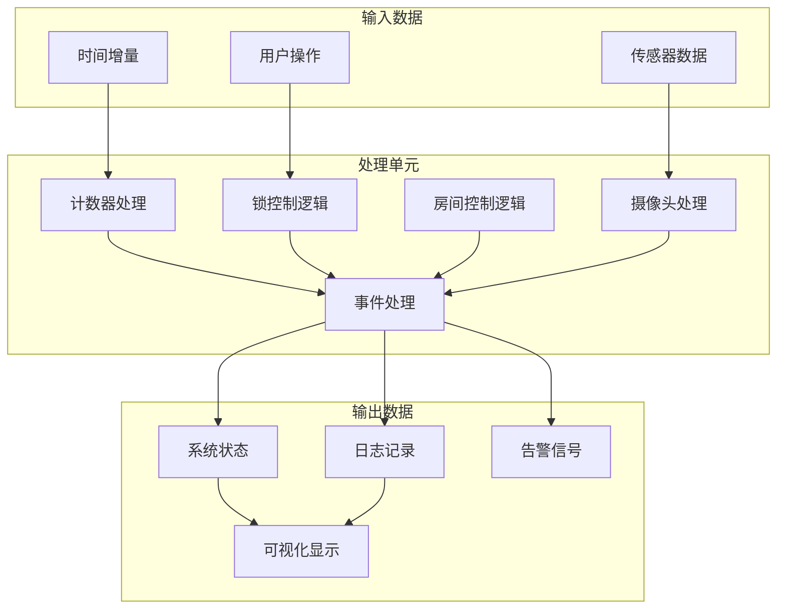

# L2集成测试

<cite>
**本文档引用的文件**
- [README.md](file://README.md)
- [Makefile](file://Makefile)
- [test_framework.h](file://tests/test_framework.h)
- [test_l2_integration.c](file://tests/test_l2_integration.c)
- [counter.h](file://include/counter.h)
- [counter.c](file://src/counter.c)
- [electromagnetic_lock.h](file://include/electromagnetic_lock.h)
- [electromagnetic_lock.c](file://src/electromagnetic_lock.c)
- [sealed_room.h](file://include/sealed_room.h)
- [sealed_room.c](file://src/sealed_room.c)
- [event_system.h](file://include/event_system.h)
- [event_system.c](file://src/event_system.c)
- [security_camera.h](file://include/security_camera.h)
- [security_camera.c](file://src/security_camera.c)
- [red_magic_system.h](file://include/red_magic_system.h)
- [red_magic_system.c](file://src/red_magic_system.c)
- [main.c](file://src/main.c)
</cite>

## 目录
1. [引言](#引言)
2. [项目结构](#项目结构)
3. [核心组件](#核心组件)
4. [架构概览](#架构概览)
5. [详细组件分析](#详细组件分析)
6. [依赖关系分析](#依赖关系分析)
7. [性能考虑](#性能考虑)
8. [故障排除指南](#故障排除指南)
9. [结论](#结论)
10. [附录](#附录)

## 引言

L2集成测试专注于验证组件间的交互协作和系统流程完整性，特别是溢出→故障保护→破坏的完整流程。本测试覆盖以下关键场景：

- 计数器溢出触发与回调机制
- 锁系统fail-safe机制的正确执行
- 密室破坏状态验证与状态转换
- 事件总线在组件间的消息传递
- 摄像头时钟同步漏洞的利用与盲点创建
- 红魔安全系统整体状态机的正确流转

通过这些测试，确保系统在达到理论极限值时能够正确触发故障保护机制，并最终实现密室破坏和逃脱。

## 项目结构

该项目采用模块化设计，主要分为以下层次：

**图表来源**
- [Makefile:10-17](file://Makefile#L10-L17)
- [main.c:13-15](file://src/main.c#L13-L15)

**章节来源**
- [README.md:15-53](file://README.md#L15-L53)
- [Makefile:10-17](file://Makefile#L10-L17)

## 核心组件

### 计数器组件（Counter）
计数器是整个系统的核心触发器，模拟C语言无符号整数的行为：
- 支持32位无符号整数范围（0-4294967295）
- 提供溢出回调机制
- 支持快速前进功能以加速测试进程
- 提供状态查询和统计信息

### 锁系统组件（Lock System）
实现fail-safe机制的电磁锁控制系统：
- 单个锁的状态管理（锁定/解锁/故障）
- 整体锁系统的全局故障保护
- 锁状态变化的通知机制
- 批量操作支持

### 密室组件（Sealed Room）
模拟Dr. Magata Shiki的密室环境：
- 三种状态：密封→破坏→逃脱
- 多门多锁的复杂结构
- 状态变更的时间戳记录
- 占有者存在状态管理

### 事件总线组件（Event Bus）
实现松耦合的组件通信：
- 发布/订阅模式
- 事件历史记录
- 类型化事件处理
- 性能优化的查找机制

### 摄像头组件（Security Camera）
监控系统的重要组成部分：
- 1分钟精度的视频录制
- 盲点检测和管理
- 时钟同步漏洞利用
- 回调通知机制

**章节来源**
- [counter.h:29-43](file://include/counter.h#L29-L43)
- [electromagnetic_lock.h:40-91](file://include/electromagnetic_lock.h#L40-L91)
- [sealed_room.h:63-76](file://include/sealed_room.h#L63-L76)
- [event_system.h:69-108](file://include/event_system.h#L69-L108)
- [security_camera.h:51-61](file://include/security_camera.h#L51-L61)

## 架构概览

系统采用分层架构，各组件通过清晰的接口进行交互：

**图表来源**
- [red_magic_system.h:33-40](file://include/red_magic_system.h#L33-L40)
- [red_magic_system.c:32-42](file://src/red_magic_system.c#L32-L42)

## 详细组件分析

### 溢出→故障保护→破坏流程测试

#### 测试场景设计

**图表来源**
- [test_l2_integration.c:33-54](file://tests/test_l2_integration.c#L33-L54)
- [red_magic_system.c:74-90](file://src/red_magic_system.c#L74-L90)

#### 关键测试用例分析

**用例1：溢出触发锁释放**
- 验证计数器溢出时正确触发锁系统的全局故障保护
- 确保所有锁从锁定状态切换到解锁状态
- 验证故障保护触发标志的设置

**用例2：快速前进到溢出**
- 测试计数器快速前进功能
- 验证溢出发生时锁系统的自动解锁
- 确保溢出计数的正确性

**用例3：完整的溢出序列**
- 验证从运行状态到系统关闭的完整状态转换
- 确保密室被正确破坏
- 验证事件总线上的关键事件顺序

**章节来源**
- [test_l2_integration.c:33-54](file://tests/test_l2_integration.c#L33-L54)
- [test_l2_integration.c:56-70](file://tests/test_l2_integration.c#L56-L70)
- [test_l2_integration.c:231-243](file://tests/test_l2_integration.c#L231-L243)

### 事件传播机制测试

#### 事件链路验证

**图表来源**
- [event_system.h:28-61](file://include/event_system.h#L28-L61)
- [red_magic_system.c:82-83](file://src/red_magic_system.c#L82-L83)

**章节来源**
- [test_l2_integration.c:86-104](file://tests/test_l2_integration.c#L86-L104)
- [test_l2_integration.c:128-155](file://tests/test_l2_integration.c#L128-L155)

### 密室破坏状态验证

#### 破坏流程分析

**图表来源**
- [sealed_room.h:26-31](file://include/sealed_room.h#L26-L31)
- [sealed_room.c:144-168](file://src/sealed_room.c#L144-L168)

**章节来源**
- [test_l2_integration.c:288-305](file://tests/test_l2_integration.c#L288-L305)
- [test_l2_integration.c:307-322](file://tests/test_l2_integration.c#L307-L322)

### 摄像头时钟同步漏洞测试

#### 漏洞利用验证

**图表来源**
- [security_camera.h:109-115](file://include/security_camera.h#L109-L115)
- [security_camera.c:176-192](file://src/security_camera.c#L176-L192)

**章节来源**
- [test_l2_integration.c:161-182](file://tests/test_l2_integration.c#L161-L182)
- [test_l2_integration.c:184-199](file://tests/test_l2_integration.c#L184-L199)

## 依赖关系分析

### 组件间依赖图

**图表来源**
- [Makefile:6](file://Makefile#L6)
- [red_magic_system.h:19-25](file://include/red_magic_system.h#L19-L25)

### 数据流向分析

#### 主要数据流路径

**图表来源**
- [red_magic_system.c:115-125](file://src/red_magic_system.c#L115-L125)
- [event_system.c:171-204](file://src/event_system.c#L171-L204)

**章节来源**
- [counter.c:44-60](file://src/counter.c#L44-L60)
- [electromagnetic_lock.c:223-238](file://src/electromagnetic_lock.c#L223-L238)
- [sealed_room.c:144-168](file://src/sealed_room.c#L144-L168)

## 性能考虑

### 时间复杂度分析

| 组件 | 操作 | 时间复杂度 | 空间复杂度 | 优化策略 |
|------|------|------------|------------|----------|
| 计数器 | 增加/溢出 | O(1) | O(1) | 直接算术运算 |
| 锁系统 | 全局故障保护 | O(n) | O(1) | 批量操作 |
| 事件总线 | 发布事件 | O(h) | O(e) | 哈希表查找 |
| 密室 | 状态转换 | O(1) | O(1) | 直接状态更新 |
| 摄像头 | 盲点检测 | O(m) | O(1) | 线性扫描 |

### 内存使用分析

- **事件历史缓冲区**：固定大小的循环缓冲区，避免动态分配
- **回调数组**：固定大小的数组，支持最多8个溢出回调
- **状态机缓存**：预分配的状态转换回调数组

## 故障排除指南

### 常见问题诊断

#### 溢出测试失败
**症状**：锁未正确释放或状态转换异常
**排查步骤**：
1. 验证计数器溢出回调是否正确注册
2. 检查锁系统的全局故障保护函数调用
3. 确认事件总线上的事件顺序正确

#### 事件丢失问题
**症状**：某些事件处理器未被调用
**排查步骤**：
1. 验证事件订阅者的注册状态
2. 检查事件总线的暂停状态
3. 确认事件类型的有效性

#### 密室状态不一致
**症状**：密室状态与预期不符
**排查步骤**：
1. 验证锁状态与门状态的一致性
2. 检查房间密封完整性检查逻辑
3. 确认状态转换的前置条件

**章节来源**
- [test_l2_integration.c:25-31](file://tests/test_l2_integration.c#L25-L31)
- [event_system.c:171-204](file://src/event_system.c#L171-L204)
- [sealed_room.c:129-142](file://src/sealed_room.c#L129-L142)

## 结论

L2集成测试成功验证了以下关键能力：

1. **溢出触发机制**：计数器溢出能够正确触发后续的故障保护流程
2. **故障保护执行**：锁系统能够正确执行全局故障保护，释放所有锁
3. **状态转换验证**：密室能够从密封状态正确转换到破坏和逃脱状态
4. **事件传播**：事件总线能够正确传播各个阶段的关键事件
5. **漏洞利用**：摄像头时钟同步漏洞能够正确创建盲点

这些测试确保了系统在达到理论极限时能够按照设计预期正确执行，为更高级别的系统测试奠定了坚实基础。

## 附录

### 测试用例清单

| 测试类别 | 测试用例 | 验证目标 |
|----------|----------|----------|
| 计数器+锁集成 | 溢出触发锁释放 | 溢出→故障保护流程 |
| 计数器+锁集成 | 快速前进到溢出 | 性能优化验证 |
| 事件传播 | 溢出事件链 | 松耦合通信 |
| 事件传播 | 事件总线组件通信 | 组件协作 |
| 摄像头漏洞 | 漏洞创建盲点 | 安全漏洞验证 |
| 摄像头漏洞 | 重装模拟 | 漏洞利用流程 |
| 红魔系统 | 系统状态转换 | 完整流程验证 |
| 红魔系统 | 标准设施设置 | 系统初始化 |
| 密室+锁 | 密室破坏验证 | 状态机正确性 |
| 密室+锁 | Magata逃逸序列 | 完整场景验证 |

### 边界条件处理

- **计数器边界**：精确处理0xFFFFFFFF到0x00000000的溢出
- **锁系统边界**：处理空锁系统和单个锁的特殊情况
- **事件总线边界**：验证最大订阅者数量限制
- **密室边界**：处理多门多锁的复杂状态组合
- **摄像头边界**：验证最大录制段数和盲点数量限制