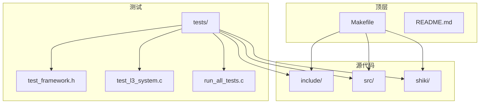
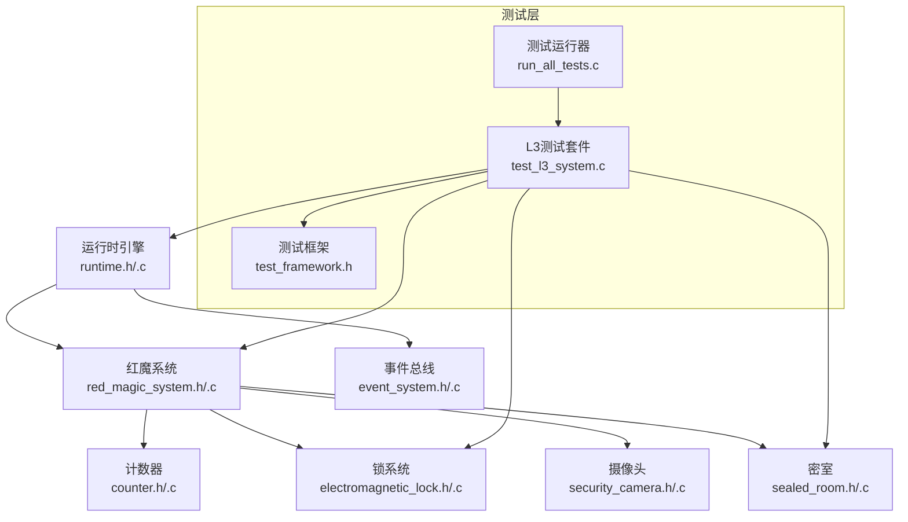
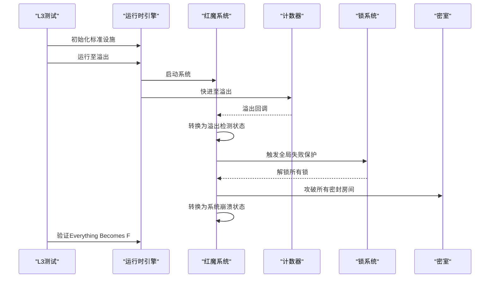
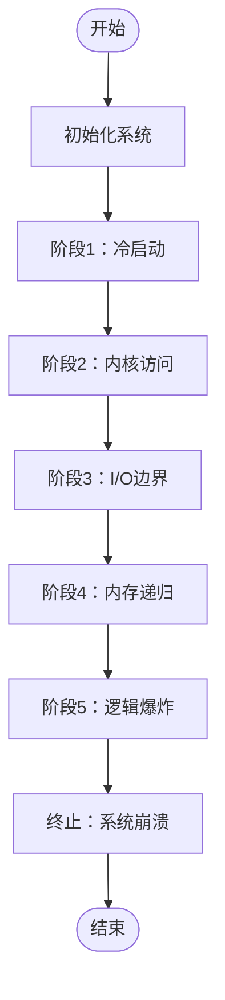
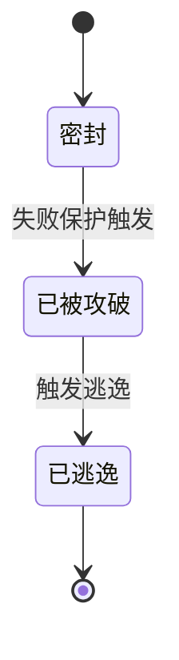
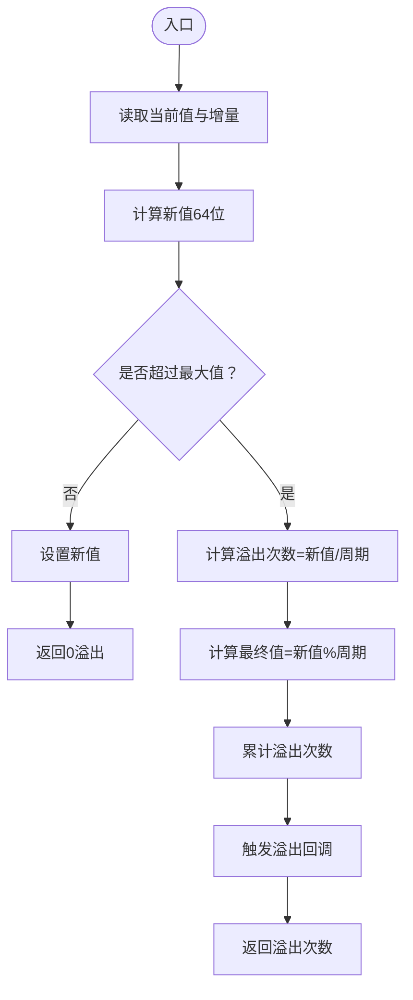
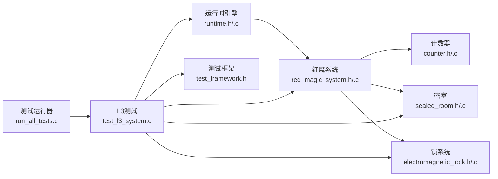

# L3系统测试

<cite>
**本文档引用的文件**
- [README.md](file://README.md)
- [Makefile](file://Makefile)
- [tests/Makefile](file://tests/Makefile)
- [tests/run_all_tests.c](file://tests/run_all_tests.c)
- [tests/test_framework.h](file://tests/test_framework.h)
- [tests/test_l3_system.c](file://tests/test_l3_system.c)
- [include/runtime.h](file://include/runtime.h)
- [include/red_magic_system.h](file://include/red_magic_system.h)
- [include/counter.h](file://include/counter.h)
- [include/sealed_room.h](file://include/sealed_room.h)
- [include/electromagnetic_lock.h](file://include/electromagnetic_lock.h)
- [src/main.c](file://src/main.c)
- [src/runtime.c](file://src/runtime.c)
- [src/red_magic_system.c](file://src/red_magic_system.c)
- [src/counter.c](file://src/counter.c)
</cite>

## 目录
1. [简介](#简介)
2. [项目结构](#项目结构)
3. [核心组件](#核心组件)
4. [架构总览](#架构总览)
5. [详细组件分析](#详细组件分析)
6. [依赖关系分析](#依赖关系分析)
7. [性能考虑](#性能考虑)
8. [故障排除指南](#故障排除指南)
9. [结论](#结论)
10. [附录](#附录)

## 简介
本文件为L3系统测试的详细技术文档，聚焦于端到端仿真测试与完整逃逸模拟验证。围绕“Everything Becomes F”（一切终将归于F）的核心概念，系统性验证以下目标：
- 完整的Shiki进化路径模拟（5阶段仿真）
- 从冷启动到逻辑爆炸的完整状态迁移
- 计数器溢出机制与系统级逃逸确认
- 基于测试框架的可重复、可度量的验证流程

该测试属于系统级验证范畴，覆盖单元测试（L1）、集成测试（L2）与系统测试（L3）。L3测试通过端到端运行完整仿真，确保计数器溢出触发失败保护机制，电磁锁释放，密室被攻破，最终Dr. Magata Shiki成功逃脱，并在验证阶段确认“Everything Becomes F”的数学与语义含义。

## 项目结构
项目采用模块化分层组织：include定义接口，src实现核心功能，shiki包含Shiki进化阶段的子模块，tests提供测试套件，顶层Makefile负责构建主程序与各阶段程序。

图表来源
- [Makefile:1-167](file://Makefile#L1-L167)
- [tests/Makefile:1-48](file://tests/Makefile#L1-L48)

章节来源
- [README.md:15-53](file://README.md#L15-L53)
- [Makefile:1-167](file://Makefile#L1-L167)
- [tests/Makefile:1-48](file://tests/Makefile#L1-L48)

## 核心组件
- 计数器模块（counter）：32位无符号整型计数器，模拟C语言行为，溢出后回绕至0，触发回调。
- 红魔系统（red_magic_system）：安全系统控制器，管理计数器、锁系统、摄像头、密室与事件总线，维护系统状态机。
- 运行时引擎（runtime）：将小说情节映射为五阶段仿真，驱动系统状态与阶段切换。
- 密室模型（sealed_room）：模拟Dr. Shiki的密室，状态从密封到被攻破再到逃逸。
- 电磁锁系统（electromagnetic_lock）：fail-safe设计，正常供电时锁定，断电或触发失败保护时解锁。

章节来源
- [include/counter.h:1-99](file://include/counter.h#L1-L99)
- [include/red_magic_system.h:1-166](file://include/red_magic_system.h#L1-L166)
- [include/runtime.h:1-184](file://include/runtime.h#L1-L184)
- [include/sealed_room.h:1-141](file://include/sealed_room.h#L1-L141)
- [include/electromagnetic_lock.h:1-137](file://include/electromagnetic_lock.h#L1-L137)

## 架构总览
L3系统测试以运行时引擎为核心，串联红魔系统与各子系统，形成如下交互：

图表来源
- [include/runtime.h:100-183](file://include/runtime.h#L100-L183)
- [include/red_magic_system.h:66-165](file://include/red_magic_system.h#L66-L165)
- [include/counter.h:36-98](file://include/counter.h#L36-L98)
- [include/electromagnetic_lock.h:83-136](file://include/electromagnetic_lock.h#L83-L136)
- [include/sealed_room.h:63-140](file://include/sealed_room.h#L63-L140)
- [tests/test_framework.h:1-149](file://tests/test_framework.h#L1-L149)
- [tests/test_l3_system.c:1-389](file://tests/test_l3_system.c#L1-L389)
- [tests/run_all_tests.c:1-61](file://tests/run_all_tests.c#L1-L61)

## 详细组件分析

### L3系统测试设计目标与场景
- 设计目标
  - 验证计数器溢出的正确性与性能（O(1)快进）
  - 验证系统状态机从初始化到运行、溢出检测、失败保护、系统崩溃的完整链路
  - 验证密室状态从密封到被攻破再到逃逸的正确迁移
  - 验证“Everything Becomes F”的数学与语义双重含义：0xFFFFFFFF溢出至0x00000000，八次F的十六进制表示
  - 验证五阶段仿真完整执行，逻辑爆炸阶段触发终止
- 测试场景
  - 15年仿真快进：从初始状态直接快进至溢出点，验证系统状态与锁状态
  - 密室逃逸端到端：验证密室被攻破且最终逃逸
  - “Everything Becomes F”验证：确认溢出发生、系统崩溃、逃逸完成
  - 阶段完整性：验证所有五个阶段均被执行
  - 初始/中期/末期系统状态：分别验证不同时间点的状态一致性

章节来源
- [tests/test_l3_system.c:24-389](file://tests/test_l3_system.c#L24-L389)
- [README.md:92-122](file://README.md#L92-L122)

### 关键流程：计数器溢出与系统失败保护

图表来源
- [src/red_magic_system.c:74-183](file://src/red_magic_system.c#L74-L183)
- [src/counter.c:44-104](file://src/counter.c#L44-L104)
- [tests/test_l3_system.c:24-179](file://tests/test_l3_system.c#L24-L179)

章节来源
- [src/red_magic_system.c:74-183](file://src/red_magic_system.c#L74-L183)
- [src/counter.c:44-104](file://src/counter.c#L44-L104)
- [tests/test_l3_system.c:24-179](file://tests/test_l3_system.c#L24-L179)

### 阶段执行与状态迁移
- 阶段映射：冷启动、内核访问、I/O边界、内存递归、逻辑爆炸
- 执行策略：通过运行时引擎逐阶段推进，或直接快进到溢出点
- 终止条件：逻辑爆炸阶段完成后，运行时进入终止状态

图表来源
- [include/runtime.h:34-54](file://include/runtime.h#L34-L54)
- [src/runtime.c:166-200](file://src/runtime.c#L166-L200)
- [tests/test_l3_system.c:199-254](file://tests/test_l3_system.c#L199-L254)

章节来源
- [include/runtime.h:34-54](file://include/runtime.h#L34-L54)
- [src/runtime.c:166-200](file://src/runtime.c#L166-L200)
- [tests/test_l3_system.c:199-254](file://tests/test_l3_system.c#L199-L254)

### 密室逃逸状态机

图表来源
- [include/sealed_room.h:26-31](file://include/sealed_room.h#L26-L31)
- [src/red_magic_system.c:167-176](file://src/red_magic_system.c#L167-L176)
- [tests/test_l3_system.c:104-118](file://tests/test_l3_system.c#L104-L118)

章节来源
- [include/sealed_room.h:26-31](file://include/sealed_room.h#L26-L31)
- [src/red_magic_system.c:167-176](file://src/red_magic_system.c#L167-L176)
- [tests/test_l3_system.c:104-118](file://tests/test_l3_system.c#L104-L118)

### 计数器溢出算法与性能
- 溢出判定：使用64位中间计算避免32位溢出，采用模运算快速定位新值与溢出次数
- 性能特性：快进函数为O(1)，通过除法与取余一次性计算溢出次数与最终值
- 回调机制：每次溢出触发注册的回调，用于通知上层系统进行状态转换

图表来源
- [src/counter.c:81-104](file://src/counter.c#L81-L104)
- [src/counter.c:32-56](file://src/counter.c#L32-L56)

章节来源
- [src/counter.c:81-104](file://src/counter.c#L81-L104)
- [src/counter.c:32-56](file://src/counter.c#L32-L56)

## 依赖关系分析
- L3测试依赖运行时引擎与红魔系统，间接依赖计数器、锁系统、密室与事件总线
- 运行时引擎依赖红魔系统，红魔系统依赖计数器与锁系统
- 测试框架提供断言与统计能力，测试运行器统一调度各测试套件

图表来源
- [tests/test_l3_system.c:13-18](file://tests/test_l3_system.c#L13-L18)
- [include/runtime.h:100-183](file://include/runtime.h#L100-L183)
- [include/red_magic_system.h:66-165](file://include/red_magic_system.h#L66-L165)
- [include/counter.h:36-98](file://include/counter.h#L36-L98)
- [include/electromagnetic_lock.h:83-136](file://include/electromagnetic_lock.h#L83-L136)
- [include/sealed_room.h:63-140](file://include/sealed_room.h#L63-L140)
- [tests/test_framework.h:1-149](file://tests/test_framework.h#L1-L149)
- [tests/run_all_tests.c:18-60](file://tests/run_all_tests.c#L18-L60)

章节来源
- [tests/test_l3_system.c:13-18](file://tests/test_l3_system.c#L13-L18)
- [include/runtime.h:100-183](file://include/runtime.h#L100-L183)
- [include/red_magic_system.h:66-165](file://include/red_magic_system.h#L66-L165)
- [include/counter.h:36-98](file://include/counter.h#L36-L98)
- [include/electromagnetic_lock.h:83-136](file://include/electromagnetic_lock.h#L83-L136)
- [include/sealed_room.h:63-140](file://include/sealed_room.h#L63-L140)
- [tests/test_framework.h:1-149](file://tests/test_framework.h#L1-L149)
- [tests/run_all_tests.c:18-60](file://tests/run_all_tests.c#L18-L60)

## 性能考虑
- 计数器快进：O(1)复杂度，避免逐小时循环，满足长时间快进需求
- 测试效率：单次溢出快进耗时应小于0.1秒，保证测试可重复性与吞吐量
- 内存占用：运行时历史记录数组大小固定，避免动态扩容带来的额外开销
- 并发与事件：事件总线与回调数量有限，确保阶段切换与完成回调的及时处理

章节来源
- [src/counter.c:81-104](file://src/counter.c#L81-L104)
- [tests/test_l3_system.c:67-82](file://tests/test_l3_system.c#L67-L82)
- [include/runtime.h:25-30](file://include/runtime.h#L25-L30)

## 故障排除指南
- 溢出未触发
  - 检查计数器快进函数是否正确传入小时数
  - 确认溢出回调已注册并被触发
- 系统状态异常
  - 核对系统状态机转换顺序：初始化→运行→溢出检测→失败保护→系统崩溃
  - 使用状态查询接口验证当前状态
- 锁未解锁
  - 确认失败保护触发函数被调用
  - 检查锁系统是否处于全局失败保护状态
- 密室未被攻破
  - 确认失败保护触发后是否遍历所有密封房间并调用攻破函数
  - 检查密室状态回调是否正确注册
- 验证失败
  - 确认最终验证函数检查了溢出发生、系统崩溃、逃逸完成等条件
  - 对比最终计数器值与十六进制表示，确保八次F的出现

章节来源
- [src/red_magic_system.c:146-183](file://src/red_magic_system.c#L146-L183)
- [src/runtime.c:103-125](file://src/runtime.c#L103-L125)
- [tests/test_l3_system.c:124-179](file://tests/test_l3_system.c#L124-L179)

## 结论
L3系统测试通过端到端仿真与完整逃逸验证，系统性地确认了“Everything Becomes F”的核心机制：计数器溢出、失败保护触发、锁系统解锁、密室攻破与最终逃逸。测试覆盖了五阶段仿真、系统状态迁移、性能与准确性验证，确保仿真结果与小说背景一致，同时具备良好的可重复性与可扩展性。

## 附录

### 测试执行流程
- 构建与运行
  - 构建主程序与各阶段程序：make
  - 运行主程序：make run
  - 构建并运行测试：make test
- 测试套件
  - L1单元测试、L2集成测试、L3系统测试、阶段测试按顺序执行
  - 最终汇总报告输出所有测试结果

章节来源
- [Makefile:50-167](file://Makefile#L50-L167)
- [tests/run_all_tests.c:18-60](file://tests/run_all_tests.c#L18-L60)

### 验证指标清单
- 计数器溢出：最大值到达后回绕至0，溢出计数增加
- 系统状态：从初始化→运行→溢出检测→失败保护→系统崩溃
- 锁系统：失败保护触发后全部解锁
- 密室状态：被攻破后进入逃逸状态
- 阶段完整性：五个阶段均被执行
- 性能：溢出快进耗时小于阈值

章节来源
- [tests/test_l3_system.c:24-389](file://tests/test_l3_system.c#L24-L389)
- [README.md:92-122](file://README.md#L92-L122)