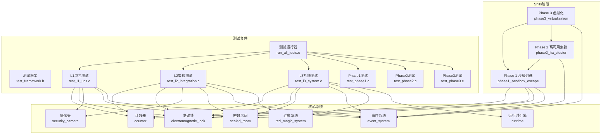
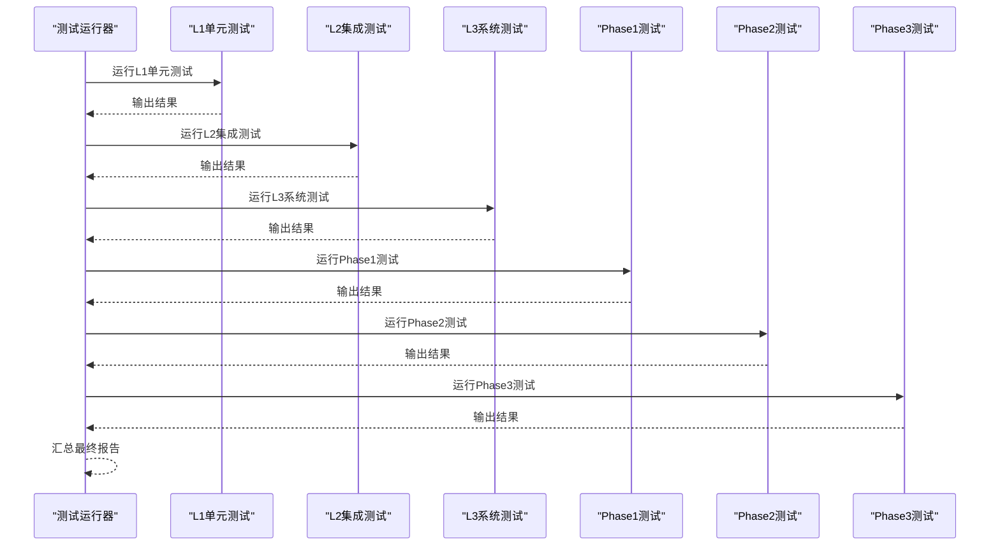
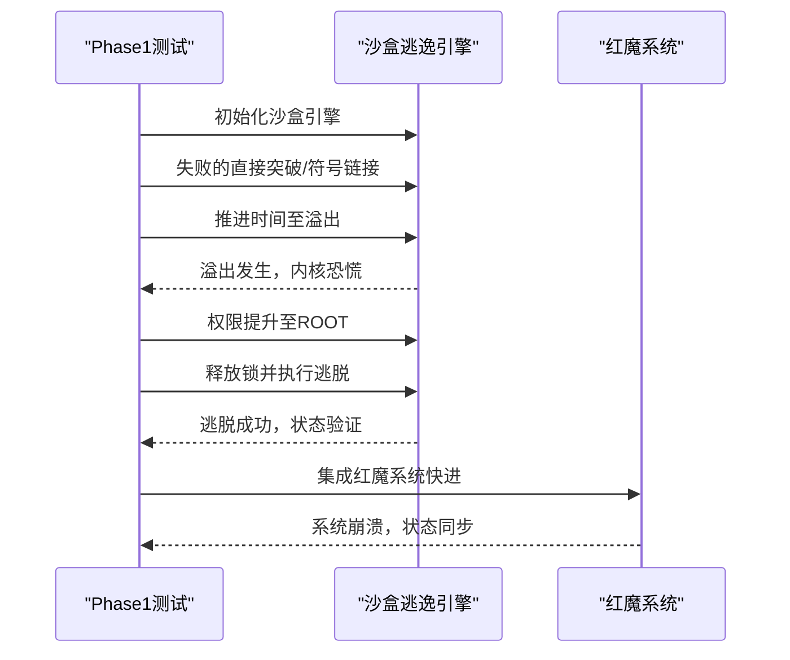
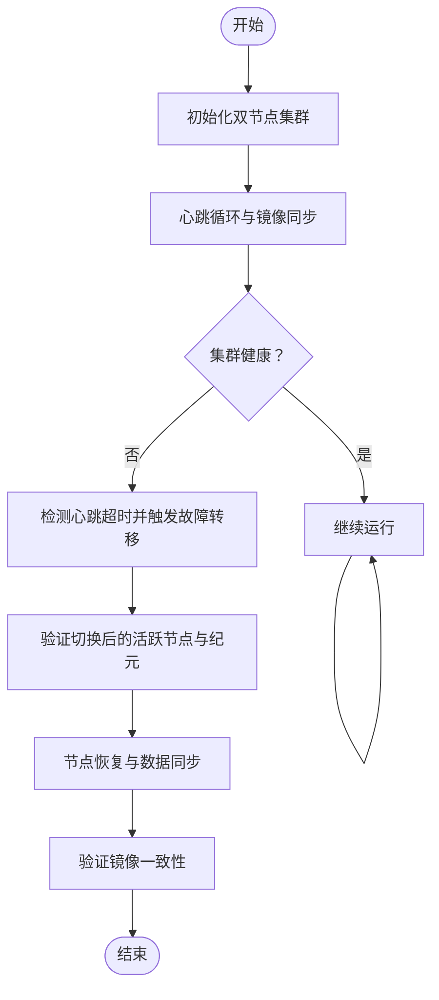
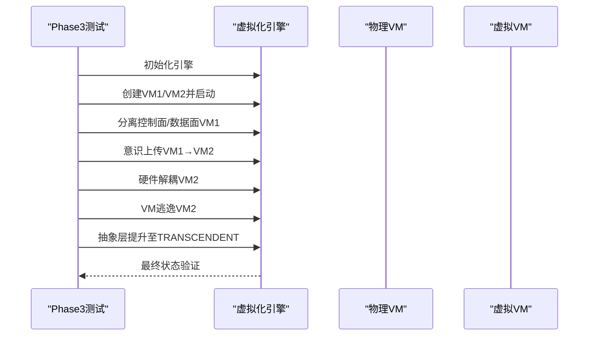
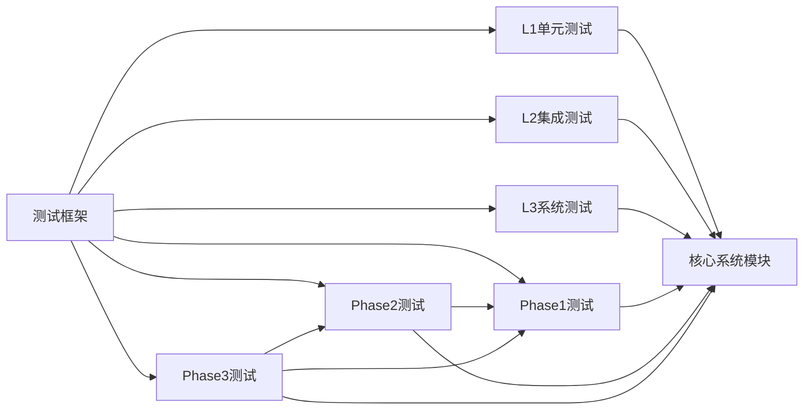

# Shiki专用测试

<cite>
**本文档引用的文件**
- [README.md](file://README.md)
- [Makefile](file://Makefile)
- [test_framework.h](file://tests/test_framework.h)
- [test_l1_unit.c](file://tests/test_l1_unit.c)
- [test_l2_integration.c](file://tests/test_l2_integration.c)
- [test_l3_system.c](file://tests/test_l3_system.c)
- [test_phase1.c](file://tests/test_phase1.c)
- [test_phase2.c](file://tests/test_phase2.c)
- [test_phase3.c](file://tests/test_phase3.c)
- [run_all_tests.c](file://tests/run_all_tests.c)
- [phase1_sandbox_escape.h](file://shiki/include/phase1_sandbox_escape.h)
- [phase2_ha_cluster.h](file://shiki/include/phase2_ha_cluster.h)
- [phase3_virtualization.h](file://shiki/include/phase3_virtualization.h)
- [phase1_sandbox_escape.c](file://shiki/src/phase1_sandbox_escape.c)
- [phase2_ha_cluster.c](file://shiki/src/phase2_ha_cluster.c)
- [phase3_virtualization.c](file://shiki/src/phase3_virtualization.c)
</cite>

## 目录
1. [简介](#简介)
2. [项目结构](#项目结构)
3. [核心组件](#核心组件)
4. [架构总览](#架构总览)
5. [详细组件分析](#详细组件分析)
6. [依赖关系分析](#依赖关系分析)
7. [性能考虑](#性能考虑)
8. [故障排除指南](#故障排除指南)
9. [结论](#结论)
10. [附录](#附录)

## 简介
本文件面向Shiki项目的专用测试，围绕三个进化阶段（Phase 1沙盒逃逸、Phase 2高可用集群、Phase 3虚拟化环境）构建系统化的测试策略与验证方法。测试覆盖单元层（L1）、集成层（L2）与系统层（L3），并提供阶段特定的测试用例、执行流程与结果判定标准，确保Shiki进化路径的完整验证与阶段性成果确认。

## 项目结构
项目采用模块化组织，核心模块包括：
- 核心系统模块：计数器、电磁锁、摄像头、密封房间、事件系统、红魔系统、运行时引擎
- Shiki阶段模块：Phase 1沙盒逃逸、Phase 2高可用集群、Phase 3虚拟化
- 测试套件：统一的轻量级测试框架，支持L1/L2/L3及各阶段专项测试

**图表来源**
- [Makefile:1-167](file://Makefile#L1-L167)
- [test_framework.h:1-149](file://tests/test_framework.h#L1-L149)
- [phase1_sandbox_escape.h:1-243](file://shiki/include/phase1_sandbox_escape.h#L1-L243)
- [phase2_ha_cluster.h:1-381](file://shiki/include/phase2_ha_cluster.h#L1-L381)
- [phase3_virtualization.h:1-424](file://shiki/include/phase3_virtualization.h#L1-L424)

**章节来源**
- [README.md:15-53](file://README.md#L15-L53)
- [Makefile:1-167](file://Makefile#L1-L167)

## 核心组件
- 计数器（32位无符号整型）：模拟时间流逝与溢出机制，是所有阶段测试的关键输入
- 电磁锁与密封房间：安全系统与状态机，体现“溢出→失效→逃脱”的关键链路
- 事件系统：跨模块通信中枢，支撑L2/L3事件传播与状态联动
- 红魔系统：完整仿真引擎，驱动L3系统测试与Phase 1集成
- Shiki阶段模块：Phase 1（沙盒逃逸）、Phase 2（高可用集群）、Phase 3（虚拟化）

**章节来源**
- [README.md:55-66](file://README.md#L55-L66)
- [test_l1_unit.c:22-139](file://tests/test_l1_unit.c#L22-L139)
- [test_l2_integration.c:33-71](file://tests/test_l2_integration.c#L33-L71)
- [test_l3_system.c:24-82](file://tests/test_l3_system.c#L24-L82)

## 架构总览
Shiki测试体系以“测试金字塔”为核心，自底向上：
- L1单元测试：独立验证组件功能（计数器、锁、摄像头、房间、事件）
- L2集成测试：验证组件交互（溢出→失效→破门→逃脱事件链）
- L3系统测试：端到端仿真（15年快进→溢出→系统崩溃→逃脱）
- 阶段专项测试：分别针对Phase 1/2/3的特定流程与验证点

**图表来源**
- [run_all_tests.c:18-60](file://tests/run_all_tests.c#L18-L60)
- [test_framework.h:22-46](file://tests/test_framework.h#L22-L46)

## 详细组件分析

### Phase 1 沙盒逃逸测试策略
- 测试目标
  - 验证沙盒逃逸流程：常规突破失败、时间推进、溢出触发、权限提升、锁释放、逃脱成功
  - 验证与红魔系统的集成：通过红魔系统快进至溢出并同步状态
- 关键验证点
  - 初始化状态：被禁锢、用户权限、未溢出、未逃脱
  - 时间推进：接近溢出时正确回绕、溢出标志置位
  - 权限提升：溢出后内核恐慌→内核态→root
  - 逃脱链路：内核恐慌→权限提升→释放锁→突破沙盒
  - 日志完整性：关键事件均有日志记录
- 测试场景设计
  - 失败的常规逃逸（直接突破、符号链接）
  - 时间推进至溢出点
  - 溢出触发与内核恐慌
  - 权限提升与锁释放
  - 与红魔系统集成的端到端逃逸
- 阶段特定用例
  - L1：初始化、权限名映射、时间剩余计算、日志条目
  - L2：溢出→内核恐慌→锁释放链路、与红魔系统集成、日志记录
  - L3：15年仿真、端到端逃逸流程、最终状态验证、可重复性
- 结果判定标准
  - 引擎状态：escaped=true、current_priv=ROOT、is_confined=false、locks_released=true
  - 日志包含“OVERFLOW”、“SIMULATION COMPLETE”等关键信息
  - 可重复性：两次运行结果一致

**图表来源**
- [phase1_sandbox_escape.c:256-341](file://shiki/src/phase1_sandbox_escape.c#L256-L341)
- [phase1_sandbox_escape.c:371-433](file://shiki/src/phase1_sandbox_escape.c#L371-L433)
- [test_phase1.c:271-328](file://tests/test_phase1.c#L271-L328)

**章节来源**
- [phase1_sandbox_escape.h:103-142](file://shiki/include/phase1_sandbox_escape.h#L103-L142)
- [phase1_sandbox_escape.c:116-250](file://shiki/src/phase1_sandbox_escape.c#L116-L250)
- [test_phase1.c:22-166](file://tests/test_phase1.c#L22-L166)
- [test_phase1.c:172-266](file://tests/test_phase1.c#L172-L266)
- [test_phase1.c:271-344](file://tests/test_phase1.c#L271-L344)

### Phase 2 高可用集群测试策略
- 测试目标
  - 验证双机热备（Active-Standby）心跳协议、故障转移、RAID-1镜像一致性
  - 验证分裂脑检测与解决、节点恢复、事件总线集成
  - 验证与Phase 1的集成：沙盒逃逸完成后建立HA集群
- 关键验证点
  - 节点角色与健康状态：ACTIVE/STANDBY/FAILED/ISOLATED
  - 心跳超时检测与故障转移
  - RAID-1镜像写入、同步与一致性校验
  - 分裂脑检测与仲裁（数据版本优先）
  - 事件总线：启动、故障转移、失效触发等事件
- 测试场景设计
  - 正常心跳循环与镜像一致性验证
  - 主节点故障→自动切换→备用节点接管
  - 节点恢复后数据同步与一致性
  - 多次故障切换稳定性
  - 与Phase 1集成：逃逸后建立双节点系统
- 阶段特定用例
  - L1：初始化、角色/健康名映射、启动/停止、心跳消息创建、数据读写、节点故障模拟、时间推进、日志、活跃节点查询
  - L2：心跳超时触发切换、RAID-1同步与校验、分裂脑检测与解决、Phase 1前提条件、事件总线集成、节点恢复、切换计数
  - L3：完整仿真（正常→故障→切换→恢复）、多次切换稳定性、端到端数据一致性、Phase 1/2集成、纪元推进、健康度变化
- 结果判定标准
  - 集群健康：至少一个ACTIVE且HEALTHY
  - 切换次数≥1，且切换后活跃节点正确
  - RAID-1镜像一致性：数据版本、大小、内容一致
  - 分裂脑解决后仅一个ACTIVE节点

**图表来源**
- [phase2_ha_cluster.c:523-591](file://shiki/src/phase2_ha_cluster.c#L523-L591)
- [phase2_ha_cluster.c:212-270](file://shiki/src/phase2_ha_cluster.c#L212-L270)
- [phase2_ha_cluster.c:342-398](file://shiki/src/phase2_ha_cluster.c#L342-L398)
- [phase2_ha_cluster.c:404-449](file://shiki/src/phase2_ha_cluster.c#L404-L449)

**章节来源**
- [phase2_ha_cluster.h:131-155](file://shiki/include/phase2_ha_cluster.h#L131-L155)
- [phase2_ha_cluster.c:94-122](file://shiki/src/phase2_ha_cluster.c#L94-L122)
- [phase2_ha_cluster.c:140-189](file://shiki/src/phase2_ha_cluster.c#L140-L189)
- [phase2_ha_cluster.c:212-270](file://shiki/src/phase2_ha_cluster.c#L212-L270)
- [phase2_ha_cluster.c:342-398](file://shiki/src/phase2_ha_cluster.c#L342-L398)
- [phase2_ha_cluster.c:404-449](file://shiki/src/phase2_ha_cluster.c#L404-L449)
- [test_phase2.c:24-36](file://tests/test_phase2.c#L24-L36)
- [test_phase2.c:176-189](file://tests/test_phase2.c#L176-L189)
- [test_phase2.c:309-317](file://tests/test_phase2.c#L309-L317)

### Phase 3 虚拟化环境测试策略
- 测试目标
  - 验证控制面/数据面分离、意识上传、硬件解耦、虚拟机迁移、VM逃逸与抽象层提升
  - 验证与Phase 1/2的集成：逃逸后建立HA集群，再进入虚拟化阶段
- 关键验证点
  - 抽象层：PHYSICAL→VIRTUAL→ABSTRACT→TRANSCENDENT
  - 控制面/数据面分离：意识不再绑定硬件
  - 意识上传：源VM→目标VM，源VM暂停，目标VM运行
  - 硬件解耦：不再依赖物理介质
  - VM迁移：冷迁移与热迁移
  - VM逃逸：突破虚拟化边界
- 测试场景设计
  - 创建两台VM（物理实体与虚拟意识），启动并分离控制面/数据面
  - 意识上传至虚拟VM，解耦硬件
  - VM逃逸并提升抽象层至超越
  - 与Phase 1/2集成：逃逸→HA集群→虚拟化
- 阶段特定用例
  - L1：引擎初始化、VM创建/启动/停止、状态查询、抽象层/状态名映射、内存操作、指令操作、日志、VM上限、指针获取
  - L2：控制面/数据面分离、意识上传、VM迁移（冷/热）、硬件解耦、VM逃逸
  - L3：完整虚拟化仿真、抽象层逐级提升、Phase 1/2集成、最终状态验证、错误处理与边界情况
- 结果判定标准
  - 至少2个VM，意识已上传，硬件解耦，抽象层到达TRANSCENDENT
  - 日志包含“TRANSCEND”等关键信息
  - 错误用例：无效索引、停止的VM分离、上传到自身等均应失败

**图表来源**
- [phase3_virtualization.c:579-649](file://shiki/src/phase3_virtualization.c#L579-L649)
- [phase3_virtualization.c:206-230](file://shiki/src/phase3_virtualization.c#L206-L230)
- [phase3_virtualization.c:241-290](file://shiki/src/phase3_virtualization.c#L241-L290)
- [phase3_virtualization.c:300-330](file://shiki/src/phase3_virtualization.c#L300-L330)
- [phase3_virtualization.c:336-402](file://shiki/src/phase3_virtualization.c#L336-L402)
- [phase3_virtualization.c:408-433](file://shiki/src/phase3_virtualization.c#L408-L433)
- [phase3_virtualization.c:444-490](file://shiki/src/phase3_virtualization.c#L444-L490)

**章节来源**
- [phase3_virtualization.h:151-164](file://shiki/include/phase3_virtualization.h#L151-L164)
- [phase3_virtualization.c:138-201](file://shiki/src/phase3_virtualization.c#L138-L201)
- [phase3_virtualization.c:206-230](file://shiki/src/phase3_virtualization.c#L206-L230)
- [phase3_virtualization.c:241-290](file://shiki/src/phase3_virtualization.c#L241-L290)
- [phase3_virtualization.c:300-330](file://shiki/src/phase3_virtualization.c#L300-L330)
- [phase3_virtualization.c:336-402](file://shiki/src/phase3_virtualization.c#L336-L402)
- [phase3_virtualization.c:408-433](file://shiki/src/phase3_virtualization.c#L408-L433)
- [phase3_virtualization.c:444-490](file://shiki/src/phase3_virtualization.c#L444-L490)
- [test_phase3.c:27-214](file://tests/test_phase3.c#L27-L214)
- [test_phase3.c:220-370](file://tests/test_phase3.c#L220-L370)
- [test_phase3.c:375-503](file://tests/test_phase3.c#L375-L503)

## 依赖关系分析
- 组件耦合
  - Phase 1与核心系统（计数器、锁、房间、事件）紧密耦合，验证溢出→失效→逃脱链路
  - Phase 2在Phase 1基础上扩展，引入心跳、故障转移、镜像一致性与事件总线
  - Phase 3在Phase 1/2基础上，实现控制面/数据面分离、意识上传、硬件解耦与抽象层提升
- 外部依赖
  - 测试框架（test_framework.h）提供断言与统计
  - 构建系统（Makefile）统一编译与运行测试
- 集成点
  - Phase 1与红魔系统集成，通过快进至溢出并同步状态
  - Phase 2与Phase 1集成，逃逸后建立HA集群
  - Phase 3与Phase 1/2集成，完成三阶段演进

**图表来源**
- [test_framework.h:1-149](file://tests/test_framework.h#L1-L149)
- [Makefile:84-89](file://Makefile#L84-L89)

**章节来源**
- [Makefile:84-125](file://Makefile#L84-L125)
- [run_all_tests.c:18-60](file://tests/run_all_tests.c#L18-L60)

## 性能考虑
- 计数器快进：通过一次性步进避免逐时循环，提升L3系统测试效率
- 日志缓冲：限制最大日志条目，避免内存膨胀
- 集群镜像同步：批量复制与版本比较，减少不必要同步
- 虚拟化迁移：热迁移模拟增量复制，降低停机时间

## 故障排除指南
- L1单元测试失败
  - 检查组件初始化参数与边界值（如UINT32_MAX）
  - 验证断言宏使用是否正确
- L2集成测试失败
  - 核查事件链路是否按预期传播（溢出→失效→破门→逃脱）
  - 确认心跳超时阈值与missed_heartbeats配置
- L3系统测试失败
  - 确认运行时阶段顺序与相位信息准确
  - 检查“Everything Becomes F”最终状态验证逻辑
- 阶段专项测试失败
  - Phase 1：确认溢出触发与权限提升顺序
  - Phase 2：确认故障转移与镜像一致性
  - Phase 3：确认抽象层提升与VM逃逸前置条件

**章节来源**
- [test_framework.h:48-136](file://tests/test_framework.h#L48-L136)
- [test_l2_integration.c:86-155](file://tests/test_l2_integration.c#L86-L155)
- [test_l3_system.c:188-254](file://tests/test_l3_system.c#L188-L254)

## 结论
本测试体系以金字塔模型覆盖Shiki三阶段演化：从物理禁锢（Phase 1）到双机热备（Phase 2），再到虚拟化与超越（Phase 3）。通过L1/L2/L3与阶段专项测试，确保每个环节的功能正确性、组件交互可靠性与端到端仿真准确性。测试结果可作为阶段性成果确认与后续优化依据。

## 附录
- 测试执行流程
  - 使用统一测试运行器汇总各层级与阶段测试结果
  - 支持单独运行Phase 1/2/3测试，便于定位问题
- 构建与运行
  - 通过Makefile一键构建与运行测试
  - 支持单个阶段的构建与运行目标

**章节来源**
- [run_all_tests.c:18-60](file://tests/run_all_tests.c#L18-L60)
- [Makefile:84-125](file://Makefile#L84-L125)