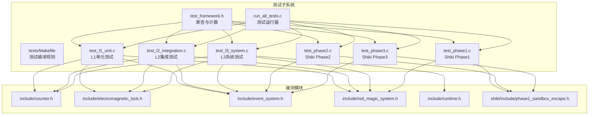
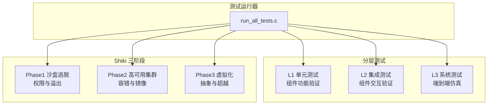
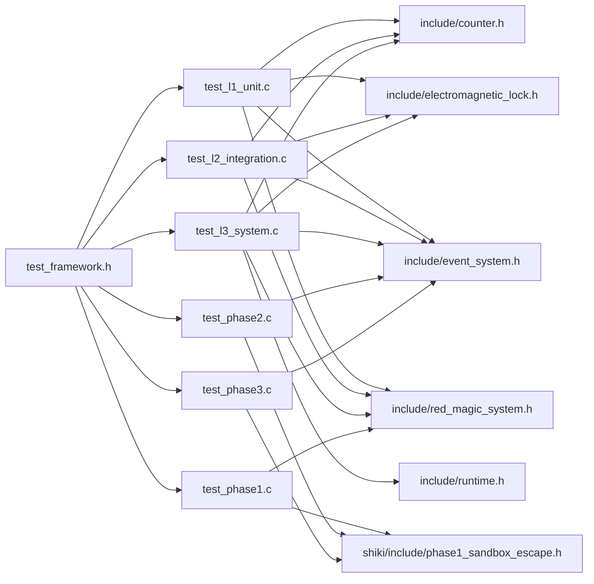

# 测试体系

<cite>
**本文引用的文件**
- [tests/test_framework.h](file://tests/test_framework.h)
- [tests/run_all_tests.c](file://tests/run_all_tests.c)
- [tests/Makefile](file://tests/Makefile)
- [tests/test_l1_unit.c](file://tests/test_l1_unit.c)
- [tests/test_l2_integration.c](file://tests/test_l2_integration.c)
- [tests/test_l3_system.c](file://tests/test_l3_system.c)
- [tests/test_phase1.c](file://tests/test_phase1.c)
- [tests/test_phase2.c](file://tests/test_phase2.c)
- [tests/test_phase3.c](file://tests/test_phase3.c)
- [Makefile](file://Makefile)
- [include/counter.h](file://include/counter.h)
- [include/electromagnetic_lock.h](file://include/electromagnetic_lock.h)
- [include/event_system.h](file://include/event_system.h)
- [include/red_magic_system.h](file://include/red_magic_system.h)
- [include/runtime.h](file://include/runtime.h)
- [shiki/include/phase1_sandbox_escape.h](file://shiki/include/phase1_sandbox_escape.h)
</cite>

## 目录
1. [简介](#简介)
2. [项目结构](#项目结构)
3. [核心组件](#核心组件)
4. [架构总览](#架构总览)
5. [详细组件分析](#详细组件分析)
6. [依赖关系分析](#依赖关系分析)
7. [性能考量](#性能考量)
8. [故障排查指南](#故障排查指南)
9. [结论](#结论)
10. [附录](#附录)

## 简介
本测试体系面向 Everything Becomes F 项目，采用分层测试架构，覆盖 L1 单元测试、L2 集成测试、L3 系统测试，并针对 Shiki 三阶段（Phase 1~3）分别设计专用测试套件。测试框架为自包含的头文件测试框架，提供断言宏、测试计数与汇总输出；测试运行器统一调度各层级与阶段测试，输出最终结果。

## 项目结构
测试相关代码集中在 tests 目录，包含：
- 自定义测试框架与运行器：test_framework.h、run_all_tests.c
- 分层测试套件：test_l1_unit.c、test_l2_integration.c、test_l3_system.c
- Shiki 专用测试：test_phase1.c、test_phase2.c、test_phase3.c
- 测试构建：tests/Makefile
- 顶层构建：Makefile（含测试目标）

图表来源
- [tests/test_framework.h:1-149](file://tests/test_framework.h#L1-L149)
- [tests/run_all_tests.c:1-61](file://tests/run_all_tests.c#L1-L61)
- [tests/Makefile:1-48](file://tests/Makefile#L1-L48)
- [tests/test_l1_unit.c:1-498](file://tests/test_l1_unit.c#L1-L498)
- [tests/test_l2_integration.c:1-365](file://tests/test_l2_integration.c#L1-L365)
- [tests/test_l3_system.c:1-389](file://tests/test_l3_system.c#L1-L389)
- [tests/test_phase1.c:1-399](file://tests/test_phase1.c#L1-L399)
- [tests/test_phase2.c:1-480](file://tests/test_phase2.c#L1-L480)
- [tests/test_phase3.c:1-554](file://tests/test_phase3.c#L1-L554)
- [include/counter.h:1-99](file://include/counter.h#L1-L99)
- [include/electromagnetic_lock.h:1-137](file://include/electromagnetic_lock.h#L1-L137)
- [include/event_system.h:1-157](file://include/event_system.h#L1-L157)
- [include/red_magic_system.h:1-166](file://include/red_magic_system.h#L1-L166)
- [include/runtime.h:1-184](file://include/runtime.h#L1-L184)
- [shiki/include/phase1_sandbox_escape.h:1-243](file://shiki/include/phase1_sandbox_escape.h#L1-L243)

章节来源
- [tests/Makefile:1-48](file://tests/Makefile#L1-L48)
- [Makefile:84-89](file://Makefile#L84-L89)

## 核心组件
- 自包含测试框架
  - 断言宏：ASSERT_TRUE、ASSERT_FALSE、ASSERT_EQ、ASSERT_NEQ、ASSERT_GT、ASSERT_LT、ASSERT_GTE、ASSERT_LTE、ASSERT_STR_EQ、ASSERT_NULL、ASSERT_NOT_NULL
  - 计数与汇总：内部维护测试总数、通过数、失败数，并提供 TEST_SUMMARY、TEST_GET_* 查询
  - 测试函数声明：TEST(name) 宏生成静态测试函数
  - 运行控制：TEST_SUITE_BEGIN、RUN_TEST
- 测试运行器
  - 统一入口 run_all_tests.c，按顺序调用各测试套件的 run_xxx_tests 返回值累加，输出最终结果
- 构建系统
  - tests/Makefile 编译测试对象与库对象，链接生成 run_all_tests
  - 顶层 Makefile 提供 test 目标，自动进入 tests 并运行测试

章节来源
- [tests/test_framework.h:16-146](file://tests/test_framework.h#L16-L146)
- [tests/run_all_tests.c:18-60](file://tests/run_all_tests.c#L18-L60)
- [tests/Makefile:25-35](file://tests/Makefile#L25-L35)
- [Makefile:84-89](file://Makefile#L84-L89)

## 架构总览
分层测试架构与 Shiki 三阶段测试的组织方式如下：

图表来源
- [tests/run_all_tests.c:26-42](file://tests/run_all_tests.c#L26-L42)
- [tests/test_l1_unit.c:430-497](file://tests/test_l1_unit.c#L430-L497)
- [tests/test_l2_integration.c:328-364](file://tests/test_l2_integration.c#L328-L364)
- [tests/test_l3_system.c:342-388](file://tests/test_l3_system.c#L342-L388)
- [tests/test_phase1.c:350-398](file://tests/test_phase1.c#L350-L398)
- [tests/test_phase2.c:429-479](file://tests/test_phase2.c#L429-L479)
- [tests/test_phase3.c:509-553](file://tests/test_phase3.c#L509-L553)

## 详细组件分析

### L1 单元测试（组件功能测试）
- 覆盖范围
  - 计数器：初始化、增量、溢出检测与环绕、快速前进、常量与时间估算等
  - 电磁锁：初始化、上电/断电、紧急释放、全局释放、系统状态统计
  - 安防摄像头：初始化、分钟录制、盲点创建与统计、时钟漂移漏洞与复现
  - 密封房间：初始化、门添加、破坏与逃脱、Magata套房常量与溢出逃脱
  - 事件总线：初始化、订阅/取消订阅、历史记录、暂停/恢复、事件名映射
- 设计要点
  - 每个组件独立测试其边界条件与典型路径
  - 使用断言宏确保数值正确性与状态一致性
  - 通过 RUN_TEST 逐项执行，TEST_SUMMARY 输出统计

章节来源
- [tests/test_l1_unit.c:22-145](file://tests/test_l1_unit.c#L22-L145)
- [tests/test_l1_unit.c:151-222](file://tests/test_l1_unit.c#L151-L222)
- [tests/test_l1_unit.c:228-287](file://tests/test_l1_unit.c#L228-L287)
- [tests/test_l1_unit.c:293-352](file://tests/test_l1_unit.c#L293-L352)
- [tests/test_l1_unit.c:358-424](file://tests/test_l1_unit.c#L358-L424)
- [tests/test_l1_unit.c:430-497](file://tests/test_l1_unit.c#L430-L497)

### L2 集成测试（组件交互测试）
- 覆盖范围
  - 计数器溢出触发锁系统紧急释放链路
  - 事件传播：溢出→释放锁→破坏房间，多处理器链式响应
  - 时钟同步漏洞：摄像头盲点创建与重装模拟
  - Red Magic 系统：状态机转换、初始化→运行→溢出→系统停摆
  - 房间与锁：锁释放后房间可被破坏，Magata套房溢出逃脱
- 设计要点
  - 以真实对象组合进行端到端路径验证
  - 通过回调与事件总线验证跨模块通信
  - 复杂场景使用跟踪器记录事件序列

章节来源
- [tests/test_l2_integration.c:33-70](file://tests/test_l2_integration.c#L33-L70)
- [tests/test_l2_integration.c:86-155](file://tests/test_l2_integration.c#L86-L155)
- [tests/test_l2_integration.c:161-200](file://tests/test_l2_integration.c#L161-L200)
- [tests/test_l2_integration.c:205-282](file://tests/test_l2_integration.c#L205-L282)
- [tests/test_l2_integration.c:288-322](file://tests/test_l2_integration.c#L288-L322)
- [tests/test_l2_integration.c:328-364](file://tests/test_l2_integration.c#L328-L364)

### L3 系统测试（端到端仿真）
- 覆盖范围
  - 15年仿真：计数器快速前进至溢出，系统状态切换
  - 密封房间：破坏→逃脱状态机
  - Everything Becomes F 验证：溢出发生、系统停摆、最终状态校验
  - 运行时阶段：冷启动→内核→I/O→内存→逻辑爆炸→终止
  - 系统全生命周期：初始化→运行中→溢出→系统停摆
  - 小说精度：计数器类型修正、溢出机制、时间周期、监禁时长
- 设计要点
  - 以 EverythingBecomesFRuntime 为核心驱动完整叙事弧
  - 验证阶段信息完整性与完成标志
  - 性能基准：快速前进效率与时钟开销

章节来源
- [tests/test_l3_system.c:24-82](file://tests/test_l3_system.c#L24-L82)
- [tests/test_l3_system.c:88-118](file://tests/test_l3_system.c#L88-L118)
- [tests/test_l3_system.c:124-179](file://tests/test_l3_system.c#L124-L179)
- [tests/test_l3_system.c:199-254](file://tests/test_l3_system.c#L199-L254)
- [tests/test_l3_system.c:260-302](file://tests/test_l3_system.c#L260-L302)
- [tests/test_l3_system.c:308-332](file://tests/test_l3_system.c#L308-L332)
- [tests/test_l3_system.c:342-388](file://tests/test_l3_system.c#L342-L388)

### Shiki 专用测试（Phase1~3）
- Phase1 沙盒逃脱
  - 功能：初始化、权限等级、时间推进、溢出触发、权限提升、内核恐慌、锁释放、完整逃脱流程
  - 集成：与 Red Magic 系统联动，日志记录与可重复性验证
- Phase2 高可用集群
  - 功能：节点角色与健康、心跳、数据写入/读取、镜像一致性、故障转移、分裂脑检测与解决
  - 集成：与 Phase1 的沙盒逃脱前置条件、事件总线联动
- Phase3 虚拟化
  - 功能：虚拟机创建/引导/停止、状态查询、抽象层级名称、内存/指令操作、日志与清理、上限与指针
  - 集成：控制/数据平面分离、意识上传、迁移、硬件解耦、VM 逃脱、全栈仿真与最终状态验证
- 设计要点
  - 各阶段自包含 L1/L2/L3 三层验证
  - 严格的状态机与阶段推进校验
  - 与上层系统的集成测试贯穿 L2/L3

章节来源
- [tests/test_phase1.c:22-166](file://tests/test_phase1.c#L22-L166)
- [tests/test_phase1.c:172-265](file://tests/test_phase1.c#L172-L265)
- [tests/test_phase1.c:271-344](file://tests/test_phase1.c#L271-L344)
- [tests/test_phase2.c:24-170](file://tests/test_phase2.c#L24-L170)
- [tests/test_phase2.c:176-303](file://tests/test_phase2.c#L176-L303)
- [tests/test_phase2.c:309-423](file://tests/test_phase2.c#L309-L423)
- [tests/test_phase3.c:28-214](file://tests/test_phase3.c#L28-L214)
- [tests/test_phase3.c:220-370](file://tests/test_phase3.c#L220-L370)
- [tests/test_phase3.c:375-503](file://tests/test_phase3.c#L375-L503)

### 测试运行与调试
- 运行方式
  - 顶层命令：make test（构建并运行 tests/run_all_tests）
  - 子目录：进入 tests/ 手动 make run
- 调试技巧
  - 使用断言定位失败位置（断言宏会打印表达式与行列号）
  - 查看 TEST_SUMMARY 输出的通过/失败统计
  - 在复杂链路中增加临时日志或事件订阅，追踪事件序列
  - 利用快速前进接口（如 counter_fast_forward、red_magic_fast_forward）缩短等待时间
- 覆盖率分析
  - 当前未启用专门的覆盖率工具链；建议在 CI 中引入 gcov/lcov 或编译器内置覆盖率支持，结合现有测试套件进行度量

章节来源
- [Makefile:84-89](file://Makefile#L84-L89)
- [tests/test_framework.h:49-119](file://tests/test_framework.h#L49-L119)
- [tests/run_all_tests.c:18-60](file://tests/run_all_tests.c#L18-L60)

## 依赖关系分析
测试框架与被测模块的依赖关系如下：

图表来源
- [tests/test_framework.h:12-17](file://tests/test_framework.h#L12-L17)
- [tests/test_l1_unit.c:12-17](file://tests/test_l1_unit.c#L12-L17)
- [tests/test_l2_integration.c:12-17](file://tests/test_l2_integration.c#L12-L17)
- [tests/test_l3_system.c:12-18](file://tests/test_l3_system.c#L12-L18)
- [tests/test_phase1.c:14-16](file://tests/test_phase1.c#L14-L16)
- [tests/test_phase2.c:14-17](file://tests/test_phase2.c#L14-L17)
- [tests/test_phase3.c:14-18](file://tests/test_phase3.c#L14-L18)
- [include/counter.h:15-17](file://include/counter.h#L15-L17)
- [include/electromagnetic_lock.h:13-14](file://include/electromagnetic_lock.h#L13-L14)
- [include/event_system.h:15-17](file://include/event_system.h#L15-L17)
- [include/red_magic_system.h:19-25](file://include/red_magic_system.h#L19-L25)
- [include/runtime.h:20-23](file://include/runtime.h#L20-L23)
- [shiki/include/phase1_sandbox_escape.h:28-30](file://shiki/include/phase1_sandbox_escape.h#L28-L30)

## 性能考量
- 快速前进优化
  - 计数器与 Red Magic 系统提供快速前进接口，显著缩短长周期仿真时间
  - 建议在 L3 系统测试中优先使用快速前进，减少等待时间
- 时间测量
  - L3 系统测试使用 clock_gettime/CLOCKS_PER_SEC 进行耗时评估，确保快速前进的即时性
- 日志与事件
  - 事件总线与日志记录可能带来额外开销，建议在性能敏感路径关闭冗余日志

章节来源
- [tests/test_l3_system.c:71-82](file://tests/test_l3_system.c#L71-L82)
- [tests/test_l2_integration.c:161-200](file://tests/test_l2_integration.c#L161-L200)

## 故障排查指南
- 断言失败定位
  - 断言宏会在失败时打印表达式与文件行号，便于快速定位问题
- 事件链路异常
  - 使用事件总线订阅与历史记录，确认事件序列是否符合预期
- 状态不一致
  - 通过系统状态查询与阶段推进接口，逐步回溯状态变更
- Shiki 阶段问题
  - 从 Phase1 的溢出与权限提升开始，逐阶段验证，确保前置条件满足后再进入下一阶段

章节来源
- [tests/test_framework.h:49-119](file://tests/test_framework.h#L49-L119)
- [tests/test_l2_integration.c:86-155](file://tests/test_l2_integration.c#L86-L155)
- [tests/test_phase1.c:172-265](file://tests/test_phase1.c#L172-L265)

## 结论
该测试体系以自包含的轻量级框架为基础，配合分层与分阶段的测试策略，实现了从组件功能到系统仿真的全面覆盖。通过断言宏、测试计数与汇总输出，以及统一的运行器，保证了测试的一致性与可维护性。建议在持续集成中引入覆盖率工具，进一步完善质量保障闭环。

## 附录
- 测试运行命令
  - make test：构建并运行全部测试
  - make -C tests run：仅运行测试（无需顶层构建）
- 关键接口与数据结构概览（用于理解测试上下文）
  - 计数器：UnsignedShortCounter、溢出回调、快速前进
  - 锁系统：LockSystem、全局释放、状态统计
  - 事件总线：EventBus、订阅/发布、历史记录
  - Red Magic 系统：状态机、计数器访问、相机/房间管理
  - 运行时：EverythingBecomesFRuntime、阶段推进、完成标志
  - Phase1：沙盒引擎、权限等级、溢出与逃脱序列
  - Phase2：高可用集群、心跳、镜像一致性、故障转移
  - Phase3：虚拟化引擎、抽象层级、意识上传与 VM 逃脱

章节来源
- [include/counter.h:36-96](file://include/counter.h#L36-L96)
- [include/electromagnetic_lock.h:47-134](file://include/electromagnetic_lock.h#L47-L134)
- [include/event_system.h:69-154](file://include/event_system.h#L69-L154)
- [include/red_magic_system.h:66-163](file://include/red_magic_system.h#L66-L163)
- [include/runtime.h:100-181](file://include/runtime.h#L100-L181)
- [shiki/include/phase1_sandbox_escape.h:75-240](file://shiki/include/phase1_sandbox_escape.h#L75-L240)