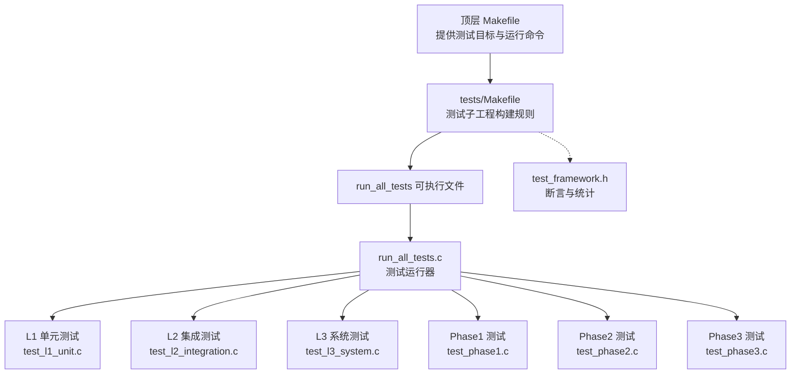
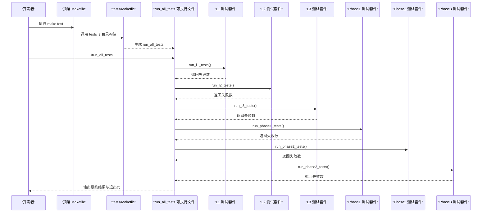
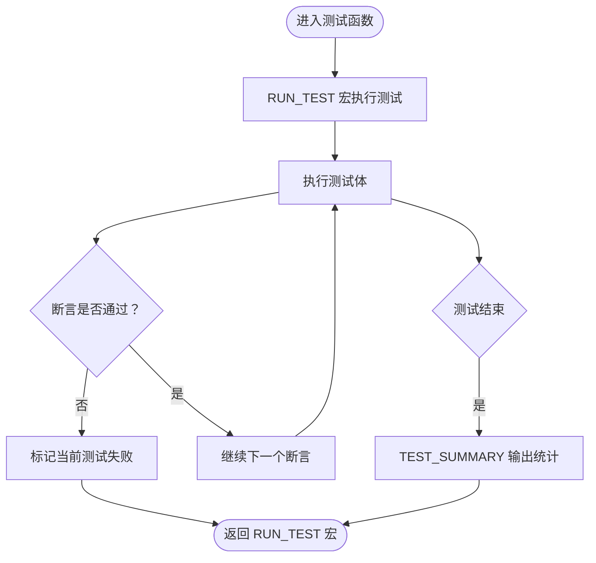
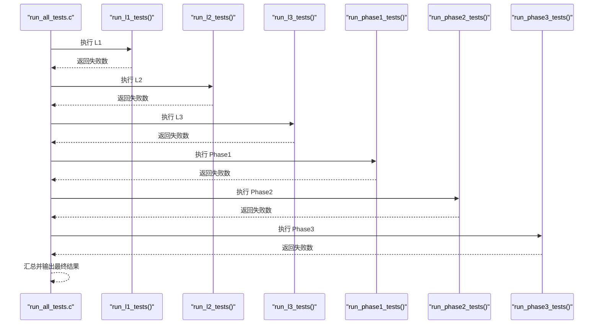
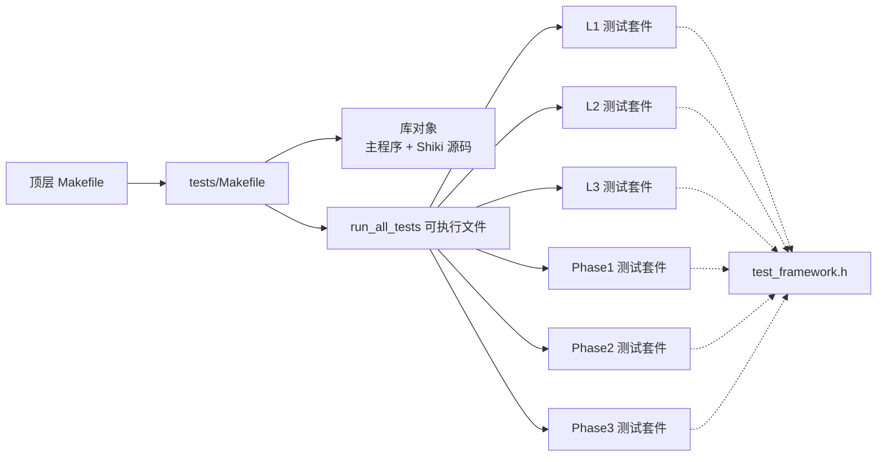

# 测试执行与调试

<cite>
**本文档引用的文件**
- [Makefile](file://Makefile)
- [tests/Makefile](file://tests/Makefile)
- [tests/test_framework.h](file://tests/test_framework.h)
- [tests/run_all_tests.c](file://tests/run_all_tests.c)
- [tests/test_l1_unit.c](file://tests/test_l1_unit.c)
- [tests/test_l2_integration.c](file://tests/test_l2_integration.c)
- [tests/test_l3_system.c](file://tests/test_l3_system.c)
- [tests/test_phase1.c](file://tests/test_phase1.c)
- [tests/test_phase2.c](file://tests/test_phase2.c)
- [tests/test_phase3.c](file://tests/test_phase3.c)
- [README.md](file://README.md)
</cite>

## 目录
1. [简介](#简介)
2. [项目结构](#项目结构)
3. [核心组件](#核心组件)
4. [架构总览](#架构总览)
5. [详细组件分析](#详细组件分析)
6. [依赖关系分析](#依赖关系分析)
7. [性能考虑](#性能考虑)
8. [故障排查指南](#故障排查指南)
9. [结论](#结论)
10. [附录](#附录)

## 简介
本指南面向测试工程师与开发者，系统性阐述该代码库的测试执行流程、构建配置与调试技巧。内容涵盖测试套件的组织结构（L1/L2/L3 与 Phase1/2/3）、执行顺序与并行策略、测试环境搭建与依赖管理、构建选项配置、测试结果分析与失败用例定位、调试工具使用，以及性能测试、覆盖率分析与持续集成配置建议。

## 项目结构
测试相关的核心目录与文件如下：
- tests/：测试子工程，包含测试框架、各层级测试用例与测试可执行文件构建规则
- tests/Makefile：测试子工程的构建规则，负责编译测试源码并链接主程序库
- tests/test_framework.h：轻量级头文件测试框架，提供断言宏与统计输出
- tests/run_all_tests.c：测试运行器，按顺序调用各测试套件并汇总最终结果
- tests/test_l1_unit.c、test_l2_integration.c、test_l3_system.c：按层级划分的单元、集成与系统测试
- tests/test_phase1.c、test_phase2.c、test_phase3.c：Shiki 进化阶段的测试套件
- 顶层 Makefile：提供统一构建入口，包括测试目标与运行命令

**图表来源**
- [Makefile:83-89](file://Makefile#L83-L89)
- [tests/Makefile:1-48](file://tests/Makefile#L1-L48)
- [tests/run_all_tests.c:18-60](file://tests/run_all_tests.c#L18-L60)
- [tests/test_framework.h:16-146](file://tests/test_framework.h#L16-L146)

**章节来源**
- [Makefile:83-89](file://Makefile#L83-L89)
- [tests/Makefile:1-48](file://tests/Makefile#L1-L48)
- [README.md:42-49](file://README.md#L42-L49)

## 核心组件
- 测试框架（test_framework.h）
  - 提供 TEST_SUITE_BEGIN、TEST、RUN_TEST 宏，用于定义与运行测试函数
  - 提供 ASSERT_* 系列断言宏，覆盖布尔、数值比较、字符串比较与空指针判断
  - 提供 TEST_SUMMARY、TEST_GET_FAILED 等统计与查询接口
- 测试运行器（run_all_tests.c）
  - 声明外部各测试套件的 run_* 函数
  - 按顺序依次执行 L1/L2/L3 与 Phase1/2/3 的测试套件
  - 输出最终汇总结果并返回进程退出码
- 各层级测试套件
  - L1：针对独立组件（计数器、锁、摄像头、密封室、事件总线等）进行单元测试
  - L2：验证组件间的交互（溢出触发、事件传播、相机时钟漏洞、红魔系统状态机）
  - L3：端到端系统测试（15 年仿真、“一切皆 F”验证、运行时相位序列）
  - Phase1/2/3：分别对应沙盒逃逸、高可用集群、虚拟化阶段的测试

**章节来源**
- [tests/test_framework.h:16-146](file://tests/test_framework.h#L16-L146)
- [tests/run_all_tests.c:18-60](file://tests/run_all_tests.c#L18-L60)
- [tests/test_l1_unit.c:1-498](file://tests/test_l1_unit.c#L1-L498)
- [tests/test_l2_integration.c:1-365](file://tests/test_l2_integration.c#L1-L365)
- [tests/test_l3_system.c:1-389](file://tests/test_l3_system.c#L1-L389)
- [tests/test_phase1.c:1-399](file://tests/test_phase1.c#L1-L399)
- [tests/test_phase2.c:1-480](file://tests/test_phase2.c#L1-L480)
- [tests/test_phase3.c:1-554](file://tests/test_phase3.c#L1-L554)

## 架构总览
测试执行的总体流程如下：

**图表来源**
- [Makefile:83-89](file://Makefile#L83-L89)
- [tests/Makefile:34-35](file://tests/Makefile#L34-L35)
- [tests/run_all_tests.c:26-42](file://tests/run_all_tests.c#L26-L42)

## 详细组件分析

### 测试框架与断言系统
- 设计要点
  - 使用静态变量维护测试计数与失败标志，避免全局污染
  - 断言宏在失败时打印断言表达式、文件与行号，并立即返回当前测试函数
  - 提供 TEST_SUMMARY 输出本次套件的运行统计
- 复杂度与性能
  - 断言为 O(1)，统计为 O(1)，整体开销极低
  - 通过直接返回而非长跳转，减少异常路径的复杂度
- 错误处理
  - 断言失败即终止当前测试函数，确保失败信息明确
  - 统一的失败计数便于后续汇总

**图表来源**
- [tests/test_framework.h:33-46](file://tests/test_framework.h#L33-L46)
- [tests/test_framework.h:49-136](file://tests/test_framework.h#L49-L136)

**章节来源**
- [tests/test_framework.h:16-146](file://tests/test_framework.h#L16-L146)

### 测试运行器与执行顺序
- 执行顺序
  - L1 单元测试 → L2 集成测试 → L3 系统测试 → Phase1 → Phase2 → Phase3
- 结果汇总
  - 将各套件的失败数累加，最终输出“全部通过”或“失败数量”
  - 退出码为 0 表示全部通过，非 0 表示存在失败

**图表来源**
- [tests/run_all_tests.c:26-42](file://tests/run_all_tests.c#L26-L42)

**章节来源**
- [tests/run_all_tests.c:18-60](file://tests/run_all_tests.c#L18-L60)

### L1 单元测试（组件级）
- 覆盖范围
  - 计数器：初始化、增量、溢出检测与环绕、快速前进、常量与时间换算
  - 电磁锁：初始化、上电/断电、失效保护触发、全局失效保护
  - 安防摄像头：分钟录制、盲点创建、时钟同步漏洞利用
  - 密封室：初始化、添加门、破坏、逃逸、Magata 地库状态
  - 事件总线：订阅、发布、历史记录、暂停/恢复、事件名映射
- 特点
  - 针对单一功能点进行验证，便于定位问题
  - 对边界条件（如 0xFFFFFFFF）与数学计算（年份换算）进行严格校验

**章节来源**
- [tests/test_l1_unit.c:22-145](file://tests/test_l1_unit.c#L22-L145)
- [tests/test_l1_unit.c:151-222](file://tests/test_l1_unit.c#L151-L222)
- [tests/test_l1_unit.c:228-287](file://tests/test_l1_unit.c#L228-L287)
- [tests/test_l1_unit.c:293-352](file://tests/test_l1_unit.c#L293-L352)
- [tests/test_l1_unit.c:358-424](file://tests/test_l1_unit.c#L358-L424)

### L2 集成测试（组件交互）
- 覆盖范围
  - 计数器溢出触发锁释放、快速前进至溢出解锁
  - 事件总线链式传播（溢出 → 失效保护 → 锁释放 → 房间被破坏）
  - 时钟同步漏洞导致盲点创建与重装模拟
  - 红魔系统状态机：初始化 → 运行 → 溢出 → 系统崩溃
  - 密封室与锁的协作：释放锁不自动破坏，但可被破坏
  - Magata 地库完整逃逸流程
- 特点
  - 关注跨模块协作与事件驱动的状态流转
  - 强化对真实场景中错误传播路径的验证

**章节来源**
- [tests/test_l2_integration.c:33-70](file://tests/test_l2_integration.c#L33-L70)
- [tests/test_l2_integration.c:86-155](file://tests/test_l2_integration.c#L86-L155)
- [tests/test_l2_integration.c:161-200](file://tests/test_l2_integration.c#L161-L200)
- [tests/test_l2_integration.c:205-282](file://tests/test_l2_integration.c#L205-L282)
- [tests/test_l2_integration.c:288-322](file://tests/test_l2_integration.c#L288-L322)

### L3 系统测试（端到端）
- 覆盖范围
  - 15 年仿真与快速前进效率验证
  - Magata 逃逸端到端流程与密封室状态转换
  - “一切皆 F”验证：溢出发生、系统终止、日志与状态一致性
  - 运行时相位序列：冷启动 → 内核访问 → I/O 边界 → 内存递归 → 逻辑爆炸
  - 初始/中期/终态系统状态一致性检查
  - 小说准确性：无符号整型溢出机制、时间周期与监禁时长
- 特点
  - 以完整生命周期视角验证系统正确性
  - 强调性能（快速前进）与准确性（数学与状态）

**章节来源**
- [tests/test_l3_system.c:24-82](file://tests/test_l3_system.c#L24-L82)
- [tests/test_l3_system.c:88-118](file://tests/test_l3_system.c#L88-L118)
- [tests/test_l3_system.c:124-179](file://tests/test_l3_system.c#L124-L179)
- [tests/test_l3_system.c:199-254](file://tests/test_l3_system.c#L199-L254)
- [tests/test_l3_system.c:260-302](file://tests/test_l3_system.c#L260-L302)
- [tests/test_l3_system.c:308-336](file://tests/test_l3_system.c#L308-L336)

### Phase1 沙盒逃逸测试
- 覆盖范围
  - 沙盒初始化、权限等级、时间推进、溢出触发与环绕、特权提升、日志记录
  - 与红魔系统的集成、事件传播、多次逃逸尝试追踪、时间溢出环绕
- 特点
  - 以阶段化流程验证逃逸序列的完整性与可重复性
  - 强调与上层系统的联动（红魔集成）

**章节来源**
- [tests/test_phase1.c:22-150](file://tests/test_phase1.c#L22-L150)
- [tests/test_phase1.c:172-265](file://tests/test_phase1.c#L172-L265)
- [tests/test_phase1.c:271-328](file://tests/test_phase1.c#L271-L328)
- [tests/test_phase1.c:330-344](file://tests/test_phase1.c#L330-L344)

### Phase2 高可用集群测试
- 覆盖范围
  - 集群初始化、节点角色与健康状态、心跳消息、数据写入/读取、节点故障模拟
  - 故障转移、RAID-1 同步与一致性、脑裂检测与解决、事件总线集成
  - 与 Phase1 的前置条件与集成验证、多轮故障稳定性、集群纪元演进
- 特点
  - 关注高可用与容错能力，强调数据一致性与服务连续性
  - 逐步引入事件总线与外部阶段的集成

**章节来源**
- [tests/test_phase2.c:23-145](file://tests/test_phase2.c#L23-L145)
- [tests/test_phase2.c:176-241](file://tests/test_phase2.c#L176-L241)
- [tests/test_phase2.c:309-373](file://tests/test_phase2.c#L309-L373)
- [tests/test_phase2.c:375-423](file://tests/test_phase2.c#L375-L423)

### Phase3 虚拟化测试
- 覆盖范围
  - 虚拟化引擎初始化、虚拟机创建/启停/状态查询、抽象层级名称
  - 内存读写、指令队列与执行、日志与清理、最大 VM 数限制、指针获取
  - 控制/数据平面分离、意识上传、冷/热迁移、硬件解耦、虚拟机逃逸
  - 全流程仿真、物理到超然层级的演进、与 Phase1/2 的集成、最终状态验证与错误处理
- 特点
  - 层级化抽象验证，从物理到超然的渐进式演进
  - 强调边界条件与错误处理，保证健壮性

**章节来源**
- [tests/test_phase3.c:27-214](file://tests/test_phase3.c#L27-L214)
- [tests/test_phase3.c:220-369](file://tests/test_phase3.c#L220-L369)
- [tests/test_phase3.c:375-503](file://tests/test_phase3.c#L375-L503)
- [tests/test_phase3.c:509-553](file://tests/test_phase3.c#L509-L553)

## 依赖关系分析
- 构建依赖
  - tests/Makefile 将主程序源码与 Shiki 源码编译为库对象，再与测试源码链接生成 run_all_tests
  - 顶层 Makefile 通过子目录构建与运行测试，简化用户操作
- 运行时依赖
  - run_all_tests.c 通过外部声明调用各套件的 run_* 函数
  - 各测试套件依赖 test_framework.h 提供的断言与统计宏

**图表来源**
- [Makefile:83-89](file://Makefile#L83-L89)
- [tests/Makefile:9-22](file://tests/Makefile#L9-L22)
- [tests/Makefile:34-35](file://tests/Makefile#L34-L35)
- [tests/run_all_tests.c:11-16](file://tests/run_all_tests.c#L11-L16)
- [tests/test_framework.h:16-146](file://tests/test_framework.h#L16-L146)

**章节来源**
- [Makefile:83-89](file://Makefile#L83-L89)
- [tests/Makefile:9-22](file://tests/Makefile#L9-L22)
- [tests/run_all_tests.c:11-16](file://tests/run_all_tests.c#L11-L16)

## 性能考虑
- 快速前进（Fast Forward）
  - L3 系统测试包含对快速前进效率的验证，确保大步进溢出在可接受时间内完成
  - 建议在性能回归测试中复用该模式，结合计时器评估不同实现的性能差异
- 并发与并行
  - 当前测试执行为串行顺序，未启用并行执行
  - 若需加速，可在 CI 中按套件拆分并行任务（L1/L2/L3 与 Phase1/2/3），并在本地使用多核编译器优化
- 内存与日志
  - Phase3 的日志与内存操作测试有助于发现潜在的资源泄漏与性能瓶颈
  - 建议在 CI 中增加内存检测工具（如 AddressSanitizer）与覆盖率收集

## 故障排查指南
- 常见问题定位
  - 断言失败：根据断言输出中的表达式、文件与行号快速定位失败点
  - 状态不一致：结合事件总线历史与系统状态查询，确认事件传播链路
  - 溢出与环绕：重点检查计数器的边界值与快速前进逻辑
- 调试技巧
  - 使用最小化用例：从 L1 单元测试开始，逐步缩小问题范围
  - 日志辅助：利用事件总线与各模块的日志接口，记录关键状态变化
  - 分阶段验证：先验证 Phase1，再验证 Phase1+Phase2，最后验证 Phase1+Phase2+Phase3
- 工具建议
  - 本地调试：gcc/gdb，配合断点与变量观察
  - 静态分析：clang-check 或 clang-tidy，检查未使用变量、空指针等
  - 动态分析：valgrind（memcheck）检测内存错误；AddressSanitizer 检测越界与泄漏
  - 覆盖率：gcov/lcov 生成覆盖率报告，识别未覆盖路径

**章节来源**
- [tests/test_framework.h:49-136](file://tests/test_framework.h#L49-L136)
- [tests/test_l2_integration.c:86-155](file://tests/test_l2_integration.c#L86-L155)
- [tests/test_l3_system.c:67-82](file://tests/test_l3_system.c#L67-L82)
- [tests/test_phase3.c:155-173](file://tests/test_phase3.c#L155-L173)

## 结论
本测试体系以清晰的层级划分与阶段化演进为核心，通过单元、集成与系统三级测试覆盖关键功能与边界条件，并以运行时相位序列与“一切皆 F”的验证确保系统行为符合预期。借助统一的测试框架与运行器，测试执行流程简洁可控；通过合理的调试与工具链配置，可高效定位与修复问题。建议在持续集成中引入并行化与覆盖率分析，进一步提升质量保障水平。

## 附录

### 测试环境搭建与依赖管理
- 依赖
  - 编译器：gcc（支持 C99）
  - 构建工具：make
  - 可选：gdb（调试）、valgrind（内存检测）、gcov/lcov（覆盖率）
- 获取与构建
  - 在仓库根目录执行 make test，自动完成测试构建与运行
  - 如需单独构建测试，进入 tests/ 目录执行 make

**章节来源**
- [Makefile:83-89](file://Makefile#L83-L89)
- [tests/Makefile:34-35](file://tests/Makefile#L34-L35)

### 构建选项配置
- 编译器与标志
  - 默认使用 gcc，CFLAGS 包含标准与头文件路径
  - 可在本地导出自定义 CFLAGS（如开启更多警告或优化级别）
- 目标选择
  - make test：构建并运行所有测试
  - make tests：仅构建测试可执行文件
  - make clean/distclean：清理构建产物

**章节来源**
- [Makefile:5-6](file://Makefile#L5-L6)
- [Makefile:83-89](file://Makefile#L83-L89)
- [Makefile:126-142](file://Makefile#L126-L142)

### 测试结果分析与失败用例定位
- 结果输出
  - 每个套件结束后输出 PASS/FAIL 统计
  - 最终汇总显示“全部通过”或失败数量
- 定位步骤
  - 查看 run_all_tests.c 的失败累计，确定失败套件
  - 进入对应测试文件，依据断言输出定位具体用例
  - 使用最小化用例与日志辅助，逐步缩小范围

**章节来源**
- [tests/run_all_tests.c:26-59](file://tests/run_all_tests.c#L26-L59)
- [tests/test_framework.h:138-146](file://tests/test_framework.h#L138-L146)

### 持续集成配置建议
- 并行策略
  - 将 L1/L2/L3 与 Phase1/2/3 的测试拆分为独立流水线任务，实现并行执行
- 覆盖率与静态分析
  - 在 CI 中启用 gcov/lcov 生成覆盖率报告
  - 集成 clang-tidy/clang-check，确保代码风格与安全
- 性能回归
  - 保留 L3 的快速前进性能测试作为回归基准
- 报告与归档
  - 归档测试日志与覆盖率报告，便于审计与回溯