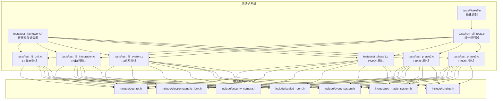
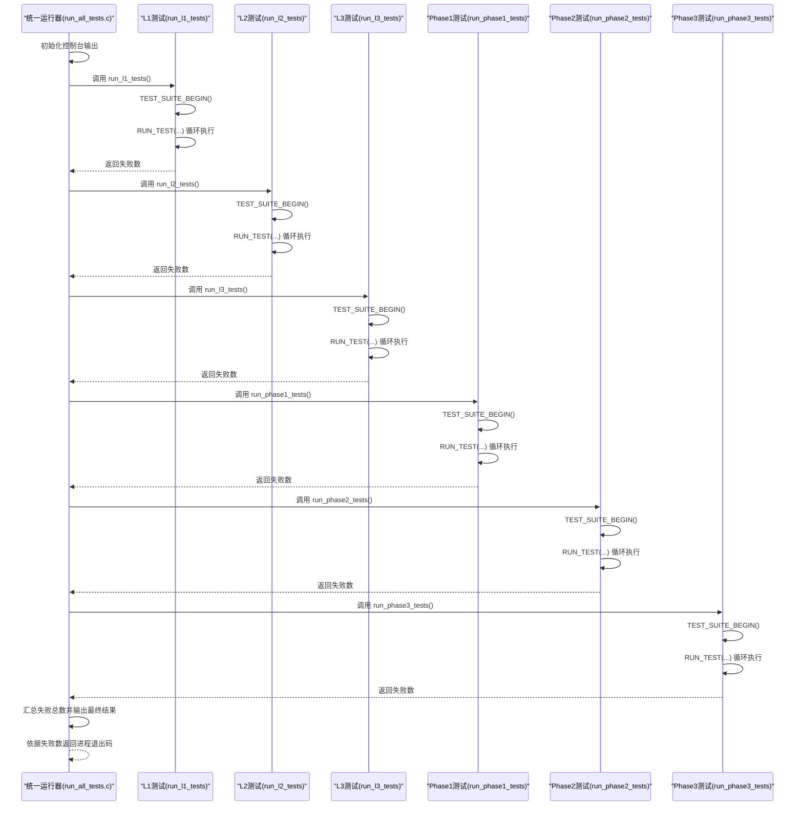
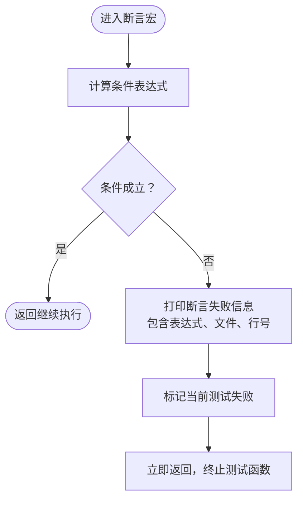
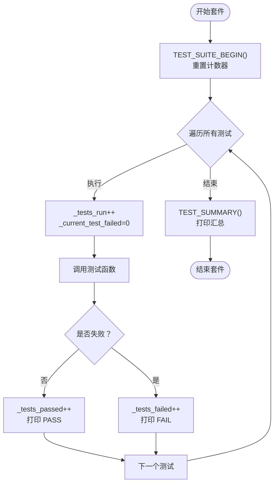
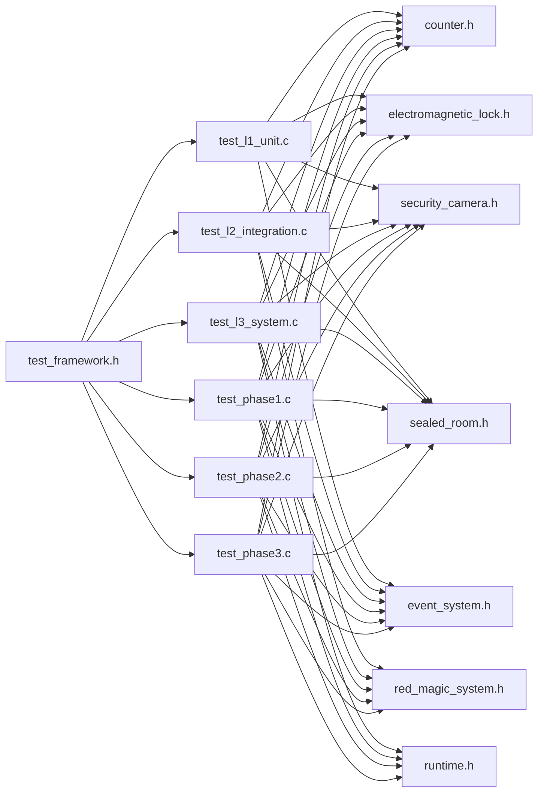

# 测试框架核心

<cite>
**本文档引用的文件**
- [test_framework.h](file://tests/test_framework.h)
- [run_all_tests.c](file://tests/run_all_tests.c)
- [Makefile](file://tests/Makefile)
- [test_l1_unit.c](file://tests/test_l1_unit.c)
- [test_l2_integration.c](file://tests/test_l2_integration.c)
- [test_l3_system.c](file://tests/test_l3_system.c)
- [test_phase1.c](file://tests/test_phase1.c)
- [test_phase2.c](file://tests/test_phase2.c)
- [test_phase3.c](file://tests/test_phase3.c)
- [counter.h](file://include/counter.h)
- [electromagnetic_lock.h](file://include/electromagnetic_lock.h)
- [security_camera.h](file://include/security_camera.h)
- [event_system.h](file://include/event_system.h)
- [red_magic_system.h](file://include/red_magic_system.h)
- [runtime.h](file://include/runtime.h)
- [sealed_room.h](file://include/sealed_room.h)
</cite>

## 目录
1. [简介](#简介)
2. [项目结构](#项目结构)
3. [核心组件](#核心组件)
4. [架构总览](#架构总览)
5. [详细组件分析](#详细组件分析)
6. [依赖关系分析](#依赖关系分析)
7. [性能考虑](#性能考虑)
8. [故障排查指南](#故障排查指南)
9. [结论](#结论)
10. [附录](#附录)

## 简介
本测试框架是一个自包含的、头文件驱动的单元与集成测试工具，专为 Everything Becomes F 项目设计。它采用极简宏定义实现断言、测试计数与汇总输出，无需外部依赖，便于在多层级（L1 单元、L2 集成、L3 系统、Phase1~3）测试中统一风格与行为。

框架特性：
- 头文件内联：仅需包含头文件即可使用，无链接负担
- 断言丰富：覆盖布尔、数值比较、字符串、空指针等常用断言
- 计数清晰：自动统计运行、通过、失败次数，支持单套件与全局汇总
- 可扩展：提供回调注册、事件总线、运行时阶段管理等接口以支撑复杂场景

## 项目结构
测试子系统由“测试框架头文件 + 各级测试套件 + 统一运行器”构成，配合主工程源码与头文件进行编译与执行。

图表来源
- [test_framework.h:1-149](file://tests/test_framework.h#L1-L149)
- [run_all_tests.c:1-61](file://tests/run_all_tests.c#L1-L61)
- [Makefile:1-48](file://tests/Makefile#L1-L48)
- [counter.h:1-99](file://include/counter.h#L1-L99)
- [electromagnetic_lock.h:1-137](file://include/electromagnetic_lock.h#L1-L137)
- [security_camera.h:1-147](file://include/security_camera.h#L1-L147)
- [event_system.h:1-157](file://include/event_system.h#L1-L157)
- [red_magic_system.h:1-166](file://include/red_magic_system.h#L1-L166)
- [runtime.h:1-184](file://include/runtime.h#L1-L184)
- [sealed_room.h:1-141](file://include/sealed_room.h#L1-L141)

章节来源
- [test_framework.h:1-149](file://tests/test_framework.h#L1-L149)
- [run_all_tests.c:1-61](file://tests/run_all_tests.c#L1-L61)
- [Makefile:1-48](file://tests/Makefile#L1-L48)

## 核心组件
- 断言宏系统：提供 ASSERT_TRUE、ASSERT_FALSE、ASSERT_EQ、ASSERT_NEQ、ASSERT_GT、ASSERT_LT、ASSERT_GTE、ASSERT_LTE、ASSERT_STR_EQ、ASSERT_NULL、ASSERT_NOT_NULL 等，用于条件判断与错误定位
- 测试计数器：在每个测试套件内维护 _tests_run、_tests_passed、_tests_failed、_current_test_failed 四个静态变量，确保独立计数与可重置性
- 测试运行器：通过 RUN_TEST(name) 执行测试函数，打印 PASS/FAIL 并更新计数；通过 TEST_SUMMARY() 输出汇总结果
- 套件入口：TEST(name) 定义测试函数；TEST_SUITE_BEGIN() 重置计数器，便于多套件独立运行
- 结果查询：TEST_GET_FAILED()、TEST_GET_PASSED()、TEST_GET_RUN() 提供失败数、通过数、运行数查询

章节来源
- [test_framework.h:16-146](file://tests/test_framework.h#L16-L146)

## 架构总览
测试框架采用“头文件内联 + 外部被测模块”的解耦设计。各测试套件通过包含 test_framework.h 使用断言与计数能力，同时按需包含被测模块头文件访问其接口。统一运行器 run_all_tests.c 调用各层级测试套件的 run_*_tests() 函数，汇总最终失败数并决定退出码。

图表来源
- [run_all_tests.c:18-60](file://tests/run_all_tests.c#L18-L60)
- [test_l1_unit.c:430-497](file://tests/test_l1_unit.c#L430-L497)
- [test_l2_integration.c:328-364](file://tests/test_l2_integration.c#L328-L364)
- [test_l3_system.c:342-388](file://tests/test_l3_system.c#L342-L388)
- [test_phase1.c:350-398](file://tests/test_phase1.c#L350-L398)
- [test_phase2.c:429-479](file://tests/test_phase2.c#L429-L479)
- [test_phase3.c:509-553](file://tests/test_phase3.c#L509-L553)

## 详细组件分析

### 断言宏系统
断言宏通过条件判断与错误回传实现测试验证，失败时记录断言表达式、文件名与行号，并设置当前测试失败标志，随后 return 以终止该测试函数的后续执行。

- 表达式断言：ASSERT_TRUE(expr)、ASSERT_FALSE(expr)
- 数值比较：ASSERT_EQ(a,b)、ASSERT_NEQ(a,b)、ASSERT_GT(a,b)、ASSERT_LT(a,b)、ASSERT_GTE(a,b)、ASSERT_LTE(a,b)
- 字符串比较：ASSERT_STR_EQ(a,b)（基于字符串比较）
- 指针检查：ASSERT_NULL(ptr)、ASSERT_NOT_NULL(ptr)

图表来源
- [test_framework.h:49-135](file://tests/test_framework.h#L49-L135)

章节来源
- [test_framework.h:48-146](file://tests/test_framework.h#L48-L146)

### 测试计数器机制与状态管理
- 套件级计数：每个测试套件内部维护 _tests_run/_tests_passed/_tests_failed/_current_test_failed 四个静态变量，避免跨套件污染
- 运行流程：TEST_SUITE_BEGIN() 重置计数；RUN_TEST(name) 增加运行计数并清零当前失败标志；测试结束后根据 _current_test_failed 更新通过/失败计数
- 汇总输出：TEST_SUMMARY() 打印本次套件的运行/通过/失败统计
- 结果查询：TEST_GET_FAILED()/TEST_GET_PASSED()/TEST_GET_RUN() 提供失败/通过/运行数读取

图表来源
- [test_framework.h:23-46](file://tests/test_framework.h#L23-L46)
- [test_framework.h:138-146](file://tests/test_framework.h#L138-L146)

章节来源
- [test_framework.h:16-46](file://tests/test_framework.h#L16-L46)
- [test_framework.h:138-146](file://tests/test_framework.h#L138-L146)

### 错误报告系统
- 断言失败时输出格式包含：断言类型、失败表达式、文件名、行号
- 测试结束时输出本次套件的统计摘要
- 统一运行器汇总各套件失败数，输出最终结果与退出码

章节来源
- [test_framework.h:49-141](file://tests/test_framework.h#L49-L141)
- [run_all_tests.c:18-60](file://tests/run_all_tests.c#L18-L60)

### 初始化、运行与总结流程
- 初始化：各套件通过 TEST_SUITE_BEGIN() 初始化计数器
- 运行：通过 RUN_TEST(name) 逐个执行测试函数，断言失败即短路返回
- 总结：通过 TEST_SUMMARY() 输出本次套件统计；统一运行器汇总各套件失败数并输出最终结果

章节来源
- [test_framework.h:23-46](file://tests/test_framework.h#L23-L46)
- [test_framework.h:138-141](file://tests/test_framework.h#L138-L141)
- [run_all_tests.c:18-60](file://tests/run_all_tests.c#L18-L60)

### 断言宏使用示例（路径指引）
以下为常见断言在测试中的使用位置（仅提供文件与行号范围，不直接展示代码内容）：
- 数值相等与范围比较
  - [test_l1_unit.c:22-80](file://tests/test_l1_unit.c#L22-L80)
  - [test_l2_integration.c:33-70](file://tests/test_l2_integration.c#L33-L70)
  - [test_l3_system.c:24-82](file://tests/test_l3_system.c#L24-L82)
- 字符串比较
  - [test_l1_unit.c:35-41](file://tests/test_l1_unit.c#L35-L41)
  - [test_l2_integration.c:161-199](file://tests/test_l2_integration.c#L161-L199)
  - [test_l3_system.c:139-155](file://tests/test_l3_system.c#L139-L155)
- 空指针与非空指针
  - [test_l1_unit.c:235-243](file://tests/test_l1_unit.c#L235-L243)
  - [test_l2_integration.c:184-199](file://tests/test_l2_integration.c#L184-L199)
- 布尔断言
  - [test_l1_unit.c:151-183](file://tests/test_l1_unit.c#L151-L183)
  - [test_l2_integration.c:128-155](file://tests/test_l2_integration.c#L128-L155)
  - [test_l3_system.c:88-118](file://tests/test_l3_system.c#L88-L118)

## 依赖关系分析
测试框架与被测模块的依赖关系如下：

图表来源
- [test_framework.h:1-149](file://tests/test_framework.h#L1-L149)
- [test_l1_unit.c:9-17](file://tests/test_l1_unit.c#L9-L17)
- [test_l2_integration.c:9-18](file://tests/test_l2_integration.c#L9-L18)
- [test_l3_system.c:9-19](file://tests/test_l3_system.c#L9-L19)
- [test_phase1.c:12-17](file://tests/test_phase1.c#L12-L17)
- [test_phase2.c:11-18](file://tests/test_phase2.c#L11-L18)
- [test_phase3.c:12-19](file://tests/test_phase3.c#L12-L19)
- [counter.h:1-99](file://include/counter.h#L1-L99)
- [electromagnetic_lock.h:1-137](file://include/electromagnetic_lock.h#L1-L137)
- [security_camera.h:1-147](file://include/security_camera.h#L1-L147)
- [event_system.h:1-157](file://include/event_system.h#L1-L157)
- [red_magic_system.h:1-166](file://include/red_magic_system.h#L1-L166)
- [runtime.h:1-184](file://include/runtime.h#L1-L184)
- [sealed_room.h:1-141](file://include/sealed_room.h#L1-L141)

章节来源
- [test_l1_unit.c:9-17](file://tests/test_l1_unit.c#L9-L17)
- [test_l2_integration.c:9-18](file://tests/test_l2_integration.c#L9-L18)
- [test_l3_system.c:9-19](file://tests/test_l3_system.c#L9-L19)
- [test_phase1.c:12-17](file://tests/test_phase1.c#L12-L17)
- [test_phase2.c:11-18](file://tests/test_phase2.c#L11-L18)
- [test_phase3.c:12-19](file://tests/test_phase3.c#L12-L19)

## 性能考虑
- 断言开销：断言宏为编译期展开的条件判断，运行时开销极低，适合大量单元测试
- 计数器局部化：静态计数器位于每个套件文件内，避免全局竞争与锁开销
- 统一运行器：顺序执行各套件，便于调试与日志可读性；如需并行可在上层构建脚本中扩展

## 故障排查指南
- 断言失败定位
  - 断言宏会在失败时输出表达式、文件与行号，优先检查对应条件与上下文
  - 对于字符串断言，确认传入参数为有效 C 字符串且长度合理
- 测试未执行或计数异常
  - 确认 TEST_SUITE_BEGIN() 已在套件开头调用
  - 确认 RUN_TEST(name) 已正确包裹测试函数
- 套件间干扰
  - 各套件使用独立静态计数器，避免跨套件共享变量
- 统一运行器退出码
  - run_all_tests.c 根据累计失败数返回非零退出码，便于 CI/CD 判定

章节来源
- [test_framework.h:49-141](file://tests/test_framework.h#L49-L141)
- [run_all_tests.c:18-60](file://tests/run_all_tests.c#L18-L60)

## 结论
Everything Becomes F 的测试框架以极简宏定义实现了完整的断言、计数与汇总功能，配合多层级测试套件与统一运行器，形成从单元到系统的完整验证闭环。其头文件内联设计降低了依赖与编译复杂度，断言与计数机制直观可靠，适合在大型仿真项目中持续演进与维护。

## 附录

### 断言宏一览（按用途分类）
- 布尔断言
  - [ASSERT_TRUE(expr):49-55](file://tests/test_framework.h#L49-L55)
  - [ASSERT_FALSE(expr):57-63](file://tests/test_framework.h#L57-L63)
- 数值断言
  - [ASSERT_EQ(a,b):65-71](file://tests/test_framework.h#L65-L71)
  - [ASSERT_NEQ(a,b):73-79](file://tests/test_framework.h#L73-L79)
  - [ASSERT_GT(a,b):81-87](file://tests/test_framework.h#L81-L87)
  - [ASSERT_LT(a,b):89-95](file://tests/test_framework.h#L89-L95)
  - [ASSERT_GTE(a,b):97-103](file://tests/test_framework.h#L97-L103)
  - [ASSERT_LTE(a,b):105-111](file://tests/test_framework.h#L105-L111)
- 字符串断言
  - [ASSERT_STR_EQ(a,b):113-119](file://tests/test_framework.h#L113-L119)
- 指针断言
  - [ASSERT_NULL(ptr):121-127](file://tests/test_framework.h#L121-L127)
  - [ASSERT_NOT_NULL(ptr):129-135](file://tests/test_framework.h#L129-L135)

### 测试生命周期宏
- [TEST(name)](file://tests/test_framework.h#L30)
- [TEST_SUITE_BEGIN()](file://tests/test_framework.h#L23)
- [RUN_TEST(name)](file://tests/test_framework.h#L33)
- [TEST_SUMMARY()](file://tests/test_framework.h#L138)
- [TEST_GET_FAILED()/TEST_GET_PASSED()/TEST_GET_RUN():144-146](file://tests/test_framework.h#L144-L146)