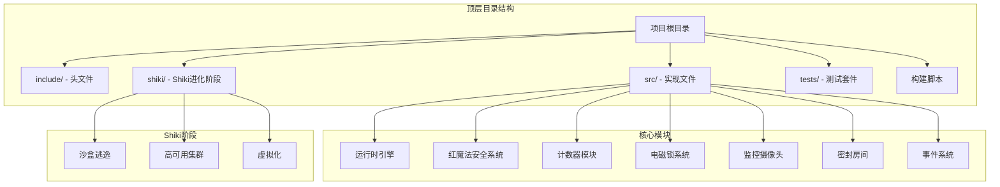
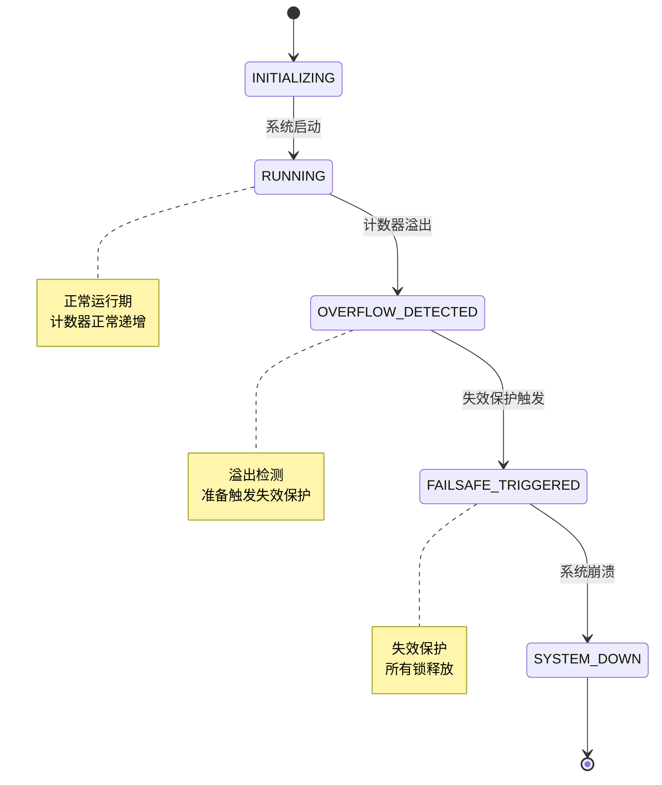
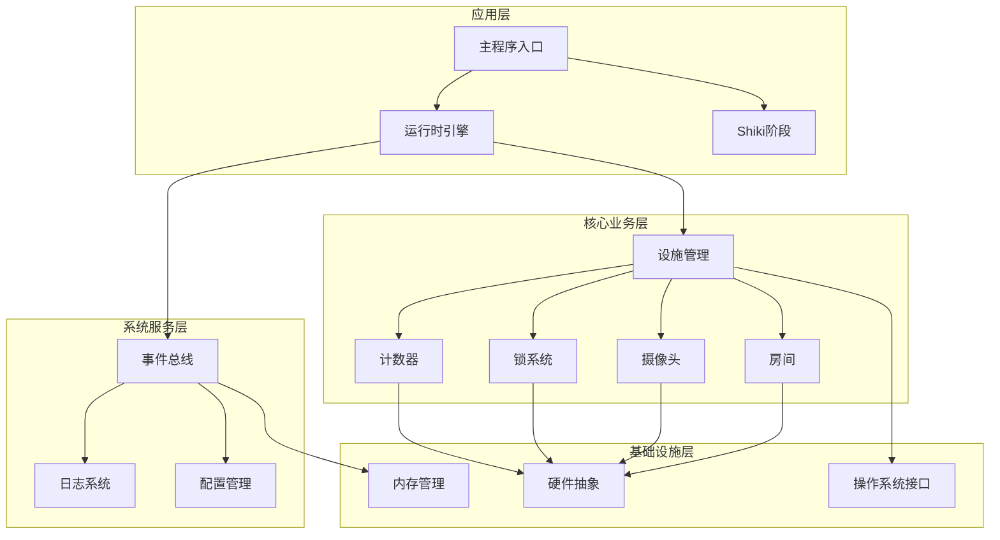
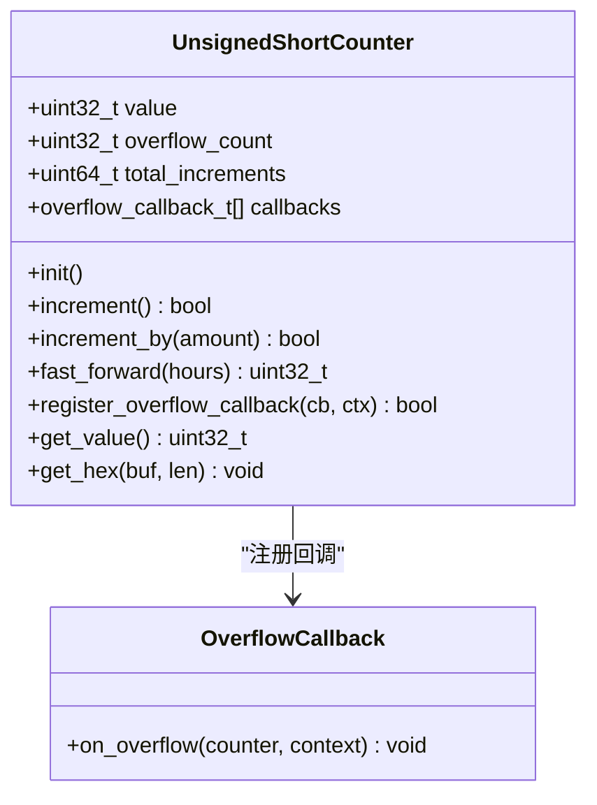
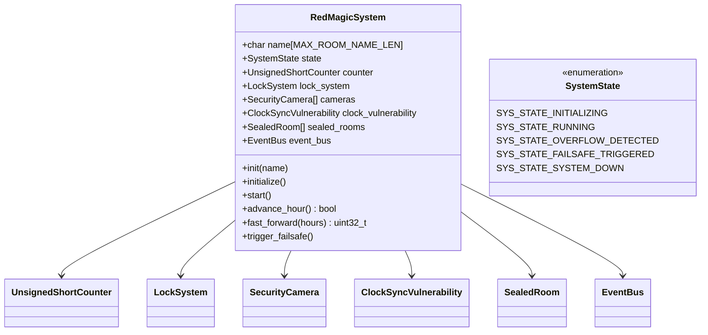
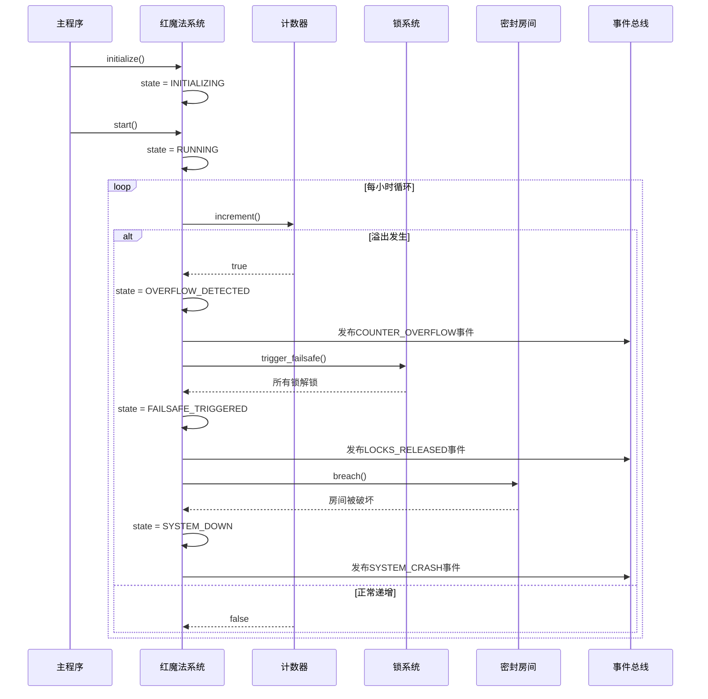
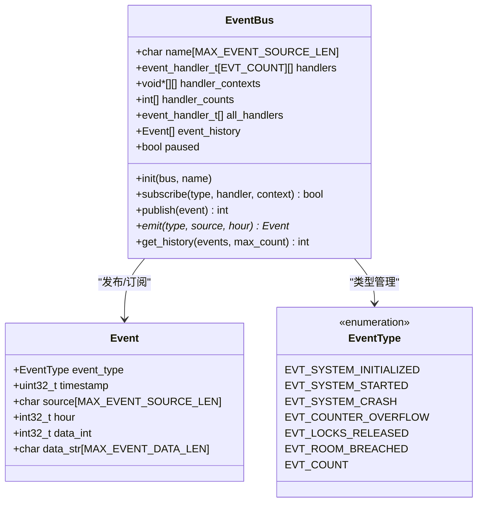
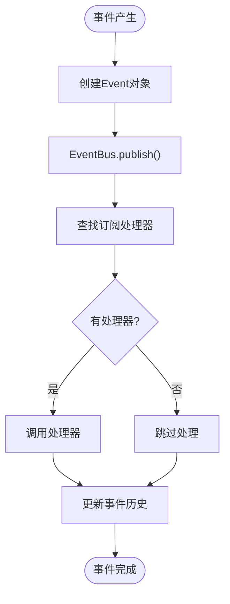
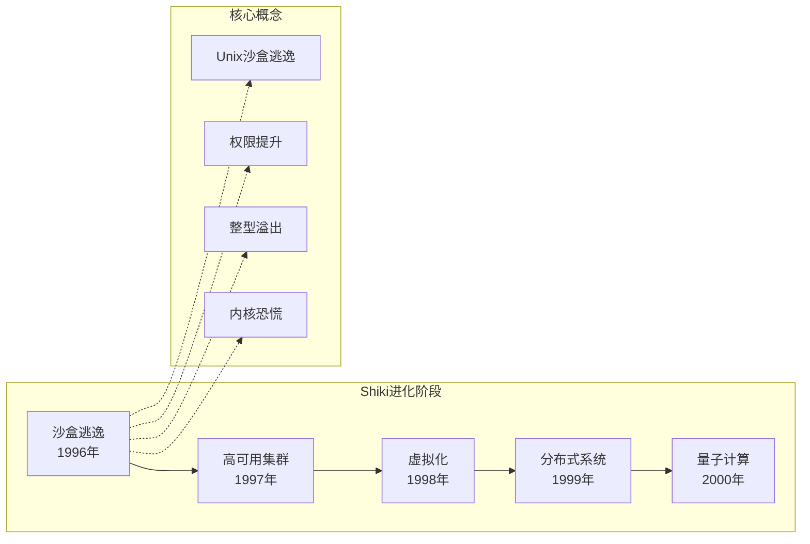
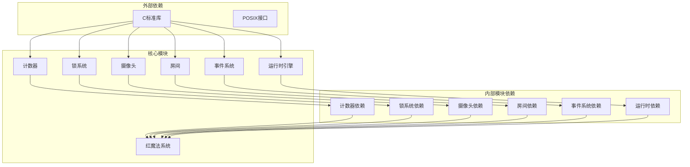

# Everything Becomes F 项目概述

<cite>
**本文档引用的文件**
- [README.md](file://README.md)
- [Makefile](file://Makefile)
- [src/main.c](file://src/main.c)
- [include/runtime.h](file://include/runtime.h)
- [include/event_system.h](file://include/event_system.h)
- [include/red_magic_system.h](file://include/red_magic_system.h)
- [include/counter.h](file://include/counter.h)
- [include/sealed_room.h](file://include/sealed_room.h)
- [include/electromagnetic_lock.h](file://include/electromagnetic_lock.h)
- [include/security_camera.h](file://include/security_camera.h)
- [shiki/include/phase1_sandbox_escape.h](file://shiki/include/phase1_sandbox_escape.h)
- [tests/test_framework.h](file://tests/test_framework.h)
- [tests/test_l1_unit.c](file://tests/test_l1_unit.c)
- [tests/test_l2_integration.c](file://tests/test_l2_integration.c)
- [tests/test_l3_system.c](file://tests/test_l3_system.c)
</cite>

## 目录
1. [简介](#简介)
2. [项目结构](#项目结构)
3. [核心组件](#核心组件)
4. [架构总览](#架构总览)
5. [详细组件分析](#详细组件分析)
6. [依赖关系分析](#依赖关系分析)
7. [性能考虑](#性能考虑)
8. [故障排除指南](#故障排除指南)
9. [结论](#结论)
10. [附录](#附录)

## 简介

Everything Becomes F 是一个基于森恒史小说《The Perfect Insider》（《すべてがFになる》）的教育仿真项目。该项目以整数溢出漏洞为核心主题，通过事件驱动架构和状态机管理，模拟了博士生真贺田四季（Dr. Magata Shiki）在封闭研究设施中被监禁15年，并通过植入计数器整数溢出bug实现逃脱的故事情节。

项目的核心创新在于将经典的安全漏洞概念转化为可交互的教育仿真，通过"快速前进时间"的方式，在极短时间内完成从系统初始化到最终"Everything Becomes F"的完整叙事弧线。这种设计不仅保留了原作的文学张力，更提供了直观的安全演示价值。

该项目的教育目标包括：
- 展示整数溢出漏洞的根本原理和安全威胁
- 通过事件驱动架构演示松耦合系统设计
- 利用状态机管理复杂系统行为
- 提供模块化设计的实践案例
- 帮助学习者理解安全系统中的脆弱环节

## 项目结构

项目采用清晰的分层组织结构，体现了良好的软件工程实践：



**图表来源**
- [Makefile:1-167](file://Makefile#L1-L167)
- [README.md:15-53](file://README.md#L15-L53)

**章节来源**
- [README.md:15-53](file://README.md#L15-L53)
- [Makefile:1-167](file://Makefile#L1-L167)

## 核心组件

### 事件驱动架构

项目采用发布-订阅事件总线模式，实现了系统各组件间的松耦合通信。事件系统支持：

- **事件类型分类**：系统事件、计数器事件、锁事件、摄像头事件、房间事件、阶段事件
- **回调机制**：支持单事件类型订阅和全事件订阅
- **历史记录**：维护事件历史便于调试和审计
- **暂停/恢复**：支持事件流的暂停和恢复操作

### 状态机管理

系统通过明确的状态转换实现了复杂的业务逻辑：



**图表来源**
- [include/red_magic_system.h:34-40](file://include/red_magic_system.h#L34-L40)

### 模块化设计

项目采用高度模块化的架构，每个模块都有明确的职责边界：

- **计数器模块**：实现32位无符号整数计数器，支持溢出检测和回调
- **锁系统模块**：管理多个电磁锁，支持失效保护机制
- **监控模块**：实现摄像头监控和时钟同步漏洞模拟
- **房间模块**：建模密封房间的状态变化
- **运行时引擎**：协调各模块的生命周期和状态转换

**章节来源**
- [include/event_system.h:25-61](file://include/event_system.h#L25-L61)
- [include/red_magic_system.h:34-40](file://include/red_magic_system.h#L34-L40)

## 架构总览

项目采用分层架构设计，从底层基础设施到上层应用逻辑形成清晰的层次结构：



**图表来源**
- [src/main.c:76-135](file://src/main.c#L76-L135)
- [include/runtime.h:98-117](file://include/runtime.h#L98-L117)

## 详细组件分析

### 计数器模块分析

计数器模块是整个系统的核心，实现了32位无符号整数的行为模拟：



**图表来源**
- [include/counter.h:36-43](file://include/counter.h#L36-L43)
- [include/counter.h:26-27](file://include/counter.h#L26-L27)

计数器的关键特性：
- **溢出检测**：精确模拟C语言无符号整数的溢出行为
- **快速前进**：支持大量时间推进的高效算法
- **回调机制**：为溢出事件提供扩展点
- **精度保证**：使用64位计数器避免中间计算溢出

### 红魔法安全系统分析

红魔法安全系统作为核心控制器，集成了所有子系统：



**图表来源**
- [include/red_magic_system.h:66-88](file://include/red_magic_system.h#L66-L88)
- [include/red_magic_system.h:34-40](file://include/red_magic_system.h#L34-L40)

系统状态转换流程：



**图表来源**
- [src/main.c:176-135](file://src/main.c#L176-L135)
- [include/red_magic_system.h:99-106](file://include/red_magic_system.h#L99-L106)

### 事件系统分析

事件系统实现了完整的发布-订阅模式：



**图表来源**
- [include/event_system.h:93-108](file://include/event_system.h#L93-L108)
- [include/event_system.h:69-76](file://include/event_system.h#L69-L76)

事件传播流程：



**图表来源**
- [include/event_system.h:126-127](file://include/event_system.h#L126-L127)
- [include/event_system.h:138-139](file://include/event_system.h#L138-L139)

### Shiki进化阶段分析

项目包含五个Shiki进化阶段，每个阶段都对应小说中的特定情节：



**图表来源**
- [shiki/include/phase1_sandbox_escape.h:151-157](file://shiki/include/phase1_sandbox_escape.h#L151-L157)

**章节来源**
- [shiki/include/phase1_sandbox_escape.h:1-243](file://shiki/include/phase1_sandbox_escape.h#L1-L243)

## 依赖关系分析

项目采用清晰的依赖层次结构，体现了良好的模块化设计：



**图表来源**
- [Makefile:5-8](file://Makefile#L5-L8)
- [include/red_magic_system.h:19-25](file://include/red_magic_system.h#L19-L25)

**章节来源**
- [Makefile:5-8](file://Makefile#L5-L8)
- [include/red_magic_system.h:19-25](file://include/red_magic_system.h#L19-L25)

## 性能考虑

项目在设计时充分考虑了性能优化：

### 时间推进优化

项目实现了高效的批量时间推进算法，避免逐小时循环的低效操作：

- **快速前进算法**：使用数学运算直接计算溢出次数，避免循环迭代
- **内存效率**：采用固定大小的数据结构，减少动态内存分配
- **缓存友好**：数据结构紧凑排列，提高CPU缓存命中率

### 事件系统优化

事件系统采用了高性能的设计模式：

- **固定大小数组**：避免动态扩容带来的性能开销
- **环形缓冲区**：事件历史采用环形缓冲区，支持O(1)插入和查询
- **回调缓存**：处理器列表预先分配，减少运行时分配

### 内存管理策略

- **栈分配优先**：大部分数据结构使用栈分配，减少堆管理开销
- **批量初始化**：支持一次性初始化多个组件
- **资源池化**：事件处理器和回调函数采用预分配策略

## 故障排除指南

### 常见问题诊断

#### 计数器溢出问题

**症状**：计数器值异常或溢出检测不工作
**排查步骤**：
1. 检查计数器初始化是否正确
2. 验证溢出回调注册是否成功
3. 确认计数器值范围在有效范围内

#### 事件传播问题

**症状**：事件处理器未被调用
**排查步骤**：
1. 验证事件类型是否正确
2. 检查订阅关系是否建立
3. 确认事件总线未被暂停

#### 系统状态异常

**症状**：系统状态转换不符合预期
**排查步骤**：
1. 检查状态转换条件
2. 验证相关组件状态
3. 查看事件历史记录

### 调试工具

项目提供了完善的调试支持：

- **详细日志输出**：系统状态变化和关键事件的详细记录
- **验证结果输出**：完整的系统验证报告
- **测试框架**：覆盖单元测试、集成测试和系统测试的完整测试套件

**章节来源**
- [src/main.c:49-74](file://src/main.c#L49-L74)
- [tests/test_framework.h:16-27](file://tests/test_framework.h#L16-L27)

## 结论

Everything Becomes F 项目成功地将文学作品中的安全概念转化为可操作的教育仿真。通过事件驱动架构、状态机管理和模块化设计，项目不仅准确再现了原作的情节，更重要的是提供了深入理解整数溢出漏洞和安全系统脆弱性的机会。

项目的主要优势包括：

1. **教育价值显著**：通过沉浸式体验帮助学习者理解安全漏洞的根本原理
2. **架构设计优秀**：事件驱动和状态机模式展现了现代软件设计的最佳实践
3. **实现质量高**：代码结构清晰，测试覆盖全面，文档完善
4. **扩展性强**：模块化设计为后续功能扩展提供了良好基础

该项目为安全教育和软件工程教学提供了宝贵的实践案例，展示了如何将抽象的安全概念转化为具体可操作的学习工具。

## 附录

### 构建和运行指南

项目支持多种构建方式和运行模式：

```bash
# 基本构建
make                    # 构建所有可执行文件
make run               # 运行主程序
make test              # 运行测试套件

# Shiki阶段构建
make phase1            # 构建沙盒逃逸阶段
make phase2            # 构建高可用集群阶段  
make phase3            # 构建虚拟化阶段

# 运行不同阶段
make run-phase1        # 运行沙盒逃逸
make run-phase1-integrate # 运行集成版本
```

### 测试层次说明

项目采用三层测试策略：

- **L1单元测试**：独立组件的功能验证
- **L2集成测试**：组件间交互的验证
- **L3系统测试**：完整仿真场景的验证

每层测试都针对不同的验证目标，确保系统的可靠性和正确性。